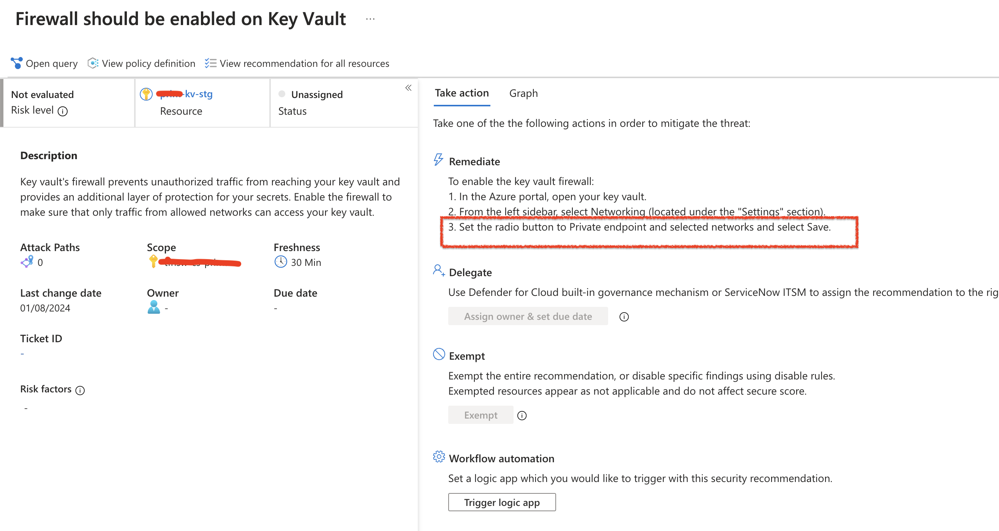
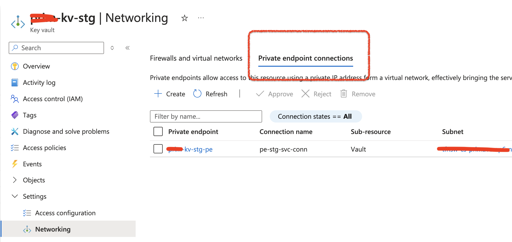

> A leader takes people where they want to go. A great leader takes people where they don't necessarily want to go, but ought to be.
—Rosalynn Carter, former First Lady

# The Curious Case of Azure Key Vault Defender Alerts: When Security Settings Play Hide and Seek

## TL;DR 🚀
Got a stubborn Azure Defender alert about Key Vault firewall even after configuring everything correctly? Don't panic! Sometimes you need to do a little dance with the settings to make Azure acknowledge your changes. Read on for the full story and solution.

## The Mystery 🔍
Picture this: You've done everything by the book. Your Azure Key Vault is locked down tight with:
- Private endpoint? ✅
- Public access disabled? ✅
- Network security properly configured? ✅

Yet, Azure Defender keeps wagging its finger at you with the alert: "Firewall should be enabled on Key Vault." Frustrating, right?

## The Plot Thickens 🕵️‍♂️
After diving deep into this mystery, we discovered something interesting about how Azure Defender processes these security configurations. It's like trying to wake up a sleepy guard - sometimes you need to give them a gentle nudge!

## The Secret Sauce: The 30-Minute Rule... Sort Of 🕒
According to the official Defender recommendation details page, changes should reflect within 30 minutes. But here's where it gets interesting:
- Sometimes it takes longer
- Sometimes it doesn't sync at all
- And sometimes... well, it needs a special trick to wake up

## The Magic Solution 🎩✨
Here's the clever workaround that actually works:

1. **The Configuration Dance:**
   - First, change your Key Vault settings to a different configuration
   - Then change them back to your desired secure settings
   * For example:
     1. Temporarily enable public access
     2. Wait a few minutes
     3. Disable public access again
     4. Ensure private endpoint is configured

2. **The Waiting Game:**
   - Wait for approximately 30 minutes
   - Watch the magic happen as the alert disappears

## Why Does This Work? 🤔
Think of it like refreshing a stuck webpage. By changing the settings and changing them back, we force Azure's backend to:
1. Recognize that a change has occurred
2. Re-evaluate the security status
3. Update the Defender recommendations

## Best Practices Reminder 🛡️
While dealing with this quirk, remember to maintain security best practices:
- Keep private endpoints enabled
- Restrict network access appropriately
- Monitor your Key Vault access logs
- Regular security review of access policies

## The Happy Ending 🌟
By following this approach, you can finally bid farewell to that persistent Defender alert while maintaining your Key Vault's security posture. It's a small price to pay for keeping your secrets safe!

## Share Your Experience 💭
Have you encountered similar issues with Azure Defender alerts? How did you handle them? Share your stories in the comments below!

---
*Remember: Security is a journey, not a destination. Sometimes we just need to know the right dance moves to keep our Azure resources secure and compliant!* 🚀

#Azure #Security #KeyVault #CloudComputing #DevOps #TechTips

--HTH--