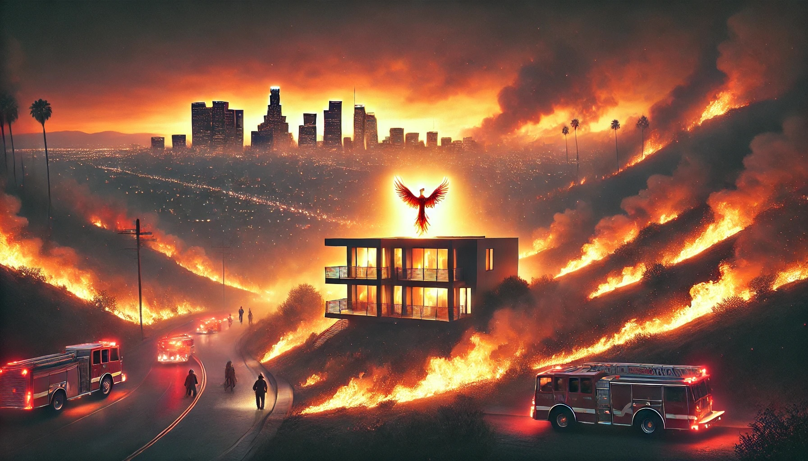

---
header:
    image: 2025-01-11-bushifire.jpeg
title: 当天堂燃烧时——现代火灾的悖论
date: 2025-01-11
tags:
 - 新闻
 - 火灾
 
permalink: /blogs/tech/zh/bushfire-in-los-angeles
layout: single
category: 技术
---

> “光焰愈盛，其衰愈速。”——老子

# 当天堂燃烧：现代火灾的悖论
当2025年人们刚刚从庆祝2024年美国大选胜利的日子里和期待新的一年会更好时，洛杉矶突然发生了一场火灾。

地平线上的橙色光芒并不是洛杉矶著名的日落。火焰吞噬了那些已经存在了几代人的社区，家庭目睹他们的记忆化为灰烬，只能在慌乱中抓起一些物品逃离。在洛杉矶，这座世界上最先进的城市之一，我们正在面对一个古老的敌人——但它带来了意想不到的现代复杂性。

## 普罗米修斯的警告：与火的古老舞蹈

希腊人告诉我们关于普罗米修斯的故事，这位泰坦敢于从众神手中偷取火焰并赠予人类。这份礼物带来了温暖、光明和文明，但也赋予了我们控制它的责任。宙斯对普罗米修斯的惩罚是永恒的折磨，但真正的诅咒或许是人类与火之间永无止境的复杂关系——这一关系随着我们的城市发展而变得更加复杂。

今天，当洛杉矶居民看着他们的家园燃烧时，我们想起了这个古老的契约。像希腊神话中的凡人一样，我们学会了尊重神圣礼物的力量，但即使是最先进的技术也无法完全解决与这种原始力量之间的关系。

## 现代悖论：当先进城市遇上古老力量

像洛杉矶这样拥有技术力量和复杂管理系统的城市，为什么仍然无法避免野火的侵袭？答案可能在于我们称之为“进步的悖论”。就像那些以为可以战胜众神的古希腊英雄一样，我们对技术的自信有时会让我们忽视基本的真相。

我们的城市坐落在一个自然的“压力锅”中——一个由自然设计的地中海气候区，注定会发生火灾。那些吸引人们开发的美丽山丘和峡谷正好为火灾的蔓延提供了完美条件。圣安娜风，就像古代神明的气息，将小火苗变成无法控制的大火。我们的繁荣不仅未能保护我们，反而将家园推向更易发生火灾的区域，形成了消防员所称的“野地-城市界面”——现代社会相当于在奥林匹斯山脚下建造神庙。

## 火焰背后的系统

问题不仅仅是地理条件。我们的政治体系以短期为重点，难以应对长期威胁。经济激励鼓励在危险地区进行开发，而原本用于控制风险的保险系统往往未能实现这一目的。人类心理也在起作用——就像忽视卡珊德拉警告的特洛伊人一样，我们存在乐观偏差，总认为灾难不会降临到自己头上。

我们在灭火方面的成功实际上带来了新的危险。几十年的积极火灾抑制导致野地区域内危险燃料的堆积。大自然本有一套规律的、小规模的火灾系统来清理灌木——而我们为了追求控制却打破了这种循环。这让人联想到迈达斯国王，他的“点石成金”愿望看似是一种祝福，实际上却带来了意外的后果。

## 凤凰悖论：恢复与重生

玛丽亚·罗德里格斯从未想过自己会面临选择家庭照片的难题。凌晨3点，她站在自家车道上，只有五分钟时间决定哪些东西值得装进车里。她的故事反映了无数家庭的经历，揭示了我们系统性失败的代价。然而，像凤凰从灰烬中重生一样，社区总能找到重建和适应的方法。

## 新的道路：从过去和现在中学习

解决方案可能并不在于更多的技术来对抗火灾，而在于从根本上重新思考如何在易发生火灾的环境中建设和管理城市。我们需要解决造成脆弱性的深层系统问题：

- 政治激励与长期规划需求的不一致
- 鼓励冒险开发的经济体系
- 防范性行动的心理障碍
- 有时增加而非减少风险的监管框架

## 写下我们自己的史诗

当洛杉矶开始新一轮重建时，我们有机会书写与火的新篇章。像古希腊人学会在尊重神灵的同时实现人类成就一样，我们必须找到在技术进步与自然力量之间平衡的方法。

前行的道路要求将弹性融入我们的系统中：重新思考高风险区域的财产权利，创造更好的防范性金融激励，开发更多适应性的城市规划方法，以及投资于社区层面的韧性，而不仅仅是保护个人财产。

最终，这不仅是关于破坏的故事，更是关于智慧的故事。也许最先进的城市并不是试图完全控制自然的城市，而是那些学会在自然周期中共存的城市。就像普罗米修斯的火焰一样，我们的现代技术和系统是强大的工具，但它们必须以智慧和对自然力量的尊重来使用。

当我们重建时，我们必须记住，真正的进步可能不在于征服自然，而在于理解和适应自然。人类韧性的永恒火焰，像赫斯提亚的炉火一样，继续燃烧——不是为了违抗自然，而是与自然和谐相处。

# 最后的思考
让我来探讨这个引人深思的问题：为什么即使是我们最先进的城市也仍然容易受到野火的威胁？答案揭示了人类发展与自然力量之间的复杂张力。

### 什么是形态？
想象洛杉矶是一块精密的手表，置于一个天然的“压力锅”中。这座城市的先进技术和管理系统固然令人印象深刻，但它的存在环境却是由数百万年的生态过程所塑造的。这种矛盾关系引发了几个关键悖论：

### 地理悖论
首先是地理悖论。洛杉矶坐落在地中海气候区，自然易于经历漫长的干燥季节和周期性火灾。那些让它成为理想开发地的特性——宜人的天气、美丽的山丘和风景如画的峡谷——同时也让它变得脆弱。圣安娜风可以以惊人的速度推动火势扩散，就像好莱坞标志一样，是这片土地的一部分。

### 繁荣悖论
然后是我们所谓的“繁荣悖论”。建造洛杉矶的财富和发展实际上在某些方面增加了火灾的风险。昂贵的住宅向更深的野地区域推进，形成了消防员称之为“野地-城市界面”。这就像在火山边缘建造美丽的玻璃房——景色令人叹为观止，但风险始终存在。

### 技术悖论
技术悖论尤为有趣。尽管我们拥有先进的灭火设备和预警系统，但我们的现代基础设施实际上可能让火灾变得更糟。当风损坏电力线时，它们可能引发火灾。道路和开发项目可能破坏自然防火带。这与沿河修建堤坝有时会导致更严重的洪水类似——我们的解决方案可能带来新的问题。

### 管理悖论
气候变化为这一问题增加了另一层复杂性。我们的技术进步改变了地球的气候系统，造成更长的干燥季节、更极端的天气事件以及更不稳定的火灾条件。这有点像在建造一座最先进的房屋时，同时削弱了它的地基。

### 人类悖论
管理悖论可能是最微妙但也最重要的。数十年的积极火灾抑制——一种源自我们灭火技术能力的政策——导致了野地区域内危险燃料的堆积。大自然本有一套规律的、小规模的火灾系统来清理灌木。通过阻止这些火灾，我们无意中创造了更大、更具灾难性的火灾条件。

### 心理悖论
最后是心理悖论。人类在评估长期风险时 notoriously 不擅长，尤其是那些罕见但灾难性的风险。我们往往专注于眼前的问题，而不是长期规划。这就像知道自己的房子位于洪水区却因为多年没有发生洪水而不购买保险一样。

### 文化悖论
在这里问题变得更加哲学化：我们在建设先进城市方面的成功可能正在加剧它们的脆弱性。我们创造了高度高效但也高度刚性的系统。自然系统虽然看似混乱，却通过灵活性和冗余性内置了韧性。尽管我们的现代城市技术复杂，有时却缺乏这种自然的适应性。

### 前行之路
最深刻的洞见可能在于：我们试图在一个自然要求周期性变化的环境中施加永久解决方案。火不仅仅是对景观的威胁——它是景观自我更新的一部分。像许多现代城市一样，洛杉矶的建设基于永久性的假设，而自然遵循的是周期性更新和变化的原则。

### 真正的进步
这表明，真正的进步可能不在于更多技术来对抗火灾，而在于从根本上重新思考如何在易发生火灾的环境中建设和管理城市。或许最先进的方法是与自然周期合作，而非对抗它——设计能够与周期性火灾共存的社区，而不是试图完全防止火灾。

### 古老的智慧
这一挑战反映了人类文明的一个更广泛的真理：我们最伟大的成就并非来自于征服自然，而是来自于理解并适应自然。解决野火威胁的方法或许不在于建设更先进的城市，而在于建设更具自然适应性的城市。