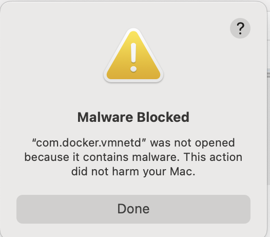
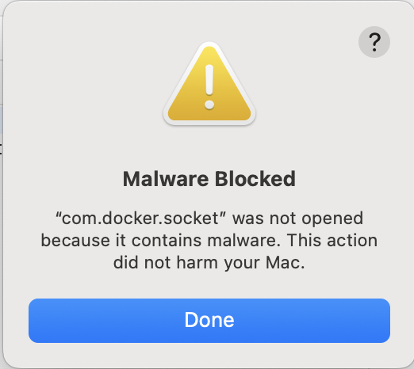

---
header:
    image: /assets/images/hd_magic_micronaut_jpa.jpg
title:  fix annoying fake security prompt in docker desktop in macbook
date: 2025-01-17
tags:
 - Java
permalink: /blogs/tech/en/fix-annoying-fake-security-prompt-in-docker-desktop-in-macbook
layout: single
category: tech
---
# Resolving Docker Desktop Security Blocks on MacBook: A Step-by-Step Solution

As a macOS user and Docker enthusiast, I recently encountered a frustrating security issue that prevented Docker Desktop from starting properly. If you're seeing error messages like "Malware detection prevents Docker Desktop to start" or "com.docker.vmnetd was not opened because it contains malware," you're not alone. In this guide, I'll walk you through a reliable solution to get Docker Desktop running smoothly again.

## Understanding the Issue

The problem stems from macOS's built-in security features mistakenly flagging Docker Desktop's components as potential malware. This is particularly common after fresh installations or updates of Docker Desktop. The security system specifically targets two critical Docker components:

1. com.docker.vmnetd - Docker's virtual machine network daemon

2. com.docker.socket - Docker's communication socket


## The Solution

I've developed a series of commands that safely remove the flagged components and allow for a clean restart of Docker Desktop. Here's the complete fix:

```bash
# First, remove the network daemon and socket from launch services
sudo launchctl bootout system/com.docker.vmnetd 2>/dev/null || true
sudo launchctl bootout system/com.docker.socket 2>/dev/null || true

# Remove the helper tools that were flagged as malware
sudo rm /Library/PrivilegedHelperTools/com.docker.vmnetd || true
sudo rm /Library/PrivilegedHelperTools/com.docker.socket || true

# Clean up any remaining Docker processes
ps aux | grep -i docker | awk '{print $2}' | sudo xargs kill -9 2>/dev/null
```

Let's break down what each part does:

1. The `launchctl bootout` commands safely remove Docker's network daemon and socket from macOS's launch services. The `2>/dev/null || true` portion ensures the command succeeds even if the services aren't currently running.

2. The `rm` commands remove the helper tools that were flagged by the security system. These will be recreated when Docker Desktop starts again.

3. The final command chain identifies and terminates any remaining Docker processes, ensuring a clean slate for the restart.

## Step-by-Step Instructions

1. Open Terminal on your MacBook
2. Copy and paste each command individually, or save them all in a script
3. Enter your administrator password when prompted
4. Close any security warning pop-ups that appear during the process
5. Launch Docker Desktop again

## Prevention and Best Practices

To minimize the chances of encountering this issue in the future:

1. Always download Docker Desktop directly from the official website (https://www.docker.com/products/docker-desktop/)
2. Keep your macOS and Docker Desktop updated to the latest versions
3. Consider temporarily disabling any third-party security tools during Docker Desktop updates
4. Save these commands in a script file for future reference

## Troubleshooting

If you still experience issues after following these steps:

1. Verify that all Docker processes are truly terminated by running: `ps aux | grep -i docker`
2. Check system logs for any remaining security blocks: `sudo log show --predicate 'subsystem == "com.apple.securityd"' --last 1h`
3. Consider performing a complete uninstall and reinstall of Docker Desktop

## Conclusion

While this security issue can be frustrating, it's actually a sign that macOS's security features are working as intended to protect your system. The solution provided here safely works around the false positive without compromising your system's security. Remember to always exercise caution when running commands with sudo privileges and ensure you're using software from trusted sources.

Have you encountered other Docker Desktop issues on macOS? Share your experiences in the comments below, and I'll be happy to help troubleshoot them.

