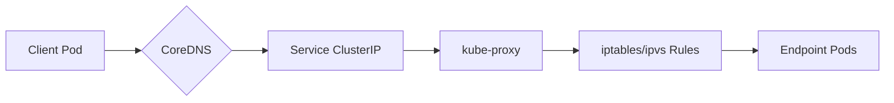

---
header:
    image: /assets/images/hd_wait_in_java.png
title:  Why This Simple YAML Reveals the Hidden Complexity of Kubernetes Networking YAML Kubernetes networking
date: 2025-09-01
tags:
    - tech
    - pressed
permalink: /blogs/tech/cn/why-this-simple-yaml-reveals-the-hidden-complexity-of-kubernetes-networking-yaml-kubernetes-networking
layout: single
category: tech
---
> The best revenge is massive success. - Frank Sinatra
---

## 🔥 你的 Kubernetes Service 配置，正在悄悄泄露安全风险！

三天前，我收到一封紧急邮件："生产环境数据库管理界面被公网扫描暴露"。调查结果令人窒息——又是一个看似无害的 NodePort Service 配置引发的血案。这让我想起去年某云厂商因为类似配置错误导致千万数据泄露的案例。

今天，让我们深入剖析这个看似简单的 YAML，揭示 Kubernetes 网络背后的复杂世界。

## 🧩 首先，理解这个 YAML 中的关键组件如何协同工作

```yaml
apiVersion: v1
kind: Service
metadata:
  name: open-webui-service
  namespace: open-webui
spec:
  type: NodePort
  ports:
  - port: 3888        # Service 暴露的端口
    targetPort: 3888  # Pod 内容器监听的端口
    nodePort: 30888   # 节点上暴露的端口
  selector:
    app: open-webui
    component: frontend
```

### 这个 YAML 背后的生态系统：

1. **Service 与 Pod 的关系**：
   - `selector` 字段通过标签选择器与 Pod 建立关联
   - Service 作为稳定的网络端点，背后是动态变化的 Pod IP

2. **三层端口协作机制**：
   - `nodePort: 30888` → 节点级别访问入口
   - `port: 3888` → Service 集群IP端口
   - `targetPort: 3888` → 实际应用端口

3. **kube-proxy 的关键角色**：
   - 监听 Service 和 Endpoint 变化
   - 维护 iptables/ipvs 规则
   - 实现负载均衡和流量转发

4. **CoreDNS 的服务发现**：
   - 为 Service 提供 DNS 解析
   - `open-webui-service.open-webui.svc.cluster.local` → ClusterIP

## 🎯 真实故事：一次价值5万元的配置失误

去年我在某金融公司做咨询时，遇到了工程师小王。他为了"临时测试"创建了一个 NodePort Service，心想："反正没人知道节点IP，用两天就删"。

第三天，安全团队发现：Shodan 上赫然显示着他们的节点IP和30888端口，后面跟着一行刺眼的红字："OpenWebUI 未授权访问漏洞"。

**根本原因**：小王不知道的是，这个配置会在所有节点上开放30888端口，包括那些有公网IP的节点。

## 🔍 NodePort 的安全陷阱：比你想象的更可怕

### ❌ 普通认知：
"NodePort = 只能通过节点IP访问，很安全"

### ✅ 资深洞察：
**NodePort 会在所有节点上开放端口**，就像在每个节点都开了一个后门。

我记得第一次深入研究 kube-proxy 源码时的发现：
```go
// kube-proxy 在处理 NodePort 时的主要逻辑
func (proxier *Proxier) syncProxyRules() {
    // 为每个节点添加相同的端口监听规则
    for _, nodeIP := range getAllNodeIPs() {
        addIPTablesRule(nodeIP, nodePort, serviceIP)
    }
}
```

这意味着：
1. **扫描器最爱**：30888 这种高位端口在 Shodan 眼里就像黑夜里的灯塔
2. **默认无认证**：除非应用层有认证，否则直接暴露
3. **网络策略可能失效**：某些 CNI 插件对 NodePort 流量处理不同

### 🛡️ 最佳实践：
```yaml
apiVersion: v1
kind: Service
metadata:
  name: secure-service
spec:
  type: LoadBalancer
  ports:
  - port: 443
    targetPort: 8443
  selector:
    app: secure-app
---
apiVersion: networking.k8s.io/v1
kind: NetworkPolicy
metadata:
  name: restrict-access
spec:
  podSelector:
    matchLabels:
      app: secure-app
  ingress:
  - from:
    - ipBlock:
        cidr: 10.0.0.0/8
```

## 📊 ClusterIP：你以为简单，其实暗藏玄机

有一次深夜，我被紧急呼叫："服务间歇性不可用"。排查3小时后发现——CoreDNS 缓存问题导致 ClusterIP 解析失败。

### ❌ 普通认知：
"ClusterIP = 内部服务发现，很简单"

### ✅ 资深洞察：
ClusterIP 是 Kubernetes 最精妙的抽象之一，依赖多个组件协同：



**关键依赖链**：
1. **kube-proxy** 维护 iptables/ipvs 规则
2. **CoreDNS** 提供域名解析服务
3. **CNI 插件** 负责底层网络连通性
4. **Endpoint Controller** 管理 Pod 与 Service 的映射

### 🛡️ 最佳实践：
```bash
# 系统性排查方法
kubectl get endpoints open-webui-service  # 检查端点状态
kubectl describe service open-webui-service  # 查看服务详情
kubectl debug node/node-name -it --image=nicolaka/netshoot
nslookup open-webui-service.open-webui.svc.cluster.local
```

## 🚀 Headless Service：分布式系统的生命线

我在做 Kafka on K8s 方案时，曾经低估了 Headless Service 的重要性，结果付出了惨重代价——集群始终无法稳定形成。

### ❌ 普通认知：
"Headless Service = 没有 ClusterIP，没啥用"

### ✅ 资深洞察：
**Headless Service 是 StatefulSet 的灵魂**。通过 DNS SRV 记录提供完整的服务发现能力：

```
# DNS 查询返回所有 Pod IP
kafka-headless.open-webui.svc.cluster.local → 
  10.244.1.10
  10.244.2.11
  10.244.3.12
```

### 🛡️ 最佳实践：
```yaml
apiVersion: v1
kind: Service
metadata:
  name: kafka-headless
  annotations:
    service.alpha.kubernetes.io/tolerate-unready-endpoints: "true"
spec:
  clusterIP: None
  publishNotReadyAddresses: true  # 关键参数！
  ports:
  - port: 9092
    name: broker
  selector:
    app: kafka
  sessionAffinity: None
```

## 💡 来自老兵的实用建议

1. **理解流量路径**：从入口到 Pod 的完整路径
2. **监控关键指标**：kube-proxy 规则数量、DNS 查询延迟
3. **定期安全审计**：检查不必要的 NodePort 暴露
4. **使用网络策略**：最小权限原则，限制不必要的访问

## 🎯 总结：超越 YAML 表面，深入网络本质

那个价值5万元的事故教会我们：**真正的 Kubernetes 专家不是会写 YAML，而是理解每个配置背后的完整网络栈**。

当你下次写 Service YAML 时，问问自己：
1. 这个服务真的需要 NodePort 吗？
2. 网络策略是否足够严格？
3. DNS 解析是否可靠？
4. 监控是否覆盖了所有关键指标？

---

📌 **延伸阅读**：
- [Kubernetes Network Policies 实战指南]
- [深入理解 kube-proxy 工作原理]
- [云原生网络安全最佳实践]

✉️ 有问题？欢迎交流：
- 主页：https://todzhang.com/
- 公众号：竹书纪年的IT男
- 邮箱：phray@163.com

> "最好的故障是永远不发生的故障" —— 某次事故复盘后的感悟
