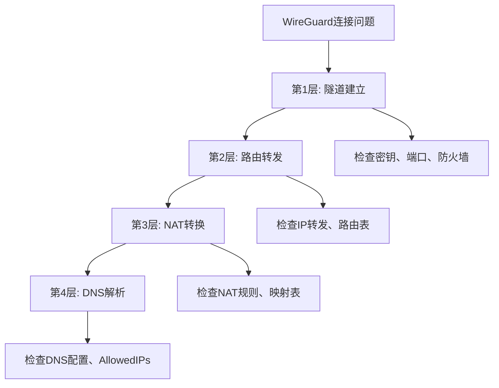

---
header:
    image: /assets/images/hd_kerberos.png
title:  NAT setup issue wireguard technology networking security WireGuard firewall configuration issues
date: 2025-09-09
tags:
    - tech
permalink: /blogs/tech/en/nat-setup-issue-wireguard-technology-networking-security-WireGuard-firewall-configuration-issues
layout: single
category: tech
---
> The question isn't who is going to let me; it's who is going to stop me. - Ayn Rand

# iPhone连WireGuard却上不了网？我花了6小时踩遍所有坑，最后发现真凶竟然是...

昨天晚上10点，我满怀信心地在Windows 11上配好了WireGuard服务端。iPhone连上，绿灯亮起，一切看起来完美。

然后我打开Safari，输入google.com，回车...

**转圈，转圈，超时。**

我当时的第一反应是：**"又是DNS问题吧，改个8.8.8.8就好了。"**

6小时后，我想撞墙。

## 第一个坑：我被"连接成功"骗了

看到WireGuard显示绿色连接状态，我理所当然地认为"WireGuard已经工作了"。就像看到电脑开机了，就认为网络肯定通了一样。

**这是第一个错误认知。**

我花了1小时检查各种DNS配置，尝试了1.1.1.1、8.8.8.8、114.114.114.114，甚至把手机的DNS改成了自动。

结果：依然上不了网。

直到我想起一个基本问题：**连接成功 ≠ 数据包能出去**。

WireGuard只是建立了一条隧道，就像在两座山之间挖了个洞。但如果洞的另一头没有路，你还是走不出去。

## 第二个坑：我以为Windows会自动NAT

作为一个用了10年Linux的工程师，我潜意识里认为Windows应该和Linux一样，**开启IP转发就能自动NAT**。

错得离谱。

我检查了IP转发状态：

```powershell
Get-ItemProperty -Path "HKLM:\SYSTEM\CurrentControlSet\Services\Tcpip\Parameters" -Name "IPEnableRouter"
```

结果是1，看起来没问题。但我忽略了一个关键点：**Windows需要手动配置NAT规则**。

当时我甚至开始怀疑是不是iPhone的问题，换了iPad测试，结果一样。

## NAT到底是什么？为什么WireGuard离不开它？

在深入问题之前，我必须先搞清楚NAT这个被大多数程序员忽略的概念。

### NAT的本质：IP地址的"翻译官"

NAT (Network Address Translation) 直译是"网络地址转换"，但这个名字容易让人误解。**NAT的真正作用是做"地址翻译"**。

想象你在一家跨国公司工作：
- 你的工号是内部的：10.8.0.100
- 但对外时，公司统一用公网地址：203.0.113.1
- 当你给客户发邮件时，客户看到的发件人是公司地址，不是你的内部工号
- 当客户回复时，公司前台负责把邮件转发给你

**NAT做的就是这个"前台转发"的工作。**

### 为什么需要NAT？IPv4地址不够用

这个问题要追溯到互联网设计的早期。IPv4只有43亿个地址，但全球设备早就超过了这个数量。

所以出现了一个巧妙的解决方案：
- **公网IP**：真正能在互联网上路由的地址（珍贵资源）
- **私有IP**：只在局域网内使用的地址（可以重复使用）

常见的私有IP段：
- `10.0.0.0/8` (10.0.0.1 - 10.255.255.254)
- `172.16.0.0/12` (172.16.0.1 - 172.31.255.254) 
- `192.168.0.0/16` (192.168.0.1 - 192.168.255.254)

你家路由器就是一个NAT设备：所有设备都用192.168.x.x的内网IP，但上网时都"伪装"成路由器的公网IP。

### WireGuard中的NAT：双重地址转换

在WireGuard场景下，NAT的作用更加关键，因为涉及**双重地址转换**：

```
iPhone (客户端)          Windows (WireGuard服务端)           互联网
10.8.0.100        →        10.8.0.1                →    外网服务器
                         (WireGuard隧道IP)              (真实公网IP)
```

数据包的完整旅程：

1. **iPhone发出请求**：源IP = 10.8.0.100，目标 = google.com
2. **通过WireGuard隧道**：数据包加密，发送到Windows服务端
3. **第一次NAT转换**：Windows把源IP从10.8.0.100改成10.8.0.1
4. **第二次NAT转换**：Windows把源IP从10.8.0.1改成真实公网IP
5. **发送到互联网**：Google服务器看到的是Windows的公网IP

**如果缺少任何一次NAT转换，数据包就会迷路。**

## 第三个坑：我差点放弃的那一刻

晚上12点，我已经检查了：
- 防火墙规则 ✓
- IP转发 ✓  
- 路由表 ✓
- DNS配置 ✓
- 重启服务 ✓

**但就是上不了网。**

我甚至开始怀疑是不是WireGuard在Windows上有bug。准备切换到OpenWireGuard的时候，突然想起一个细节：

**我从来没有验证过数据包是否真的从WireGuard接口转发到了外网接口。**

## 真凶现身：Windows NAT配置的盲区

我打开Wireshark，监控WLAN接口，然后从iPhone发起ping 8.8.8.8。

**结果：没有任何数据包。**

这说明什么？数据包确实进了WireGuard隧道，但没有从Windows的物理网卡出去。

问题不在IP转发，而在**NAT转换**。

Windows的IP转发只是说"我愿意转发包"，但不会自动把内网IP（10.8.0.x）转换成外网IP。

### Windows vs Linux的NAT差异

这里有个重要的概念区别，很多程序员不知道：

**Linux的做法** (iptables)：
```bash
# 开启IP转发
echo 1 > /proc/sys/net/ipv4/ip_forward

# 配置NAT规则
iptables -t nat -A POSTROUTING -s 10.8.0.0/24 -o eth0 -j MASQUERADE
```
Linux的iptables会自动处理地址转换，程序员习惯了这种"一条命令搞定"的方式。

**Windows的做法** (NetNat)：
```powershell
# 开启IP转发
Set-ItemProperty -Path "HKLM:\SYSTEM\CurrentControlSet\Services\Tcpip\Parameters" -Name "IPEnableRouter" -Value 1

# 必须单独创建NAT规则
New-NetNat -Name "WireGuardNAT" -InternalIPInterfaceAddressPrefix 10.8.0.0/24
```

**关键差异**：Windows把"转发"和"NAT"分成了两个独立的功能，必须都配置才行。

### 深入理解Windows NetNat

`New-NetNat`这条命令做了什么？

```powershell
New-NetNat -Name "WireGuardNAT" -InternalIPInterfaceAddressPrefix 10.8.0.0/24
```

参数解析：
- `Name`：NAT规则的名字，用于管理
- `InternalIPInterfaceAddressPrefix`：**内网IP段**，指定哪些IP需要NAT转换

执行后，Windows会：
1. **识别内网流量**：凡是源IP属于10.8.0.0/24的包，都被标记为"需要NAT"
2. **自动选择外网接口**：Windows会自动找到当前的默认网关接口（通常是WLAN或以太网）
3. **创建NAT映射表**：记录内网IP:端口 ↔ 外网IP:端口的对应关系
4. **双向转换**：出去的包改源IP，回来的包改目标IP

运行这条命令的瞬间，iPhone立刻能上网了。

## 第四个坑：AllowedIPs的隐秘陷阱

解决了NAT问题，我以为大功告成。结果第二天测试时发现：**有些网站能开，有些不能**。

检查后发现，我的客户端配置写的是：

```ini
AllowedIPs = 10.8.0.0/24
```

### AllowedIPs的真实含义

很多人以为`AllowedIPs`是"允许访问的IP"，其实不是。

**正确理解**：`AllowedIPs = 路由表条目`

当你配置`AllowedIPs = 10.8.0.0/24`时，iPhone会在路由表中添加：

```
目标网段: 10.8.0.0/24
网关: WireGuard隧道
```

这意味着：
- ✅ 访问10.8.0.x的流量 → 走WireGuard隧道  
- ❌ 访问其他任何IP的流量 → 走原来的网络

所以部分网站能开（碰巧解析到10.8.0.x段），部分不能开。

**全流量WireGuard的正确配置**：

```ini
AllowedIPs = 0.0.0.0/0, ::/0
```

这相当于说："所有IPv4和IPv6流量都走WireGuard"。

## NAT的进阶知识：端口映射和连接跟踪

### NAT映射表的工作原理

当iPhone访问Google时，Windows的NAT模块会创建一个映射条目：

```
内网地址            外网地址              状态
10.8.0.100:51234 ↔ 203.0.113.1:51234   ESTABLISHED
```

关键点：
1. **端口可能被重新分配**：如果51234端口已被占用，NAT会自动选择其他端口
2. **连接状态跟踪**：NAT必须记住每个连接的状态，才能正确转发回来的数据包
3. **超时清理**：长时间无活动的连接会被自动清理

### Windows NAT的限制和优化

Windows NetNat相比Linux iptables有一些限制：

**端口范围限制**：
```powershell
# 查看NAT的端口池
Get-NetNat | Get-NetNatExternalAddress
```

**并发连接限制**：
Windows NAT默认支持约1000个并发连接，对于个人WireGuard够用，企业级可能需要优化。

**静态端口映射**：
如果需要固定端口映射（比如远程桌面），可以用：
```powershell
Add-NetNatStaticMapping -NatName "WireGuardNAT" -Protocol TCP -ExternalIPAddress 0.0.0.0 -InternalIPAddress 10.8.0.100 -InternalPort 3389 -ExternalPort 3389
```

## 故障排查的系统性方法

基于这次踩坑，我总结了一套WireGuard故障排查的系统方法：

### 层级排查法



### 实用的排查命令

**检查NAT状态**：
```powershell
# 查看所有NAT规则
Get-NetNat

# 查看NAT会话（活跃连接）
Get-NetNatSession

# 查看NAT统计信息
Get-NetNatExternalAddress
```

**检查路由表**：
```powershell
# 查看IPv4路由表
route print -4

# 查看特定接口的路由
netsh interface ipv4 show route
```

**实时监控网络接口**：
```powershell
# 查看接口统计
Get-NetAdapterStatistics

# 实时监控特定接口的流量
Get-Counter "\Network Interface(WireGuard Tunnel)\Bytes Total/sec" -Continuous
```

## 我学到的5个深层教训

1. **"连接成功"不等于"能上网"**
   - 隧道建立只是第一步，数据转发才是关键

2. **不要跨平台想当然**
   - Linux的经验不能直接套用到Windows
   - 每个系统的网络栈都有自己的特点

3. **NAT是网络的"翻译官"**
   - 理解NAT的工作原理，能解决80%的网络连通性问题
   - Windows NetNat和Linux iptables的区别要搞清楚

4. **AllowedIPs是路由，不是ACL**
   - 这个命名容易误导，实际是在配置路由表
   - 全流量WireGuard必须用0.0.0.0/0

5. **抓包是最诚实的调试工具**
   - 当配置看起来都对时，数据包会告诉你真相
   - Wireshark是网络工程师的显微镜

## 一键修复脚本（生产级）

基于这次踩坑经历，我写了一个完整的检查和修复脚本：

```powershell
# wireguard-fix-advanced.ps1
param(
    [string]$WireGuardSubnet = "10.8.0.0/24",
    [string]$NatName = "WireGuardNAT"
)

Write-Host "=== WireGuard Windows NAT 配置检查工具 ===" -ForegroundColor Green

# 检查管理员权限
if (-NOT ([Security.Principal.WindowsPrincipal] [Security.Principal.WindowsIdentity]::GetCurrent()).IsInRole([Security.Principal.WindowsBuiltInRole] "Administrator")) {
    Write-Error "需要管理员权限运行此脚本"
    exit 1
}

# 1. 检查IP转发
Write-Host "`n1. 检查IP转发状态..." -ForegroundColor Yellow
$ipForward = Get-ItemProperty -Path "HKLM:\SYSTEM\CurrentControlSet\Services\Tcpip\Parameters" -Name "IPEnableRouter" -ErrorAction SilentlyContinue

if (!$ipForward -or $ipForward.IPEnableRouter -eq 0) {
    Write-Host "启用IP转发..." -ForegroundColor Red
    Set-ItemProperty -Path "HKLM:\SYSTEM\CurrentControlSet\Services\Tcpip\Parameters" -Name "IPEnableRouter" -Value 1
    Write-Host "✓ IP转发已启用（需要重启生效）" -ForegroundColor Green
} else {
    Write-Host "✓ IP转发已启用" -ForegroundColor Green
}

# 2. 检查NAT规则
Write-Host "`n2. 检查NAT规则..." -ForegroundColor Yellow
$existingNat = Get-NetNat -Name $NatName -ErrorAction SilentlyContinue

if (!$existingNat) {
    Write-Host "创建NAT规则..." -ForegroundColor Red
    try {
        New-NetNat -Name $NatName -InternalIPInterfaceAddressPrefix $WireGuardSubnet
        Write-Host "✓ NAT规则创建成功: $WireGuardSubnet" -ForegroundColor Green
    } catch {
        Write-Error "NAT规则创建失败: $($_.Exception.Message)"
    }
} else {
    Write-Host "✓ NAT规则已存在: $($existingNat.InternalIPInterfaceAddressPrefix)" -ForegroundColor Green
}

# 3. 检查防火墙规则
Write-Host "`n3. 检查防火墙规则..." -ForegroundColor Yellow
$firewallRule = Get-NetFirewallRule -DisplayName "WireGuard*" -ErrorAction SilentlyContinue

if (!$firewallRule) {
    Write-Host "防火墙规则可能缺失，请检查UDP端口是否开放" -ForegroundColor Yellow
} else {
    Write-Host "✓ 发现WireGuard防火墙规则" -ForegroundColor Green
}

# 4. 显示当前网络状态
Write-Host "`n4. 当前网络状态:" -ForegroundColor Yellow
Write-Host "NAT规则列表:"
Get-NetNat | Format-Table Name, InternalIPInterfaceAddressPrefix, ExternalIPInterfaceAddressPrefix -AutoSize

Write-Host "`n活跃NAT会话数: $($(Get-NetNatSession).Count)"

Write-Host "`n网络接口列表:"
Get-NetAdapter | Where-Object Status -eq "Up" | Format-Table Name, InterfaceDescription, LinkSpeed -AutoSize

Write-Host "`n=== 检查完成 ===" -ForegroundColor Green
Write-Host "如果问题仍未解决，请:"
Write-Host "1. 重启WireGuard服务"
Write-Host "2. 检查客户端AllowedIPs配置"
Write-Host "3. 使用Wireshark抓包验证数据流向"
```

## 最后的反思：网络知识的重要性

这次排查让我意识到，**现代程序员对网络基础知识的了解程度严重不足**。

我们每天都在写网络应用，但对数据包如何从A点到达B点的细节却一知半解。当出现问题时，往往只能靠"重启试试"、"换个DNS"这样的玄学方法。

**真正的网络调试能力包括**：
- 理解TCP/IP栈的工作原理
- 掌握路由和NAT的机制
- 会用抓包工具分析数据流
- 了解不同操作系统的网络实现差异

这些知识在云原生时代更加重要，因为Kubernetes、Service Mesh、API Gateway等技术，本质上都是在做网络流量的路由和转发。

如果你也是那种"网络一出问题就头疼"的程序员，我建议从这次的NAT案例开始，逐步补齐网络基础知识。

**毕竟，没有网络，就没有互联网；没有NAT，就没有现代网络。**

---

*P.S. 如果这篇文章帮你解决了WireGuard问题，或者让你学到了NAT知识，不妨转发给你的team同事。毕竟，网络问题人人都会遇到，但真正理解原理的人并不多。*