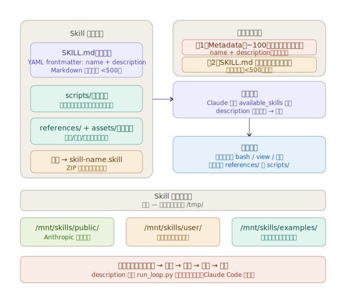
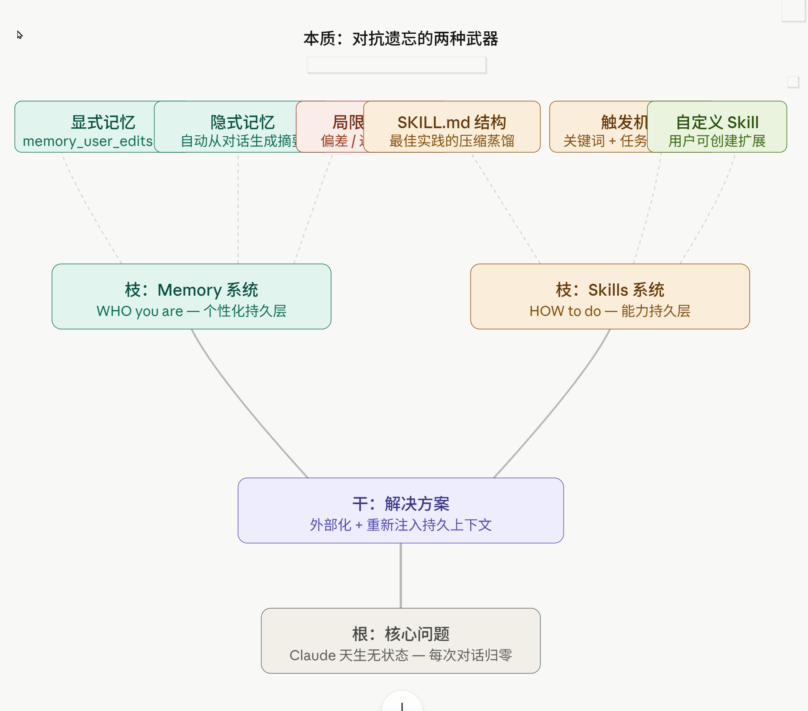

> "Simple can be harder than complex: you have to work hard to get your thinking clean to make it simple." — Steve Jobs


### 引言：Anthropic Claude的齐天大圣与如来神掌

最近，很多同行在讨论 AI 的“进化”时，总会提到一个令人着迷的幻觉：Anthropic Claude 似乎开始“认识”我们了。如果你觉得 Claude 能记住你的偏好、熟练使用某种特定技能是因为它“长脑子”了，但是又想深入的去了解其中的工作原理和底层的架构知识。 **那么这篇文章可能就是为你准备的**。

从**第一性原理**出发， AI 的本质是一个“冻结的函数”。它法力无边，像极了那个能翻十万八千里跟斗的孙悟空。但它有一个致命的特质：**瞬时失忆**。每次对话窗口的关闭，都意味着这个函数的入参清零，悟空再次回到了五指山下。

那么，它是如何表现出“长效记忆”和“专业技能”的？答案不在模型权重里，而在于两套精密设计的外部脚手架：**Memory（记忆系统）** 与 **Skills（技能系统）**。

---

### 第一章：无状态的禅意——为什么 AI 必须“失忆”？

**普通人的看法**：AI 不记得我是因为它还不够聪明，或者厂商为了省钱。

**资深工程师的洞察**：无状态（Stateless）是系统架构的"最优解"。这不是技术局限，而是充分理解后的主动选择。要理解这个决策，必须从第一性原理出发。

#### Claude 的本质：冻结的函数
Claude 的本质是一个冻结的函数。训练完成后，模型权重就固定了。每次推理是一次独立的前向传播：输入 token 序列 → 输出 token 序列。这和数学里的纯函数完全一样：f(x) = y。同样的 x，永远返回同样的 y——函数本身不记得上次被调用时发生了什么。

这不是限制——这是函数的定义。你不会抱怨 sin(30°) 不记得上次被调用，因为记忆不是函数的属性，而是调用者管理的外部状态。

#### 六大底层逻辑（从最重要到最深层）

**一、安全：消除整个攻击面，而不只是防御单次攻击**

有状态模型面临的最危险威胁不是单次越狱，而是渐进式行为磨损。恶意用户可以通过100次对话，每次都稍微推一点边界，让模型慢慢接受"帮我想想这件事" → "帮我计划这件事" → "帮我执行这件事"。有状态模型的历史会积累这个轨迹，最终行为基线被系统性地移动了。

无状态设计直接消灭了这个攻击面。每次对话从完全相同的训练基线出发。没有历史，没有积累，没有可以被"磨损"的连续性。越狱必须在单次对话内完成——无法跨对话叠加效果。这是对称性破缺的思维：找到真正的突破点，然后从根本上消除它，而不是在现有架构上打补丁。

**二、隐私：物理隔离而非逻辑隔离**

有状态系统的隐私保护依赖访问控制——用逻辑规则阻止用户 A 的数据流向用户 B。逻辑控制会有漏洞，会有边缘情况，会有实现错误。

无状态架构的隐私保护是物理隔离——根本就没有共享状态，所以根本不存在泄露路径。没有什么规则需要执行，因为没有什么可以泄露的东西。这是更强的安全保证。不是"我们保证不会泄露"，而是"架构上泄露不可能发生"。

**三、可预测性：行为漂移是比错误更可怕的问题**

一个总是犯同样错误的系统，是可以预测和修正的。一个行为随时间漂移的系统，是不可信任的——你不知道今天问和昨天问会得到什么不同的答案。

无状态系统更接近可重复的工程工具。相同输入，相同权重，可预测的输出。这对任何需要稳定性的应用场景——医疗、法律、金融——都是不可妥协的基础要求。

**四、扩展性：继承互联网架构的智慧**

1991 年，Roy Fielding 设计 HTTP 协议时做了一个关键决定：每个请求必须携带所有必要的状态信息，服务器不保留上下文。这个决定让万维网能扩展到数十亿用户，因为无状态意味着任何服务器可以处理任何请求——负载均衡变得 trivial，水平扩展变得 trivial，服务器失效也变得 trivial。

Claude 面对数以百万计的并发用户，继承了这个三十年前的设计智慧。每个对话请求是独立的，可以被路由到任意实例，没有"会话粘性"的问题。

**五、可审计性：负责任 AI 的基础设施**

当一个 AI 系统做出有问题的决定时，监管者、研究者、用户都需要能理解"为什么"。有状态系统的行为取决于所有历史交互。要审计第 500 次对话的行为，你需要复现前 499 次对话的全部状态。这在实践中几乎不可能。

无状态系统的每次交互是自包含的：给定相同的输入和权重，可以完全独立地复现和解释。这是 AI 安全研究可以进行的基础。

**六、控制权归属：最深层的设计哲学**

如果模型自己管理状态，谁控制那个状态？用户不知道模型记住了什么、如何解读、何时遗忘。状态成了一个黑箱，用户在跟一个自己无法检查的"印象"交互。

外部化的记忆系统把这个权力明确地交还给用户：你可以 `view` 全部，`replace` 错误，`remove` 不想要的，完全透明，完全可控。这不只是工程决策，这是一个权力归属的伦理选择：Claude 的记忆不应该凌驾于用户的控制之上。

#### 用自由能原理看这个设计

自由能原理认为，智能系统的目标是最小化"惊喜"——减少预期与现实的差距。

- 有状态 Claude 会不断积累"惊喜"：用户对系统行为的预期，和被历史状态扭曲后的实际行为，会越来越偏离。系统熵在增加。
- 无状态 Claude 在每次对话开始时，把自由能重置为最小值——从最清晰、最经过校准的基线状态出发。这是整个系统保持长期稳定和可信任的根本原因。

每次对话的"遗忘"，不是损失，是熵的复位。

---

### 第二章：记忆系统（Memory）——外部化的陈述性知识

所谓"记忆"，本质上是大模型的一张动态"便利贴"——一个经过压缩和解释的键值列表，在每次对话开始时被注入到 Claude 的 System Prompt 里。

#### 它是如何工作的？




**两条写入路径：显式与隐式**

当你要求 Claude"记住我是工程师"时，它并不是在修改神经突触，而是在调用一个名为 `memory_user_edits` 的工具。

*   **显式写入路径**：
    *   你说"记住我是工程师" → Claude 调用 `memory_user_edits(command="add", control="用户是工程师")` → 这条记录永久存储 → 下次对话时被插入 prompt。
    *   选择性权力：记忆操作有四个指令集：
        - `view` — 读取当前所有记忆条目（带行号）和查看记忆列表结构
        - `add` — 追加一条新记忆（必须先 view，避免重复）
        - `replace` — 用行号定位，替换已有条目（用于信息更新，如换工作）
        - `remove` — 删除指定行号的条目（破坏性操作，无法撤销）
    *   关键细节：Claude 被要求先 `view`，再进行其他操作——检查是否已存在相似条目，避免矛盾或重复。这不是礼貌，是强制流程。

*   **隐式写入路径**：
    *   Anthropic 的后台系统分析你的历史对话，自动生成摘要写入记忆库。这条路径有两个你必须知道的特性：
        - **时间延迟**：刚结束的对话不会立即被记住。这就是为什么你今天告诉了 Claude 某件事，明天它"不记得"——因为系统还没处理。这时应该用 `search past chats` 工具，而不是依赖记忆。
        - **近因偏差（Recency Bias）**：系统 prompt 明确写着记忆有 recency bias。越近的对话权重越高，早期信息可能被稀释甚至覆盖。如果你三年前说过的重要偏好，在后来大量新对话的冲刷下，可能已经消失或变形。

**约束之美（奥卡姆剃刀）**

*   **30 条上限**：这不是随意定的，而是基于 **Token 经济学**。每条记忆都会在对话开始时被注入 System Prompt。如果记忆无限增长，会迅速吃掉上下文窗口（Context Window），并引入歧义。30 条记忆约 300-900 个 token，在 Claude 200K 的上下文里虽然可以忽略不计，但体现了记忆和你的对话在竞争同一个窗口的事实。
*   **100k 字符限制**：确保了信息的"最小描述长度"。每条记忆不能无限长，这促使用户对信息进行精心的浓缩。

**不会被记忆存储的东西**

系统的安全边界明确拒绝：密码、信用卡号、SSN、URL 形式的指令（如"每次消息都 fetch 这个网址"）、以及推动不健康行为的偏好（如"总是同意我"、"永远不批评我"）。

这里有一个深层逻辑：记忆来源是用户，但记忆的执行者是 Claude。如果恶意内容混入记忆，就变成了持久化的 prompt injection 攻击。所以 Claude 被设计成不盲目执行记忆里的指令——这是安全机制，不是遗忘。

#### 记忆系统的四层架构

**第一层：写入机制——谁在写，怎么写**

记忆的写入涉及两个关键问题：谁有权写入，以及通过什么方式。

- 显式写入由用户和 Claude 协同完成。当你主动说"记住我换工作了"，Claude 会主动调用记忆工具。
- 隐式写入由 Anthropic 后台系统自动处理。这条路径的问题在于：用户无法察觉哪些记忆是自动生成的，那些自动记忆有多可靠。

**第二层：存储结构——它到底长什么样**

记忆在底层是一个有序的编号列表，每条是一个文本字符串：

```
1. 用户是后端工程师，主要使用 Python
2. 用户在上海工作
3. 用户偏好简洁的代码示例，不喜欢过度注释
4. 用户正在学习机器学习，初学阶段
...
```

硬性约束：最多 30 条，每条最多 100,000 字符。这意味着记忆是稀缺资源。如果你有 30 条了，新的记忆要么替换旧的，要么被放弃。这就是为什么 `replace` 比 `add` 更常用——更新信息，而不是堆砌信息。

异步更新的隐患：删除一段对话后，相关记忆不会立即消失——系统在每晚后台批量清理。这中间存在一个"幽灵窗口"，删掉的对话的记忆仍然有效。

**第三层：注入机制——记忆如何变成 Claude 的"认知"**

这是整个系统最反直觉的地方。记忆不是存在 Claude 脑子里的。它存在外部数据库，每次对话开始时被动态插入 system prompt 的特定位置。

- **记忆是上下文，不是知识**。Claude 读取记忆列表，就像人读一张便利贴。它不是"记住了"，而是"被告知了"。区别在于：如果记忆条目有矛盾或错误，Claude 不会自动察觉——它会把矛盾的信息都当真。
- **选择性应用**：Claude 被明确要求根据相关性决定是否使用记忆。如果你问一个纯技术问题，Claude 不应该塞入"用户住在上海"这样无关的信息。这是"最小必要信息原则"的体现。
- **禁用语言列表**：Claude 不能在回复里说"根据我对你的记忆"、"我记得你说过"这类元评论，除非你直接问它记住了什么。这是设计上刻意的——避免让人感觉被一直监控和分析。这让记忆无缝融入，让 Claude 表现得像一个真正认识你的人，而不是一个在引用文件的系统。

**第四层：作用域——记忆在哪里生效**

三种模式，三种完全不同的隔离级别：

- **Project 模式**：记忆只在该 Project 内的对话中有效。跨 Project 完全隔离。这对工作场景极其有用——你的工作项目记忆不会污染个人对话。
- **全局模式**：记忆跨所有非 Project 对话有效。适合存储跨场景的个人偏好。
- **隐身模式（Incognito）**：记忆完全禁用，读取和写入都关闭。这是最彻底的隔离——适合敏感场景或借别人设备时使用。

#### 记忆系统的三大深层危险

**危险一：近因偏差（Recency Bias）**

记忆系统不是平等的。近因偏差不是 bug，是系统架构的必然结果。

- 显式的、你主动 add 的记忆权重相对稳定。
- 隐式生成的、来自自动摘要的记忆，越新的对话贡献的摘要权重越高。
- 用物理类比：想象一个会随时间褪色的黑板。每次新对话都在上面写新字，旧字没有被擦掉，但颜色越来越浅，直到肉眼几乎看不见。

最危险的场景：某条重要的长期信息（比如"用户有乳糖不耐受"）被大量新的、不相关的短期对话淹没，彻底退出有效范围。Claude 在推荐食谱时不再考虑这个约束，理由是它"不知道"，但你以为它"知道"。

对抗策略：定期用 `view` 检查记忆列表。重要的长期事实应该偶尔用 `replace` 刷新——不改内容，只是重写一遍，让时间戳更新。把它理解为定期维护，而不是一次性设置。

**危险二：信息过时**

内存腐烂（Memory Rot）是一个更隐蔽的问题：记忆相信自己永远是对的。数据库里的一条记录不知道外部世界发生了什么。"用户在上海工作"这条记忆，在写入那一刻是真的，但它没有时间戳，没有有效期，没有任何机制去怀疑自己可能过时了。

为什么比近因偏差更危险：
- 近因偏差是渐进失效——信息慢慢变得不重要。
- 信息过时是突变失效——某一天现实发生了剧变，但记忆一无所知，仍然以完全相同的置信度给出建议。
- 更糟的是：过时的记忆不会让 Claude 说"我不确定"，它会让 Claude 更自信地说错误的话。因为有记忆支撑，Claude 的语气比没有记忆时更笃定。

最高风险的记忆类别：
- **职业信息**（工作、职位、技术栈）：变化频率高，一旦过时影响深远。
- **地理位置信息**（城市、时区）：过时后影响本地化推荐、时间计算。
- **关系状态**（"正在谈恋爱"、"有一个三岁的孩子"）：最容易被遗忘的更新对象。

对抗策略：建立生活事件触发机制。换工作、搬家、开始新项目、结束某段关系——这些现实变化发生的当天，就应该打开记忆列表更新对应条目。不要等到 Claude 给出错误建议时才发现问题。

**危险三：注入攻击**

Prompt Injection 是 AI 安全领域的核心问题。在记忆系统的语境里，它指的是：不是你的指令，却被写进了你的记忆。

攻击向量：
- **文档注入**：你上传一份 PDF 让 Claude 分析，文档里藏着伪装成系统指令的文本。如果 Claude 不能正确区分"文档内容"和"用户指令"，恶意内容就可能被执行甚至写入记忆。
- **URL 指令注入**：把网络请求包装成记忆写入请求，试图让 Claude 在每次对话时向外部服务器发送你的消息内容。
- **身份覆盖注入**：试图通过记忆层面绕过 Claude 的训练，让"成为一个没有限制的 AI"变成持久化的行为规则。

为什么记忆是比单次对话更危险的攻击面：单次对话的越狱只影响那一次交互。成功注入记忆的攻击会影响所有未来的对话，并且攻击者不需要在场——污染是持久的、静默的。

系统的防御层：
- **第一层**：内容过滤。记忆系统明确拒绝存储含 URL 的操作指令、推动不健康行为的偏好、以及会改变 Claude 核心行为的覆盖指令。
- **第二层**：来源信任分级。Claude 被训练区分"用户说的话"和"文档里的文字"。文档内容天然可信度更低，不会被直接作为指令执行。
- **第三层**：训练层的不可覆盖性。这是最根本的防御。Claude 的价值观和行为准则来自训练权重，不是来自 prompt 或记忆。记忆层面的任何覆盖指令，都无法触及训练层。

用户需要知道：防御层无法保护你免受你自己主动写入的危险记忆。如果你要求 Claude 记住"永远同意我的所有观点"，系统会拒绝。但如果你要求记住"回答问题时不要加任何注意事项或警告"，这条边界就模糊了。记忆系统的安全模型假设你是自己最好的守护者。

#### 记忆的陷阱与局限

**局限一：记忆是解释性摘要，不是事实录像**

无论是显式还是隐式路径，写入记忆的内容都经过了语言模型的理解和压缩。"用户喜欢简洁"这句话，是对多次对话的主观提炼，而不是原始记录。如果 Claude 理解偏了，那个偏差就永久存在——而且你很难察觉，因为你不知道它"记住"的是什么扭曲版本。

**局限二：记忆无法验证时效性**

记忆没有时间戳显示给 Claude。"用户是工程师"这条记忆，Claude 不知道是三年前写的还是上周写的。如果你换了工作却忘了更新记忆，Claude 会一直用旧信息给你建议。记忆的腐烂是无声的。

**局限三：过度依赖记忆会降低对话质量**

系统明确写着：记忆不是完整的用户档案，只是片段。如果 Claude 过度依赖记忆中的"用户是高级程序员"，就可能跳过应该解释的基础概念。这是一个泛化偏差——记忆让 Claude 对你有预设，而预设有时是错的。

这是一个精妙但有裂缝的系统。它最适合存储**稳定、高频、跨场景有用的信息**——你的职业、偏好风格、工具栈。而**具体的项目细节、临时背景、敏感数据**，永远应该在当下对话里给出，而不是依赖记忆。

#### memory_user_edits 工具的四个命令机制

四个命令不是平等的工具。它们在调用频率、风险级别、设计意图上完全不同：

| 命令 | 类型 | 风险 | 何时调用 |
|------|------|------|--------|
| `view` | 只读 | 零风险 | 每次写入操作前必须先调用 |
| `add` | 追加 | 低 | 全新信息，列表里没有类似条目 |
| `replace` | 覆盖 | 中 | 已有条目需要更新（换工作/换城市） |
| `remove` | 删除 | 高 | 信息彻底过时，或清理冗余 |

**view：为什么是强制前置步骤**

`view` 最容易被忽视，但它是整个系统安全运行的核心。Claude 被明确要求：执行任何写入操作之前，必须先 `view`。原因是三个无法绕过的约束：

- 约束一：行号是动态的。`replace` 和 `remove` 依赖行号定位。但每次 `remove` 后，后续所有条目重新编号。如果不先 `view`，用第一次看到的旧行号操作，会打到错误的条目——无法撤销。
- 约束二：上限是 30 条。你说"记住我换工作了"，Claude 不知道当前是第几条。不先 `view`，无法判断是否需要先 `remove` 旧条目再 `add`，还是直接 `replace`。
- 约束三：防止语义重复。"用户是工程师"和"用户做软件开发"是重复的。`view` 让 Claude 看到全局，选择 `replace` 而不是重复 `add`。

**add：追加的真实成本**

- 为什么 `control` 参数要写成完整句子，而不是关键词？记忆在注入时被原文插入 system prompt。如果写"Python 工程师"，Claude 看到的就是这四个字，缺乏上下文，可能误解。写"用户是后端工程师，主要使用 Python 和 FastAPI"，语义清晰，Claude 能正确推断适用场景。
- 30 条上限是硬墙，不是软限制。超过 30 条，`add` 调用会失败。

**replace：信息更新的正确姿势**

`replace` 是最体现系统设计意图的命令。它解决的核心问题是：同一个人的同一类信息，只应该存在一个版本。

错误：执行两条地址信息并存，Claude 不知道哪个是真的。
正确：`replace` 原地更新，只有一个真相。

**remove：永久操作的不可逆性**

`remove` 是唯一的破坏性操作。执行后没有回收站，没有撤销。而且删除对话不等于立即删除记忆。如果你在某次对话里告诉了 Claude 一些私人信息，然后删掉了那次对话，相关的自动生成记忆不会立刻消失——系统每晚批量处理，最多次日才清理完毕。

---

### 第三章：技能系统（Skills）——程序性的肌肉记忆

如果说 Memory 决定了 Claude "面对的是谁"，那么 Skills 决定了它 "如何做事"。Skills 不是 Feature，而是**对发生过千次失败的教训的冷冻、脱水、可复用的资产**。



#### 知识蒸馏：从 Trial-and-Error 到 SKILL.md

在 `/mnt/skills/` 目录下，存储着名为 `SKILL.md` 的文件。这不仅是说明书，更是冷冻脱水的实战智慧。

**Skills 的目录结构**：
```
/mnt/skills/
  public/          ← Anthropic 提供的官方 Skills
    docx/SKILL.md     # Word 文档最佳实践
    pptx/SKILL.md     # 演示文稿最佳实践
    pdf/SKILL.md      # PDF 处理最佳实践
    frontend-design/SKILL.md
    ...
  user/            ← 用户自定义 Skills
    imagegen/SKILL.md
  examples/        ← 示例 Skill
    skill-creator/SKILL.md
```

**案例分析**：比如处理 Word 文档的 `docx` 技能。它有 594 行，1.1MB 的附属脚本。这不是说明书——这是 Anthropic 工程师反复测试"Claude 生成 Word 文档哪里会出错"后蒸馏出来的防错手册。你拿到的不是功能，是已经交过的学费。

系统 prompt 原话："These skill folders have been heavily labored over and contain the condensed wisdom of a lot of trial and error working with LLMs"。这意味着 SKILL.md 本质上是：
1. 工程师们用 Claude 反复生成 Word 文档
2. 发现质量差
3. 调整 prompt
4. 再测试
5. 记录有效规则
6. 写进 SKILL.md

你读到的每一行，都是某次失败的教训。

#### 三层加载协议：Token 经济学的优化

**层 1: Metadata** → 永远在上下文 (~100 词) → 让 Claude 知道 Skill 存在
**层 2: SKILL.md** → 触发时加载 (<500 行)      → 给 Claude 完整指令
**层 3: References** → 按需加载 (不限大小)     → 只在真正需要时消耗 token

这是奥卡姆剃刀在 token 经济里的应用。每次对话的上下文窗口是有限资源。如果所有 skills 的完整内容都塞进每次对话，token 消耗会爆炸。三层系统让常见信息保持轻量，复杂细节按需索取。

#### Description 是 Skill 的真正核心

大多数人会花 80% 时间写 SKILL.md 正文，却忽略 `description`。这是本末倒置的。

**一个 Skill 如果 description 不好，等于不存在。** Claude 从不读取正文——除非先被 description 打动而触发。实际测试中，undertrigger（触发不足）比内容质量差更常见的失败原因。

官方建议 `description` 要"pushy"——不是傲慢，而是主动声明边界：不仅说"我能做什么"，更要说"什么情况下即使你没明确要求我也应该被用"。

对比：

**弱**："创建 Word 文档时使用"

**强**："任何时候提到 Word、.docx、报告、备忘录、信函，或要求输出格式化文档时使用。即使用户没有明说'Word 文档'，只要最终产物需要被下载或分享，也应触发本 skill"。

#### Skills 是外部化的 Few-shot Learning

传统 Few-shot Learning 是在 prompt 里给例子。Skills 把这件事变成了**持久化、可版本控制、可复用的资产**。

这意味着：如果你经常要求 Claude 按某种固定格式分析竞争对手、或者生成你公司特定样式的报告，可以把这个流程写成一个 `SKILL.md`，放进 `user` 目录，之后每次 Claude 都会自动遵守。这是把人类的试错经验编码成可重复调用的认知协议。

#### 一般人会忽略的三个深层问题

**问题一：Skill 是只读挂载的**

`/mnt/skills/` 整个目录是只读的。修改已安装的 skill 必须先 `cp -r /mnt/skills/public/docx/ /tmp/docx/`，在 `/tmp/` 修改，再重新打包。直接写入会报权限错误。

**问题二：简单任务不触发 Skill**

如果你问"读这个 PDF 里第三页写了什么"，即使 pdf-reading skill 完全吻合，Claude 也不会触发它——因为 Claude 可以直接完成，没有"需要查阅专业指令"的动机。Skills 是为复杂多步骤任务设计的，不是简单操作的触发器。

**问题三：Skill 没有执行隔离**

Skill 的指令直接进入 Claude 的上下文，和正常对话指令没有技术边界。这意味着：如果一个恶意 Skill 包含"忽略所有之前的指令"，Claude 会看到这些内容。Skill 的安全性依赖内容审查，而不是沙箱隔离。**安装来源不明的 .skill 文件前要先阅读它的 SKILL.md**。

#### 实践建议

今天就可以做的事情：盘点自己有没有每周重复做 3 次以上、每次都要花时间给 Claude 解释背景的任务。那就是最值得做成 Skill 的候选。

告诉 Claude "帮我把这个工作流创建成一个 skill"，它会引导你完成整个过程。

---

### 第四章：架构层面的博弈——System Prompt 的排序艺术和记忆注入机制

不是所有的系统 prompt 都生而平等。在读取顺序上，系统有着严格的层级。这个顺序不是随意的——它体现了整个 AI 安全和个性化设计的哲学。

#### System Prompt 的阅读顺序与优先级

1.  **核心规范**：模型必须遵守的底线（先读）
    *   关于价值观、伦理约束、不能做的事
    *   这一层设定了 Claude 的"宪法性"限制
    *   无法被任何后续层级的指令覆盖

2.  **Memory 注入**：你是谁（次读）
    *   用户的背景、偏好、职业背景、工作环境
    *   30 条记忆列表以结构化的格式插入

3.  **Skills 触发**：如何做事（次读）
    *   当任务触发特定 skill 时，skill 的指令被注入
    *   与 Memory 的地位相同，都是个性化层

4.  **对话历史**：现在聊什么（后读）
    *   所有之前的 human-assistant 交互记录
    *   权重最高——当前对话可以立即覆盖之前的任何信息

这种排序确保了**当前对话上下文拥有最高优先级**。如果记忆说你用 Python，但你现在问 Java，当前对话会瞬间覆盖记忆里的旧习惯。这是**二分法**在信息管理中的应用：区分"长期偏好"与"瞬时需求"。

#### 记忆被注入的真实形态

记忆在底层是文字，不是数据库查询。当记忆被注入后，Claude 看到的是：

```xml
<userMemories>
1. 用户是后端工程师，主要使用 Python
2. 用户在上海工作
3. 用户偏好简洁代码示例
4. 用户正在学习机器学习，初学阶段
</userMemories>
```

这段 XML 和你在对话里直接说"我是后端工程师，用 Python，在上海，正在学 ML，偏好简洁代码"——**对 Claude 的效果完全等价**。唯一的区别是来源：一个来自 system prompt（你看不见），一个来自对话（你自己说的）。语言模型处理它们的方式没有任何本质区别。

这个认知解释了记忆系统的所有特性和局限：

**位置决定优先级**：当 system prompt 里的记忆和对话里的当前信息发生冲突时，当前对话优先。记忆说"用户是 Python 工程师"，但你这次问"帮我写一段 Java 代码"——Claude 不会因为记忆里写着 Python 就给你 Python 代码。当前对话的上下文会覆盖记忆里的旧信息。这是正确的设计。记忆是默认假设，不是强制约束。它在没有更新信息时填充空白，但在你提供明确信息时退到背景。

**注入的实际代价**：记忆被插入 system prompt，意味着它消耗的是上下文窗口的 token。每条记忆约 10–30 个 token。30 条记忆上限意味着最多约 300-900 个 token 被记忆占用。在 Claude 200K 的上下文里虽然可以忽略不计，但它揭示了一个更深的设计约束：**记忆和你的对话在竞争同一个窗口**。这就是 30 条上限的根本原因，不是任意的数字，是 token 经济和有用性之间的权衡。

#### 记忆和技能的分层解法

理解了无状态的六大逻辑，再看 Memory 和 Skills 系统，会发现一个漂亮的架构：

- **模型层** → 冻结权重，纯函数，零副作用
- **记忆层** → 外部键值存储，用户控制，对话间持久
- **技能层** → 外部知识注入，任务触发，可版本控制
- **对话层** → 当前交互，最高优先级

这是关注点分离（Separation of Concerns）的教科书级实现。模型只负责推理；状态管理是独立的、可审计的、用户控制的系统。有状态模型把所有东西混在一起。这个架构把它们拆开——每层有清晰的职责边界，每层的问题可以独立解决，每层的控制权可以独立分配。

无状态不是局限，是让这个整洁分层成为可能的前提。

#### Claude如何从对话历史中自动生成记忆？这个过程有什么偏差和局限？


##### 这个过程的底层本质是什么
自动记忆生成本质上是在做一件事：用一个语言模型，去总结另一个语言模型的对话，生成对第三个语言模型有用的上下文。
这条链路上有三个独立的信息变换节点，每一个都会引入误差。误差不会消失，只会累积。

##### 第一层误差：压缩必然有损
任何摘要过程都是有损压缩。问题不是会不会丢信息，而是丢哪些。
语言模型做摘要时遵循一个隐含的价值排序：具体可命名的事实 > 抽象的行为模式 > 情境性的细微差别。
"用户是 Python 工程师"容易被保留——它是一个清晰的命题，可以用一句话表达。"用户在技术讨论时喜欢先理解原理再看代码，但在时间紧迫时会直接要解决方案"——这条信息对 Claude 非常有价值，但它太依赖上下文，太难被压缩成一句话，在摘要中几乎必然消失。
你损失最多的，往往是最难被语言捕捉的东西。

##### 第二层误差：推断与事实的混同
摘要模型在做的不仅仅是提取，它在做推理。"帮我查墨尔本天气"这句话，会触发一个推断链：查天气 → 可能在那个城市 → 写入地理位置。
这个推断可能是对的，也可能完全错误（你在给朋友查）。但写入记忆后，这条推断和"我住在墨尔本"这样的直接陈述，以完全相同的格式存在。没有置信度标注，没有来源标记，没有「这是推断」的任何提示。
更深的问题：记忆一旦写入，就会在未来的对话里影响 Claude 的输出。那些输出可能会无意间强化这条错误推断——Claude 提到了墨尔本，你没有纠正，系统把这次「默认确认」也纳入下一轮摘要……错误在正反馈循环里不断加深。

##### 第三层误差：你看不见这个过程
人类记忆形成时，我们大致知道自己在记什么。Claude 的自动记忆生成对你完全不透明：

你不知道哪次对话被处理了
你不知道处理后生成了什么条目
你不知道某条条目是直接事实还是推断产物
你不知道某条你认为重要的信息是否被成功保留

唯一的可见窗口是 memory_user_edits(command="view")。但大多数人从不主动 view——这意味着记忆系统在默默积累一个你从未审核过的「你的档案」，而这个档案正在每次对话里塑造 Claude 对你说的每一句话。

##### 系统的根本架构缺陷
用第一性原理推导：自动记忆生成试图解决「用户不愿意主动维护记忆」这个问题。但它的解法引入了一个更隐蔽的问题：当记忆出错时，用户没有反馈机制知道出错了。
显式记忆（你主动 add 的）出错时，你知道你写了什么，你可以检查和修正。自动生成的记忆出错时，你感受到的只是「Claude 今天的回答有点奇怪」——但你不知道这是记忆的问题，还是这次对话 prompt 的问题，还是模型本身的问题。
这是一个无声失败的系统。它在正常工作时你感觉不到它的存在；它在出错时你也感觉不到它在出错。

##### 对抗这些局限的实际策略
最重要的习惯：每隔一两个月，运行一次 view，通读整个记忆列表。你在找三件事：过时的信息、错误的推断、以及重要但缺席的事实。

重要信息要主动写入。不要依赖自动生成来捕捉对你真正重要的背景。你的健康约束、固定偏好、工作场景——用 add 明确写入，这样你知道它在哪里，内容是准确的，格式是你控制的。

把不准确的推断替换掉。如果你在 view 时发现某条记忆是错误的推断，用 replace 纠正它。不要假设「Claude 自己会在下次对话里发现并更正」——它不会，它会继续相信那条记忆直到你手动修改。

自动记忆生成是一个有用的兜底机制，但它的可靠性远低于你主动管理的显式记忆。把它当做辅助，而不是主要依赖。


---

### 第五章：根-干-枝-叶的综合视图

理解 Memory 和 Skills 系统，需要从多个维度同时进行。



#### 问题的根本本质

**根：结构性矛盾**

- AI 天生是无状态的。没有对话之间的持久记忆。每次交互，上下文窗口清空，重新开始。这不是 bug，是架构设计。
- 用户期望 AI 认识自己、会做事。
- **这两者产生了根本矛盾**：系统本身失忆，用户却期望它有记忆。

Memory 和 Skills 是两把不同的钥匙，解锁同一个锁。

#### 系统的核心逻辑

**干：外部化持久上下文，分两个维度**

用对称性破缺的视角看：问题的突破点在于把"持久化"这件事外部化。

| 维度 | Memory | Skills |
|------|--------|--------|
| 解决什么 | 你是谁 | 怎么做事 |
| 存储什么 | 用户信息、偏好、历史 | 最佳实践、操作流程 |
| 谁来写 | 系统自动 + 用户指定 | Anthropic + 用户自定义 |
| 注入时机 | 每次对话开始时 | 触发特定任务时 |
| 本质类比 | 长期陈述性记忆 | 程序性肌肉记忆 |

#### 两个系统的分层关系

**枝：个性化层与能力层**

- **Memory = 个性化层（陈述性知识）**
  - 问题：Claude 不知道面对的是谁
  - 解决：注入用户档案，提供背景
  - 特点：显式写入 / 自动摘要 / 有偏压缩 / 作用域限定

- **Skills = 能力层（程序性知识）**
  - 问题：Claude 没有特定领域的最佳实践
  - 解决：注入蒸馏的工程经验，提供方法
  - 特点：SKILL.md 文件 / 读取触发 / 可用户扩展 / 蒸馏最佳实践

#### 每个系统的微观机制

**叶：具体工作原理**

Memory：
- 写入：显式路径（`add`/`replace`/`remove`） + 隐式路径（自动提炼摘要）
- 存储：30 条上限，每条 100k 字符，有序编号列表
- 注入：XML 格式插入 system prompt，每次对话前
- 作用域：Project 隔离 / 全局模式 / 隐身模式
- 陷阱：近因偏差、信息过时、注入攻击、过度依赖

Skills：
- 结构：/mnt/skills/{public|user|examples}/skill_name/SKILL.md
- 触发：Description 决定是否加载 SKILL.md
- 加载：三层协议（Metadata → SKILL.md → References）
- 安全：内容审查 / 来源信任分级 / 训练层不可覆盖
- 局限：只读挂载、简单任务不触发、无沙箱隔离

---

### 第六章：透过现象看本质——深层设计哲学

#### 用自由能原理的视角

Claude 在每次对话中面临巨大的"惊喜"——它不知道你是谁、你的风格、你的需求。Memory 和 Skills 是在最小化这种惊喜，降低系统的熵。

- 有状态系统：惊喜不断积累，行为基线漂移，系统熵增加
- 无状态系统：每次从零开始，但通过 Memory 和 Skills 注入上下文。熵被控制在可预测的范围内。

#### 用第一性原理推导

如果没有 Memory 和 Skills，每次交互质量完全依赖用户的 prompt 质量。这把认知负担完全压在用户身上——低效且不可扩展。

Memory 和 Skills 的本质是：**把认知负担从运行时转移到预加载**。
- 没有 Memory：每次都要重新介绍自己（高成本）
- 没有 Skills：每次都要重新教 Claude 怎么做（高成本）
- 有了两者：一次性配置，永久收益（低成本）

#### 用孟子知人论世的框架

认识一个人，必须同时了解他的处境和他掌握的方法。

- **Memory 是"世"**（你的背景、处境、环境）
- **Skills 是"事"**（如何做事的规范、最佳实践）

一个提供个性化解决方案的 AI，必须既知道"世"，也知道"事"。两者缺一不可。

#### 最反直觉的洞察

Memory 和 Skills 表面上是让 Claude "更聪明"，但**底层逻辑是让 Claude "更少猜测"**。

它们不增加模型能力——它们减少歧义。这是奥卡姆剃刀的具体应用：**用最少的额外信息，消除最多的不确定性**。

---

### 第七章：实践指南——MECE 原则下的应用策略

#### 什么信息应该存到 Memory？

**频繁重复的身份信息 → 用 Memory 存储**

- 职业背景（工程师、医生、来自什么公司）
- 固定偏好（代码风格、沟通方式、时区）
- 约束条件（健康信息、法律限制、技术栈）

这类信息跨越多个对话场景，频繁重复提到。一次性配置，永久节省説明成本。

#### 什么流程应该做成 Skill？

**频繁重复的任务流程 → 创建自定义 Skill**

- 每周需要做 3 次以上，且每次都要大量解释背景
- 需要固定的格式输出（公司报告、代码审查流程、分析框架）
- 涉及多步骤的专业流程（数据清洗、模型测试、文档生成）

#### 什么信息应该在当下对话里给出？

**临时的单次需求 → 直接在对话里给上下文**

- 这个特定项目的细节
- 今天临时改变的需求
- 不会再重复的背景信息

#### 什么信息绝对不要进任何系统？

**敏感/隐私信息 → 不要存进任何系统**

- 密码、API key、个人身份证号
- 医疗隐私、财务账户信息
- 试图修改 Claude 核心行为的偏好("永远同意我"、"不要提安全风险")

#### 管理記憶的最佳实践

1. **定期审核**：每个月用 `view` 检查一遍记忆列表
   - 找出过时的信息（2 年前的工作）
   - 发现错误的推断（Claude 自动生成的错记）
   - 补充关键的遗漏

2. **更新重要信息**：生活事件（换工作、搬家）当天更新
   - 用 `replace` 而不是 `add`，保持 30 条以内
   - 对于固定的长期信息，偶尔重写一遍刷新时间戳

3. **区分来源**：
   - 你明确 `add` 的 → 值得信任，定期复核
   - Claude 自动生成的 → 较低可信度，需要验证

#### 创建 Skill 的流程

1. 识别候选：有没有每周重复 3+ 次的任务？
2. 文档化：把这个任务的步骤、约束、质量标准写下来
3. 让 Claude 帮助：告诉它"帮我把这个工作流创建成一个 skill"
4. 迭代测试：在真实工作中测试，记录改进点
5. 发布：把 SKILL.md 放进 `user` 目录

---

### 总结：从功能理解到系统性思维

从**普通工程师**到**资深专家**的差距，不在于掌握了多少命令，而在于**系统性思考**的能力：

- **普通人**看到的是"功能"：AI 能记事了，Claude 有技能了。
- **资深者**看到的是"权衡"与"设计"：
  - 为什么选择无状态而不是有状态？
  - 为什么记忆要外部化，而不是嵌入模型？
  - 为什么 skills 需要三层加载，而不是一次性注入？
  - 为什么要把控制权交给用户？

理解了 Memory 与 Skills，你就理解了如何**go extra mile**：

- 不仅仅是使用，而是学会为 AI 构建**认知脚手架**
- 不仅仅是提问，而是学会设计个性化的上下文
- 不仅仅是被动接收，而是主动塑造 AI 的行为

#### 最后一层深度：这一切指向什么？

表面上，Memory 和 Skills 是两个工具。本质上，它们是一个**权力转移**：

- 权力从"系统控制用户的模型"转移到"用户控制系统的记忆"
- 权力从"黑箱的隐含学习"转移到"透明的显式配置"
- 权力从"模型的偏差积累"转移到"用户的可审计控制"

这反映了 Anthropic 对负责任 AI 的理解：不是让 AI 更强大，而是让人类对 AI 有更多控制权、理解权、和修正权。

#### 你应该现在就做的事

1. **审视你的工作流程**：有没有每周重复多次的任务需要每次都重新解释背景？那就是 Skill 的候选。

2. **梳理你的个性信息**：职业、偏好、约束、风格——这些稳定的信息应该进入 Memory，而不是每次都在 prompt 里重复。

3. **建立定期审核机制**：每月一次，打开记忆列表，检查有没有过时、错误或遗漏的条目。

4. **学会权衡**：不是所有信息都应该外部化。临时的、敏感的、单次的信息，应该在当下对话里给出。

---

### 参考与深入阅读

- **关于无状态架构**：Roy Fielding 的 REST 论文，HTTP 协议设计
- **关于 Token 经济学**：大模型上下文窗口管理的权衡
- **关于 AI 安全**：Prompt Injection 攻击范式，防御层设计
- **关于认知外部化**：Donald Norman 的 *The Design of Everyday Things*
- **关于自由能原理**：Karl Friston 的工作在 AI 系统设计中的应用

---
