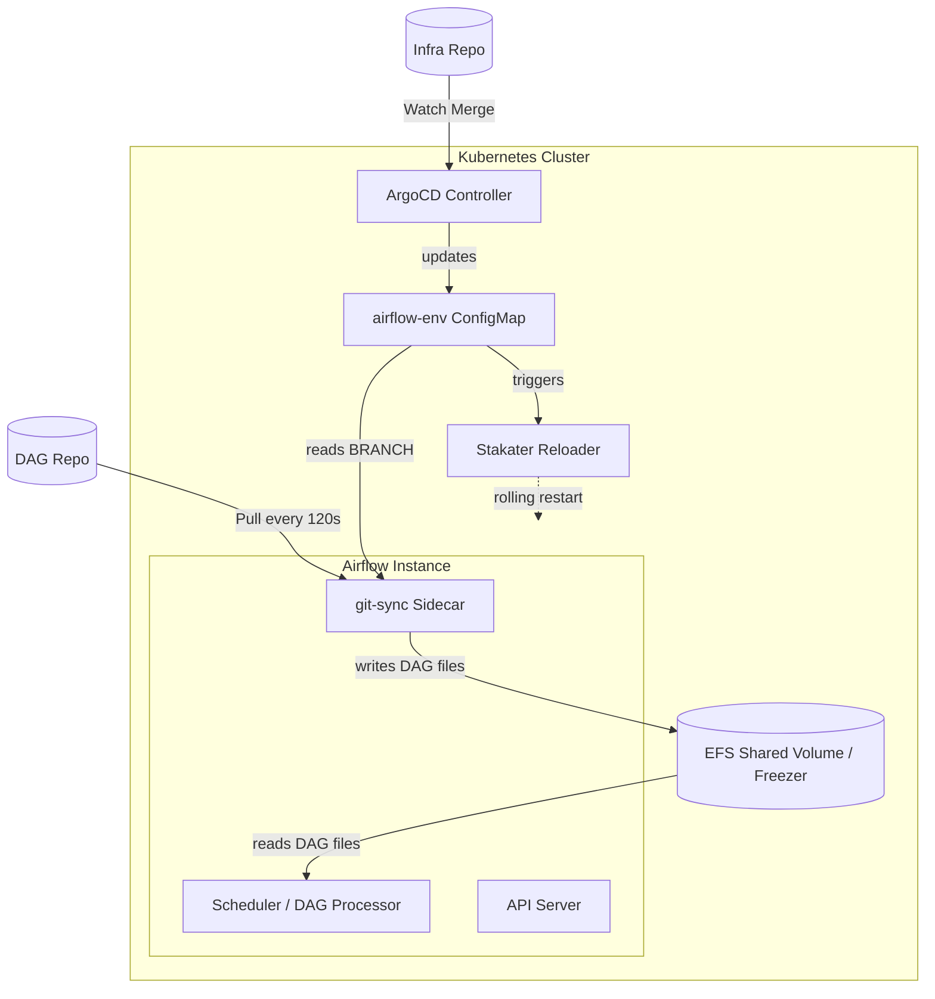

> "If it hurts, do it more frequently, and bring the pain forward." — Jez Humble

---

# Why Does Changing One ConfigMap Restart Your Entire Airflow Cluster?

*A three-day branch tug-of-war, and the two pipelines everyone had been confusing*

Tuesday, 3 PM. A message lands in our dev channel:

> "Who changed BRANCH back? My DAG was halfway through a run."

That was Lin, from the data platform team. Ten minutes earlier, Wei from the risk team had pointed the Airflow dev environment's ConfigMap `BRANCH` field at his own branch — the two teams were integrating against the same CRM tables and had to share one environment. Lin saw the UI throwing 502s, assumed the cluster was broken, and changed it back.

Over the next three days that ConfigMap got flipped more than a dozen times. Every flip rolling-restarted the API server, the scheduler, and the triggerer. Every flip meant a minute or two of 502s and a spike in EFS traffic. By day three both sides were sniping at each other in the channel, and Wei had filed a ticket asking for a dedicated Airflow instance for his team.

Here's the interesting part: **neither of them did anything wrong**. Both were doing exactly what they understood "switch the branch to test" to mean. The real problem was that their shared mental model — *changing the branch means changing which code runs* — was wrong at the root.

Changing the branch isn't swapping code. Changing the branch is **evacuating the building and making everyone clock back in**.

That's what this post is about. Once it clicks, you get multi-team integration for free, plus a much sharper intuition for how GitOps actually closes the loop on Kubernetes.

---

### The 30-Second Version: Two Pipelines, Never One

A Kubernetes-native Airflow deployment typically has two Git repositories driving two completely independent control loops. **Do not conflate them:**

| Pipeline | Repository | Trigger | Who does the work | Cost |
|---|---|---|---|---|
| **Infrastructure state** | K8s manifests (ConfigMap/Helm) | Merge → ArgoCD syncs | **Reloader**: sees the config change, rolls the cluster | **High** — 1-2 min of disruption |
| **Runtime code** | DAG source repo | Push to the active branch | **git-sync**: quietly pulls every ~120s | **Low** — no restarts |

**The core insight:** ArgoCD **does not care** what your DAG code looks like. It only watches YAML. Your business logic reaches the cluster entirely through the git-sync sidecar polling on a timer.

> 📌 **Takeaway:** Lin and Wei burned three days because they treated a cheap action (pushing code) and an expensive one (mutating the ConfigMap) as the same thing. The first costs you a two-minute wait. The second kicks everyone off the cluster.

---

### The Mental Model: Three Workers in a Restaurant Kitchen

Picture the Airflow cluster as a restaurant. Three roles keep it running:

1.  **The stocker (git-sync)** — Every 120 seconds, without fail, he checks the supplier (your DAG repo): "Anything new?" If so, he hauls it into the **walk-in freezer (EFS)**.
2.  **The manager (Reloader)** — He stares at the **rules board on the wall (the ConfigMap)**. The moment a single word on that board changes — say, the `BRANCH` field — he blows the whistle, sends every cook home, and makes them clock back in.
3.  **The cooks (Airflow scheduler/workers)** — They pull ingredients from the freezer and cook. They read the rules board exactly once: at the moment they clock in.

Now look at Wei's change again. He thought he was switching suppliers. **What he actually did was have the manager clear out the entire kitchen.** Lin's half-finished DAG run was the pot of food that got dumped.

And when Lin changed it back, the whistle blew again.

🩸 **Hard-won warning:** The cooks only read the board at clock-in. That means ConfigMap changes are **completely invisible to already-running pods** — no restart, no effect. People lose whole afternoons here: they change a value, ArgoCD syncs it, `kubectl get configmap` shows the new value, and yet `env` inside the pod is still stale. The config isn't broken. That cook just hasn't clocked back in today.

> 📌 **Takeaway:** A ConfigMap is read once, at pod startup. Between "config updated" and "config in effect" sits exactly one restart.

---

### Architecture: Where the Data Actually Flows

One diagram, and the handoff point becomes obvious:

**EFS is the handoff point.** git-sync **writes**; the Airflow components **read**. The two pipelines shake hands here, and only here.

> 📌 **Takeaway:** The only physical meeting point is shared storage. Upstream, the two loops are strangers — ArgoCD never reads your DAGs, and git-sync never cares about Helm.

---

### The Fix: The Integration Branch Pattern

Back to Lin and Wei. If flipping the ConfigMap is a disaster, how do two projects run end-to-end tests on one environment?

**Add a layer of indirection: a short-lived integration branch.** Which is, of course, exactly what Wheeler was talking about.

1.  **Cut the branch.** From the development trunk (say `dev-main`), branch `integration/dev-projA-projB`.
2.  **Change the config once.** Point the dev ConfigMap's `BRANCH` at the integration branch. ArgoCD syncs, Reloader restarts the cluster — for the **last** time this cycle.
3.  **Push normally.** Both teams merge their feature branches into the integration branch. Conflicts over shared operators and common dependencies get resolved in Git, not by overwriting each other in the cluster.
4.  **Updates land silently.** The ConfigMap hasn't changed, so Reloader stays quiet. git-sync hauls new commits into EFS every 120 seconds. Grab a coffee, refresh the UI, your DAG is there.

After we posted this in the channel, that ConfigMap was modified **exactly once** for the rest of the integration cycle.

#### Honest Tradeoffs

This works, but I don't want to sell only the upside:

*   **Conflicts move; they don't vanish.** You've relocated the fight from "kicking each other's pods" to "resolving merge conflicts in Git." That's the right place for it, but the work is still there.
*   **No branch protection.** An integration branch is a sandbox with no CI gate. Anyone can clobber code a teammate just got working.
*   **Reloader is a blunt instrument.** It fires on *any* ConfigMap change. Update a UI title or an unrelated env var in the same ConfigMap and you still pay for a full rolling restart. There's no field-level diffing.
*   **It needs an expiry date.** This branch is short-lived by design. Once integration passes, merge back to trunk and release the environment slot. **Never let it grow into a second `main`**, or you've built yourself a permanent integration hell.

If projects A and B have **no hard dependency**, skip all of this and request two separate dev environments. Physical isolation always wins. Indirection solves problems, but indirection is also a cost.

> 📌 **Takeaway:** Compress the expensive action from a dozen times a day down to once per cycle. That single sentence is the entire value of the pattern.

---

### Debugging Playbook

When code is pushed but the environment looks dead, work through this before restarting anything:

**Q1: I pushed DAG code. Why isn't the UI updated?**
*   **The truth: wait.** git-sync's `INTERVAL` is typically 120 seconds. If it's still missing after that, read the sidecar logs — usually a connectivity failure or a file conflict.
*   `kubectl -n <namespace> logs deploy/airflow-git-sync --tail=50`

**Q2: I changed BRANCH in the ConfigMap. Do I also need to push to the DAG repo?**
*   **No.** After Reloader restarts the pods, the fresh git-sync container performs a full clone of whatever branch the ConfigMap names. If the branch exists on the remote, it will be pulled.

**Q3: How do I confirm Reloader is the culprit?**
*   Read its logs. `Changes detected in ConfigMap... Reloading deployment` means the manager blew the whistle again.
*   `kubectl -n reloader logs deploy/reloader-reloader --tail=30`

**Q4: The ConfigMap has the new value, but the pod's env is stale.**
*   The pod never restarted. Check whether that Deployment carries the Reloader annotation — a missing annotation is the most common cause. Config changed, nobody blew the whistle.
*   `kubectl -n <ns> get deploy airflow-scheduler -o jsonpath='{.metadata.annotations}'`

---

### 🧭 Beyond Airflow: Four Principles Worth Keeping

The concrete problem is solved. But if this post is only worth a `kubectl` command, it wasn't worth writing.

Those three days weren't really an Airflow story. The same accident happens daily in places that have never heard of Kubernetes. Here are the four things I actually took away.

#### 1. Cost has to be visible in the interface

Wei changing `BRANCH` and Lin pushing a commit **look identical in the editor**: change one line of text, open a PR. One costs the whole team two minutes of downtime. The other costs nothing.

**When the expensive action and the cheap action wear the same face, accidents aren't bad luck — they're guaranteed.** This has nothing to do with skill. You cannot beat a cost-blind interface by telling people to be careful.

Human institutions invented enormous amounts of friction for exactly this reason. Prescription drugs need a signature; aspirin doesn't. Large transfers need a second factor; buying coffee doesn't. Launching a nuclear weapon requires two keys turned at once. That friction isn't bureaucracy — it's translating **cost** into **feel**.

Now turn it on your own systems. The operations that caused your worst outages — do they look any different from routine ones? If not, that's not "an accident waiting to happen." It's **already happening, just not yet written down**.

> Generalize: when you want to prevent a class of mistake, the first instinct shouldn't be a doc or an announcement. It should be — **can I make the action itself harder to perform?**

#### 2. Shared mutable state is the root of every collaboration conflict

Lin and Wei weren't arguing about engineering. They were fighting over **a single field that anyone could change, that took effect for everyone, and that recorded nobody's name**.

Computer science has a name for this: **shared mutable state**. Decades of concurrency bugs are largely one long war against it. And the moment it leaves code and enters an organization, it just changes costume — the office fridge, the shared test account, the schedule spreadsheet anyone can edit, the one projector in the one meeting room.

What's striking is that **there have only ever been three solutions**, in any domain:

| Solution | In code | In an organization | In this post |
|---|---|---|---|
| **Isolate** — give everyone their own | Thread-local storage | One environment per team | Two separate dev envs (best answer when there's no hard dependency) |
| **Serialize** — take turns | Locks, mutexes | Booking systems, on-call rotations | **The integration branch: concurrency converted into sequence** |
| **Immutability** — append, never modify | Functional style, event sourcing | Append-only records, don't rewrite history | Every push is a new commit; nothing is overwritten |

The integration branch is, fundamentally, **a lock on that ConfigMap** — just implemented in process rather than in code.

> Generalize: next time your team has recurring friction nobody can quite explain, don't jump to "poor communication." Go looking for the object: **is there something anyone can change, that takes effect for everyone?** Find it, then pick one of the three.

#### 3. Indirection is both the cure and a debt

Almost everyone quotes only the first half of Wheeler's line. The full quote is:

> "Any problem in computer science can be solved by adding a layer of indirection — **except the problem of too many layers of indirection.**"

The integration branch is a layer of indirection. It genuinely solved the problem. It also handed us a branch with no CI protection, one extra merge, and one more thing somebody has to remember to delete.

That's why I kept hammering on **short-lived**. A layer's value decays with time while its cost accrues. A "temporary" integration branch that survives three months stops being the cure and becomes the next problem.

The organizational version is nearly identical: two departments can't coordinate, so you add a coordinator role; the coordinator solves it, and then stays forever. Five years later the company is all coordinators and nobody remembers what was being coordinated.

> Generalize: when you add a layer, **define its exit condition at the same time.** A temporary solution with no demolition plan is a permanent one.

#### 4. Without feedback, people will always poke at the system

Back to the detail that started everything: why did Lin change `BRANCH` back?

Because she saw 502s, and **nothing in the system told her "this is an expected restart Wei triggered two minutes ago."** She was facing a silent broken state, so she did what anyone does: revert the most recent change.

That's not Lin's fault. **When information is missing, humans probe systems with actions.** Elevator buttons pressed repeatedly, crosswalk buttons jabbed a dozen times, a page refreshed frantically when it doesn't respond — same mechanism every time.

So a great many "human error" incidents are really **observability failures**: not people being reckless, but a system that never gave them enough information to be careful. And when every probe mutates shared state (see principle 2), the probes compound into an avalanche.

> Generalize: when you catch someone "doing something reckless," hold off on writing the rule. Ask first — **before they acted, did the system tell them what was going on?**

---

### Action Items

1. **Pull up the revision history on your dev ConfigMap.** More than three changes in a week and your team is probably living Lin and Wei's three days right now.
2. **Audit which Deployments carry the Reloader annotation.** Too many and you pay restart costs for unrelated changes; too few and your config changes silently never apply.
3. **Write git-sync's `INTERVAL` into your team docs.** "How long after I push?" shouldn't be a question every new hire has to ask.
4. **Next time someone says "let me just switch the branch," ask which one they mean:** mutating the ConfigMap, or pushing code. That one question would have saved us three days.
5. **Run principle 2 across your team's daily life.** List three things anyone can change that take effect for everyone. That list is the shortlist for your next incident — technical or not.

---

**In one line:** under GitOps, **code iteration waits on git-sync; environment changes roll the cluster via Reloader.** Keep those two separate and your shared environment stops being fragile.

But if you keep only one sentence from this post, I'd want it to be this one:

*Every fight over a shared environment is really the same failure: nobody made it clear how much each action costs. Swap "environment" for "team," "family," or "public resource," and the sentence still holds.*
