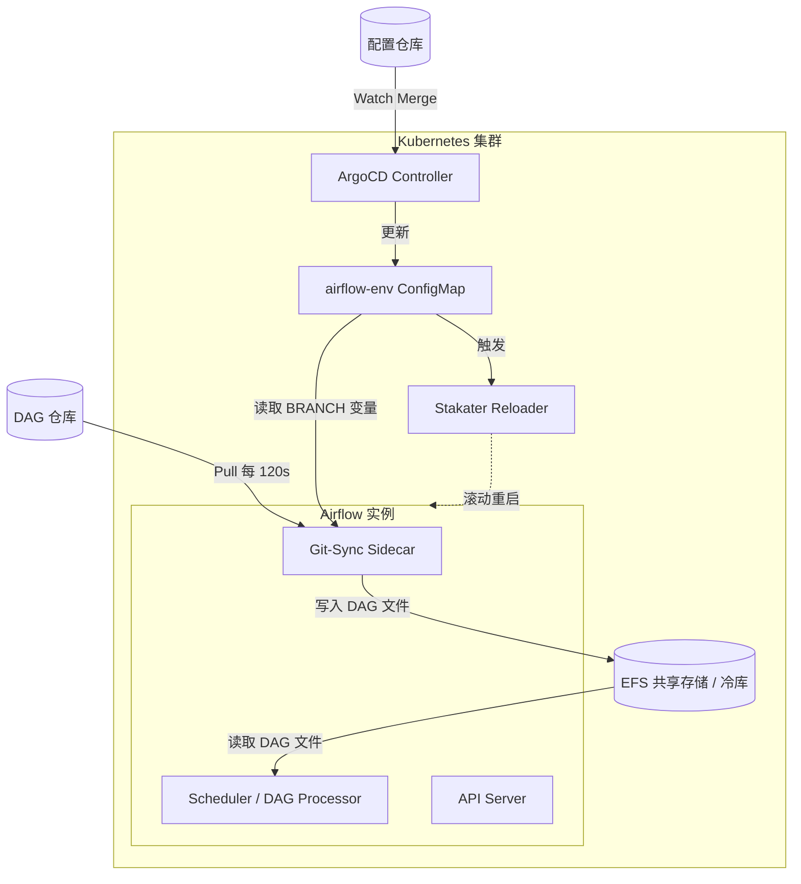

> "计算机科学领域的任何问题都可以通过增加一个间接的中间层来解决。" — David Wheeler

---

# 为什么你改一下 ConfigMap，整个 Airflow 集群就跟着重启？

*一场持续了三天的分支拉锯战，和它背后被所有人误解的两条管道*

周二下午三点，我们的 Dev 环境群里跳出来一条消息：

> "谁又把 BRANCH 改回去了？我 DAG 才跑到一半。"

发消息的是数据平台组的 Lin。十分钟前，风控组的 Wei 把 Airflow Dev 环境 ConfigMap 里的 `BRANCH` 字段改成了自己的分支——因为两个组要联调同一个 CRM 系统的表，必须在同一个环境里跑。Lin 看到 UI 502 了，以为是环境挂了，顺手又改了回来。

于是接下来的三天，这个 ConfigMap 被来回改了 十几次。每改一次，Airflow 的 API Server、Scheduler、Triggerer 全体滚动重启，UI 502 一两分钟，EFS 上的读写压力跟着飙。到第三天，两边都开始在群里阴阳怪气，Wei 甚至提了个工单要求"给风控组单独一套 Airflow"。

有意思的地方在于：**他们俩谁都没做错**。两个人都在按自己理解的"切分支去测试"操作。真正的问题是，他们心里那个模型——"改分支 = 换一下要跑的代码"——从根上就是错的。

改分支根本不是换代码。改分支是**把整栋楼的人清空重新上岗**。

这篇想讲清楚的就是这件事。搞懂之后，你不仅能优雅解决多项目联调，还能对 Kubernetes 上的 GitOps 闭环建立一个非常清晰的直觉。

---

### 🎯 30 秒吃透：别把两条管道混为一谈

在现代 Airflow 的云原生部署中，我们通常有两个 Git 仓库，对应两条完全独立的更新管道。**千万别混淆它们**：

| 管道 | 仓库侧重 | 触发机制 | 谁在干活？ | 代价 |
|------|--------|--------|--------|--------|
| **环境配置管道** | K8s 清单仓库 (ConfigMap/Helm) | Merge 代码 → ArgoCD 自动同步 | **Reloader**：发现配置变了，滚动重启集群 | **高**，1-2 分钟真空期 |
| **业务代码管道** | DAG 源码仓库 | Push 代码到当前指定分支 | **Git-Sync**：默默在后台每 ~120s 拉一次代码 | **低**，无重启 |

**核心认知**：ArgoCD **根本不关心**你的 DAG 代码长什么样，它只盯着 K8s 的 YAML。你的业务代码更新，全靠 Git-Sync 那个 Sidecar 容器定时去拉。

> 📌 **本节要点**：Lin 和 Wei 吵了三天，是因为他们把"低代价的动作"（push 代码）和"高代价的动作"（改 ConfigMap）当成了同一件事。前者等两分钟就好，后者会踢掉所有人。

---

### 🧠 建立心智模型：后厨里的三个打工人

我们打个比方，把 Airflow 集群看作一家高档餐厅。为了让餐厅运转，后台有三个角色在配合：

1.  **备货员 (Git-Sync)**：他只认死理，每隔 120 秒就去供应商（DAG 代码仓库）那里看一眼："有新菜吗？"有的话，就拉回来塞进**冷库 (EFS)**。
2.  **店长 (Reloader)**：他死死盯着墙上的**制度牌 (ConfigMap)**。只要制度牌上的字改了（比如换了拉取代码的 `BRANCH` 字段），店长就会吹哨，把所有厨师（Airflow 的各个 Pod）踢下线，让他们重新洗手打卡上班。
3.  **厨师 (Airflow Scheduler/Worker)**：从冷库里拿菜做饭。他们只有在每天"打卡上班"的那一刻，才会抬头看一眼制度牌上的环境变量。

现在回头看 Wei 那次操作：他以为自己只是"换了个供货商"，**实际上他是让店长把整个后厨全部清场重置了一遍**。Lin 那半跑完的 DAG，就是那锅被端走倒掉的菜。

而 Lin 改回去的那一下，等于让店长又吹了一次哨。

🩸 **血泪提醒**：厨师只在"打卡那一刻"看制度牌。这意味着 ConfigMap 里的环境变量改动，**对已经在运行的 Pod 是完全无效的**——不重启就不生效。很多人在这里浪费半天：改了值、ArgoCD 也同步了，`kubectl get configmap` 查出来是新的，但 Pod 里 `env` 还是旧的。不是配置没生效，是那个厨师今天还没重新打卡。

> 📌 **本节要点**：ConfigMap 的改动只在 Pod 启动的瞬间被读取一次。"配置已更新"和"配置已生效"之间，隔着一次重启。

---

### 🏗️ 架构总览：数据流到底是怎么走的

一张图看懂底层的交接点：

**EFS 就是那个交接点**：Git-Sync 负责**写**，Airflow 的各个组件负责**读**。两条管道在这里，也只在这里，握了一次手。

> 📌 **本节要点**：两条管道唯一的物理交汇处是共享存储。上游谁也不认识谁——ArgoCD 从不读你的 DAG，Git-Sync 也从不关心 Helm。

---

### 💡 最佳实践：多项目联调的"集成分支"模式

回到 Lin 和 Wei 的困境。既然频繁改 ConfigMap 会导致灾难，那两个项目必须在同一个 Dev 环境里做端到端测试时，该怎么办？

**答案是：引入一个中间层——集成分支（Integration Branch）。** 这也正是本文开头那句 David Wheeler 的话。

1.  **拉取集成分支**：从基准主干（如 `dev-main`）拉出一条短期的集成分支，例如 `integration/dev-projA-projB`。
2.  **一次性修改配置**：把 Dev 环境 ConfigMap 里的 `BRANCH` 字段，改为这条集成分支。Merge 后，ArgoCD 同步，Reloader 触发**最后一次**集群重启。
3.  **日常推代码**：接下来，团队 A 和团队 B 分别将自己的 Feature 分支合并进这条集成分支。共享配置、公共依赖目录的冲突，在 Git 里解决，而不是在集群里靠互相覆盖解决。
4.  **无感更新**：此时因为 ConfigMap 没变，Reloader 不会叫唤。Git-Sync 会每 120 秒自动把集成分支上的新 commit 搬进 EFS。你们只需要喝口水，刷新一下 Airflow UI，新改的 DAG 就出现了。

我们把这套流程贴进群里之后，那个 ConfigMap 在剩下的整个联调周期里，**只被改了一次**。

#### ⚠️ 诚实的权衡（Trade-offs）

这种玩法很爽，但有代价，我不想只讲好的一面：

*   **冲突提前了，但没有消失**：你只是把冲突从"集群里互相踢 Pod"挪到了"Git 里解 merge conflict"。挪对了地方，但工作量还在。
*   **没有分支保护**：集成分支是个"大杂烩"（Sandbox），没有严格的 CI 门禁，大家随时可能把别人跑通的代码覆盖掉。
*   **Reloader 是把钝刀**：它对**任何** ConfigMap 变更都会触发。你就算只改了个 UI 标题、或一个毫不相干的环境变量，照样赔上一次全量滚动重启。它不做字段级 diff。
*   **必须有退出机制**：这条分支是**短生命周期**的。一旦联调通过，立刻合并回上游主干并释放环境。**千万别把它养成第二个 `main`**，否则你会陷入无休止的"集成地狱"。

如果项目 A 和 B 之间**没有硬依赖**，别折腾集成分支，直接去申请两个独立的 Dev 环境（一人占一个槽位）。物理隔离永远是最高效的——中间层能解决问题，但中间层本身也是成本。

> 📌 **本节要点**：把"高代价动作"从每天十几次压缩到整个周期一次。集成分支的全部价值就在这一句里。

---

### 🛠️ 排坑自救指南

如果你发现代码推上去了但环境没反应，别急着发脾气，按下面的逻辑排查：

**Q1: 我 push 了 DAG 代码，为什么 UI 没更新？**
*   **真理**：等。Git-Sync 的轮询间隔（`INTERVAL`）通常是 120 秒。如果 2 分钟后还没出，去查 Git-Sync 的日志，看是不是连不上 GitHub 或者有文件冲突。
*   `kubectl -n <your-namespace> logs deploy/airflow-git-sync --tail=50`

**Q2: 改了 ConfigMap 里的 BRANCH，还需要去推一次 DAG 仓库吗？**
*   **不需要**。Reloader 重启 Pod 后，新的 Git-Sync 容器启动时会全量 Clone 你指定的那个新分支。只要远端有这个分支，它自己会拉下来。

**Q3: 怎么确认是 Reloader 在搞鬼？**
*   查 Reloader 的日志。只要看到 `Changes detected in ConfigMap... Reloading deployment`，你就知道店长又在吹哨了。
*   `kubectl -n reloader logs deploy/reloader-reloader --tail=30`

**Q4: ConfigMap 明明是新值，Pod 里的环境变量还是旧的？**
*   Pod 没重启过。检查这个 Deployment 有没有加 Reloader 的注解——漏加注解是最常见的原因，配置改了但没人吹哨。
*   `kubectl -n <ns> get deploy airflow-scheduler -o jsonpath='{.metadata.annotations}'`

---

### 🧭 跳出 Airflow：四条可以带走的通用原则

到这里，具体问题已经解决了。但如果这篇只值一个 `kubectl` 命令，那它就白写了。

Lin 和 Wei 那三天，本质上不是 Airflow 的故事。同样的事故，在完全没有 Kubernetes 的地方每天都在发生。下面四条，是我从这件事里真正带走的东西。

#### 一、代价必须写在界面上

Wei 改 `BRANCH` 和 Lin 推一次代码，在编辑器里**看起来是同一个动作**：改一行文本，提个 PR。但一个的代价是两分钟全员停工，另一个是零。

**当高代价动作和低代价动作长着同一张脸，事故就不是意外，是必然。** 这跟人的水平无关——你不可能靠"大家小心一点"来对抗一个不区分代价的界面。

人类社会为此发明了大量的"摩擦"：处方药要医生签字，非处方药随便拿；大额转账要二次验证，买杯咖啡刷了就走；核武器发射要两把钥匙同时转动。这些摩擦不是官僚主义，是把**代价**翻译成了**手感**。

反过来看我们自己的系统：那些出过大事故的操作，界面上和日常操作长得一样吗？如果一样，那不是"迟早会出事"，是**已经在出事了，只是还没被记录下来**。

> 举一反三：任何时候你想防止一类误操作，第一反应不该是写文档、发通知，而该是问——**能不能让这个动作本身变得更难做？**

#### 二、共享可变状态，是一切协作冲突的根源

Lin 和 Wei 争的不是技术观点，是**一个谁都能改、改了对所有人生效、而且没人知道是谁改的字段**。

这个东西在计算机科学里有个名字：**共享可变状态（shared mutable state）**。多线程编程几十年的血泪史，一大半是在跟它搏斗。而它一旦跨出代码，进入组织，形态立刻就变了——公用冰箱、共享的测试账号、那份谁都能编辑的排班表、只有一台的会议室投影仪。

有意思的是，**解法在所有领域都只有三条**：

| 解法 | 计算机里 | 组织里 | 这篇文章里 |
|---|---|---|---|
| **隔离**：每人一份 | 线程本地变量 | 每人一个独立环境 | 申请两套 Dev（没硬依赖时的最优解） |
| **串行化**：排队访问 | 加锁 / 互斥量 | 预约制、值班制 | **集成分支：把并发改成先后** |
| **不可变**：只增不改 | 函数式、事件溯源 | 只追加的记录、不改历史 | 每次 push 都是新 commit，从不覆盖 |

我们选的集成分支，本质上就是**给那个 ConfigMap 加了一把锁**——只不过锁不在代码里，在流程里。

> 举一反三：下次团队里出现说不清的反复摩擦，别先归因到"沟通不畅"。先找一找：**是不是有个东西，谁都能改，改了对所有人生效？** 找到它，再从上面三条里挑一条。

#### 三、中间层是解药，也是负债

开头那句 David Wheeler 的话，几乎所有人都只引用了前半句。完整的原话是：

> "计算机科学领域的任何问题都可以通过增加一个间接的中间层来解决——**除了中间层过多这个问题本身。**"

集成分支是个中间层，它确实解决了问题。但它同时带来了：一条没有 CI 保护的分支、一次额外的 merge、一个必须有人记得删掉的东西。

这就是为什么我在上面反复强调**短生命周期**。中间层的价值随时间衰减，成本却随时间累积——一条活了三个月的"临时"集成分支，会从解药变成你要解决的下一个问题。

这个模式在组织里几乎一模一样：两个部门配合不畅，于是加一个协调岗；协调岗解决了问题，然后永久留了下来；五年后，公司里全是协调岗，没人记得当初要协调的是什么。

> 举一反三：加中间层的时候，**同时想好它的退出条件**。一个没有拆除计划的临时方案，就是永久方案。

#### 四、没有反馈的时候，人一定会瞎操作

回到最开始那个细节：Lin 为什么要把 `BRANCH` 改回去？

因为她看到 UI 502 了，而**系统没有任何地方告诉她"这是 Wei 在两分钟前触发的一次预期内的重启"**。她面对的是一个沉默的坏状态，于是她做了任何人都会做的事：把最近改过的东西改回去。

这不是 Lin 的错。**在信息缺失的时候，人类会用行动来试探系统。** 电梯按钮被反复按、红绿灯的行人按钮被戳十几下、页面没反应就疯狂刷新——都是同一个机制。

所以很多所谓的"人为操作事故"，真正的根因是**可观测性缺失**：不是人乱来，是系统没给人足够的信息让他别乱来。而当每个人的试探动作都会改变共享状态时（见原则二），试探就会互相叠加，变成雪崩。

> 举一反三：当你发现有人"乱操作"，先别急着定规矩。先问一句：**在他动手之前，系统告诉过他正在发生什么吗？**

---

### 立刻可以做的事

1. **现在就去看一眼你们 Dev 环境 ConfigMap 的修改历史**。如果一周被改了超过三次，你们团队大概率正在经历 Lin 和 Wei 的那三天。
2. **确认 Reloader 注解加在了哪些 Deployment 上**。加多了，你会为无关变更付重启代价；加少了，配置改了永远不生效。
3. **把 Git-Sync 的 `INTERVAL` 值写进团队文档**。"推完等多久"这个问题，不该每个新人都来问一遍。
4. **下次有人说"我切一下分支测试"，先问一句：改的是 ConfigMap 还是 push 代码？** 这一句话能省掉一场三天的拉锯战。
5. **拿原则二去扫一遍你团队的日常**：列出三个"谁都能改、改了对所有人生效"的东西。它们就是你下一次事故的候选名单——不管是不是技术上的。

---

**总结成一句话**：GitOps 环境下，**业务迭代靠 Git-Sync 等时间，环境切换靠 Reloader 滚集群。** 把这俩拆开用，你的测试环境就能稳如老狗。

但如果这篇你只记一句，我希望是这句：

*所有共享环境的争吵，本质上都不是人的问题，是没人说清楚哪个动作的代价有多大。而这句话，把"环境"换成"团队"、"家庭"、"公共资源"，一样成立。*
