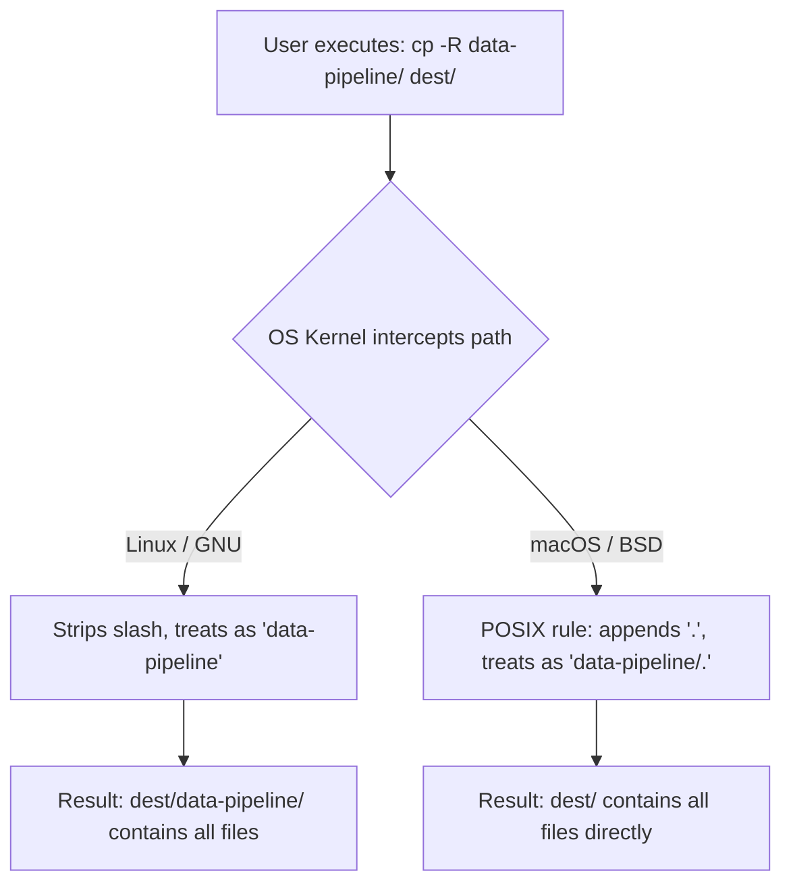

> "Unix was not designed to stop its users from doing stupid things, as that would also stop them from doing clever things." — Doug Gwyn

# Why a single trailing slash destroyed our staging environment

*One misplaced keystroke can scatter hundreds of files, and the worst part is that both the OS and the engineer were just following the rules.*

It was 4:30 PM on a Thursday. David, a backend engineer, was testing a configuration fix locally. He needed to move the compiled `data-pipeline` artifacts into his local `~/deployments/staging/` directory to verify the build before pushing. 

He opened his terminal and typed a command he had used a thousand times:

```bash
cp -R data-pipeline/ ~/deployments/staging/
```

He expected to see `~/deployments/staging/data-pipeline/`. Instead, he watched as hundreds of config files, Python scripts, and raw binaries were sprayed directly into the `staging` root, overwriting base environment files and turning the directory into a disorganized landfill. The local deployment immediately crashed.

Sarah, the release engineer shadowing him, sighed. "You copied the contents, not the directory. You can't just throw source slashes around."

David pushed back. "I ran that exact same command on our Linux CI runner yesterday. It copied the directory perfectly. The command is right."

The frustrating truth? Nobody was wrong. David's mental model was perfectly tuned to GNU coreutils on Linux. Sarah's environment was BSD-based macOS. The interface they were using was identical, but the execution was violently different.

## ⚡️ The 30-second version

The culprit is a single character: the trailing slash after the **source** path. Individual programs layer their own rules on top of the filesystem, creating a matrix of behaviors that you have to memorize to avoid destroying data.

| Command | macOS (BSD) | Linux (GNU) | What happens? |
| :--- | :--- | :--- | :--- |
| `cp -R src/ dest/` | ❌ Sprays contents | ✅ Copies directory | Silent divergence based on OS |
| `cp -R src dest/` | ✅ Copies directory | ✅ Copies directory | Safe across platforms |
| `rsync -a src/ dest/` | ✅ Syncs contents | ✅ Syncs contents | Consistently syncs internals |
| `rsync -a src dest/` | ❌ Syncs directory | ❌ Syncs directory | Nests a folder inside a folder |

> 📌 **Takeaway:** GNU `cp` on Linux mostly ignores the source trailing slash. BSD `cp` on macOS treats the source trailing slash as an explicit command to dump the directory's contents. 

## 🧠 The mental model: The invisible dot

To understand why macOS sprayed David's files, you have to look at the POSIX specification. POSIX dictates that a pathname ending in one or more slashes is resolved **as if a single `.` were appended**.

When David typed `data-pipeline/`, the macOS kernel interpreted it as `data-pipeline/.`. 

Think of a directory as a cardboard box. The path `data-pipeline` is a pointer to the box itself. You can pick up the box, move it, or rename it. But the path `data-pipeline/.` (and by extension `data-pipeline/`) is a pointer to the *inside* of the box. 

When you hand a pointer to the inside of a box to BSD `cp`, it assumes you want to move what is inside, not the box itself. 

> 📌 **Takeaway:** A trailing slash is not a boundary marker; it is a dereference operator. It asserts "this is a directory, and I am pointing at its contents."

## ⚙️ The mechanism

Here is what actually happened when the path hit the operating system:



Because of the POSIX `.` appending rule, the trailing slash also forces symlinks to resolve to their targets. `link` is the link itself. `link/` is whatever it points at.

🩸 **Hard-won warning:** Tab completion loves to append slashes to symlinks. If you type `rm link[TAB]`, your shell expands it to `rm link/`. On macOS, this safely throws an error ("Not a directory"). But historically, running `rm -rf link/` on older Unix systems quietly traversed the symlink and deleted the *contents* of the target directory, leaving the empty link behind. This silent behavior has nuked more production directories than I care to count.

> 📌 **Takeaway:** The POSIX dot-appending rule means a trailing slash forces the OS to target the contents of a directory or the target of a symlink, rather than the container itself.

## 🛠️ The fix

David and Sarah spent twenty minutes manually deleting the hundreds of stray files from the staging directory. Once it was clean, David ran the command again, this time dropping the source slash:

```bash
cp -R data-pipeline ~/deployments/staging/
```

It worked perfectly. They agreed on a simple team rule for the rest of the deployment cycle: **Slash the destination, never the source.**

Keeping the slash on the destination (`~/deployments/staging/`) is defensive. If you misspell the destination (`~/deployments/stagin/`), the trailing slash tells `cp` that it must be an existing directory. It will fail loudly rather than silently creating a new file or directory with the misspelled name.

> 📌 **Takeaway:** Slash the destination to force a directory check. Leave the source bare to move the container, not just the contents.

## ⚖️ Honest tradeoffs

The "never slash the source" rule works beautifully for standard Unix utilities like `cp` and `mv`. But it falls apart when you introduce `rsync`.

`rsync` enforces the strictest interpretation of the trailing slash rule, and it does so consistently across platforms. 
- `rsync -a src dest/` copies the directory `src` into `dest`.
- `rsync -a src/ dest/` copies the *contents* of `src` into `dest`.

If you blindly apply the `cp` rule to `rsync`, you will end up accidentally nesting directories inside each other. Furthermore, muscle memory actively fights you: terminal tab-completion automatically appends slashes to directories. You have to consciously hit backspace to be safe with `cp`, but leave it alone to be precise with `rsync`.

> 📌 **Takeaway:** There is no universal safe harbor. You must know whether the tool you are using operates on the container or the contents by default.

## 🚑 A debugging playbook

When a file operation behaves unexpectedly, check the slashes. 

| Symptom | Cause | The Fix |
| :--- | :--- | :--- |
| `cp` sprays files into the root of the target. | Source had a trailing slash on macOS/BSD. | `cp -R src dest/` (No slash on source) |
| `mv a b/` fails with "Not a directory". | `b` does not exist. | Create `b` first, or drop the slash if renaming: `mv a b` |
| `rsync` creates `dest/src/src/`. | Source lacked a trailing slash in a sync job. | `rsync -a src/ dest/` (Slash the source) |

> 📌 **Takeaway:** Destination slashes make failures loud. Source slashes make failures silent and messy.

## 🧭 Elevation: Three laws of interface betrayal

The trailing slash is just a symptom. The real failure here is what happens when an abstraction leaks its underlying implementation. 

### 1. Contextual execution breaks universal interfaces
POSIX standardizes the syntax, but the operating system determines the semantics. Two systems can expose the identical surface area but bind completely different meanings to them. 
*   **The mechanism:** An interface is only universal if the environment underneath it interprets inputs identically. When the environment diverges, the interface becomes a trap.
*   **Cross-domain example:** Legal contracts. Two states can use the exact same standard commercial lease form. But local case law interprets the phrase "reasonable wear and tear" completely differently. The text is identical; the execution is dictated by the jurisdiction.

> Generalize: Where in your stack are you assuming that identical configs or identical syntax will yield identical infrastructure?

### 2. Destructive defaults must be explicit
If a tool can drastically alter state—like spraying hundreds of files across a directory—the user should have to explicitly ask for that behavior using a loud flag (like `/*` or `--contents`).
*   **The mechanism:** Silent modifiers, like a single trailing character, are invisible to a skimming eye but massive in consequence. High-variance operations should require high-friction inputs.
*   **Cross-domain example:** Aviation design. The flap levers and landing gear levers in a cockpit have different physical shapes (one feels like a wheel, one feels like a wedge). A pilot cannot accidentally trigger a destructive state change by touch alone. The system requires explicit, unmistakable intent.

> Generalize: What internal CLI tools in your company silently change destructive behavior based on implicit context?

### 3. Muscle memory is an attack vector
Your terminal trains you to hit `TAB`, which automatically appends a slash. The environment trains you to do the dangerous thing by default.
*   **The mechanism:** If a safety rule requires an operator to consciously override thousands of hours of muscle memory every single time they type a command, the rule will inevitably fail under pressure.
*   **Cross-domain example:** Medicine. If a hospital redesigns its crash cart layout but keeps the physical cart looking exactly the same, nurses will reach for epinephrine and grab something else. Muscle memory overrides conscious thought in a crisis.

> Generalize: Are your deployment playbooks asking engineers to act unnaturally during an incident to avoid a footgun?

## 🎯 Action items

1. **Audit your CI scripts today:** Grep your `Makefile` and deployment scripts for `cp -R` or `cp -r`. If you see a source path with a trailing slash, remove it to ensure the script behaves identically on Mac and Linux.
2. **Alias for safety:** On your local machine, alias `cp` to `cp -i` and `mv` to `mv -i` in your `.bashrc` or `.zshrc`. This forces the OS to prompt you before overwriting existing files, catching a bad slash before it destroys data.
3. **The standup question:** Ask your team tomorrow: *"Do we have any local build scripts that behave differently on Mac than they do on Linux?"* Find the gaps before they find you.

An interface that requires you to remember the operating system's lineage is an interface that has already failed.
