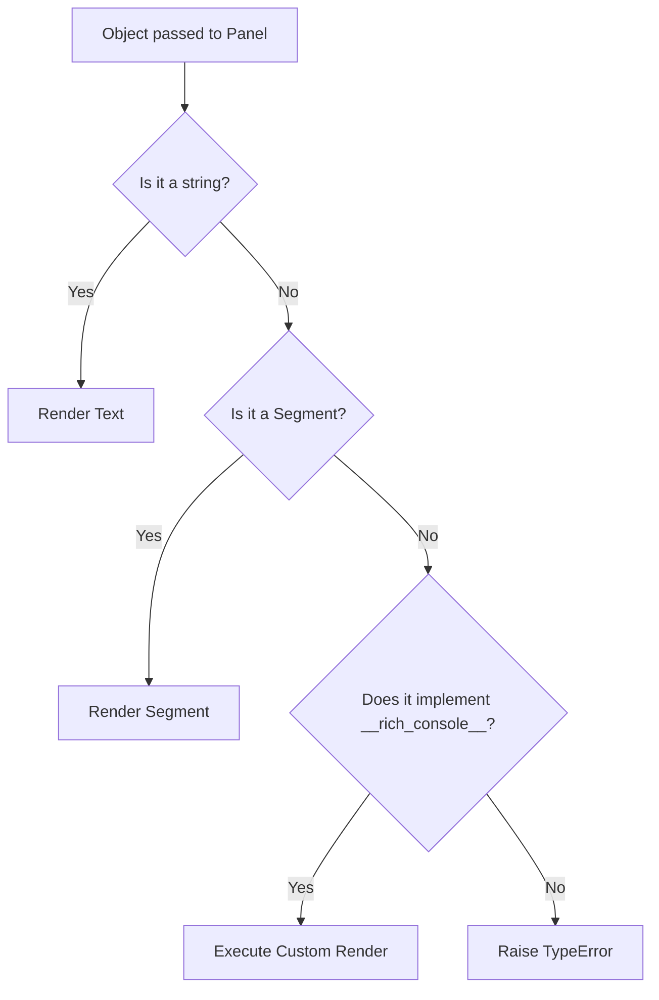

> "You must be the change you wish to see in the world." — Mahatma Gandhi

# Why Does Your Internal CLI Tool Keep Crashing with Raw Python Tracebacks?

*A Panel(dict) crash, a 2,400-year-old butcher, and the real argument for restraint in developer tools.*

### 🎯 The 9:15 AM Standup Collision

It was 9:15 AM on a Tuesday. Wei, a senior platform engineer, was screen-sharing during a weekly deployment sync. Marcus, the team lead, watched as Wei kicked off a newly updated internal CLI tool to publish the team's localized technical documentation.

Halfway through the execution, the terminal spit out a raw python traceback and died:

```text
Errors found Unable to render {'topic': 'architecture', 'titles': ['Draft A', 'Draft B']};
A str, Segment or object with __rich_console__ method is required
```

Marcus sighed. "Did the sync fail? Or did it write the files?"

Wei mutters, "I think it wrote them. I'll just wrap it in a `try/except` block and print the raw exception. It's just an internal developer script anyway. Nobody outside our team runs it."

But here is the "nobody was wrong" turn: Wei was behaving entirely sensibly. He wanted to ship the main feature and not spend half a day styling a terminal script that only five people run. Marcus was also behaving sensibly: he knew that fragile, cryptic developer tools breed operational anxiety. If a tool looks like it was thrown together in ten minutes, users treat it with suspicion. They double-check every output, hesitate before clicking enter, and eventually abandon it for manual, error-prone workflows. 

The real defect was not Wei's code; it was a shared, faulty mental model: treating command-line interfaces as throwaway scripts rather than internal products.

> 📌 **Takeaway:** The polish of your internal tooling is the loudest signal of your engineering professionalism. A cryptic crash in a CLI tells your peers that you do not value their operational confidence.

---

### 🧠 The 30-Second Summary

Building a reliable terminal interface does not require a massive UI framework or weeks of styling. It requires understanding the rendering contracts of your libraries and applying friction only where it prevents real-world disasters.

| Approach | User Experience | Error Handling | Relative Implementation Cost |
| :--- | :--- | :--- | :--- |
| **The "Just a Script" Model** | Raw JSON dumps, infinite prompts, silent freezes | Tracebacks expose internal data structures | **Low** (Initial build only; high long-term support overhead) |
| **The Product CLI Model** | Scannable tables, interactive selections, active progress | Structured, actionable errors with clear recovery paths | **Medium** (A few extra lines of robust layout and library configuration) |
| **Over-engineered TUI** | Full-screen dashboards, custom mouse-tracking, noisy animations | Complex state management hides actual terminal failures | **High** (Wasted hours maintaining custom UI elements) |
| **The Sweet Spot (Recommended)** | High-contrast visual grouping, single-joint confirmations, graceful status spinners | Checked render contracts and explicit error boundaries | **Low-to-Medium** (Leverages standard libraries with smart defaults) |

> 📌 **Takeaway:** A great CLI does not draw a custom dashboard; it respects the terminal, formats information for scanning, and keeps the operator informed during high-latency actions.

---

### 🧭 The Mental Model: Cook Ding’s Blade

In the *Zhuangzi*, there is a story of Cook Ding, a butcher whose knife remained razor-sharp for nineteen years without grinding. When asked how, he explained that he did not hack at bones. He followed the natural structure of the ox, sliding his thin blade through the spaces between the joints where there was plenty of room.

Your CLI's interactive prompts and confirmation screens are that blade. 

If you hack at the user's flow with defensive confirmation prompts at every step ("Are you sure you want to select this file?", "Are you sure you want to view the list?"), the operator will develop "confirmation fatigue." They will mash the `Enter` key reflexively to bypass your checkpoints. When the critical, irreversible joint actually arrives—such as deleting a production database or archiving a primary branch—they will bypass that prompt too, without looking.

Great CLI design is about finding the actual joints of the workflow. You must let the user glide through reversible, low-risk decisions without friction, reserving your sharpest confirmation prompts exclusively for the points of high-cost, irreversible commitments.

> 📌 **Takeaway:** Design your CLI flows to match the real-world risk of the actions. If an action can be undone with a simple command, do not block the user with a confirmation prompt.

---

### 🛠️ The Mechanism: How Rich Renders Data

Let's look at why Wei's code crashed. He was using the popular `rich` library to draw a neat terminal panel around his data:

```python
# The code that crashed Wei's sync
console.print(Panel(data, title=f"Title for {selected_file}"))
```

Here, `data` was a raw Python dictionary: `{'topic': 'architecture', 'titles': [...]}`. 

To understand why this fails, we need to look at how `rich` processes objects. The library does not simply call `str()` on whatever you pass to a container. It expects a strict rendering contract:



A raw Python `dict` does not implement `__rich_console__`. It is not a string, and it is not a `Segment`. Instead of guessing and printing an ugly, unformatted curly-brace block, `rich` raises a `TypeError` to protect your layout from garbage data.

🩸 **Hard-won warning:** Never pass raw collection objects (dicts, lists, sets) directly into Rich containers like `Panel`, `Columns`, or `Padding`. Always explicitly serialize them, format them as strings, or feed them into a structured Rich `Table` or `Tree` component first.

> 📌 **Takeaway:** Rich enforces strict rendering contracts on its containers; passing raw data structures directly will trigger runtime errors instead of silent coercion.

---

### 🏗️ Refactoring the Interface

Let us look at how Wei fixed the tool. Instead of hiding the traceback with a broad `try/except` block, he restructured the data display to make it scannable.

#### Step 1: Format the Renderable

First, we extract the data and build a human-readable string to satisfy the `Panel` contract:

```python
from rich.console import Console
from rich.panel import Panel

console = Console()

# Safely extract and format the data
titles = data.get("titles", []) if isinstance(data, dict) else []
if titles:
    formatted_text = "\n".join(f"{i+1}. {title}" for i, title in enumerate(titles))
    console.print(Panel(formatted_text, title=f"Options for {selected_file}", expand=False))
else:
    console.print(Panel("[yellow]No title options found.[/yellow]", title="Warning"))
```

#### Step 2: Elevate to a Structured Table

If the user needs to select an option, a simple block of text is still hard to scan. We can use a color-grouped `Table` where each row has a distinct, contrasting color signal. This lets the eye lock onto a row immediately:

```python
from rich.table import Table
from rich import box

TITLE_PALETTE = ["cyan", "magenta", "green", "yellow", "bright_blue"]

table = Table(
    title="✨ Generated Title Options ✨",
    box=box.ROUNDED,
    show_lines=True,
    title_style="bold white on dark_magenta",
)
table.add_column("#", style="bold white", justify="center", width=3)
table.add_column("Suggested Title", style="bold")

for i, title in enumerate(titles):
    color = TITLE_PALETTE[i % len(TITLE_PALETTE)]
    table.add_row(f"[{color}]{i + 1}[/{color}]", f"[{color}]{title}[/]")

console.print(table)
```

#### Step 3: Handle Latency with Context Managers

While the CLI waits for a remote service to respond, a frozen terminal leaves the user in limbo. We can use `console.status()` to run a live spinner. 

```python
# CORRECT: Using console.status as a context manager
with console.status("[bold cyan]Querying suggestion engine...[/]", spinner="dots"):
    # This block runs the spinner in a background thread until the context exits
    result = await mock_network_call_to_service()
```

🩸 **Hard-won warning:** Simply calling `console.status("Loading...")` as a bare expression does nothing. It returns a status object but does not start the background thread. You must use it with a `with` statement, or manually call `.start()` and `.stop()`, otherwise your spinner will remain completely invisible.

#### Step 4: Keep Default Styles with InquirerPy

When we prompt the user for input using `InquirerPy`, we want custom colors without rewriting the entire theme. The `get_style` utility has an underdocumented behavior controlled by the `style_override` flag:

```python
from InquirerPy.utils import get_style

# CORRECT: Merge custom styles with the library's defaults
custom_style = get_style(
    {
        "questionmark": "#f5a742 bold",
        "pointer": "#f542a7 bold",
        "answer": "#42c5f5 bold",
    },
    style_override=False,  # False means 'do not discard the default theme fields'
)
```

If you set `style_override=True`, every field you didn't define (like instructions, checkboxes, or helper text) drops back to unstyled, raw terminal text, making your CLI look half-baked.

During the next Tuesday sync, Wei ran the updated tool. The clean, color-coded table and active status spinner made the progress obvious. Marcus didn't have to ask a single question, and the tool has run without a manual double-check ever since.

> 📌 **Takeaway:** Good CLI design uses structural layout containers (like tables and status blocks) to group related details, reducing the user's cognitive load during execution.

---

### 💡 The Hidden Costs of Polish

Every design choice carries a trade-off. We must be honest about what polish costs us:

*   **Dependency Footprint:** Libraries like `rich` and `InquirerPy` introduce extra dependencies. If your tool is distributed as a lightweight wrapper for a systems-engineering task, a sudden 15MB dependency tree can slow down pipeline initialization times.
*   **Testability:** Terminal UI components are notoriously difficult to verify in unit tests. Mocking standard input/output streams for interactive prompts requires complex integration tests, meaning your interactive code is often the least-tested path in your codebase.
*   **Terminal Compatibility:** Rich text, ANSI colors, and interactive cursors require modern terminal emulators. If your CLI runs inside a bare-bones CI/CD environment or a legacy terminal emulator, these visual enhancements can degrade into a mess of raw escape characters.

To balance these costs, write your tools with a quiet fallback path. If the terminal is not interactive (e.g., inside a GitHub Action pipeline), bypass the interactive prompts entirely and read parameters from command-line arguments.

```python
import sys

if not sys.stdin.isatty():
    # Fall back to non-interactive mode when running in a pipeline
    apply_automated_defaults()
```

> 📌 **Takeaway:** Real craft is knowing when to step back. If your CLI tool is running inside an automated pipeline, disable interactive features and output plain, easily parsable text.

---

### 🛠️ CLI Debugging Playbook

| If you see this symptom... | ...It usually means... | ...Run this command / Check this pattern |
| :--- | :--- | :--- |
| `TypeError: ... is required` inside Rich | A raw collection (dict, list) was passed directly into a renderable container. | Inspect the line raising the error and wrap the data in a `str()`, format string, or use `Table.add_row()` instead. |
| Terminal freezes during API calls without feedback | A network request is blocking the main execution thread without indicating status. | Wrap the async/sync call inside a `with console.status(...)` context block. |
| Text colors look washed out or completely invisible | The terminal color theme conflicts with hardcoded HEX values in your custom style dictionary. | Use standard ANSI color names (e.g., `"green"`, `"bright_blue"`) instead of hardcoded hex colors, or set `style_override=False`. |
| User inputs are ignored or cursor behaves erratically | The stdin stream is being shared or redirected (e.g., reading from a piped command). | Ensure you verify `sys.stdin.isatty()` before instantiating interactive prompts. |

---

### 🧭 Transferable Engineering Principles

Let us elevate this problem beyond the command line. Why did this small crash spark such a deep conversation? Because it exposes general laws of software craftsmanship.

#### 1. The Interface Is the Contract

*   **The Mechanism:** Users judge the integrity of an entire system by its outermost layer. If the interface is sloppy, fragile, or half-finished, the user assumes the underlying engine is built to the same standard of quality.
*   **Non-Technical Example:** A restaurant can have a spotless, state-of-the-art kitchen. But if the menus are stained with grease and have handwritten corrections scribbled in pen, the customer immediately worries about the kitchen's hygiene.
*   > Generalize: Look at your current project. Where is a messy, unpolished interface causing your peers or clients to doubt the quality of your underlying engine?

#### 2. Friction Must Match Risk

*   **The Mechanism:** The cognitive effort required to execute an action must scale in proportion to its risk and irreversibility. If you treat every minor decision with high friction, you exhaust your user's attention, leading to mistakes when critical moments arrive.
*   **Non-Technical Example:** A military rifle has an explicit, physical safety catch that must be flipped before firing. A simple table lamp has a quick-toggle switch. If turning on a table lamp required releasing a safety latch and typing a password, users would break the switch off.
*   > Generalize: Are you forcing users to confirm simple, low-risk, or reversible operations? How can you streamline the path for safe actions while reserving friction for destructive ones?

#### 3. Leverage Intelligent Defaults

*   **The Mechanism:** Reusing existing, well-tuned default design patterns minimizes cognitive load for both the creator and the consumer. It prevents the need to constantly reinvent standards from scratch.
*   **Non-Technical Example:** Automobile manufacturers keep the gas pedal on the right and the brake pedal on the left, regardless of whether the vehicle is a diesel truck or an electric sports car. They do not invent a new layout to show off their uniqueness.
*   > Generalize: Are you writing custom rendering logic or custom input parsers where a standard framework's default settings would do the job better and with less maintenance overhead?

---

### 🛠️ Action Items

1.  **Grep your scripts today:** Search your team's utilities folder for `except Exception as e: print(e)` or naked `print(data)` statements. Replace them with formatted outputs or clean terminal exits.
2.  **Conduct a prompt audit:** Run through your most-used internal script. Count the confirmation prompts. If there are more than two, delete the ones that guard actions that can be reverted with a simple `git checkout` or file restore.
3.  **Add a status spinner:** Pick a script that takes more than 500ms to run. Wrap the heavy network or database calls in a `console.status()` context manager. Watch how the perceived performance of the tool changes immediately.
4.  **The Silent Run Test (Non-Technical):** Sit next to a teammate who has never run your tool before. Ask them to run it without giving them any verbal instructions. Do not speak. Watch where they hesitate, where they make mistakes, and where they ask questions. That is your roadmap for polish.

***

*A blade stays sharp for nineteen years not because it is fast, but because it only cuts where there is already room. Your tools are no different—thoughtful restraint is the highest form of professional polish.*
