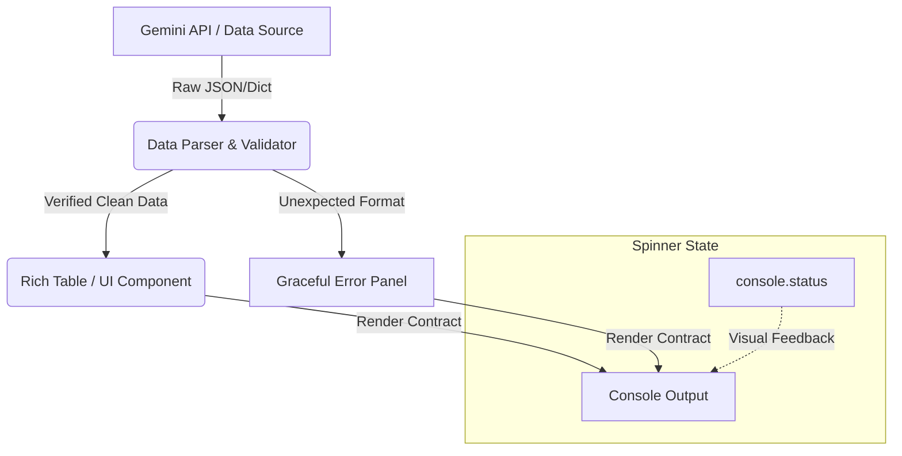

> "彼节者有间，而刀刃者无厚；以无厚入有间，恢恢乎其于游刃必有余地矣。" — 庄子

# 为什么你写得好好的 CLI 工具，别人一用就崩溃？

*从一个 Panel(dict) 崩溃说起：为什么克制，才是命令行工具最高级的礼貌*

> 就像是人类创造了工具，而反过来工具又影响了人类的思考方式。比如开发人员离不开IDE，IDE又影响了开发人员的编程方式。同样，一个优秀CLI工具，会反向影响开发人员的思考方式。 对于 CLI这种脚本语言，如果它的交互不够优雅，同样会影响开发人员的思考方式。 很多人觉得不就是敲几行命令的事嘛，哪有那么复杂？够用就行。但正是这种想法，导致了许多不必要的麻烦。 比如下面的例子

### 🎯 一、现场还原：当“能跑就行”撞上发布死线

周二下午 15:30，距离本周的技术周报发布截止时间只剩 10 分钟。

内容运营负责人李婷急匆匆地在工作群里敲击着键盘，@了负责内部发布工具开发的程序员魏强：

“强哥，你写的新闻发布脚本又崩了！我刚把大模型生成的候选标题贴进去，终端就直接吐了一大堆红色的 Traceback，发布流程卡在这儿了，下班前肯定发不出去了！”

魏强心里有些委屈。这个 CLI 工具是他利用周末时间“用爱发电”写出来的，平时运行得好好的。他点开李婷发来的截图，那行刺眼的错误信息赫然在目：

```text
Errors found Unable to render {'topic': ..., 'titles': [...]};
A str, Segment or object with __rich_console__ method is required
```

“这不能怪脚本啊，” 魏强暗自嘀咕，“大模型偶尔返回了一个嵌套的 JSON 字典，而不是纯文本列表。你手动把格式改一下不就能跑了吗？”

一个觉得对方“大惊小怪，内部工具能跑就行”，另一个觉得对方“写的工具太难用，稍微不注意就崩溃”。群里的气氛顿时有些微妙。

#### 💡 “没有人犯错”的转折

其实，在这个冲突里，谁都没有错。魏强为了提高团队效率，快速迭代出工具，采用“能跑就行”的敏捷思路是完全合理的；李婷在紧张的发布窗口期，期望一个对非技术人员友好的工具能提供清晰、健壮的反馈，也是理所当然的。

真正的根源在于：**他们缺少一个共同的默契，即“打印数据”与“渲染界面”之间存在着一条不可逾越的鸿沟。** 魏强把原始的 API 响应直接扔给了渲染引擎，而没有在边界上做好契约校验。一旦我们把内部工具当成一个“产品”来对待，很多原本以为“没必要”的细节，就会变成不可或缺的防线。

> 📌 **本节要点**：内部工具的冲突往往源于开发者的“能跑就行”与用户对“健壮反馈”期望之间的错位，真正的解决之道在于建立清晰的渲染契约。

---

### 🧠 二、30秒极速预览：脚本思维 vs 产品思维

在深入细节之前，我们先通过一张对比表来看看，这两种思维方式在具体实现上的成本与收益差异：

| 维度 / 概念 | “能跑就行”的脚本式思维 | “优雅好用”的产品式思维 | 相对成本与收益 |
| :--- | :--- | :--- | :--- |
| **数据处理** | 裸露打印 (`print(dict)`) | 契约式渲染 (按契约转换格式后渲染) | 极低开发成本，换取 100% 的运行期稳定性 |
| **样式定制** | 粗暴覆盖 (`style_override=True`) | 增量定制 (`style_override=False`) | 零额外成本，直接继承终端库的全局美感 |
| **异步等待** | 界面死锁或静态提示 | 状态感知 (`console.status`) | 仅需一行上下文管理器，消除用户的等待焦虑 |
| **用户交互** | 频繁确认 (肌肉记忆式回车) | 关键节点防御 (仅在不可逆节点确认) | 降低用户决策疲劳，真正起到安全屏障作用 |

> 📌 **Takeaway:** CLI 工具不是简单的“代码包装器”，而是人机交互的界面。多花 10% 的精力在渲染契约和交互节点上，能减少 90% 的沟通和维护成本。

---

### 🏗️ 三、心智模型：餐厅的“出餐窗口”

要彻底解决“打印”与“渲染”的混淆，我们需要建立一个心智模型：**把终端界面当成餐厅的“出餐窗口”。**

```
[ 后台业务逻辑 ]  --->  ( 原始数据: 塑料袋装食材 )  --->  [ 渲染边界: 厨师装盘 ]  --->  ( 最终界面: 精美菜品 )  --->  [ 用户 ]
```

在大后方，后台逻辑（如大模型 API、数据库查询）就像是忙碌的后厨。后厨处理食材时，为了效率，可能会用塑料袋（原始 JSON/Dict）临时盛放原料。但服务员绝不能把一整袋未剥皮的洋葱直接扔到顾客的餐桌上——这就是魏强直接将 `dict` 传给 `rich.Panel` 时发生的事情。

`rich.Panel` 作为一个渲染容器，它有一份严格的**出餐契约**：它只接受已经装盘好的、可以直接食用的食物（字符串、Segment 或实现了 `__rich_console__` 的可渲染对象）。

当我们重新审视魏强的代码：

```python
# 崩溃版本：直接把“生塑料袋”扔给了顾客
console.print(Panel(data, title=f"Title for {selected_file}"))
```

要让界面优雅，我们必须在“出餐窗口”（渲染边界）做一个显式的“装盘”动作。即使后厨送来的数据格式变了，服务员也应该在窗口进行拦截和重新拼装，而不是直接让顾客窒息。

> 📌 **Takeaway:** 永远不要让原始数据直接撞击渲染引擎。在边界处建立清晰的“装盘”（Data-to-UI）转换，是保证界面健壮性的第一道防线。

🩸 **Hard-won warning:** 在编写终端交互时，千万不要为了图省事直接复制某些文档里的 `style_override=True`。这个参数一旦开启，会静默清空所有未显式定义的默认样式（包括复选框的勾选态、高亮指针等），导致你的终端交互界面在一瞬间变得“残缺不全”。排查这个问题往往会浪费你一整个下午去对比底层源码的默认色板。

---

### 🛠️ 四、原理解析：渲染契约与状态流转

在一个优秀的 CLI 工具中，数据从获取到最终呈现在用户面前，需要经历明确的生命周期。以下是数据流与状态控制的经典架构：



在这个架构中，耗时的数据获取阶段被包裹在 `console.status` 中，保障了用户的知情权；而解析器作为哨兵，确保只有符合契约的数据才能进入 UI 渲染组件。

> 📌 **本节要点**：通过明确的数据解析器和状态管理器，将耗时操作与数据校验隔离开来，是保障 CLI 稳定性的核心架构。

---

### 🧭 五、代码重构：从“能跑”到“优雅”的蜕变

让我们回到魏强的工具，看看他是如何一步步将这个粗糙的脚本重构成一个充满匠心精神的生产力工具的。

#### 1. 履行渲染契约，优雅处理异常

魏强首先重写了标题展示逻辑。不再直接打印 `data`，而是安全地提取并格式化：

```python
# 提取标题列表，并做类型防御
titles = data.get("titles", []) if isinstance(data, dict) else data
if not isinstance(titles, list):
    titles = [str(titles)]

# 转换为符合契约的格式
titles_text = "\n".join(f"{i+1}. {t}" for i, t in enumerate(titles))
console.print(Panel(titles_text, title=f"Title for {selected_file}", border_style="green"))
```

#### 2. 从“纯文本”到“视觉分色表格”

为了降低李婷的视线扫描成本，魏强引入了 `rich.Table`，并使用一套精心设计的调色板为不同的选项赋予色彩：

```python
from rich.table import Table
from rich import box

TITLE_PALETTE = ["cyan", "magenta", "green", "yellow", "bright_blue"]

table = Table(
    title="✨ Generated Title Options ✨",
    box=box.ROUNDED,
    show_lines=True,
    title_style="bold white on dark_magenta",
)
table.add_column("#", style="bold white", justify="center", width=3)
table.add_column("Title Candidates", style="bold")

for i, t in enumerate(titles):
    color = TITLE_PALETTE[i % len(TITLE_PALETTE)]
    table.add_row(f"[{color}]{i + 1}[/{color}]", f"[{color}]{t}[/{color}]")

console.print(table)
```

#### 3. 恰到好处的异步状态提示

为了避免调用 API 时界面死锁，魏强使用了 `console.status` 上下文管理器。这让长时间的网络等待变成了一个优雅旋转的动画：

```python
# 优雅的异步等待状态提示
with console.status("[bold cyan]Asking Gemini for title ideas...[/bold cyan]", spinner="dots"):
    result = await mcp_client.call_tool("suggest_N_titles", {"file": selected_file})
```

#### 4. 克制的安全确认

最后，魏强去掉了那些无意义的确认框，只在“发布并移动文件”这唯一一个不可逆的节点上，保留了默认值为 `False` 的严谨确认：

```python
from InquirerPy import inquirer

publish_languages = await inquirer.checkbox(
    message="🌐 Publish which language version(s)?",
    choices=["zh", "en"],
).execute_async()

# 只有在这里，我们才需要打扰用户
confirmed = await inquirer.confirm(
    message=f"Publish {selected_file} as {'/'.join(publish_languages)} with this title?",
    default=False,  # 极其重要：默认值必须是安全的不确认
).execute_async()
```

**重构后的结局：**

周四下午，同样的发布窗口。李婷再次运行了更新后的工具。这一次，没有任何崩溃。终端里展现出一张精致、色彩分明的表格，等待提示像呼吸一样平稳闪烁。在确认无误后，她按下回车，文章瞬间发布成功。群里不再有抱怨，只有李婷发来的一个“大拇指”表情包。

> 📌 **本节要点**：通过类型防御、视觉分色和合理的异步提示，可以将一个粗糙的脚本重构为极具产品感的优雅工具。

---

### 💡 六、诚实的权衡：优雅背后的成本

天底下没有免费的午餐，优雅的交互同样伴随着代价：

1. **开发时间的边际成本**：编写健壮的类型防御和美观的 UI 组件，会使原本只需 10 行的脚本膨胀到 50 行。对于生命周期只有一次的临时脚本，这种投资是不划算的。
2. **终端环境的兼容性碎片化**：不同用户的终端配置千差万别（有些不支持 Unicode，有些是白色背景）。过度使用 RGB 色彩或特殊字符，可能会在某些旧版终端上显示为乱码。因此，必须确保有优雅降级的预案。
3. **非交互式环境（CI/CD）的死锁风险**：如果你的工具既要在本地交互运行，又要在 CI/CD 管道中自动化执行，交互式 Prompt 可能会导致管道无限挂起。你必须编写检测 `sys.stdout.isatty()` 的逻辑来自动绕过交互。

> 📌 **本节要点**：优雅的交互并非毫无代价，需要在开发成本、终端兼容性以及非交互式环境（CI/CD）的死锁风险之间做出诚实的权衡。

---

### 🛠️ 七、命令行工具除错指南

| 症状 (Symptom) | 根本原因 (Cause) | 解决方案 (Fix) |
| :--- | :--- | :--- |
| `TypeError: Unable to render ...` | 传入渲染容器的对象未实现渲染契约 | 在渲染前进行类型检查与数据格式化，或使用 `rich.pretty.Pretty` 包装 |
| 交互提示词样式丢失，变成黑白或空白 | 误用 `style_override=True` 清空了默认色板 | 将 `style_override` 设为 `False`，只覆盖你关心的 Key |
| `console.status()` 动画不显示 | 仅调用了方法，未作为上下文管理器（`with`）使用 | 使用 `with console.status(...)` 包裹耗时代码块 |
| CI/CD 管道中脚本静默挂起 | 在非交互式环境下触发了交互式 Prompt | 检查 `sys.stdout.isatty()`，非 TTY 环境自动回退到默认值或跳过 Prompt |

> 📌 **本节要点**：建立一张清晰的除错清单，能够帮助我们在遇到渲染异常、样式丢失或 CI 挂起时快速定位根本原因。

---

### 🧭 八、升维思考：优秀设计的通用法则

从解决一个 CLI 崩溃的细节中，我们可以提炼出三条适用于更广泛系统设计的通用法则：

#### 原则一：代价必须写在界面上 (Cost Visibility Principle)

* **机制**：人类的注意力是非常稀缺的资源。如果一个灾难性的操作（如删除数据库、消费高昂 API）在界面上的视觉反馈和普通操作完全一致，用户在长期的肌肉记忆下必定会发生误触。代价越高的操作，其交互摩擦力应该越大，视觉显化程度应该越高。
* **非技术领域案例**：在航空工业和重型机械中，紧急停止按钮（E-Stop）永远被设计成巨大的、红色的、必须用力拍击且带有物理防护罩的按钮。你绝不可能因为“手滑”而按错它，它用极致的物理摩擦力保护了生命安全。
* > 举一反三：检查你系统中的敏感操作（如“删除项目”或“发送全局推送”），它们的确认按钮是否和普通保存按钮长得一模一样？如果是，立刻引入二次确认或强制输入名称以显化代价。

#### 原则二：边界处的宽容是设计者的失职 (The Illusion of Tolerance at Boundaries)

* **机制**：著名的波斯特尔定律（“发送时要保守，接收时要宽容”）在接口和 UI 设计中常常被滥用。如果你在系统边界处对脏数据过于“宽容”（比如默默吞掉异常、靠猜测去兼容错误的格式），你只是把由于格式不一致导致的系统崩溃延后到了一个更难排查的深渊里。在系统边界进行严格的契约校验，才是对系统整体健壮性最负责的做法。
* **非技术领域案例**：在药房取药时，药剂师绝对不会对模糊不清的处方进行“宽容的猜测”。如果字迹无法辨认，他们会立刻退回处方并要求医生重新确认，因为边界上的任何一次“善意猜测”都可能导致医疗事故。
* > 举一反三：在你的 API 或组件边界上，是否写了太多的 `try: ... except: pass`？试着把它们替换为明确的断言和类型守卫，让错误在边界处直接暴露。

#### 原则三：防御性交互的边际效应递减 (The Law of Diminishing Returns on Defensive Friction)

* **机制**：并非所有的安全保护都是有益的。当一个系统里充斥着密密麻麻的“你确定吗？”时，用户会迅速产生“警报疲劳”（Alarm Fatigue）。频繁出现的低价值确认框，非但不能阻止灾难发生，反而会让用户养成闭着眼睛连敲回车的习惯，从而彻底废掉了真正关键的那道安全防线。
* **非技术领域案例**：如果一栋大楼里的每一个房间都装有高分贝的火灾警报器，且经常因为有人抽烟而误报，那么当真正的火灾来临时，人们的第一反应往往是“又是误报”而选择无视，最终错失逃生机会。
* > 举一反三：统计一下你的核心流程中用户需要点击“确定”或“下一步”的次数。删掉所有可逆、低成本步骤的确认框，只保留那一个真正危险的“死线”。

> 📌 **本节要点**：优秀的系统设计往往超越了技术本身，通过显化代价、严守边界和克制交互，我们能将具体的工程实践升华为通用的设计法则。

---

### 🛠️ 九、今日行动指南

1. **立即检查**：在你的 CLI 代码库中全局搜索 `print(some_dict)` 或裸露的 `except Exception as e: print(e)`，用 `rich.console` 或专门的日志工具将其替换为有上下文的、对用户友好的错误面板。
2. **样式重构**：检查所有 `InquirerPy` 或类似交互库的配置，确保没有误用 `style_override=True`。
3. **非技术行动**：在下一次团队周会上，拉着团队的产品经理或运营人员，让他们在不看文档的情况下运行一次你写的内部脚本，记录下他们感到困惑或停顿的每一个瞬间。

---

### 🧭 十、结语

优秀的工具设计者，从不在平坦的路上设卡，但也绝不在悬崖边缺席。
