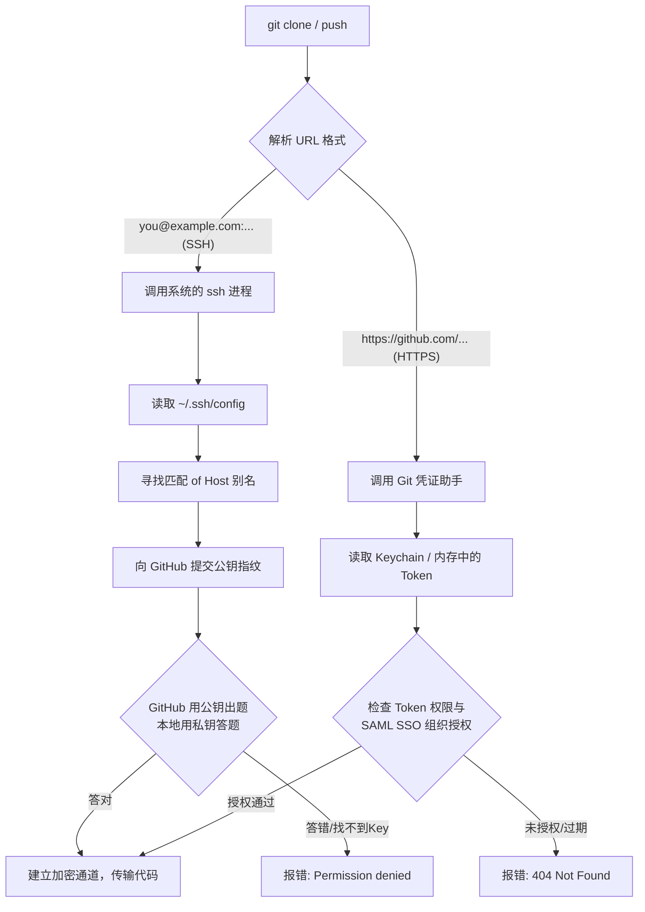

> "Be the Sun of your solar system." — Unknown

# 别再盲目复制粘贴了：彻底搞懂 Git、SSH 与 GitHub CLI 的底层连接奥秘

*从一次星期四下午的发布卡顿，看透那些让我们多熬了三个夜的 Git 协议暗坑。*

### 🎯 星期四下午 16:30 的崩溃

这是一个典型的星期四下午。距离本周最后一次生产发布窗口关闭还有半小时。新来的工程师 Leo 正在他的工位上疯狂敲击键盘，脸色发白。他试图克隆一个核心微服务的私有代码库，但终端无情地抛出了一行错误：

```
you@example.com: Permission denied (publickey).
fatal: Could not read from remote repository.
```

“我的 SSH Key 明明已经加进 GitHub 了啊！”Leo 在 Slack 频道里急得直艾特大家。作为技术负责人的 Wei 走过去，甩给他一条诊断命令：“跑一下这个看看：`ssh -i ~/.ssh/id_ed25519 -Tv you@example.com`。”

Leo 赶忙复制、粘贴、回车。终端刷刷流过几十行日志，最后定格在这一行：

```
Hi leo-corp! You've successfully authenticated, but GitHub does not provide shell access.
```

“你看！”Leo 叫了起来，“它说 `does not provide shell access`（不提供 Shell 访问权）！这就是报错吧？我的权限还是不对！”

在旁边围观的工程经理 Sarah 叹了口气，已经准备给大老板发邮件申请推迟发布了。整个团队陷入了低效的争吵：有人说是公司防火墙屏蔽了 22 端口，有人说是 Leo 的 SSH 私钥权限不对（`chmod 600`），还有人建议干脆把代码打包成 zip 用 Slack 发过去。

**其实，这里谁都没有错，只是大家都掉进了 Git 传输协议的“隐形黑盒”里。** 

Leo 以为那句“不提供 Shell 访问”是失败的报错，但实际上那是 GitHub 官方最经典的“成功暗号”；他随后为了绕开问题，自作聪明地用环境变量强行指定 SSH Key 去克隆一个 `https://` 开头的 URL，导致配置直接静默失效，白白浪费了两个小时。

这篇文章，就是为了终结这种“抓阄式”的排错。我们将从底层的协议握手开始，一路拆解到多账号配置、企业级 GHE 混合环境，以及 SAML SSO 的深水区。读完这一篇，你将建立起一套终身受用的 Git 连接心智模型。

---

### 🧠 30秒速览：两条截然不同的“敲门路径”

当你敲下 `git clone` 或 `git push` 时，你的电脑和 GitHub 之间其实在走两条完全不同的物理通道。我们先通过这张对比表，看清它们的成本与边界：

| 维度 | 🔑 SSH 协议 | 🌐 HTTPS 协议 |
| :--- | :--- | :--- |
| **通道本质** | SSH 隧道（默认 22 端口） | SSL/TLS 加密通道（443 端口） |
| **核心凭证** | 本地非对称密钥对（如 `id_ed25519`） | 个人访问令牌（PAT）/ 浏览器 OAuth 授权 |
| **企业防火墙**| 容易被严格的安全内网拦截 | 极少被拦截，通用性极强 |
| **多身份管理**| 依赖本地 `~/.ssh/config` 别名映射 | 依赖系统的凭证管理器（Credential Helper） |
| **SSO 授权成本**| 相对简单，一次配好，终身免维护 | 令牌必须显式在网页端执行 SAML 授权（易漏） |
| **维护痛点** | 容易因为 ssh-agent 乱递钥匙导致握手失败 | 令牌有过期时间，需要定期更新 |

> 📌 **本节要点**：SSH 和 HTTPS 是两套完全平行的认证体系。**拿着 SSH 的钥匙去敲 HTTPS 的门，或者拿着 HTTPS 的令牌去配 SSH，是 90% 连接故障的根本原因。**

---

### 🏗️ 精神模型：钥匙串与大门前的“保安”

为了彻底理解 SSH 的工作原理，我们来做一个生活中的类比。

假设 GitHub 是一栋戒备森严写字楼，里面放着各个公司的保险箱（代码库）。你（Git 客户端）想进去拿东西，写字楼大门前站着一个保安（SSH 服务器）。

#### 1. 为什么会有“不提供 Shell 访问”的提示？
当保安（GitHub）验证了你的身份后，他会对你说：“**确认了，你是我们登记过的会员。但是，我们这栋楼不提供办公室给你坐（Does not provide shell access），你拿完箱子（代码）就得立刻走人。**”
这就是那句经典提示的真相。它不是报错，它是**最高级别的成功通告**。只要你看到了你的 GitHub 用户名，就说明你的钥匙（私钥）已经成功对上了大门上的锁（公钥）。看看 Leo 刚才遇到的情况，他就是把保安礼貌的送客令当成了驱逐令。

#### 2. `-v` 的“掏钥匙”过程
当你加上 `-v` 参数（如 `ssh -Tv`）时，相当于开启了“慢镜头解说”。你会看到你的电脑在口袋里摸索钥匙串的过程：

```
debug1: Offering public key: .../id_ed25519_corp     # 保安大哥，你看看这把钥匙行不行？
debug1: Server accepts key: .../id_ed25519_corp      # 保安：行，就是这把，对上了！ ✅
```

#### 3. 为什么钥匙太多反而进不去？
默认情况下，SSH 客户端非常热心。如果你的 `~/.ssh/` 目录下有 10 把 Key，或者你的 `ssh-agent` 里存了大量的密钥，当你尝试连接 GitHub 时，它会**按顺序一把一把掏出来试**。
但 GitHub 的保安非常多疑。如果连续试到第 6 把还是错的，保安就会直接拉黑你，抛出 `Too many authentication failures`（认证失败次数过多）。**这就是为什么你明明在后台配了正确的 Key，却依然连不上的诡异原因。**

> 📌 **本节要点**：看到 `successful authenticated` 就是成功，不要被后面的 `does not provide shell access` 吓退。多 Key 环境下，必须强制指定钥匙，防止“热心办坏事”。

---

### 🛠️ 底层机制：当你按下 `git clone` 时

我们通过一个清晰的流程图，来看看 Git 到底是如何在底层分流并完成认证的：



#### 剖析经典的“指鹿为马”乌龙

在星期四下午的排错中，Leo 曾经尝试过这样一条命令：

```bash
# ❌ 这是一条完全自相矛盾的命令
GIT_SSH_COMMAND="ssh -i ~/.ssh/id_ed25519_corp" \
  git clone https://github.com/example-corp/core-data-pipeline-cli.git
```

这条命令为什么一定会失败？我们对照上面的流程图看：
1. Git 解析 URL，发现是 `https://` 开头，于是毫不犹豫地走向了右侧的 **HTTPS 通道**。
2. 此时，你在左侧配置的 `GIT_SSH_COMMAND` 环境变量，是专门用来控制 **SSH 进程** 的。因为根本没有调用 `ssh`，这个变量被 Git **完全无视**。
3. 结果：Git 依然去向你的系统 Keychain 索要密码或 Token，而你以为它正在使用你指定的那把 SSH Key。

**正确姿势：必须保证协议与凭证匹配。** 如果要用特定的 SSH Key，URL 必须换成 SSH 格式（域名后是冒号 `:`，而不是斜杠 `/`）：

```bash
# ✅ 协议与环境变量完美匹配
GIT_SSH_COMMAND="ssh -i ~/.ssh/id_ed25519_corp -o IdentitiesOnly=yes" \
  git clone you@example.com:example-corp/core-data-pipeline-cli.git
```

> 🩸 **血泪提醒**：在临时指定 Key 时，务必加上 `-o IdentitiesOnly=yes`。如果不加，SSH 依然会优先尝试 `ssh-agent` 里缓存的其他钥匙，导致你精心准备的临时钥匙根本没有出场的机会，白白浪费一下午去怀疑人生。

---

### 💡 终极修复方案：多账号与 GHE 的完美共存

在实际工作中，我们往往面临更复杂的局面：你既有公司的 GitHub 账号，又有自己的个人开源账号；甚至公司内部还部署了一套私有化的 **GitHub Enterprise (GHE)**。这三者要在同一台机器上相安无事，我们需要一套“组合拳”。

#### 第一步：通过 SSH Config 划分“假域名”

不要再让所有的账号都去挤 `github.com` 这个真域名了。我们在 `~/.ssh/config` 中，通过配置别名，把它们彻底隔离开：

```ssh-config
# ==========================================
# 1. 公司的公网 GitHub 账号
# ==========================================
Host github-corp
    HostName github.com
    User git
    IdentityFile ~/.ssh/id_ed25519_corp
    IdentitiesOnly yes

# ==========================================
# 2. 个人的公网 GitHub 账号
# ==========================================
Host github-personal
    HostName github.com
    User git
    IdentityFile ~/.ssh/id_ed25519_personal
    IdentitiesOnly yes

# ==========================================
# 3. 公司私有部署的 GitHub Enterprise (GHE)
# ==========================================
Host ghe-corp
    HostName github.example-corp.com   # 替换为你司真实的内网域名
    User git
    IdentityFile ~/.ssh/id_ed25519_ghe
    IdentitiesOnly yes
```

配置好后，你在克隆仓库时，需要手动将真实的域名替换为你的**别名**：

```bash
# 原 URL：you@example.com:example-corp/core-data-pipeline-cli.git
# 替换后：
git clone git@github-corp:example-corp/core-data-pipeline-cli.git
```

#### 第二步：通过 `includeIf` 解决 Commit 署名混乱

配好了 SSH，很多人会遇到另一个尴尬：用公司账号往公司的库提交代码，结果 Commit 历史里赫然显示着自己的个人邮箱 `you@example.com`，直接被安全合规部门点名。

我们可以在全局 `~/.gitconfig` 中配置“目录级别”的身份自动切换：

```ini
# ~/.gitconfig - 全局默认配置
[user]
    name = Wei Zhang
    email = you@example.com

# 如果项目在 ~/projects/corp/ 目录下，自动载入公司的身份配置
[includeIf "gitdir:~/projects/corp/"]
    path = ~/.gitconfig-corp
```

然后新建一个 `~/.gitconfig-corp` 文件，专门写入你在公司搬砖时的身份：

```ini
# ~/.gitconfig-corp
[user]
    name = Wei Zhang
    email = you@example.com
```

> ⚠️ **避坑细节**：`gitdir:` 后面的路径，**结尾的斜杠 `/` 绝对不能漏掉**。它是 Git 用来判断目录匹配边界的核心标志。

#### 第三步：让 GitHub CLI (gh) 接管 HTTPS 与 SSO 授权

如果你所在的企业强制禁用了 22 端口，或者启用了 SAML SSO（单点登录），那么 SSH 的路就被堵死了。这时，**GitHub CLI (gh)** 是你的救命稻草。

SAML SSO 有一个极其反直觉的设定：**新生成的 Personal Access Token (PAT) 默认 is 无法访问企业私有仓库的，它会诡异地返回 404 错误。** 你必须在 GitHub 密钥设置页面，找到该 Token，点击 **"Configure SSO"** 并手动点击 **"Authorize"** 完成组织授权，这把钥匙才真正生效。

为了省去这些繁琐的手动步骤，直接让 `gh` 一键接管：

```bash
# 1. 登录公网并完成 SSO 授权
gh auth login

# 2. 如果是内网 GHE，指定域名登录
gh auth login --hostname github.example-corp.com

# 3. 核心魔法：将 gh 注册为 git 的全局凭证管理器
gh auth setup-git
```

运行完第三步后，你的 Git 会在底层自动调用 `gh` 维护的安全 Token。无论是 `git clone` 还是 `git push`，你再也不需要手动输入任何密码和令牌，它会在后台自动处理好 SSO 的生命周期。

回到那个令人焦灼的星期四下午。在 Wei 的指导下，Leo 迅速打开终端，用这套方案重构了他的 `~/.ssh/config`，并配置了 `includeIf`。当他再次敲下 `git clone git@github-corp:example-corp/core-data-pipeline-cli.git` 时，屏幕上终于没有了冰冷的报错，而是欢快地跳出了代码下载的进度条。Sarah 悬着的心落了地，立刻取消了推迟发布的申请。16:55，伴随着最后一次自动构建的成功绿灯，本周的生产发布顺利合入。Leo 擦了擦额头的冷汗，不仅解决了眼前的燃眉之急，更彻底搞懂了这套他以前只会盲目复制粘贴的底层逻辑。

> 📌 **本节要点**：通过 SSH 别名划分物理通道，通过 `includeIf` 隔离提交身份，通过 `gh` 托管复杂的 HTTPS 令牌，这是目前业界最优雅、维护成本最低的工程师本地环境解法。

---

### 🧭 深度升维：从 Git 敲门声中听出的三条普适定律

技术细节会随着工具的更迭而过时，但我们在解决这些连接冲突时所暴露出的思维盲区，却指向了更底层的软件设计规律。让我们把这几个具体的 Git 暗坑，拆解升华为三条放之四海而皆准的系统设计原则。

#### 第一条：通道与凭证必须解耦（The decoupling of Channel and Credential）

*   **原理机制**：
    在计算机系统中，**通道（Channel）**决定了数据的物理传输路径和协议规范，而**凭证（Credential）**决定了发起方的身份和权限。优秀的架构设计必须让这两者保持绝对的“正交性”。一旦在设计上将它们强行绑定，或者在实现上让它们含混不清（例如 Git 客户端在面对 HTTPS 链接时，不加提示地直接忽略 `GIT_SSH_COMMAND` 环境变量），就会给使用者带来极大的心智负担和隐性故障。
*   **非技术领域的跨界实例**：
    去银行办理业务。**通道**是“VIP 专属柜台”或“普通自助 ATM 机”；**凭证**是你的“身份证”或“银行卡”。VIP 柜台并不绑定某一个特定的身份证，任何人只要持有合法的 VIP 卡（凭证），就可以走 VIP 柜台（通道）。如果银行规定“凡是名字叫张三的人，必须去 3 号柜台，哪怕他手里拿的是普通储蓄卡”，整个业务系统就会陷入混乱。
*   **举一反三**：
    > 举一反三：在设计或排查分布式系统对接、微服务 API 调用时，永远先问自己：我现在排查的这个报错，到底是数据传输通道（如 HTTP/gRPC 协议、网络代理、端口路由）的问题，还是身份鉴权凭证（如 Token、证书、签名）的问题？先把通道调通，再把凭证对齐，不要混在一起乱开药方。

#### 第二条：显式优于隐式，别让系统帮你“猜”钥匙（Explicit beats Implicit）

*   **原理机制**：
    当一个客户端拥有多个可选的身份凭证（如多把 SSH 钥匙）去请求同一个服务地址时，如果依赖系统的“隐式自动尝试”（如 `ssh-agent` 默认的轮询机制），系统就会因为多次无效尝试而触发安全防御机制（如被限流或直接拉黑）。**显式的上下文传递，永远优于隐式的智能猜测。** 宁可在配置中多写一行 `IdentitiesOnly yes`，也不要把决策权交给底层的默认行为。
*   **非技术领域的跨界实例**：
    在民航飞行控制中，空管（ATC）绝不会根据雷达上飞机的型号去隐式猜测它的航班号。两架完全相同的波音 777 在同一条跑道上准备起飞，空管必须依赖飞行员显式报出的唯一呼号（如“Speedbird 123”）。如果空管靠“猜测”去给飞机下达起飞指令，等待他们的将是灾难性的空难。
*   **举一反三**：
    > 举一反三：在编写自动化脚本、配置 CI/CD 流水线或设计多租户系统时，永远不要依赖系统的“默认账号”或“自动检测”。显式地通过 `--profile`、`--account` 或环境变量将上下文钉死。记住，写在明面上的冗余，远比藏在暗处的“智能”更安全。

#### 第三条：安全边界不靠“不可见”来维持（Security by Obscurity is not Security）

*   **原理机制**：
    在 SAML SSO 场景下，当你使用未授权的 Token 访问企业私有仓库时，GitHub 为什么不返回 `403 Forbidden`，而是返回 `404 Not Found`？因为 `403` 意味着“我知道这个东西存在，只是不让你碰”；而 `404` 则是“我这里什么都没有”。**隐藏存在性，是防止元数据泄露（Metadata Leakage）和拒绝服务攻击的最高级手段。** 真正的安全设计，连“这里有一扇门”这个事实都不会暴露给未经授权的人。
*   **非技术领域的跨界实例**：
    在儿科医学和药品的包装设计中，针对儿童的处方药瓶盖通常采用“下压并旋转”的双重结构。对于儿童来说，他们甚至无法通过直觉发现“这个盖子是可以被打开的”这一物理事实（对他们而言，这是一个焊死的不可拆卸塑料块，即 404 状态），从而彻底杜绝了误服的风险，而不仅仅是在瓶身上印上“严禁儿童触碰”的警告（403 状态）。
*   **举一反三**：
    > 举一反三：在设计高安全级别的 API、敏感后台管理系统或云端资源路由时，对于未通过身份认证的请求，应当统一拦截并返回 `404`，而不是 `403`。不要给潜在的攻击者留下任何试探你的资产分布、接口命名规律的线索。

> 📌 **本节要点**：技术底层的连接冲突，本质上是系统设计原则的投射。理解通道与凭证解耦、显式声明以及元数据保护，能帮我们在软件架构和日常管理中做出更优雅的决策。

---

### 🛠️ 终极排错手册：遇到问题，照着这个查

当你再次在终端里遇到连接障碍时，请闭上眼，深呼吸，不要乱改配置。对照下表，5分钟内精准定位：

| 症状表现 | 背后真因 | 诊断与药方 |
| :--- | :--- | :--- |
| `Permission denied (publickey)` | 1. 钥匙没给对<br>2. 保安不认识你 | **第一步**：跑 `ssh -Tv you@example.com`<br>**第二步**：看输出中是否有 `Server accepts key`。如果没有，说明 SSH Config 没配对，或者 `ssh-agent` 递错了钥匙。<br>**第三步**：确认你的公钥是否真的粘贴进了 GitHub Settings -> SSH Keys。 |
| `Too many authentication failures` | 你的钥匙串太重了，保安被你烦死了 | 在 `~/.ssh/config` 对应的 Host 块中，立刻加上一行：`IdentitiesOnly yes`，强制只用指定的那把 Key。 |
| `SAML SSO required` 或克隆私有库报 `404 Not Found` | Token 是对的，但没找经理“签字盖章” | **别改 URL！** 登录 GitHub 网页端，进入 Developer Settings -> Personal Access Tokens，找到你正在使用的 Token，点击旁边醒目的 **Configure SSO**，找到你的企业组织，点击 **Authorize**。 |
| `REMOTE HOST IDENTIFICATION HAS CHANGED!` | 对方换脸了（可能是真钓鱼，也可能是官方轮换 Key） | **安全确认**：去 GitHub 官网博客核对近期是否有官方 SSH Key 轮换公告。<br>**解法**：如果确认安全，运行 `ssh-keygen -R github.com` 清除旧的指纹记录，重新连接即可。 |

> 📌 **本节要点**：排错不是碰运气。通过 `ssh -Tv` 观察握手细节，对照症状清单，分清是网络、密钥还是 SSO 授权问题，即可在 5 分钟内精准破局。

---

### 🎯 今日行动指南

1. **清理钥匙串**：运行 `ssh-add -l`，看看你的本地缓存里躺了多少把陈年老钥匙。不需要的立刻通过 `ssh-add -D` 清空，避免它们去干扰正常的连接。
2. **规范你的 workspace**：在你的个人电脑上，建立 `~/projects/corp/` 和 `~/projects/personal/` 两个文件夹，并在 `~/.gitconfig` 中配置好 `includeIf`。把提交邮箱彻底隔离开，避免用公司邮箱提交开源代码，或者用个人邮箱提交商业项目。
3. **非技术行动**：在下一次团队例会或周报中，向大家同步这个“SAML SSO 404 避坑指南”。告诉大家：**在企业安全策略下，404 往往不是路径写错了，而是 Token 忘记了做 SSO 授权。** 这一个小小的科普，能帮团队里新来的小伙伴省下无数个无助的下午。

---

> 软件开发中，最昂贵的代价往往隐藏在那些“看起来能用，但谁也说不清为什么”的魔法配置里。**唯有探寻底层，方得免于焦虑。**
