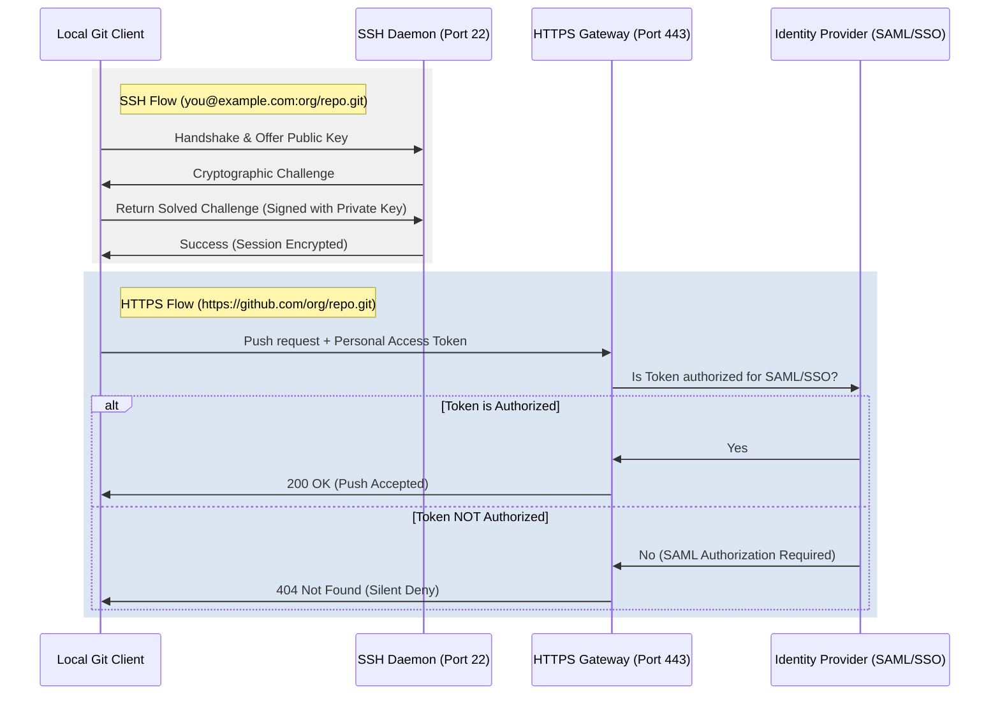

> "Complexity is the enemy of security." — Bruce Schneier

# Under the Hood of `git push`: How SSH, Keys, and `gh` Actually Work Together

*The story of a blocked deployment, a confusing 404, and the invisible boundary between SSH and HTTPS.*

It was Tuesday at 9:45 AM. The deployment pipeline for a high-volume transactional platform was frozen. Wei, a mid-level backend engineer, was trying to push a critical hotfix to the release branch. 

Instead of a success message, his terminal spat out a cold rejection:

```
Permission denied (publickey).
fatal: Could not read from remote repository.
```

Sarah, from Platform Security, jumped into the Slack incident channel. "We completed the SAML SSO migration yesterday. SSH is now deprecated for this organization. You need to use HTTPS with your corporate credentials."

Wei fired back with a terminal snippet: `ssh -i ~/.ssh/id_ed25519 -Tv you@example.com` and pasted the last line: `Hi wei-dev! You've successfully authenticated, but GitHub does not provide shell access.` 

"The key works, Sarah," Wei wrote. "GitHub itself says I am authenticated. The block is on the platform team's side."

Leo, the release coordinator, watched the thread turn into a volley of screenshots. The hotfix was delayed, and the team was burning valuable hours debating keys.

Yet, nobody was wrong. Wei's key was perfectly valid, and his SSH handshake succeeded. Sarah's security policy was correctly configured on the server. The breakdown was not a failure of technology, but a failure of the shared mental model. Wei assumed that because the SSH connection succeeded, his `git push` command—which was configured to use an HTTPS URL—should also succeed. 

Let's unpack the boundary where these protocols collide.

---

## 🎯 The 30-Second Blueprint

Before digging into the mechanics, here is how the three primary ways of interacting with remote repositories compare:

| Dimension | SSH Protocol | HTTPS (with Token) | `gh` CLI Helper |
| :--- | :--- | :--- | :--- |
| **Underlying Protocol** | SSH (Port 22) | HTTPS (Port 443) | HTTPS (Port 443) |
| **Authentication** | Asymmetric Key Pair (Local private key) | Personal Access Token (PAT) | OAuth / Encrypted Token |
| **SAML SSO Flow** | One-time key registration | Requires explicit token authorization | Handled via CLI login flow |
| **Setup Cost** | Medium (Keygen & upload) | Medium (PAT generation) | Low (Single interactive command) |
| **Maintenance Cost** | Low (Keys do not expire) | High (Tokens expire regularly) | Low (Auto-refreshes session) |

> 📌 **Takeaway:** SSH and HTTPS are entirely separate toll roads. Authenticating successfully on the SSH road does not grant you passage on the HTTPS road, even if both lead to the same repository.

---

## 🧠 The Multi-Lock Mental Model

To understand why Wei's test succeeded while his push failed, think of your code hosting platform as a highly secure corporate facility.

```
+-------------------------------------------------------------+
|                     SECURE FACILITY                         |
|                                                             |
|    [ BACK DOOR: SSH ]               [ FRONT LOBBY: HTTPS ]  |
|    - Needs physical key             - Needs temporary badge |
|    - Handled by SSH agent           - Handled by Keychain   |
|                                                             |
|               \                           /                 |
|                \                         /                  |
|                 +-----------------------+                   |
|                 |    REPOS & SOURCE     |                   |
|                 +-----------------------+                   |
+-------------------------------------------------------------+
```

### The Back Door (SSH)
This door uses a physical lock mechanism. You generate a keypair locally. You give the facility manager your public key (which they bolt to the door). When you arrive, you prove you hold the private key by solving a cryptographic puzzle. This door is simple, fast, and does not care about your browser session.

### The Front Lobby (HTTPS)
This door does not have a keyhole. It only accepts temporary magnetic badges (Tokens or Personal Access Tokens). To get a badge, you must walk through the front desk, log in with your password, and pass your company's identity provider check (SAML SSO). This badge has an expiration date printed on the front.

When Wei ran `ssh -Tv you@example.com`, he was standing at the Back Door, proving his physical key could turn the lock. But his local Git client was configured with an HTTPS remote URL. Wei was taking his physical key, walking to the Front Lobby's card reader, and wondering why the reader wouldn't let him in. 

> 📌 **Takeaway:** Git relies on helper programs to authenticate. The protocol prefix of your remote URL (`git@` vs `https://`) dictates which helper program is invoked.

---

## 🏗️ The Protocol Handshake

This sequence diagram illustrates exactly where the authentication paths diverge during a `git push` command.



During the SSH flow, the handshake completes entirely within the SSH layer. During the HTTPS flow, the server checks the token against the identity provider's database to verify if the token has been explicitly authorized for that specific organization.

> 📌 **Takeaway:** The cryptographic validity of an SSH key is verified locally, while the validity of an HTTPS token is tied to a centralized, real-time identity provider check.

---

## 🛠️ The Fix: Multi-Account and SSO Realities

To resolve the standoff, Sarah and Wei aligned their configurations to match the security policy. 

### Step 1: Aligning the URL
First, Wei updated his repository's remote URL to use HTTPS, since the security policy blocked port 22 (SSH) for corporate assets:

```bash
# Check current remote
git remote -v
# origin you@example.com:org/repo.git (fetch)
# origin you@example.com:org/repo.git (push)

# Update to HTTPS
git remote set-url origin https://github.com/org/repo.git
```

### Step 2: Setting up `GIT_SSH_COMMAND` for Permitted Environments
In environments where SSH is allowed but multiple keys are present (such as running private projects alongside work projects), Wei learned how to force Git to use a specific key without polluting his global configuration.

```bash
# Force git to use a specific identity key for a single command
GIT_SSH_COMMAND="ssh -i ~/.ssh/id_ed25519 -o IdentitiesOnly=yes" git clone you@example.com:personal/repo.git
```

Using `-o IdentitiesOnly=yes` is the vital safety switch here. Without it, the SSH agent will offer every key in its ring sequentially, which can trigger a brute-force protection block on the server.

🩸 **Hard-won warning:** If you use `GIT_SSH_COMMAND` with an `https://` URL, the environment variable is silently ignored. Git will hand off the connection to your system's HTTP helper instead of SSH, leading to confusing authentication prompts.

### Step 3: Isolating Identities by Directory
To prevent work commits from using his personal email address, Wei configured dynamic Git configurations in his `~/.gitconfig`:

```ini
# ~/.gitconfig
[user]
    name = Wei Chen
    email = you@example.com

# Dynamically load work identity for specific paths
[includeIf "gitdir:~/projects/work/"]
    path = ~/.gitconfig-work
```

And inside `~/.gitconfig-work`:

```ini
# ~/.gitconfig-work
[user]
    email = you@example.com
```

Now, any repository cloned under `~/projects/work/` automatically stamps commits with Wei's work email, without manual intervention.

> 📌 **Takeaway:** Clean identity management requires separating your network transport configuration (SSH vs HTTPS) from your author identity configuration (Git config name and email).

---

## 💡 Tradeoffs and Limits

Choosing between these authentication methods is not a matter of finding the "best" protocol, but of understanding where the control plane lives.

* **SSH** is highly efficient for machine-to-machine communication, automated scripts, and environments where you want long-lived, passwordless access. However, it is notoriously difficult for security teams to audit in real-time. If an employee leaves, revoking their SSH key requires active intervention on the server or a centralized key-management authority. Furthermore, corporate firewalls frequently block port 22.
* **HTTPS** is firewall-friendly (using standard port 443) and integrates seamlessly with modern Identity Providers (IdPs) for SAML SSO. This allows instant, centralized access revocation. The downside is the maintenance overhead: Personal Access Tokens (PATs) expire regularly, and managing them manually is a recipe for developer friction.
* **`gh` CLI** acts as a bridge, automating token generation and renewal while storing credentials securely in your operating system's keychain. However, it introduces an external dependency and is less suited for headless CI/CD environments where interactive login is impossible.

> 📌 **Takeaway:** Use HTTPS with a credential helper like `gh` for local development to satisfy modern corporate security compliance, and reserve SSH for isolated, headless environments where port 22 is explicitly permitted.

---

## 🛠️ A Debugging Playbook

When your push fails, use this quick reference to diagnose the root cause:

| Symptom | Root Cause | Diagnostic Command / Fix |
| :--- | :--- | :--- |
| `Permission denied (publickey)` | The SSH server rejected your keys or no key was offered. | Run `ssh -Tv you@example.com` to see which keys are being offered. |
| `Repository not found` (on HTTPS push) | The remote repository exists, but your token lacks SAML SSO authorization. | Run `gh auth status` or check your token's SSO authorization in your platform's developer settings. |
| `fatal: Authentication failed` | Stale credentials cached in your system's credential helper. | Run `git credential reject` to clear the cached credentials. |

> 📌 **Takeaway:** A `404 Not Found` error on a push is often a security feature in disguise, hiding the repository's existence from unauthorized tokens.

---

## 🧭 The Elevation: Transferable Principles

Beyond the syntax of Git configurations, this incident highlights three core architectural principles that apply to all software systems.

### 1. Transport is Not Authorization
* **The Mechanism:** Just because a low-level network connection (transport layer) is successfully established and authenticated does not mean the application layer has authorized your specific action. Transport gets you to the door; authorization determines what you can carry out. Confusing these two layers leads to false confidence during troubleshooting.
* **Non-Technical Example:** Having a valid passport gets you through airport border security (transport/identity), but it does not authorize you to board a specific flight without a valid boarding pass (authorization).
* **Generalize:** When debugging a permission error, map out the layers. Are you failing at the connection level (TCP/SSH), the authentication level (who you are), or the authorization level (what you are allowed to do)?

### 2. Failures Must Speak Clearly
* **The Mechanism:** Silent failures or misleading error codes protect security but destroy developer velocity. When a system returns a `404 Not Found` instead of a `403 Forbidden` to prevent repository enumeration, it prioritizes security over debuggability. Without clear diagnostic paths, operators will apply the wrong mental models and waste hours.
* **Non-Technical Example:** A bank vault door that simply refuses to turn without explaining whether the combination is wrong, the time-lock is active, or the branch is closed.
* **Generalize:** When designing APIs or security policies, balance security-by-obscurity against operator debuggability. If you must return a generic error to the client, ensure internal logs or diagnostic headers provide a clear escape hatch for authorized operators.

### 3. The Interface Dictates the Mental Model
* **The Mechanism:** When an interface hides underlying complexity (e.g., Git treating SSH and HTTPS remotes as interchangeable strings in a config file), users will conflate the two. When things break, they will apply the wrong troubleshooting tools because the interface suggested they were identical.
* **Non-Technical Example:** Modern push-button car ignitions. Because the physical interface is identical to turning a key, drivers often forget that the car's computer is performing complex pre-checks (like verifying the key fob's proximity or checking if the brake is depressed), leading to confusion when the car fails to start.
* **Generalize:** Look at your system's user interface. Does it make two fundamentally different operations look identical? If so, expect your users to make category errors when those operations fail, and proactively design guardrails.

---

## 🎯 Action Items

Here is what you can check today to ensure your local environment is clean and secure:

1. **Audit your remotes:** Run `git remote -v` in your primary work repository. If you are still using SSH (`git@...`) but your organization has migrated to SSO, switch to HTTPS.
2. **Verify your active SSH keys:** Run `ssh-add -l` to see which keys are currently loaded in your SSH agent. Remove stale keys with `ssh-add -d <path_to_key>`.
3. **Test your SSO authorization:** If using GitHub, run `gh auth status` to verify that your active token is authorized for your organization's SAML SSO.
4. **Isolate your identities:** Set up directory-based Git configurations using `includeIf` in your global `~/.gitconfig` to prevent committing to work repositories with your personal email address.
5. **Align with Security (Non-Technical):** Schedule a brief alignment sync with your security or platform engineering team to understand upcoming authentication changes before they are rolled out to production pipelines.

With their mental models aligned, Wei ran `git remote set-url origin https://github.com/org/repo.git` and authenticated using his corporate-approved `gh` CLI helper. The push went through instantly. The deployment pipeline turned green, the hotfix was successfully deployed, and Leo stood down the incident channel. Sarah and Wei even scheduled a 15-minute sync to document the new HTTPS-only workflow for the rest of the engineering team.

> "The most secure system is not the one with the highest walls, but the one where the doors are clearly marked."
