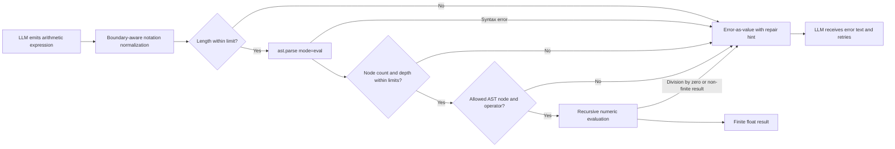

> "Simplicity is prerequisite for reliability." — Edsger W. Dijkstra

# Thin Runtime, Strong Guardrails: How We Built an AST Sandbox for AI Workflows

*An AI workflow did not need a smarter calculator. It needed a smaller place to make mistakes.*

## 🎯 The 10:07 calculation that should not have become an incident

At 10:07, Maya was reviewing an AI-generated financial calculation. The model had been given an expression with ordinary-looking arithmetic, a currency marker, a percentage, nested parentheses, and a parenthesized loss value. It returned an answer with the calm confidence that makes incorrect arithmetic especially expensive to notice.

At 10:10, Wei took the obvious operational route: give the workflow a Python environment and let it calculate. Python is good at arithmetic. The model could generate an expression, the runtime could evaluate it, and everyone could move on.

At 10:14, Priya pointed out the part that changes the design: a general Python runtime is not a calculator. It is a programming environment. If a model can send arbitrary Python, it can attempt arbitrary behavior, including shell invocation such as `os.system("rm -rf /")`. Even if isolation limits the blast radius, that is the wrong capability boundary for a tool whose job is addition and subtraction.

The immediate stakes were mundane but real: wasted debugging time, brittle tool calls, and a workflow that could fail because the model wrote `"$100"`, `"20%"`, or multiplication as `x` instead of `*`. The more serious cost was trust. If the arithmetic tool is unreliable, downstream reasoning starts from a number nobody should believe.

Nobody was wrong.

Maya was right that language models can produce plausible but incorrect arithmetic, especially when expressions become nested or when financial notation enters the prompt. Wei was right that deterministic code should perform deterministic math. Priya was right that running code is a different capability from evaluating an arithmetic expression.

The defect was the shared mental model. We had treated “calculator” as shorthand for “Python REPL.” Those are not comparable interfaces. One is a narrow interpreter over a tiny language. The other is a doorway into a general-purpose runtime.

The surprising part is that the security boundary and the reliability boundary are the same boundary: **the less language the tool accepts, the less the model can accidentally—or deliberately—mean.**

> 📌 **Takeaway:** An LLM should not be asked to perform consequential arithmetic in its generated prose, and it should not need a general-purpose runtime to delegate it. Give it a deliberately small calculation language instead.

## 🧠 The 30-second version

The production pattern is an AST-backed arithmetic sandbox: normalize narrowly defined financial notation, parse an expression into an abstract syntax tree (AST), check its size and complexity, and evaluate only an explicit whitelist of numeric literals, unary operators, binary operators, and grouping.

| Approach | What the model sends | Runtime capability | Relative cost | Main failure mode |
|---|---|---:|---:|---|
| Model calculates in text | Reasoning plus arithmetic | None | Low implementation cost; high correction cost | Hallucinated or inconsistent arithmetic |
| Raw `eval()` / Python REPL | Arbitrary Python | General code execution | Low initial code cost; very high security and operations cost | Arbitrary code, imports, calls, attributes, brittle input handling |
| AST sandbox | Restricted arithmetic expression | Only whitelisted arithmetic, within explicit input limits | Moderate implementation and maintenance cost | Unsupported syntax and resource limits must be handled explicitly |

For financial-style expressions, the sandbox can make two constrained repairs before parsing:

- remove a `$` currency marker only when it begins a numeric currency literal at a valid literal boundary;
- rewrite a percentage literal such as `20%` as `(20/100)`.

Any other `$` is rejected. That matters: a global `expr.replace("$", "")` turns `$$100` into `100`, silently converting malformed input into a valid value. A calculator should not reward punctuation accidents with a confident answer.

Then it parses with `ast.parse(..., mode="eval")`, enforces expression-length, AST-node-count, and tree-depth limits, and recursively evaluates only permitted AST nodes. Everything else—names, function calls, attribute access, containers, comprehensions, imports, and assignments—is rejected.

That gives the model a deterministic calculator without granting it a general interpreter.

> 📌 **Takeaway:** The cheap-looking solution is often the expensive one. A Python REPL minimizes code written today; a constrained expression evaluator minimizes the kinds of failures you must explain tomorrow.

## 🏗️ The mental model: a cashier window, not a workshop

Think of the tool as a cashier window.

A cashier accepts a small number of valid inputs: an item, a quantity, a payment method. The cashier does not hand each customer the keys to the warehouse, a forklift, and access to the ledger because the customer asked for a total.

A Python REPL is the warehouse. It can calculate a total, but it can also inspect files, allocate memory, import modules, make network requests if the environment permits them, and invoke other processes. Sandboxing the warehouse may still be necessary in some designs, but it does not make the warehouse into a cashier window.

The AST evaluator is the cashier window. Its grammar is intentionally boring:

```text
expression := number
            | - expression
            | expression + expression
            | expression - expression
            | expression * expression
            | expression / expression
            | ( expression )
```

That boringness is the feature. Maya does not need the model to author Python. She needs it to express a calculation. Wei does not need to make every Python feature safe. He needs to make this grammar correct, observable, bounded, and reject-by-default.

This also explains why a whitelist matters more than a blacklist. A blacklist asks, “Which dangerous Python features did we remember?” A whitelist asks, “Which exact syntax does a calculator require?” The former grows with the language. The latter stays small because arithmetic stays small.

There is an important limit to the metaphor. A cashier window with a short menu is not automatically protected against a customer who blocks the line with an arbitrarily long form. The AST whitelist prevents unsupported language features. It is **not** a complete isolation boundary against denial of service. Oversized input can consume parser work; deeply nested or very broad expressions can consume CPU, memory, or Python stack during validation and evaluation.

> 🩸 **Hard-won warning:** `ast.parse()` is not a sandbox. Parsing an expression only turns source text into a tree. Safety comes from refusing every node and operator that the evaluator does not explicitly implement. Calling `eval()` on the parsed result merely moves the same risk behind a more technical-looking API.

> 📌 **Takeaway:** Treat an AI tool contract like a physical service counter. Expose the smallest capability that completes the task, and bound the amount of work a caller can ask that capability to do.

## 🛠️ Where the guardrails actually meet

The key separation is between normalization, parsing, complexity validation, evaluation, and agent recovery. The model can propose text. It cannot choose what the runtime executes.



The implementation starts from the same core shape:

```python
import ast
import math
import re

# These are policy values, not universal safe defaults. Tune them to the
# product contract and enforce stricter outer resource limits for untrusted use.
MAX_EXPRESSION_CHARS = 4_096
MAX_AST_NODES = 512
MAX_AST_DEPTH = 64

_PERCENT_LITERAL = re.compile(
    r"(?P<number>(?:\d+(?:\.\d*)?|\.\d+))\s*%"
)

# A dollar marker is supported only immediately before a numeric literal and
# only at the start of an expression or after a non-word, non-dot, non-')'
# boundary. All remaining dollar signs are rejected.
_CURRENCY_LITERAL = re.compile(
    r"(?<![\w.)])\$\s*(?P<number>(?:\d+(?:\.\d*)?|\.\d+))"
)


def safe_eval_expression(expr: str) -> float:
    if not isinstance(expr, str):
        raise ValueError("expression must be a string")
    if len(expr) > MAX_EXPRESSION_CHARS:
        raise ValueError("expression is too long")

    # 1. Targeted cleanup for supported financial notation.
    normalized = _CURRENCY_LITERAL.sub(r"\g<number>", expr)
    if "$" in normalized:
        raise ValueError("invalid currency marker")
    normalized = _PERCENT_LITERAL.sub(r"(\g<number>/100)", normalized)

    # 2. Parse an expression, not a Python statement block.
    node = ast.parse(normalized, mode="eval").body
    _check_complexity(node)

    # 3. Evaluate only an explicit AST whitelist.
    result = _eval_node(node)
    if not math.isfinite(result):
        raise ValueError("result must be finite")
    return result


def _check_complexity(root: ast.AST) -> None:
    node_count = 0
    stack: list[tuple[ast.AST, int]] = [(root, 1)]

    while stack:
        node, depth = stack.pop()
        node_count += 1
        if node_count > MAX_AST_NODES:
            raise ValueError("expression is too complex")
        if depth > MAX_AST_DEPTH:
            raise ValueError("expression is nested too deeply")

        stack.extend((child, depth + 1) for child in ast.iter_child_nodes(node))


def _eval_node(node: ast.AST) -> float:
    if isinstance(node, ast.Constant):
        if isinstance(node.value, bool) or not isinstance(node.value, (int, float)):
            raise ValueError("only numeric constants are allowed")
        return float(node.value)

    if isinstance(node, ast.UnaryOp) and isinstance(node.op, (ast.UAdd, ast.USub)):
        value = _eval_node(node.operand)
        return value if isinstance(node.op, ast.UAdd) else -value

    if isinstance(node, ast.BinOp):
        left = _eval_node(node.left)
        right = _eval_node(node.right)

        if isinstance(node.op, ast.Add):
            return left + right
        if isinstance(node.op, ast.Sub):
            return left - right
        if isinstance(node.op, ast.Mult):
            return left * right
        if isinstance(node.op, ast.Div):
            return left / right

        raise ValueError("operator is not allowed")

    raise ValueError("expression contains unsupported syntax")
```

There are a few details here worth making explicit.

First, `mode="eval"` accepts one expression, not a sequence of Python statements. That is useful, but insufficient on its own. An expression can still contain a function call, a name, an attribute lookup, or a conditional expression. `_eval_node` is the actual language-policy enforcement point.

Second, the whitelist must include the structural nodes needed for arithmetic, not merely the operator names. A valid `1 + 2` tree contains `ast.BinOp`, `ast.Add`, and numeric `ast.Constant` leaves. A negative number is represented as a unary operation in the AST, so `ast.USub` must be considered deliberately rather than accidentally allowed.

Third, percentage normalization should be narrow. Blindly replacing every `%` character with `/100` changes the meaning of Python’s modulo operator and can produce confusing expressions. For a financial calculator, rewriting a numeric percentage literal is a reasonable contract. If the workflow must support richer formats—thousands separators, parentheses meaning negative values, locale-specific decimals, accounting abbreviations, or currency conversion—those should be specified and parsed as their own input language rather than smuggled through a sequence of string replacements.

Currency normalization needs the same discipline. The supported rule above is deliberately small: `$100` and `($100)` are currency literals; `$$100`, `1$100`, and `$total` are invalid. After the one documented rewrite, any remaining `$` causes rejection. This is more conservative than “remove dollar signs,” because it preserves the distinction between a supported notation and damaged input.

The source observation about parenthesized financial losses is also important. In many financial documents, `(123)` conventionally denotes a negative value. Python reads `(123)` as positive grouping. That is not a failure of Python; it is a mismatch between accounting notation and arithmetic syntax. Do not silently “fix” it with a global replacement. If accounting parentheses are required, add a documented, tested normalization rule with unambiguous boundaries.

Fourth, limits are part of the interface, not an implementation afterthought. The values shown above make the limit enforceable and visible, but they do not make in-process evaluation safe against every resource failure. Where untrusted callers can submit expressions, run this work in a separately constrained worker or process with CPU time, memory, and request-time limits appropriate to the deployment. The AST whitelist decides *which language features exist*. Process and resource isolation decide *how much damage a valid-looking request can do*.

> 📌 **Takeaway:** Parsing is recognition, not authorization. The authorization step is the evaluator’s node-and-operator whitelist, plus a deliberately narrow normalization contract and explicit resource bounds.

## 💡 The fix: errors become part of the tool protocol

When Maya’s workflow sent malformed arithmetic, the first instinct was to let the exception surface. That is normal application code behavior. It is often the wrong agent-tool behavior.

An uncaught `SyntaxError`, `ValueError`, or `ZeroDivisionError` can terminate the tool path and leave the agent with no structured feedback. The model does not learn whether it used the wrong operator, unsupported notation, an invalid currency marker, an oversized expression, or an invalid expression. It just sees a failed turn.

The better interface is **error-as-value**: catch expected failures at the tool boundary, return a short error string with an actionable hint, and allow the model to repair its own expression on the next turn.

```python
def calculate_tool(expression: str) -> str:
    try:
        return str(safe_eval_expression(expression))
    except SyntaxError:
        return "error: invalid syntax. Hint: Use '*' for multiplication, not 'x'."
    except ZeroDivisionError:
        return "error: division by zero. Hint: Check the denominator."
    except ValueError as exc:
        return (
            f"error: {exc}. Hint: Use numbers, parentheses, +, -, *, /, "
            "and percentage literals such as 20%. Use '$' only directly before a number."
        )
```

The message from the original workflow remains a good example:

```text
error: invalid syntax. Hint: Use '*' for multiplication, not 'x'
```

This is not pretending that the model “reflects” in a human sense. It is giving the next generation step better state. The tool failure becomes data in the conversation rather than a control-flow event that kills the entire agent.

That is how the conflict resolved. Wei stopped treating model output as executable Python. Maya stopped relying on prose arithmetic for calculations that mattered. Priya got a tool boundary that could be audited: a request either produced a finite number or a bounded, actionable failure. For the rest of the workflow cycle, that calculation field was modified exactly once: at the calculator boundary.

> 📌 **Takeaway:** In an agent system, expected tool failures should usually be machine-readable feedback, not process-ending exceptions. A good error message is a repair instruction with a type.

## 🏗️ What this approach costs—and where it stops working

An AST sandbox is not free. It trades generality for a smaller failure surface.

You must maintain the grammar. Every new feature—exponentiation, rounding, `min`, `max`, date arithmetic, currency conversion, accounting-format input—requires an explicit decision, implementation, tests, documentation, and error behavior. That friction is healthy until it becomes a sign that the problem is no longer “evaluate arithmetic.”

The limits also require maintenance. A legitimate expression can exceed a character, node, or nesting limit as requirements change. That should trigger a review of the input contract, not an automatic increase because one request failed. A larger limit is an expansion of the resource budget.

Do not use this pattern as a substitute for a real domain engine when the calculation requires:

- precise decimal and rounding rules, especially for money;
- currency conversion, rates, calendars, or external reference data;
- tax, accounting, or regulatory logic;
- formulas with named variables and an approved domain-specific language;
- reporting calculations whose provenance must be retained at each step.

The example returns a `float` because that matches the small sandbox’s stated interface. For production money calculations, binary floating point can introduce representational surprises. Use `decimal.Decimal` or integer minor units when the domain requires decimal exactness and define rounding explicitly. That is a domain decision, not a security patch.

The design can also degrade over time. A once-small whitelist tends to grow by exception: “just one function,” “just variables,” “just a lookup.” Eventually the evaluator is a partial programming language with undocumented semantics. At that point, either formalize it as a real DSL with a grammar and tests, or move the complexity behind a purpose-built service. A pile of special cases is merely a language implementation that has not admitted what it is.

Finally, do not mistake this evaluator for a complete hostile-input containment strategy. Length, node, and depth checks reduce predictable work. They do not replace worker-process isolation, operating-system resource controls, rate limits, and timeouts when the caller is genuinely untrusted. A whitelist is a language boundary, not a complete denial-of-service boundary.

> 📌 **Takeaway:** A constrained evaluator is excellent for constrained arithmetic. When requirements become domain semantics or hostile-input isolation, build the domain engine and containment layer the problem actually needs.

## 🛠️ Debugging playbook

The sandbox is small enough that diagnosis should be mechanical. Test the tool itself before investigating the model prompt.

| Symptom | Likely cause | Exact command or check |
|---|---|---|
| `error: invalid syntax` | The model used `x` for multiplication, prose, or malformed parentheses | Run `python -c 'from path.to.module import calculate_tool; print(calculate_tool("2 x 3"))'` and verify the hint is returned |
| `error: expression contains unsupported syntax` | The expression contains a name, call, attribute, list, or another non-arithmetic AST node | Run `python -c 'from path.to.module import calculate_tool; print(calculate_tool("sum([1, 2])"))'` and verify it is rejected |
| `error: invalid currency marker` | The input used repeated, embedded, or non-numeric dollar markers | Run `python -c 'from path.to.module import calculate_tool; print(calculate_tool("$$100")); print(calculate_tool("1$100")); print(calculate_tool("$total"))'` and verify every input is rejected |
| A percentage gives an unexpected result | The input contract did not define the percentage form, or normalization was too broad | Test `python -c 'from path.to.module import safe_eval_expression; print(safe_eval_expression("$100 * 20%"))'` and document the expected result |
| A parenthesized loss is positive | Accounting notation was passed to Python grouping syntax | Add a test case for the required notation before adding any normalization rule |
| The agent stops after one tool failure | The tool lets exceptions escape instead of returning error-as-value | Call the public tool wrapper with malformed input and confirm it returns an `error:` string |
| A result is `inf` or `nan` | Numeric input or an operation produced a non-finite result | Add tests for non-finite rejection and verify `math.isfinite(result)` is enforced |
| A request consumes unexpectedly large resources | The expression is too long, too broad, or too deeply nested; the evaluator may be running without outer isolation | Test inputs over the configured length, node-count, and depth limits; confirm they return errors, then verify the deployed worker has CPU, memory, and timeout limits |

Replace `path.to.module` with the import path in your repository. The command is intentionally boring: import the public tool boundary and test the same string contract the agent sees.

A minimal rejection suite makes the currency rule and complexity contract executable rather than aspirational:

```python
import pytest

from path.to.module import (
    MAX_EXPRESSION_CHARS,
    MAX_AST_DEPTH,
    calculate_tool,
    safe_eval_expression,
)


@pytest.mark.parametrize("expression", ["$$100", "1$100", "$total", "100$"])
def test_rejects_malformed_currency_markers(expression: str) -> None:
    assert calculate_tool(expression).startswith("error: invalid currency marker")


def test_accepts_documented_currency_literal() -> None:
    assert safe_eval_expression("($100) * 20%") == 20.0


def test_rejects_expression_over_length_limit() -> None:
    assert calculate_tool("1" * (MAX_EXPRESSION_CHARS + 1)).startswith(
        "error: expression is too long"
    )


def test_rejects_excessive_nesting() -> None:
    expression = "(" * (MAX_AST_DEPTH + 1) + "1" + ")" * (MAX_AST_DEPTH + 1)
    assert calculate_tool(expression).startswith("error:")
```

The exact message for extreme nesting can vary depending on whether Python’s parser rejects the input before the evaluator sees the tree. The contract that matters is stable: it must fail as a bounded tool error, not become an unbounded resource request.

🩸 **Hard-won warning:** Do not test only happy-path arithmetic such as `1 + 2`. The failures that consume an afternoon are notation failures: `$100`, `$$100`, embedded dollar markers, `20%`, `2 x 3`, unexpected identifiers, malformed parentheses, division by zero, accounting-style negatives, and expressions that are too large or too deep. The model will find whichever one you forgot to name.

> 📌 **Takeaway:** Debug the contract at the boundary. If the tool returns deterministic values and deterministic repair hints for hostile and malformed input, prompt changes become much easier to reason about.

## 🧭 What this incident teaches outside ASTs

### 1. Least privilege: capability must match intent

A system is safer when its available powers are close to the job it was asked to do. This is the security principle of least privilege in plain language. Each unnecessary capability creates behaviors that must be constrained, monitored, and explained. A calculator needs arithmetic; it does not need imports, filesystem access, or process creation.

Aviation applies the same idea through checklists and role separation. A pilot may have broad authority over the aircraft, but a checklist narrows a specific procedure into explicit, verifiable actions. The checklist is not an insult to expertise. It is a refusal to make a complex system depend on remembered freedom of action.

> **Generalize:** When you expose an interface, ask: “What is the smallest power the caller needs to complete this task?” Remove everything else before adding controls around it.

### 2. Cost must be visible at the interface

The general Python tool hid its real cost. It looked like a one-line implementation, while pushing security review, runtime isolation, error recovery, and operational uncertainty into the future. The AST tool makes its cost visible: each supported syntax feature, each normalization rule, and each resource limit is a named engineering decision.

In banking, an overdraft fee is controversial precisely because the customer often discovers the cost after the action. A system is easier to use responsibly when the price appears at the point where the choice is made. The same is true for engineering interfaces: hidden operational cost encourages irresponsible convenience.

The resource-limit addition illustrates the same law. “Only arithmetic” sounds cheap until an unrestricted caller sends a large or deeply nested arithmetic expression. The language may be small while the work requested is not. A visible character limit and tree budget put that cost where the request is made.

> **Generalize:** When a shortcut looks almost free, ask where its cost is being stored. If the answer is “in someone else’s incident queue later,” put the cost back into the interface now.

### 3. Errors are messages, not merely failures

Error-as-value works because an error can carry the information needed for the next correct action. An unhandled exception says only that control flow ended. A typed error plus a hint says what happened, what remains safe, and what to try next.

Medicine uses this pattern in triage. “No immediate emergency, return if symptoms worsen” is not the same as “something went wrong.” It is bounded feedback that guides the next decision without claiming certainty the system does not have.

> **Generalize:** For every predictable failure mode, ask: “Could the recipient take the next correct action from this message alone?” If not, the error is incomplete.

### 4. Shared mutable state creates invisible coordination work

The original collision happened because too many layers could influence the meaning of a calculation: the model’s prose, the execution runtime, ad hoc input cleanup, and exception behavior. A single guarded boundary made ownership clear: the calculator interprets arithmetic, and callers receive a result or a repairable error.

In family life, a shared kitchen counter becomes contentious when everyone can leave items there and nobody owns the reset. The counter is technically available to all, but its maintenance cost becomes social coordination. Software state behaves the same way. The more places that can reinterpret or modify it, the more coordination is required.

> **Generalize:** Find the value that keeps being “fixed” in multiple layers. Assign one owner for its interpretation and make every other layer pass it through unchanged.

> 📌 **Takeaway:** The AST sandbox is a specific solution, but its durable lesson is broader: narrow capabilities, visible costs, actionable failures, and clear ownership reduce coordination work in any system.

## 🛠️ Do this today

1. Inventory every AI tool that currently evaluates model-generated code. Ask whether it needs a general runtime or only a restricted operation.
2. Add tests for `$100`, `$$100`, embedded and trailing dollar markers, `20%`, nested parentheses, negative values, malformed syntax, `2 x 3`, function calls, attribute access, division by zero, and non-finite results.
3. Replace any global currency cleanup such as `expr.replace("$", "")` with one documented boundary-aware currency-literal rule. Reject every remaining `$` after that normalization pass.
4. Set and test an expression-length limit, AST node-count limit, and AST-depth limit. Treat changes to those limits as resource-budget decisions, not routine bug fixes.
5. Where untrusted callers can submit expressions, verify that evaluation happens behind process or worker isolation with appropriate CPU, memory, timeout, and rate limits. The AST whitelist is necessary, but it is not that isolation.
6. Verify that your evaluator rejects `ast.Name`, `ast.Call`, `ast.Attribute`, container literals, comprehensions, and every operator you did not intentionally support.
7. Change expected tool failures from uncaught exceptions into stable error values with one concrete repair hint.
8. In the next standup, ask a non-technical question: “Which interface in our workflow gives people more power than the task requires?” The answer is often a better backlog item than another prompt tweak.
9. If the calculation represents money, decide explicitly whether `float` is acceptable. If it is not, define decimal precision and rounding before the model starts producing results that look exact.

The implementation described here was published as a reference project; the transferable part is not its repository layout. It is the boundary: models may propose expressions, but the runtime decides what an expression is allowed to mean—and how much work it is allowed to demand.

A reliable system is not one that trusts better inputs; it is one that makes the wrong inputs cheap to reject and easy to repair.
