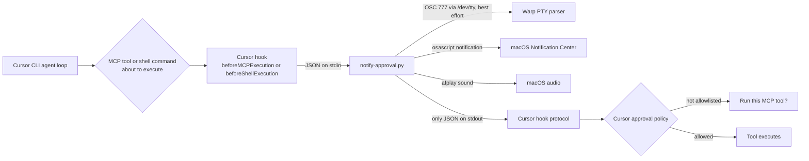

> "The purpose of computing is insight, not numbers." — Richard Hamming

# The 5-Step macOS Pager Setup That Makes Cursor CLI Output Usable Again

*An approval prompt is a human safety gate, not a completion event. Page the human without opening the gate.*

## 🎯 The stall that looked like a broken agent

Firstly, all code and configs can be found at https://github.com/CloudsDocker/cursor-cli-pager, welcoemd to fork and star.

At 01:22 UTC, in a composite but familiar scene, Maya had asked Cursor CLI to inspect a data source. Wei had switched from Warp to a chat window while waiting for the result. The CLI reached an MCP tool call, rendered **Run this MCP tool?**, and waited for `y`.

Twenty minutes later, Maya thought the agent had failed. Wei thought the request was still running. A message thread had started accumulating the usual unhelpful theories: terminal bug, model timeout, broken MCP server, somebody forgot to configure notifications.

Nobody was wrong.

Cursor CLI was doing the safe thing: it stopped for a human approval before calling a tool. Warp was doing its thing: it had not recognized this particular full-screen terminal UI as a password-like input prompt or a completed long-running command. macOS had nothing to announce because neither application emitted a notification.

The surprise is this: **an approval prompt is neither “the command finished” nor necessarily “terminal input is needed” in the way terminal notification systems understand it.** It is a policy decision inside the agent loop. If the signal must be reliable, it has to come from near that loop—not from a terminal trying to infer meaning from pixels.

This post builds a small macOS pager for that moment. It notifies you when Cursor CLI is about to execute an MCP tool or shell command, but it does not approve anything. You still decide whether to press `y`, Tab, `n`, Escape, or `p`.

> 📌 **Takeaway:** The operational failure is not that approval exists. It is that the person responsible for approval cannot see that the gate has appeared.

## 🧠 The 30-second version

Cursor CLI, Cursor hooks, and Warp/macOS notifications are three separate planes. They can influence adjacent parts of the experience, but they do not share one decision record.

| Plane | What it decides | Typical mechanism | Relative cost | What it cannot safely replace |
| --- | --- | --- | --- | --- |
| Allowlist / permission plane | Whether Cursor shows an approval UI | Per-tool approval, session allowlisting, permission configuration | **High**: changes what can execute | A notification that brings a human back |
| Hook plane | What runs before an MCP or shell execution | `beforeMCPExecution`, `beforeShellExecution`, JSON stdin/stdout | **Low**: observes and signals | Cursor’s MCP approval policy |
| Notification plane | Whether you notice the waiting state | Warp OSC, Notification Center, sound | **Low**: attention only | A trustworthy source of agent state |

The design is deliberately observe-only:

1. Cursor invokes a hook before an MCP or shell execution.
2. The hook reads Cursor’s JSON payload from stdin.
3. It sends a short, privacy-preserving notification.
4. It returns exactly `{"permission": "allow"}` on stdout.
5. Cursor still presents its own MCP approval UI when policy requires it.

That last point matters. Returning `allow` from a hook is not, at present, a general-purpose bypass for Cursor’s MCP confirmation UI. The hook permission path and the client-side MCP approval path are independent. Hooks are useful for denial and policy enforcement; they are not a substitute for an MCP allowlist.

> 📌 **Takeaway:** Use the hook plane to observe a likely approval boundary. Use the permission plane only when you actually intend to change execution authority.

## 🏗️ The mental model: a hospital call button, not an automatic door

Think of the agent loop as a hospital room.

The clinician may be qualified to perform routine work. But a high-consequence action still requires a patient’s consent or a second person’s confirmation. The call button does not grant consent. It tells the responsible person that consent is now required.

That is the pager’s role.

Maya’s request caused the agent to approach a tool boundary. Cursor’s approval UI was the consent form. Wei leaving Warp was not negligence; there was no audible call button. Warp’s command notifications were more like a timer that alerts when an operation finishes. They were not designed to understand every policy gate embedded in every interactive CLI.

This distinction prevents a common and costly mistake: treating notification friction as a reason to loosen permissions. If a data-oriented tool is annoying because it asks for approval, allowlisting it may remove the annoyance—but it also removes the review point. Those are different problems with different owners.

The practical rule is simple:

- **Permission controls authority.**
- **Notifications control attention.**
- **Hooks can connect attention to an authority boundary without changing authority.**

The pager approximates “an approval prompt is visible” using `beforeMCPExecution`. That event means “Cursor is about to call an MCP tool,” not “the user is definitely blocked on a prompt.” An already-allowlisted tool can produce the same event and run immediately. A few extra notifications are a safer failure mode than silently granting access to sensitive tools.

> 📌 **Takeaway:** A pager is a call button. If it starts signing consent forms, it has crossed from observability into authorization.

## 🛠️ Where the signal actually travels

Here is the path in concrete terms.



Cursor hooks are configured in `~/.cursor/hooks.json` for user-wide local CLI use, or in `.cursor/hooks.json` for a project-scoped setup. The working directory differs:

| Hook file | Working directory when the command runs | Scope |
| --- | --- | --- |
| `~/.cursor/hooks.json` | `~/.cursor/` | Local agent sessions for that user |
| `.cursor/hooks.json` | Project root | That workspace; potentially relevant to environments that load project configuration |

A local user hook is appropriate for this pager because the pager is for the Mac where you are sitting. A cloud agent cannot see `~/.cursor/` on your laptop, and a remote environment cannot ring your Mac merely because this file exists locally.

The hook protocol is also unusually strict:

1. Cursor starts the configured command.
2. Cursor writes one JSON payload to stdin and closes stdin.
3. Cursor reads stdout as hook-result JSON.
4. Cursor applies the hook permission result.
5. Cursor’s separate MCP policy path may still show its own approval UI.

That makes stdout a protocol channel, not a logging channel.

```json
{"permission": "allow"}
```

That is the only output this pager should write to stdout. Debugging text, log lines, or an ANSI/OSC escape sequence on stdout can make the hook result unparsable. Put diagnostic output on stderr, write logs to a file if needed, and write terminal control sequences to the TTY—not to stdout.

🩸 **Hard-won warning:** An OSC notification sequence written to stdout can look harmless in a terminal test and still break the hook in production. Cursor reads that stream as JSON, not as terminal output. A pager that corrupts its own control channel is very efficient at creating a new kind of silence.

> 📌 **Takeaway:** The terminal is not automatically the hook’s stdout. In a hook, stdout belongs to Cursor; `/dev/tty` is the best-effort route back to the terminal emulator.

## 🛠️ The five-step macOS setup

This is not auto-approval, a Warp plugin, or a Cursor IDE notification setting. It is a user-level Cursor hook that creates macOS attention signals for the CLI.

Official documentation worth keeping nearby:

- [Cursor hooks](https://cursor.com/docs/hooks)
- [Cursor CLI](https://cursor.com/docs/cli/overview)
- [Cursor MCP](https://cursor.com/docs/mcp)
- [Warp desktop notifications](https://docs.warp.dev/terminal/more-features/notifications/)
- [Warp agent notifications](https://docs.warp.dev/agents/capabilities/agent-notifications/)

### Step 1: verify the prerequisites

You need macOS, Cursor CLI, and Python 3. Warp is recommended because it can interpret terminal notification sequences, but the macOS Notification Center path also works in other terminal applications.

Install Cursor CLI using the current method documented by Cursor, then verify the pieces you will use:

```bash
which agent
agent --version
python3 --version
```

The setup relies on macOS-provided `osascript` for Notification Center and `afplay` for audio. The notification script uses Python only to read JSON safely and construct protocol-safe output.

### Step 2: allow macOS notifications before debugging the hook

In **System Settings → Notifications**, enable banners or alerts and sounds for Warp if you want Warp-attributed notifications. On the first test, macOS may ask to allow notifications from Script Editor or from the process associated with `osascript`; approve it if you want that fallback to work.

Turn off Focus or Do Not Disturb while validating. Focus is a perfectly good feature and a terrible debugging variable.

Warp’s own settings remain useful:

1. Enable session desktop notifications.
2. Enable notifications for long-running commands and password/input prompts.
3. Put Warp in the background when testing Warp’s own banners; another Warp tab can still count as Warp being focused.

Try this separately:

```bash
sleep 30
```

If Warp alerts for that command but not for **Run this MCP tool?**, that is evidence for the model in this post. The two events are different shapes of terminal activity.

### Step 3: get the companion files and install them

Use a local clone or a repository you control. Do not depend on a path inside the clone after installation: user hooks run with `~/.cursor/` as their working directory.

```bash
cd ~/projects
 git clone <REPOSITORY_URL> cursor-cli-pager
cd cursor-cli-pager
chmod +x install.sh hooks/notify-approval.py
./install.sh
```

The installer should copy the hook into `~/.cursor/hooks/` and merge the relevant event entries into `~/.cursor/hooks.json`. It should not erase unrelated hooks.

Inspect the result:

```bash
cat ~/.cursor/hooks.json
ls -l ~/.cursor/hooks/notify-approval.py
```

The relevant portion should look like this:

```json
{
  "version": 1,
  "hooks": {
    "beforeMCPExecution": [
      { "command": "./hooks/notify-approval.py" }
    ],
    "beforeShellExecution": [
      { "command": "./hooks/notify-approval.py" }
    ]
  }
}
```

If other hooks already exist, preserve them. Add this command only if the exact command entry is absent.

For a manual install:

```bash
mkdir -p ~/.cursor/hooks
cp hooks/notify-approval.py ~/.cursor/hooks/notify-approval.py
chmod +x ~/.cursor/hooks/notify-approval.py
```

Then merge the two event entries into `~/.cursor/hooks.json` yourself.

### Step 4: restart and dry-run the actual protocol

Quit `agent` fully and start it again. Hooks may reload after a save in some situations, but restarting is the reliable way to ensure the CLI reloads `hooks.json`.

You can test the hook without an MCP server:

```bash
python3 ~/.cursor/hooks/notify-approval.py <<'EOF'
{"hook_event_name":"beforeMCPExecution","mcp_server_name":"data-catalog","tool_name":"describe_table"}
EOF
```

Pass criteria:

- The final stdout line is exactly `{"permission": "allow"}`.
- The configured sound plays.
- Notification Center shows a title such as **Cursor MCP approval** and a body such as `data-catalog: describe_table`.

If stdout contains something resembling `]777;notify;...`, replace the script with a version that writes OSC to `/dev/tty` or stderr rather than stdout.

### Step 5: test the live approval UI

Start Cursor CLI in Warp:

```bash
agent
```

Ask it to perform work that needs a non-allowlisted MCP tool. Switch to another application before the prompt appears if you want to validate Warp’s background-only banner behavior as well as the `osascript` fallback.

When the CLI reaches **Run this MCP tool?**, you should already have an audible or visible macOS signal. Return to Warp and choose deliberately:

| Key | Meaning |
| --- | --- |
| `y` | Run this call once |
| Tab | Allowlist the MCP tool for the session |
| `p` | Reject and propose changes |
| `n` or Escape | Skip |

The pager bought latency, not authority. That is the point.

Maya used this setup to get Wei back to the terminal before the request became another speculative thread. The tool was reviewed once, the intended option was selected once, and the agent continued. The meaningful improvement was not that fewer people saw a prompt. It was that the prompt stopped being invisible.

> 📌 **Takeaway:** Install against `~/.cursor/`, restart the CLI, dry-run the hook protocol, then validate a real non-allowlisted tool. Do not call it working because a shell command made a sound.

## 💡 Why these notification channels are layered

The hook can use three notification paths because each covers a different failure mode.

### OSC 777: useful, but best effort

Warp documents OSC 9 and OSC 777 notification sequences. The relevant OSC 777 shape is:

```text
OSC 777: ESC ] 777 ; notify ; <title> ; <body> BEL
```

A hook is a child process. Its stdout is ordinarily a pipe back to Cursor, not a stream Warp renders. Writing the sequence to `/dev/tty` is an attempt to write to the same pseudo-terminal Warp is displaying.

It can fail. If Cursor launches the hook without an accessible TTY, there is no terminal stream for Warp to parse. That is expected, not a reason to make OSC the only mechanism.

### `osascript`: the primary macOS fallback

On macOS, `osascript` can issue a Notification Center notification independently of Warp’s parser. This is the reliable attention path when a hook has no usable TTY or when the terminal emulator does not implement Warp’s OSC behavior.

### `afplay`: the foreground escape hatch

Terminal banners are often suppressed or less useful while the terminal application is focused. Playing the system Glass sound with `afplay` covers the case where the approval appears in the focused Warp window and your eyes are elsewhere on the screen.

Privacy belongs in the design too. A hook payload can include `tool_input`, which might contain SQL, file paths, table names, workspace context, or secrets supplied to a tool. Notification Center can surface text on a lock screen, an external display, screen sharing, or another device. The banner should contain only a coarse server name and tool name, such as `data-catalog: describe_table`—not arguments.

A representative payload shape is:

```json
{
  "hook_event_name": "beforeMCPExecution",
  "mcp_server_name": "data-catalog",
  "tool_name": "describe_table",
  "tool_input": "{\"resource\":\"<REDACTED_RESOURCE>\"}"
}
```

Shell events use fields such as `command` and `cwd` instead of MCP server and tool fields.

> 📌 **Takeaway:** Use OSC as an enhancement, `osascript` as the macOS notification path, and sound as a foreground fallback. Keep notification content intentionally boring.

## 🧭 Honest limits and tradeoffs

This is an approximation, not a first-class `approvalPromptShown` event. Cursor does not provide that exact hook event here.

`beforeMCPExecution` means the agent is about to invoke a tool. It may fire even when the tool is already allowlisted and no approval UI appears. If that becomes noisy, filter on `mcp_server_name` or tool name inside the script. Do not solve noise by auto-allowlisting tools whose inputs deserve review.

`beforeShellExecution` has the same shape: it is useful for noticing an impending action, but not a guarantee that Cursor will block on a confirmation.

The `stop` hook is not the right primary signal for this problem. `stop` means an agent turn ended. It may mean the task finished, an error occurred, or a human interrupted it. An agent blocked on **Run this MCP tool?** has not stopped; it is waiting. A notifier built only around end-of-turn events can therefore be quiet during the exact stall it claims to solve.

The pager also has ordinary operational costs:

- More notifications, particularly for allowlisted tools.
- A dependency on Python and macOS notification permissions.
- Possible duplicate pings if another agent notifier is installed.
- A best-effort Warp notification path that may not reach a PTY.
- A need to retest after macOS, terminal, or CLI updates.

Do not use this exact solution for every agent environment. Warp has dedicated support for some other CLI agents, and a purpose-built integration is usually preferable when available. If you only need “the agent turn ended” across multiple CLIs, an end-of-turn notifier is a better fit. If you want click-to-focus or a menu-bar workflow, a desktop utility may be worth evaluating. This pager is narrowly for local Cursor CLI sessions where MCP or shell approval creates unattended stalls.

> 📌 **Takeaway:** This is a signal for a probable decision boundary, not a detector for a rendered screen. Accept small notification noise in exchange for preserving explicit permission review.

## 🛠️ Debugging playbook

When it goes quiet, debug the planes in order rather than toggling random settings.

| Symptom | Likely cause | Exact check or move |
| --- | --- | --- |
| Silent stall: no banner and no sound | Hook not loaded, wrong event, Focus enabled, or notification permission missing | `cat ~/.cursor/hooks.json`; restart `agent`; check Focus; rerun the dry-run below |
| Sound but no banner | Notification Center has disabled banners, is attributing `osascript` differently, or Focus is active | Check notification settings for Warp and the `osascript`-attributed process; turn Focus off for the test |
| Banner on every MCP call | The tool is already allowlisted; the hook sees before-call, not prompt-shown | Filter `mcp_server_name` or tool name in the script if noise is unacceptable |
| Agent cannot run tools after installation | Extra stdout, malformed hook JSON, `failClosed`, or a denying exit path | Ensure stdout is only `{"permission":"allow"}` and the script exits `0` |
| Warp never banners but macOS does | OSC did not reach the PTY | Treat this as expected; `osascript` is the primary fallback |
| Duplicate pings | Another notifier is installed | Disable the overlapping notifier and retest one integration at a time |
| `command not found` in hook logs | Command assumes the clone’s working directory | Use `./hooks/notify-approval.py` after installing under `~/.cursor/hooks/` |

Run this one-command retest after a macOS update or a terminal/CLI upgrade:

```bash
python3 ~/.cursor/hooks/notify-approval.py <<< '{"hook_event_name":"beforeMCPExecution","mcp_server_name":"demo","tool_name":"ping"}'
```

If the companion project includes tests, run them from its clone:

```bash
python3 -m unittest discover -s tests -v
```

The important assertion is modest and valuable: process stdout remains parseable hook JSON.

To uninstall, remove the two `./hooks/notify-approval.py` entries from `~/.cursor/hooks.json`, then remove the script and restart Cursor CLI:

```bash
rm -f ~/.cursor/hooks/notify-approval.py
```

🩸 **Hard-won warning:** Do not use hook exit code `2` for a pager. In hook protocols that treat that code as denial, an attention tool can become an execution blocker. A pager should exit `0` and emit its one valid allow result.

> 📌 **Takeaway:** Debug protocol first, permissions second, terminal behavior third. “No notification” and “the agent cannot execute” are different failures and should not share a fix.

## 🧭 What this small pager teaches beyond Cursor

The mechanism is narrow. The lessons are not.

### 1. Costs must be visible at the interface

A system can impose a real waiting cost while presenting no visible indication of who must act next. That is what happened to Wei: the approval policy was visible only inside a terminal tab, while the cost of waiting was borne outside it.

This is a form of cost visibility. People make better decisions when the interface exposes the cost of inaction at the point where action is needed. The pager does not reduce the policy cost; it makes the waiting cost legible.

In medicine, an infusion pump alarm makes an exception visible to the clinician responsible for deciding what to do. The alarm does not change the dose. In banking, a transaction held for review is useful only if the reviewer can see that their decision is pending before a customer waits indefinitely.

> **Generalize:** Where does your system require a human decision but hide the fact that time is now passing because of it?

### 2. Shared mutable state needs an explicit owner

An allowlist looks like a notification fix only when its real meaning is hidden. It is shared mutable authority: changing it changes what future actions can execute without review.

Shared mutable state creates coordination costs because multiple people, tools, and future sessions may rely on it. Cursor’s session allowlist is less permanent than a broad policy change, but it is still an authority decision—not a UI preference.

A family calendar is the non-technical version. Adding a recurring event may seem like a quick fix for one scheduling conflict, but it changes everyone’s future assumptions. A legal power of attorney similarly solves the friction of repeated approvals by intentionally changing who may act. Both require more care than setting a reminder.

> **Generalize:** Before changing a shared default to remove friction, ask: am I improving visibility, or am I silently changing authority?

### 3. Observe at the source, not at the shadow

Screen scraping the text **Run this MCP tool?** is tempting. It is also brittle and privacy-hostile. It depends on rendering details, terminal layout, copy changes, and access to visible terminal content. The hook observes an earlier structured event: the impending tool execution.

This is the observability principle behind instrumenting a service at a state transition instead of scraping a dashboard. The structured signal may be imperfect—it produces false positives for allowlisted tools—but its meaning is closer to the system’s actual decision point.

Aviation uses instrumented signals rather than asking a person to infer engine state from vibration alone. A building’s fire system watches detectors and control circuits, not whether someone noticed smoke through a hallway window. The source signal is usually less theatrical and more reliable.

> **Generalize:** Are you alerting on the state transition that matters, or on a visual side effect that happens to be easy to see?

### 4. Failures should degrade toward safety, not convenience

If `/dev/tty` is unavailable, Warp OSC may disappear. The script can still use Notification Center and sound. If a notification is noisy, the safe correction is filtering; it is not automatically granting permission to a tool. The system degrades by losing convenience before losing review.

This is a practical version of fail-safe design. It does not mean every failure must halt all work. It means the degraded behavior should avoid creating a new, less visible risk.

In urban design, a traffic signal outage should not be interpreted as permanent green in every direction. In financial controls, a failed alerting channel should not automatically waive review for a large transfer. The fallback may be slower, but its failure mode is understandable.

> **Generalize:** When your convenience layer fails, does the system become merely noisier or slower—or does it quietly grant more power than intended?

> 📌 **Takeaway:** The reusable pattern is not “write a notification hook.” It is to separate authority from attention, instrument the real state boundary, and make degraded behavior conservative.

## 🎯 What to do today

1. Run the dry-run now:

   ```bash
   python3 ~/.cursor/hooks/notify-approval.py <<< '{"hook_event_name":"beforeMCPExecution","mcp_server_name":"demo","tool_name":"ping"}'
   ```

2. Inspect `~/.cursor/hooks.json` and confirm the command is relative to `~/.cursor/`:

   ```bash
   cat ~/.cursor/hooks.json
   ```

3. Restart `agent`, trigger one real non-allowlisted MCP action, and verify that you receive a signal before deciding what to approve.

4. Check your notification body. Remove tool inputs, query text, resource names, and anything you would not want surfaced on a lock screen or screen share.

5. In the next standup or review, ask one non-technical question: **What human decision can currently block work without telling the human that they are the blocker?**

6. If notifications are noisy, filter the pager. Do not turn a notification problem into an authorization change.

The durable rule is simple: **when a system needs a human judgment, make the waiting human impossible to miss.**
