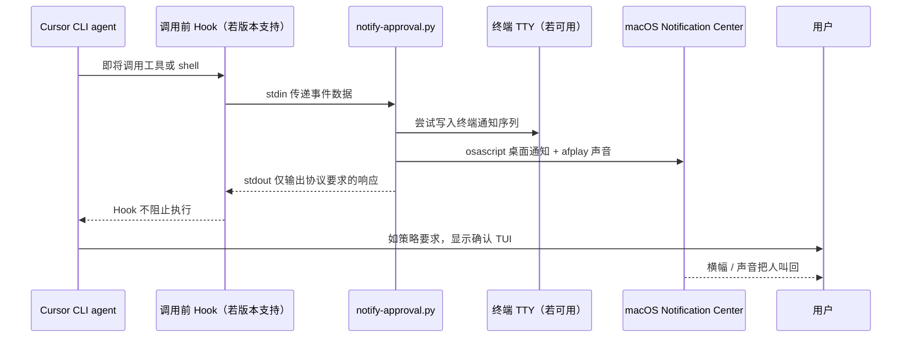

> “纸上得来终觉浅，绝知此事要躬行。” — 陆游《冬夜读书示子聿》


*不是替你批准工具调用，而是在代理卡住等你时，把沉默变成一个你听得见、看得见的信号。*

这篇文章给 macOS 上在 Warp 中运行 Cursor CLI（`agent`）的人，搭一个观察型 pager：当 MCP 工具或 shell 工具即将执行、**可能**出现人工确认门槛时，系统发出 macOS 通知和声音。**它不自动批准，不修改 MCP 权限，也不是 Warp 插件，更不是 Cursor IDE 的通知设置。**

首先相关的代码和工具都在 https://github.com/CloudsDocker/cursor-cli-pager, welcoemd to fork and star.

下午 3:20，阿明在 Warp 里启动了 `agent`，让它查一个数据服务的工具说明。几分钟后，他切去消息软件回了两句。另一边，小魏以为代理还在干活，开始处理别的任务。二十分钟过去，终端里那位代理一动不动。

它不是崩了。不是网络断了。更不是工具坏了。

它只是安静地停在：**Run this MCP tool?**

这类停顿最磨人。人以为机器在算，机器以为人在看。最后往往不是问题本身耗掉半天，而是双方都在礼貌地等待。

先说清楚：**谁都没做错。**阿明切走窗口是合理的；Cursor 在高风险工具前要求人工确认，也是合理的；Warp 没把所有 TUI 文本都当成密码提示来通知，同样合理。

真正有问题的是：三个系统各自尽责，却没有一个系统对“代理正在等人批准”这件事负责。


> 📌 **本节要点**：你要解决的不是“让代理少问一次”，而是“让人知道代理正在问”。权限与提醒是两件不同的事。

## 🎯 30 秒版本：三个平面，三种成本

Cursor CLI、MCP、Warp 和 macOS 看起来像一套东西，实际上是三套彼此独立的机制。

| 平面 | 它决定什么 | 对 MCP 确认 TUI 的作用 | 相对成本 / 风险 |
| --- | --- | --- | --- |
| MCP / allowlist 权限平面 | 工具是否需要确认、是否已获信任 | 直接影响确认界面会不会出现 | 安全成本最高：放行错了，影响是真实的 |
| Cursor Hook 平面 | 在工具或 shell 调用前运行什么脚本 | 若当前 CLI 版本支持相应事件，可用于观察、记录或按协议拒绝 | 运维成本中等：协议写错会干扰代理 |
| 终端与 macOS 通知平面 | 是否弹横幅、响铃、显示桌面通知 | 只负责叫你回来，不改变权限 | 风险最低：主要代价是噪声 |

**最容易犯的错误，是把最低风险的“提醒”问题，拿最高风险的“放行”手段去解决。**

Warp 自己有两类看起来相近的通知：

| Warp 功能 | 它主要观察什么 | Cursor CLI 的 MCP TUI |
| --- | --- | --- |
| 会话 / 命令通知 | 长命令、类似密码的输入提示 | 可能漏掉；该界面不是 stdin 上的 `Password:` |
| Agent 通知 | Warp Agent 及部分被明确集成的代理 | 是否覆盖 Cursor CLI，应以 Warp 当前支持列表为准 |

还有一个容易误判的细节：Warp 的横幅通常在 **Warp 位于后台** 时才有意义。你从一个 Warp 标签切到另一个 Warp 标签，Warp 对 macOS 来说仍然是前台应用。它不一定会像你想的那样提醒你。

Cursor IDE 里搜索 “notifications” 得到的设置，管的是桌面端 Agent Chat，不应直接推断它能控制 Warp 里的 CLI TUI。

所以，这个 pager 的服务目标很朴素：**当人工门槛可能出现时，尽快把人叫回来，但绝不替人跨过门槛。**

> 📌 **本节要点**：权限平面负责“能不能做”，通知平面负责“你知不知道”。不要为了消灭通知而扩大权限。

## 🧠 心智模型：机场安检、登机口和广播不是一个系统

把阿明那次卡住，想成一次登机。

- MCP allowlist 像安检规则：这件行李能不能直接过，还是必须人工复核。
- Cursor Hook 像登机口旁的工作人员：乘客快走到门口时，工作人员能看见、能记录；在产品明确支持的协议范围内，也可能拦下。
- Warp 与 macOS 通知像机场广播：它不决定你能不能登机，只负责告诉你“请回到登机口”。

三者都重要，但它们没有共用一本账。

```text
  ┌─────────────────────┐     ┌──────────────────────┐     ┌─────────────────────┐
  │ MCP / allowlist     │     │ Cursor hooks         │     │ Terminal + macOS    │
  │ 自动审查、权限      │     │ 本机 Hook 配置与脚本 │     │ Warp、通知、声音     │
  └──────────┬──────────┘     └──────────┬───────────┘     └──────────┬──────────┘
             │                           │                            │
             │ 显示或跳过确认界面         │ 启动脚本、传递事件数据       │ 横幅与声音
             ▼                           ▼                            ▼
       Run this MCP tool?          notify-approval.py            你的眼睛和耳朵
```

这里有个反直觉事实：即使某个 Hook 协议里存在类似下面的“继续”返回值，**也不能把它自动理解成 Cursor 会跳过 MCP 的人工确认。**

```json
{"permission": "allow"}
```

直觉上，`allow` 像一张通行证；现实里，它至多是在该 Hook 协议内表达“这个 Hook 不阻止本次执行”。MCP 确认 TUI 是否被跳过，属于客户端另一条权限路径，必须以你安装版本的 Cursor CLI 官方文档和实际行为为准，不能靠名称相同就推导权限穿透。

因此 pager 的设计规则是：**只观察，永远不代替决策。**脚本的成功返回只意味着提醒脚本不要成为拦路虎；真正显示出来的执行、会话信任或拒绝选项，仍应由你在已安装 CLI 的界面中审阅并选择。

同样，别把某个事件名当成跨版本契约。不同 Cursor CLI 版本可能暴露不同的 Hook 能力、事件字段和返回协议；不能假定存在一个精确等同于“确认提示已经显示”的事件。若你的版本提供“工具调用前”或“shell 执行前”的 Hook，它通常是最接近的观测点：工具未获信任时，确认界面可能在这一调用路径附近出现；回合结束事件则只是“也许结束了”，不是“正在等你按确认”。

Claude Code 等其他代理的事件模型也不同，有些提供更接近通知或权限请求的语义。因此，某些终端对另一种代理的请求提醒做得很好，并不能推出它们也能识别 Cursor CLI 的 MCP 确认。

> 📌 **本节要点**：把“谁决定权限”“谁观察行为”“谁通知人”拆开，很多玄学故障马上变成边界清晰的接口问题。尤其是版本敏感的 Hook，不要从一个字段名推导另一个权限系统的行为。

## 🏗️ 机制：Pager 究竟插在了哪里

本文使用的是一个**本机验证过的适配器模式**：在 Cursor CLI 当前安装版本明确支持的调用前 Hook 中，启动一个脚本。Cursor 的 Hook 配置格式、用户级文件位置、工作目录、事件名与 JSON 字段都是版本敏感接口；安装前请先核对 [Cursor 官方文档](https://docs.cursor.com/) 中与你所用 CLI 版本对应的 Hooks/CLI 页面。

不要把下面的路径和 JSON 当成对所有版本的通用承诺。它们是本地适配器的**示意形状**：如果你的官方文档确认用户级配置位于 `~/.cursor/`，并确认相应事件与命令字段，才按文档的实际 schema 合并配置。

```text
~/.cursor/hooks.json
~/.cursor/hooks/notify-approval.py
```

在这套本机配置中，用户级 Hook 的当前工作目录是 `~/.cursor/`。这件小事非常重要：配置里的相对路径应相对这个目录解释，而不是相对你的代码仓库解释。你的安装版本若另有规定，以官方文档为准。

整个调用链如下：



脚本做的事情只有五步：

1. 从 **stdin** 读取 CLI 传来的事件 JSON。
2. 从中提取服务名与工具名，拼一个短标题和短正文，例如 `data-catalog: describe_resource`。
3. 若存在可写 TTY，尝试向它写入终端特定的通知序列。
4. 在 macOS 上调用 `osascript` 显示通知，并用 `afplay` 播放系统声音；即使 Warp 仍是前台，声音也有机会把人拉回来。
5. 对 **stdout** 只输出当前 Hook 协议要求的那一份响应；如果本机文档确认响应为下例，才输出：

```json
{"permission": "allow"}
```

这里有个协议层的坑，值得单独说。

🩸 **血泪提醒**：stdout 不是日志文件，它是 Hook 协议。调试 `print()`、日志行，甚至 OSC 转义序列，一旦写到 stdout，都可能让 CLI 读不到合法 JSON。结果不是“少一条通知”，而是 Hook 报错、工具调用异常，甚至代理看起来莫名不能工作。日志写 stderr；终端控制序列写 TTY；stdout 留给协议。

调用前事件只是“即将调用”，不等于“确认弹窗已经显示”。已获信任的工具也可能触发这个事件，因此可能多响一次。这不是 bug，而是观测点比业务事件更早、更宽。

正确修法是按服务名或工具名在脚本里过滤；**不要**为了减少横幅，把敏感工具直接放进 allowlist。

关于 Warp：不要把某个 OSC 编号或控制序列视为稳定、跨版本的通知 API，除非 Warp 的当前官方文档明确这样写。Hook 是子进程，它的 stdout 通常通向 CLI 的管道，不是 Warp 正在渲染的 PTY；即便向 `/dev/tty` 写入序列，也只是一次尽力尝试。`osascript` 是这套方案在 macOS 上更直接的主通知路径。

> 📌 **本节要点**：Hook 是一个严格的进程协议，不是一段随手能打印日志的 shell 脚本。通知可以近似，权限不能近似。

## 🛠️ 5 步安装：在 macOS 上把沉默变成提醒

配套代码应放在一个公开、可审查的仓库中，建议项目名为 `cursor-cli-pager`，并采用 MIT 许可证。不要把任何内部路径、数据源名称或业务对象写进脚本和通知正文。

### 第 1 步：确认前提条件

需要：macOS、Cursor CLI、Python 3；Warp 是推荐终端，但不是唯一选择。Terminal 或 iTerm 中，macOS 通知仍可工作。

安装 Cursor CLI 后，可用以下命令确认：

```bash
which agent
agent --version
python3 --version
```

Cursor CLI 的安装、Hook 能力和配置格式，请以 [Cursor 官方文档](https://docs.cursor.com/) 为准。不要把未审计的安装命令从陌生网页直接复制进终端。

### 第 2 步：先让 macOS 愿意提醒你

在 **系统设置 → 通知** 中，为实际发送通知的应用或脚本宿主开启横幅或提醒，并开启声音。第一次测试时，macOS 可能要求允许 Script Editor，或将通知归属到 `osascript` 相关进程；应按实际弹窗授权。

验证期间，先关闭 Focus / 勿扰模式。否则你会调试半小时脚本，最后发现是系统礼貌地把所有提醒静音了。

Warp 侧也可以检查其当前 Settings 中的桌面通知、长命令和输入提示通知选项。若要验证 Warp 自己的横幅，测试时切到另一个应用，让 Warp 处于后台。

这些设置对 `sleep 30` 一类场景仍有价值，但对 **Run this MCP tool?** 不应当作可靠保障。

### 第 3 步：取得并安装文件

把项目克隆到任意工作目录，或进入包含 `install.sh`、`LICENSE` 与 `hooks/` 的目录。使用与你的仓库托管方式相匹配、且不暴露凭据的地址。例如：

```bash
cd ~/projects
# 使用你自己的公开仓库地址，不要在文章、日志或 shell history 中暴露凭据
git clone <YOUR_REPOSITORY_URL> cursor-cli-pager
cd cursor-cli-pager
```

安装：

```bash
chmod +x install.sh hooks/notify-approval.py
./install.sh
```

安装器应将脚本复制到官方文档为你当前版本指定的 Hook 目录，并将两个调用前事件**合并**进已有配置，而不是清空原有 Hook。若你的版本确认了本文所示位置，再检查：

```bash
cat ~/.cursor/hooks.json
ls -l ~/.cursor/hooks/notify-approval.py
```

下面只展示“可能的配置形状”，**不是未经版本核验就能直接复制的官方 schema**。请将事件名、`command` 字段、响应格式和相对路径替换为 Cursor 当前官方文档确认的写法：

```json
{
  "version": 1,
  "hooks": {
    "<BEFORE_MCP_EVENT_SUPPORTED_BY_YOUR_CLI>": [
      { "command": "./hooks/notify-approval.py" }
    ],
    "<BEFORE_SHELL_EVENT_SUPPORTED_BY_YOUR_CLI>": [
      { "command": "./hooks/notify-approval.py" }
    ]
  }
}
```

若已有其他 Hook，它们应继续保留。一个稳妥的安装器只在缺少完全相同命令项时追加该项。

如果不想运行安装脚本，可以手动安装：

```bash
mkdir -p ~/.cursor/hooks
cp hooks/notify-approval.py ~/.cursor/hooks/notify-approval.py
chmod +x ~/.cursor/hooks/notify-approval.py
```

然后依据当前官方 schema，手工编辑对应的 Hook 配置文件，将两个调用前事件合并进去。

### 第 4 步：彻底重启 Cursor CLI

退出 `agent`，不是只回到一个新的输入提示符，而是结束当前 CLI 进程；然后在 Warp 中重新启动它。

有些 CLI 会在保存 Hook 配置后重新加载，但重启才是可重复、可解释的验证路径。

### 第 5 步：先干跑，再跑真实 TUI

无需 MCP 服务，也可以先验证脚本的输入输出边界。下面 payload 是脚本开发用的**自定义测试夹具**，字段名应与你当前 CLI 文档实际传入的 payload 对齐：

```bash
python3 ~/.cursor/hooks/notify-approval.py <<'EOF'
{"hook_event_name":"beforeMCPExecution","mcp_server_name":"data-catalog","tool_name":"describe_resource"}
EOF
```

通过标准：

- stdout 最后一行严格等于你的已验证 Hook 协议所要求的 JSON；
- 系统声音播放；
- Notification Center 出现类似“Cursor MCP approval / data-catalog: describe_resource”的通知。

如果 stdout 混进了控制字符，说明脚本把终端输出写错了流。替换为将终端控制序列写到 TTY 或 stderr、stdout 只保留 Hook JSON 的版本。

然后回到阿明的真实场景：

1. 在 Warp 运行 `agent`。
2. 请求一项需要未获会话信任的 MCP 工具的工作。
3. 如果还想验证 Warp 横幅，在确认界面出现前切去浏览器或消息软件。
4. 当 Warp 出现 **Run this MCP tool?** 时，macOS 应已发出提醒。
5. 回到 Warp 后，审一眼工具名，并选择你安装版本实际显示的执行、会话信任或拒绝选项。不要根据网上流传的快捷键表操作；键位和文案可能随版本、终端和 UI 改动。

这就是小魏最后做的事：听到声音，回来审一眼工具名，再按下决定。Pager 没替任何人批准调用；它只把等待时间从“碰巧想起来看终端”变成“收到信号就回来”。

如果项目带测试，可运行：

```bash
python3 -m unittest discover -s tests -v
```

测试至少应断言：子进程 stdout 是可解析的 Hook JSON。

> 📌 **本节要点**：安装顺序不是仪式感。先验证系统通知，再验证 Hook 协议，最后验证真实 TUI，能把故障范围一层层缩小。

## 💡 隐私边界：通知里到底该放什么

一个典型的**测试 payload** 可以长这样：

```json
{
  "hook_event_name": "beforeMCPExecution",
  "mcp_server_name": "data-catalog",
  "tool_name": "describe_resource",
  "tool_input": "{\"resource\":\"example_record\"}"
}
```

不同版本或不同事件的 shell payload 可能使用 `command` 与 `cwd`，而不是 MCP 字段；以官方 schema 为准。

通知正文只放“服务名 + 工具名”，不要放 `tool_input`。这不是洁癖，是边界控制。

通知可能出现在锁屏、手表、屏幕共享和通知中心历史里。把资源名、SQL、业务对象、令牌或上下文塞进横幅，相当于把原本只在终端里可见的信息，复制到更多不可控的表面。

MCP 可以理解成客户端能够调用的一组工具；真正决定每次调用是否需要人工批准的，是客户端的策略。Pager 不实现 MCP，它只搭在 CLI 已支持的“调用前”观测点上。

> 📌 **本节要点**：提醒的内容应该足够让你判断“要不要回来”，却不应多到让通知本身成为数据泄露面。

## 🧭 代价与边界：这不是一个万能通知器

先把局限说在前面。

- **会有误报。**调用前 Hook 表示“即将调用”，不是“确认框已显示”。已获信任的工具也可能响。工具很多时，需要做服务或工具级过滤。
- **终端控制序列不是主保障。**Hook 是子进程，它的 stdout 通常是通向 CLI 的管道，不是 Warp 正在渲染的 PTY。向 `/dev/tty` 写终端通知序列只是尝试触达同一 PTY；若 Hook 环境没有 TTY，Warp 横幅不会出现。`osascript` 才是 macOS 上更直接的主路径。
- **声音也不是绝对可靠。**Focus、系统音量、通知权限和前台应用策略都会影响效果。`afplay` 能补足“Warp 前台时横幅不明显”的场景，但不能绕过系统级静音意图。
- **它只覆盖本机。**用户级 Hook 是本机配置。远程环境、云端代理不会看到你笔记本上的该目录。项目级配置的工作目录和作用域也可能不同；某些云端代理即使读取项目配置，也不等于它能访问你本机通知能力。
- **它不适合想要自动批准的人。**若需求是无人值守执行，应该单独设计最小权限、隔离环境、审计与 allowlist 策略。拿 pager 去承担自动化授权，是职责错位。

回合结束 Hook 也不该当作主信号。它可能代表任务完成、出现错误、被你中断；而代理卡在 **Run this MCP tool?** 时，回合未必已经结束。只安装“任务结束”通知，可能恰好会错过最让人着急的那次停顿。

若你使用的是其他代理，选择也应不同：

| 你的场景 | 更合适的选择 |
| --- | --- |
| 在 Warp 中运行已有原生通知集成的代理 | 优先使用 Warp 的对应通知集成 |
| 想统一获得多种 CLI 的“代理完成”提醒 | 选择专门的多 CLI 完成通知工具 |
| 只想在回合结束时响一声，MCP 确认不是重点 | 选择 turn-end 提醒工具 |
| 想要付费菜单栏、点击聚焦等体验 | 评估独立桌面通知产品的隐私与权限边界 |
| Cursor CLI 在 Warp 中常卡在 MCP / shell 的人工确认 | 使用本文这种 before-call pager |

> 📌 **本节要点**：这套方案买到的是“注意力延迟更低”，代价是少量误报和一个本机维护点。它不承诺精确识别弹窗，更不承诺替你做安全决定。

## 🛠️ 排障手册：症状、原因与命令

| 症状 | 最可能的原因 | 先做什么 |
| --- | --- | --- |
| 卡住、没横幅、没声音 | Hook 未加载、路径错误、Focus 开启、`osascript` 未授权 | 核对当前官方 schema；重启 `agent`；检查系统通知与 Focus |
| 有声音、无横幅 | 通知归属在 Script Editor 或相关进程；横幅关闭；Focus 拦截 | 到系统设置检查对应通知来源与横幅样式 |
| 每次 MCP 调用都响 | 工具已获信任；事件含义是“将调用”而非“确认已显示” | 在脚本中按服务名 / 工具名过滤 |
| 代理无法调用工具或 Hook 报错 | stdout 多了内容、脚本返回了拒绝性结果或非零退出码、schema 不匹配 | 执行干跑，确认 stdout 只有协议 JSON，检查退出码与官方 schema |
| Warp 从不弹、macOS 通知正常 | 终端序列没有打到 PTY，或 Hook 没有 TTY | 将 macOS 通知视为主路径；这属于预期降级 |
| 同一次出现多个提醒 | 同时运行了其他 CLI 通知器 | 逐一停用重复通知工具后复测 |
| Hook 日志出现 `command not found` | 把命令指向了仅存在于克隆目录的路径 | 使用已安装位置的绝对或文档规定相对路径，并确认脚本存在 |

一次 macOS 更新后的快速复测：

```bash
python3 ~/.cursor/hooks/notify-approval.py <<< '{"hook_event_name":"beforeMCPExecution","mcp_server_name":"demo","tool_name":"ping"}'
```

如果要卸载：先从当前 Hook 配置中删除指向 `notify-approval.py` 的事件条目，再删除脚本：

```bash
rm -f ~/.cursor/hooks/notify-approval.py
```

最后重启 `agent`。

还有三件事，别做：

1. 不要把抓取 Warp 画面中 `Run this MCP tool?` 字符串，当作主设计。它脆弱，也会把终端内容暴露给额外的屏幕抓取链路。
2. 不要凭空返回某个未被当前 Hook 文档定义的 `ask` 值，然后期待它驱动 MCP 确认。
3. 不要为了消灭提醒，给敏感数据工具开 allowlist。提醒问题应该用提醒解决；权限问题应该用权限治理解决。

🩸 **血泪提醒**：不要把“描述资源”之类看上去无害的工具一概放行。工具名温和，不代表输入、返回内容或它所处的权限边界温和。只有那些你愿意在清醒状态下、不看上下文也批准的工具，才值得考虑进入 allowlist。

> 📌 **本节要点**：排障时先确认协议，再确认系统通知，最后讨论终端能力。不要一上来就怀疑 Warp，也不要靠扩大权限掩盖可观测性缺口。

## 🧭 从一个 Pager，推到三条可迁移的规律

### 1. **代价必须写在界面上**

阿明离开终端不是不负责，而是界面没有把“现在需要你”的代价展示出来。人的注意力是稀缺资源；当等待成本对发起者不可见，任务就会自然滑出视野。

在系统设计里，这叫**成本可见性**。如果一个操作的等待、风险、回滚代价都藏在后台，用户不会主动为它预留注意力。Pager 的价值不在于发声，而在于把“代理正在等人”这个隐藏状态外显出来。

非技术领域也一样。医院把检验结果标成“需复核”，不是因为医生不会看数字，而是因为异常结果不能和普通队列混在一起。银行把异常交易推送到客户面前，也不是替客户决定拒付，而是把原本不可见的决策成本摆到界面上。

> 举一反三：你手上的流程里，哪一种等待最贵，却没有任何人能一眼看见它正在发生？

### 2. **共享可变状态，迟早需要一个守门人**

MCP allowlist、Hook 返回值、终端通知都在影响同一段用户体验，但它们不是同一份状态。以为 Hook 的“继续”结果能替代 MCP 批准，就是把三个边界不同的系统误当成一个共享变量。

这正是**共享可变状态**的经典麻烦：多个参与者都“有意见”，却没有明确谁拥有最终解释权。客户端策略平面拥有批准权；Hook 拥有产品定义范围内的前置观察能力；通知系统拥有提醒权。把所有权写清楚，系统才不靠猜。

家庭里，冰箱门上那张采购清单也是同一回事。每个人都能加东西，但如果没有人负责最终下单、没有规则区分“想吃”和“必须买”，清单越长，误解越多。城市路口的红绿灯也不是建议，它明确规定哪一套信号拥有通行权。

> 举一反三：当两个组件都声称“我已经允许了”，先问一句：它们允许的，究竟是不是同一个动作？

### 3. **观察可以近似，授权必须精确**

调用前 Hook 会产生额外提醒，因为它观察到的是“即将调用”，不是“确认框已出现”。这是一个可接受的近似：多响一次，代价是注意力；漏掉一次，则是延迟。

但 allowlist 不是近似问题。一次错误放行，代价可能是不可逆的数据访问或操作。因此这里必须坚持一条工程分界：**用宽松信号做提醒，用严格策略做授权。**

医学分诊可以先用敏感但不完美的筛查指标，把需要复核的人送去进一步检查；它不该直接替代最终诊断。航空领域的告警可以宁可多提醒飞行员检查，也不能把“疑似正常”直接当成放行许可。

> 举一反三：你现在为了减少误报，是否正在偷偷把一个“提醒规则”升级成“自动执行规则”？

> 📌 **本节要点**：好系统不是消灭所有摩擦，而是把不同性质的摩擦交给正确的层处理：可见性处理等待，权限处理风险。

## 🎯 今天就能执行的清单

1. 打开 [Cursor 官方文档](https://docs.cursor.com/)，核对你当前 CLI 版本是否支持 Hooks，以及配置文件位置、事件名、payload 和响应 schema。把这一步当成安装的一部分，不要靠旧帖猜配置。

2. 运行一次干跑命令，验证脚本 stdout 仍然是合法 JSON；若你的实际 Hook schema 不同，请将测试夹具改成官方文档定义的字段：

   ```bash
   python3 ~/.cursor/hooks/notify-approval.py <<< '{"hook_event_name":"beforeMCPExecution","mcp_server_name":"demo","tool_name":"ping"}'
   ```

3. 检查当前 Hook 配置中是否包含你所用版本支持的 MCP 与 shell 调用前事件，且脚本路径能从配置工作目录正确解析。

4. 在系统设置中检查通知横幅、声音与 Focus；不要只在 Warp 设置里找答案。

5. 选一个**未 allowlist 且无敏感副作用**的测试工具，做一次真实确认流程；确认你听得到通知，也确认 pager 没有替你批准。

6. 在下一次站会或协作讨论里问一个非技术问题：**“我们的流程里，谁在等谁？等待的人能不能被可靠地叫回来？”**

阿明后来没有再靠“记得回去看一眼终端”维持流程。那不是纪律问题，是接口问题。提醒装好后，确认仍由人按下；但那段共享状态终于有了声音。

**任何需要人介入的自动化，第一件该自动化的事，不是替人决定，而是让人及时知道轮到自己决定。**
