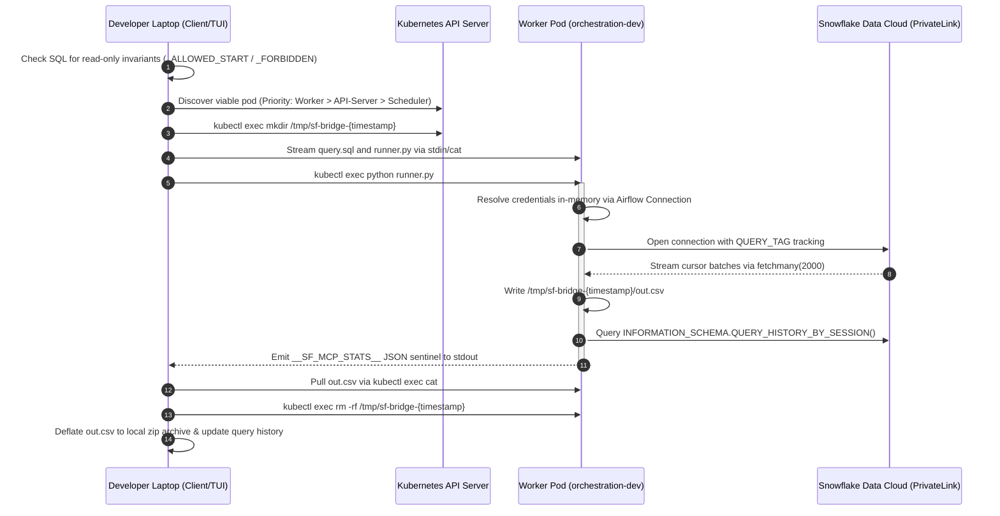

> "Try to be a rainbow in someone's cloud." — Maya Angelou

# Beyond pod orchestration: building the unified query bridge with K8s

*How to safely run analytical discovery across VPC boundaries without granting local credentials, punching firewall holes, or crashing your orchestrator.*

### 🎯 The 2:15 PM Standoff

On a rainy Tuesday at 2:15 PM, Elena dropped an angry ping into our platform engineering channel. She was building an exploratory retrieval service for our internal data lakehouse, and she needed to inspect the schema of our operational records schema in Snowflake (`MYDB.CORE_RECORDS.*`). Her local prototyping had ground to a complete halt.

"Infosec rejected my database credential request again," she wrote. "They told me to file a ticket for a static CSV dump or request a corporate jump host with a three-week approval turnaround. I just need to verify three column types and test a 10-row query. How am I supposed to ship this sprint?"

Marcus, our platform security lead, answered immediately: "Our Snowflake warehouse sits on an AWS PrivateLink connection with no public ingress. Corporate policy strictly forbids dumping production credentials into developer `~/.zshrc` files or MacBook keychains. If a laptop gets stolen or an agent script logs environment variables, we fail our SOC 2 audit by nightfall. The ticket stays closed."

Priya, the on-call data engineering lead, watched the channel heat up. Her team was fielding three similar escalations. Engineers needed fast analytical discovery; security needed verifiable isolation.

Nobody was wrong.

Elena was doing her job: trying to understand data schemas without waiting half a month for bureaucratically blessed exports. Marcus was doing his job: maintaining zero-trust credential hygiene across VPC boundaries. The failure was not human malice; it was an impedance mismatch between network isolation and developer feedback loops.

Instead of fighting either side, we looked at what was already running. Inside our Kubernetes cluster sat an Airflow deployment. Those pods already had AWS PrivateLink routing, already held the necessary database credentials safely inside orchestration secrets, and already possessed authorized access. We did not need to issue new credentials or punch holes in the VPC firewall. We needed an ephemeral query bridge.

---

### ⚖️ The 30-Second Version

Before diving into mechanics, here is how the architectural choices stack up when bridging isolated analytical warehouses to local developer tools:

| Dimension | Direct Client VPN + DB Passwords | Dedicated Proxy Microservice (gRPC/HTTP) | Ephemeral Pod Bridge (`kubectl` Driver) |
| :--- | :--- | :--- | :--- |
| **Credential Exposure** | High (plaintext/env vars on developer laptops) | Low (held in proxy memory) | **Zero** (held solely in Pod memory / K8s secrets) |
| **Network Ingress Cost** | High (VPC peering, NAT gateways, IP whitelists) | Medium (internal load balancers, mTLS certs) | **Zero** (reuses existing Kubernetes API server tunnel) |
| **Maintenance Surface** | High (managing local drivers, OS credentials) | High (deploying, patching, monitoring an extra service) | **Minimal** (single client CLI + template runner script) |
| **Blast Radius** | Severe (compromised laptop exposes entire DB role) | Medium (compromised proxy exposes all active sessions) | **Contained** (stateless execution scoped to read-only pod tokens) |
| **Transfer Bottleneck** | Local NIC / ISP routing | Proxy egress bandwidth | K8s API server WebSocket buffer (bounded by row caps) |

> 📌 **Takeaway:** When crossing strict network perimeters, do not move the credentials to the developer. Move the query payload into an already-authenticated container, run it statelessly, and stream back the compressed result over an existing administrative transport.

---

### 🧠 The Mental Model: The Consular Pouch

In international diplomacy, sovereign embassies maintain secure communication through diplomatic pouches. A domestic ministry clerk in the home country does not receive clearance to walk into a foreign palace. Instead, the clerk drafts a formal query, seals it into an official courier pouch, and hands it to a certified consular officer who already holds standing clearance within that foreign capital.

The consular officer opens the pouch, presents the query to the local authorities, receives the certified response, and sends back a sealed transcription. At no point does the domestic clerk receive diplomatic immunity, and at no point does the foreign capital open its gates to unverified visitors.

Our Airflow pods in the staging cluster (`<staging-cluster>`, namespace `orchestration-dev`) are that consular post:

1. **The Home Clerk:** Elena’s local workstation runs a lightweight TUI or FastMCP agent. It holds zero database tokens and has no route to the PrivateLink interface.
2. **The Diplomatic Pouch:** Her query is validated locally for read-only safety, packaged into an isolated file (`query.sql`), and transferred alongside an execution wrapper (`runner.py`) into the container via the Kubernetes control plane.
3. **The Consular Official:** The pod uses its native Airflow connection (`Connection.get_connection_from_secrets`) to decrypt the database credentials strictly in memory, executes the query against Snowflake, captures session telemetry, and serializes the records to an ephemeral CSV.
4. **The Return Dispatch:** The compressed output is pulled back down to Elena’s laptop, and the remote scratchpad is wiped clean immediately.

> 📌 **Takeaway:** Infrastructure orchestration tools are not just for batch jobs; they are authorized enclaves. Treating an orchestration pod as an ephemeral bastion allows you to leverage existing network authorization without maintaining fragile jump boxes.

---

### 🏗️ The Mechanism: Where the Bytes Touch

The entire transaction completes without opening external ports or persisting credentials to disk. Here is the operational topology:



#### Pod Selection: Protecting the Control Plane
One subtle design detail lives in the routing logic. If you blindly inject ad-hoc Python processes into any available pod, you will eventually select the Airflow Scheduler. A scheduler pod running heavy CSV serialization under high memory pressure will eventually get `OOMKilled`, terminating the heartbeat loop and stalling production pipelines for the entire company.

The bridge implements strict container triage:
1. **Worker Pods First:** Non-critical execution nodes designed to handle transient compute load.
2. **API Server Deployments Second:** Resilient, horizontally scaled stateless endpoints.
3. **Scheduler Pods as Absolute Fallback:** Used only if the cluster is scaled to absolute minimums during maintenance.

```python
def find_viable_pod(client) -> str:
    pods = client.list_namespaced_pod(namespace="orchestration-dev").items
    workers = [p.metadata.name for p in pods if p.metadata.labels.get("component") == "worker"]
    if workers:
        return workers[0]
    
    api_servers = [p.metadata.name for p in pods if "api-server" in p.metadata.name]
    if api_servers:
        return api_servers[0]
        
    schedulers = [p.metadata.name for p in pods if "scheduler" in p.metadata.name]
    if schedulers:
        return schedulers[0]
        
    raise RuntimeError("No execution pods available in namespace orchestration-dev")
```

#### The In-Pod Runner: Zero-Leak Data Pipeline
The remote runner script (`_REMOTE_RUNNER`) runs inside the pod's pre-configured Python environment. It handles three critical invariants:
1. **Chunked Memory Boundaries:** Records are fetched in batches of 2,000 (`cur.fetchmany(2000)`). The script writes directly to `/tmp/.../out.csv` on the container's scratch volume, keeping the Python resident set size (RSS) under 60MB even when processing hundreds of thousands of rows.
2. **Type-Safe Serialization:** Instead of dumping raw string casts, decimals are explicitly formatted via `format(val, 'f')` to avoid floating-point loss, while dates and timestamps adhere strictly to ISO 8601.
3. **Session Auditability:** Before closing the cursor, the runner inspects `INFORMATION_SCHEMA.QUERY_HISTORY_BY_SESSION()`, pairing the remote Snowflake `query_id`, scanned bytes, and compilation time with a machine-readable sentinel block (`__SF_MCP_STATS__`) on standard output.

> 📌 **Takeaway:** Triage ad-hoc execution to worker pods to protect scheduler stability, stream cursor results in bounded chunks, and separate bulk file output from telemetry sentinels.

---

### 🛠️ The Fix: Safety Without Red Tape

When Elena deployed the client script, her first query landed in 1.4 seconds. Marcus reviewed the audit log: the Snowflake query had run under the authenticated service account, tagged with `QUERY_TAG = 'adhoc-developer-bridge'`, fully visible in security metrics, and leaving behind zero local credentials.

However, building this bridge required solving two operational traps that cost us hours during prototyping.

#### Why Files Beat Shell Strings
Our initial prototype passed the SQL statement as a command-line argument: `python -c "import runner; runner.run('$SQL')"`. This failed almost immediately:
- Shell interpolation mangles quotes, newlines, and nested subqueries.
- A complex analytical query with multiple CTEs can easily exceed the Linux `ARG_MAX` limit (typically a few megabytes, but significantly smaller when wrapped through shell layers), resulting in `Argument list too long` errors.
- Shell string interpolation opens dangerous command injection vectors.

Writing `query.sql` to a temporary directory on the pod using `cat > remote_path` via standard input sidesteps the OS argument limits and shell interpretation entirely.

🩸 **Hard-won warning:** Never stream raw query results directly back over standard output if you are executing via `subprocess.run(capture_output=True)` locally. The operating system pipe buffer is bounded (typically 64KB on Linux). If the remote runner fills stdout while your local Python process waits for the command to finish, both processes deadlock permanently. Always write the bulk dataset to a file on the container filesystem first, and use stdout exclusively for small status sentinels.

```python
# Safe file streaming pattern across kubectl boundary
def _push_file(pod: str, namespace: str, local_path: str, remote_path: str):
    with open(local_path, "rb") as f:
        content = f.read()
    # Pipe bytes directly into remote cat without shell evaluation
    proc = subprocess.Popen(
        ["kubectl", "exec", "-i", pod, "-n", namespace, "--", "sh", "-c", f"cat > {remote_path}"],
        stdin=subprocess.PIPE,
        stdout=subprocess.PIPE,
        stderr=subprocess.PIPE,
    )
    stdout, stderr = proc.communicate(input=content)
    if proc.returncode != 0:
        raise RuntimeError(f"Failed to write file to pod: {stderr.decode()}")
```

> 📌 **Takeaway:** Pipe SQL payloads and runner scripts into remote scratch files via standard input rather than shell arguments to prevent shell injection, argument length limits, and OS pipe buffer deadlocks.

---

### ⚖️ Honest Tradeoffs and Limits

This pattern is an engineering compromise, not a universal silver bullet. You should understand where it begins to fray:

1. **Control Plane Tax:** Every byte transferred over `kubectl exec` passes through the Kubernetes API Server's WebSocket proxy. Pulling 500MB CSV files across this bridge puts unnecessary serialization load on your control plane nodes. If your developers need gigabyte-scale extraction, you should export from the database directly to an S3 bucket with short-lived presigned URLs.
2. **Concurrency Ceilings:** If 30 developers trigger concurrent ad-hoc queries, they will spin up 30 simultaneous Python execution processes on your Kubernetes worker nodes. This tool is built for development, schema introspection, and ad-hoc debugging—not as a backend for production microservices.
3. **Client-Side Parsing Limits:** The local client regex checks (`_FORBIDDEN` and `_ALLOWED_START`) are safety seatbelts against accidental `DROP` or `UPDATE` commands; they are not an impregnable security boundary. True isolation relies on the database user's RBAC having strictly read-only permissions (`SELECT`, `SHOW`, `DESCRIBE`).

> 📌 **Takeaway:** The ephemeral pod bridge is optimized for schema inspection and ad-hoc diagnostics; high-throughput data extraction should bypass the K8s API server in favor of direct object store exports.

---

### 🧯 The Debugging Playbook

| Symptom | Probable Mechanism | Diagnostic & Remediation Command |
| :--- | :--- | :--- |
| `RuntimeError: kubectl context check failed` | Kubeconfig expired, VPN disconnected, or cluster unreachable. | Run `kubectl get ns orchestration-dev` to verify API connectivity and refresh your SSO session token. |
| Deadlock / Command hangs indefinitely on large queries | Process stdout buffer filled, blocking child process execution. | Ensure `runner.py` redirects data output to `/tmp/.../out.csv` and only emits JSON status metadata on stdout. |
| `ValueError: Only a single SQL statement is allowed` | Client-side injection check caught a semicolon delimiter. | Remove trailing semicolons or split multiple statements into separate tool invocations. |
| Query completes but returns truncated row counts | Row limit ceiling (`SF_MAX_ROWS`) was triggered. | Check query output for `stats.truncated == True`. Append a narrower `WHERE` clause or explicit `LIMIT` to your SQL. |
| `No execution pods available` | Target namespace is scaled to zero or labels do not match selector. | Inspect pod availability: `kubectl get pods -n orchestration-dev -l component=worker`. |

---

### 🧭 Engineering Principles

#### 1. Move Computation to the Perimeter, Not Perimeters to Computation
*Mechanism:* The friction in secure environments almost always comes from trying to move secured assets (credentials, private network endpoints) toward untrusted, general-purpose machines (laptops). By packaging the query and executing it inside an already-verified perimeter, the trust boundary remains untouched.

*Non-technical parallel:* In high-security biological research, scientists do not bring dangerous pathogen samples to their desks to inspect them. They reach their hands into sealed glove boxes. The hands and the samples exist in different atmospheric pressures, separated by impermeable barriers, while the work proceeds unimpeded.

> Generalize: Whenever you feel the urge to request a new firewall exemption or static credentials, ask: *What verified compute engine is already sitting inside that network zone, and can I hand it a sealed task instead?*

#### 2. Respect the Control Plane Separation
*Mechanism:* Kubernetes distinguishes between the control plane (the API Server, etcd, scheduler) and the data plane (the network routes, service meshes, and application storage). Using administrative channels like `kubectl exec` to bridge data is a brilliant bootstrap, but mixing data-plane volume into control-plane pipes creates silent systemic fragility.

*Non-technical parallel:* A city's emergency telephone dispatch system (911) exists to coordinate police, fire, and medical teams. If citizens began using the 911 dispatch lines to order groceries because the phone connection happened to be ultra-reliable, the emergency infrastructure would collapse under routine civic traffic.

> Generalize: When leveraging administrative backdoors for engineering velocity, enforce strict output ceilings (`MAX_ROWS`) early to prevent accidental denial-of-service on management systems.

#### 3. Ephemeral Scratchpads Over Persistent Dumps
*Mechanism:* Long-lived state on shared infrastructure degrades silently. Nodes run out of disk space, old query results leak sensitive data to subsequent users, and orphaned lock files cause transient failures. Enforcing strict, deterministic timestamp-based directories and wiping them in `finally` blocks guarantees self-healing operations.

*Non-technical parallel:* In professional culinary kitchens, the rule of *mise en place* demands that a prep station is wiped completely clear between courses. A chef does not leave diced shallots on a cutting board while preparing a dessert; the cutting board is sanitized immediately so cross-contamination is physically impossible.

> Generalize: If your automation creates an artifact on a shared host, the code that cleans it up must run with the same priority as the code that created it.

---

By Friday afternoon, the impact had rippled across the platform. Elena validated her schema, tuned her retrieval queries, and shipped her feature within the sprint. Priya closed out the other three blocking escalations on her board without granting a single static credential or exposing a PrivateLink endpoint. Marcus added the bridge pattern to the company's approved operational architectures list, and zero security exemption tickets were filed for analytical discovery for the rest of the quarter.

---

### 📋 Action Items for Today

1. **Audit Your Pod Routing (Technical):** Check your orchestration namespace. Verify that your interactive scripts or debugging tools target worker nodes rather than core schedulers or etcd hosts:
   ```bash
   kubectl get pods -n <your-orchestration-ns> -o wide --show-labels
   ```
2. **Check Your Buffer Plumbing (Technical):** Review your local `subprocess` calls in developer tooling. Ensure any command producing more than a few kilobytes of output redirects to a file rather than buffering to standard output.
3. **Host an Alignment Coffee (Non-Technical):** Schedule a 15-minute sync with your platform security partner. Walk them through your data discovery challenges, and show them how ephemeral pod bridging keeps production credentials completely off local machines. You will be amazed at how quickly security approvals move when you eliminate credential distribution entirely.

---

*The best architectural solutions do not punch holes through walls; they build structured windows through the ones already standing.*
