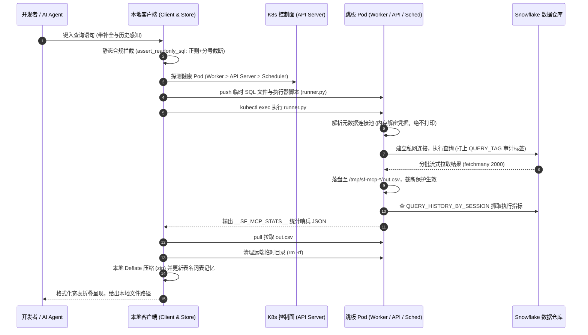
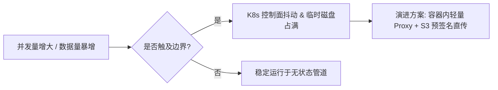

> "试着成为别人乌云里的一道彩虹。" — 玛雅·安吉罗 (Maya Angelou)

# 从 Pod 编排到数据互联：基于 K8s 与 Snowflake 打造下一代异构查询桥梁实践

*一次跨越私网隔离与合规红线的技术妥协，如何反向演进为全员标配的研发利器？*

## 🎯 周一上午 10:15 的跨部门交火

周一上午 10:15，研发大群里的消息提示音就没停过。

刚入职两周的数据工程师林浩在 Slack 频道里连发了三张终端报错截图，艾特了基础设施团队的资深 SRE 周伟："周工，我在本地搭 AI Agent 探查数据，为什么 Snowflake 的连接又超时了？能不能给我的 MacBook 分配一个私有子网的直连专线？或者把预发环境的数据库账密直接发我一份？两个小时后的排错汇报急用。"

周伟看到消息时，手里的咖啡差点洒在键盘上。他在终端前敲得噼啪作响："不可能。数据库部署在云厂商的专用托管私有连接（PrivateLink）内，公网端口一律封闭。想要本地直连，必须走为期两周的跨部门合规与安全审批，而且生产和预发环境密码全部注入在 Kubernetes Secret 和工作流引擎中，任何人不得持有明文。这是安全红线，谁开豁免谁担责。"

林浩觉得委屈：业务要排查数据异常，AI Agent 要做表结构感知与智能分析，巧妇难为无米之炊，拿不到数据通道怎么干活？周伟同样有理：一旦给每个开发者的个人笔记本开通数据库专线并分发密码，只要有一台电脑遗失或凭据泄漏，企业级核心数据的底裤就会被瞬间扒光。

**没人故意刁难，也没人偷懒耍滑，每个人都在坚守自己的职责底线。**

真正的矛盾，是本地交互式探索（灵活、快速、低门槛）与企业安全架构（网络隔离、最小特权、凭据封印）之间的天然深沟。为了跨越这条沟，团队里衍生出了一套让新手第一眼看过去直呼"野路子"、细看却拍案叫绝的架构：通过 Kubernetes 控制平面的 `kubectl exec` 管道，将动态生成的执行器推入现成的跳板 Pod，在受限的远端容器内无痕借力，再将安全脱敏的数据流无缝拉回本地。

> 📌 **本节要点**：安全合规的本质是收敛凭据与网络暴露面；当物理网络阻断且凭据隔离时，利用集群内既有的受信工作负载作为跳板，是破局的核心切入点。

---

## 🧠 30 秒速览：四种数据打通方案的代价对比

在做出选择前，我们必须清点桌上的所有筹码。面对本地环境与隔离数据库之间的数据探测需求，业界通常有以下四条路径：

| 方案维度 | 专线直连 + 本地发号 | 临时部署 HTTP 代理网关 | 容器跳板管道（本文方案） | 离线 ETL 镜像脱敏库 |
| :--- | :--- | :--- | :--- | :--- |
| **网络拓扑要求** | 需开通 VPN/专线打通 VPC | 需在集群入口暴露 Ingress/NLB | **零网络改动**，复用既有 Kubeconfig | 需搭建额外的数据同步链路 |
| **凭据安全性** | 极低（密码落地开发者机器） | 中等（网关统一鉴权） | **极高**（借用 Pod 内受控 Secret，内存解密） | 高（数据已脱敏脱密） |
| **运维与基础设施成本** | 高昂的专线与网络维护成本 | 需维护独立微服务、证书与鉴权 | **零额外服务**，依赖无状态瞬时执行 | 高昂的存储冗余与管道维护成本 |
| **数据时效性** | 实时 | 实时 | **实时** | T+1 或小时级延迟 |
| **AI Agent 友好度** | 中等（需本地繁琐配置环境） | 高（标准化 API） | **极高**（集成轻量 MCP 标准协议） | 低（无法获取实时排错状态） |

> 📌 **本节要点**：没有完美无瑕的架构，只有契合约束的取舍。利用已获审计授权的 K8s 跳板 Pod，以无状态管道替代常驻服务，是用最小系统开销撬动最大合规收益的经典权衡。

---

## 💡 心智模型：萧何入咸阳与特派员密码箱

当年汉高祖刘邦的大军打进咸阳，众将领忙着争抢金银财宝，萧何做的第一件事却是直奔丞相府，把秦朝的律令、图书、户籍底账全部封存收集。楚汉相争数年，刘邦对天下险关、户口多寡、粮草虚实了如指掌，全仰仗萧何手中的这套底账。

在大型企业的数据中台里，数据仓库就是你的"秦宫图籍"。但问题在于，这间藏书阁上了三道指纹锁，外面还绕着通电铁丝网。你作为前线侦察兵，既不能把大英博物馆的珍宝直接搬回自家书房，又不能每次看一眼底账都让工兵连去炸开一道城墙。

我们的心智模型，就是**“特派员密码箱”**机制：

本地开发机不存任何密码，也不铺设通往内库的电缆。当你想看账本时，本地客户端在内存里写好一份只读查账申请书（SQL），通过已经经过白名单登记的信使（`kubectl`），塞给已经在藏书阁里值班的特派员（Airflow Worker Pod）。特派员在内部保险柜（Kubernetes Secret）现场调取令牌，打开数据仓库，把查阅结果抄录在一张无害的羊皮纸（CSV）上，卷成小纸筒递回给你，随后立即焚毁现场的所有临时草稿。

现在回过头看林浩和周伟的争执：林浩要的是"看一眼账本的内容"，周伟防的是"有人私配藏书阁的钥匙"。特派员密码箱机制让林浩如愿看到了账本，同时周伟手中的钥匙一把也没少，保险箱的封条依然完好无损。

> 📌 **本节要点**：把"获取访问凭据"的权力下放，转变为"派发受限计算任务"的过程调用，是解决数据安全与敏捷探索冲突的核心范式转换。

---

## 🏗️ 底层机制：跨越深渊的完整数据管道

这套系统在底层由三大核心构件驱动：
1. `snowflake_query.py`：核心传输与跨 Pod 调度引擎；
2. `snowflake_store.py`：基于本地状态的智能补全、频次感知与词表记忆库；
3. `snowflake_client.py`：面向终端与 AI 上下文协议（FastMCP）的交互客户端。

整个时序调用与安全防护链路如下图所示：



### 关键机制深度拆解

#### 1. 静态防御：防呆手柄与语法围栏
在数据离开本地开发机前，`snowflake_query.py` 设置了第一道硬核防线：

```python
_FORBIDDEN = re.compile(
    r"\b(INSERT|UPDATE|DELETE|MERGE|COPY|PUT|GET|CREATE|DROP|ALTER|GRANT|REVOKE|"
    r"TRUNCATE|CALL|UNDROP|REMOVE|BEGIN|COMMIT|ROLLBACK)\b",
    re.IGNORECASE,
)
_ALLOWED_START = re.compile(
    r"^\s*(WITH|SELECT|DESCRIBE|DESC|SHOW|EXPLAIN)\b",
    re.IGNORECASE,
)

def assert_readonly_sql(sql: str) -> None:
    text = sql.strip()
    if ";" in text:
        raise ValueError("Only a single SQL statement is allowed; semicolons are forbidden.")
    if not _ALLOWED_START.match(text):
        raise ValueError(f"Statement must begin with an allowed read-only keyword.")
    if _FORBIDDEN.search(text):
        raise ValueError("Forbidden mutating keyword detected in query.")
```

注意这行极其严苛的校验：`if ";" in text`。它彻底从根源上杜绝了利用分号拼接多语句的**堆叠注入攻击（Stacked Queries）**。哪怕有人试图通过注释技巧隐藏 `DROP TABLE`，只要含有分号或非法关键字，请求在本地就会被立即抛出异常。

#### 2. Pod 优先级自适应路由：对控制平面的敬畏
在选择跳板容器时，经验不足的工程师往往会写死 `kubectl exec -it airflow-scheduler-0`。而在生产实践中，调度器（Scheduler）是整个数据中台的心脏。如果在调度器进程内跑大批量数据的内存序列化，极易引发 OOM，从而拉崩整条调度流水线。

因此代码中实现了层级优雅降级策略：
```python
# 优先级 1：Worker Pod（专门处理脏活累活，死掉一个立即被拉起）
# 优先级 2：API Server Deployment（处理元数据读取，容错性强）
# 优先级 3：Scheduler Pod（兜底保底方案，非万不得已不动用）
```

#### 3. 内存与网络防爆：双重阀门
* **批次拉取与文件刷盘**：远程执行器通过 `fetchmany(2000)` 分批写入磁盘 CSV 文件，随后通过 stdout 仅回传极简的性能指标 JSON（包裹在 `__SF_MCP_STATS__` 哨兵标记内）。如果直接通过 stdout 传输上万条数据，操作系统管道缓冲区（通常仅 64KB）瞬间就会被填满，导致子进程阻塞、父进程无限等待，形成死锁。
* **终端保护**：在 `snowflake_client.py` 中，终端界面默认只展示前 8 列（`max_display_cols = 8`），超出部分自动折叠为省略号，防止宽表输出破坏终端排版。

> 📌 **本节要点**：通过文件落地代替管道流式打印规避死锁，通过节点优先级分级调度保护核心控制平面，是工业级脚本区别于玩具代码的决定性细节。

---

## 🛠️ 解决方案与落幕：林浩的终端新体验

回到开头的冲突。周伟没有给林浩开放 VPN，也没有给出任何明文密码，而是把这套 CLI 部署到了林浩的机子上：

```bash
# 初始化并启动交互客户端
python3 /path/to/repo/ai/mcp/clients/snowflake_client.py
```

林浩敲击键盘，屏幕上出现了一个细腻的 TUI 终端界面。当他在命令行里敲入 `SELECT * FROM MYDB.` 时，终端立即浮现出一行灰色的“鬼影文字（Ghost Text）”推荐，正是团队上周排查频繁使用的学生录取核心表：

```text
query> SELECT * FROM MYDB.STUD WHERE ADMISSION_YEAR = 2024 LIMIT 50;
```

这是 `snowflake_store.py` 带来的魔力——它在本地维护了一套轻量级词表学习器。每次成功的查询都会被解析表名、提取列名，并结合执行频次与时间衰减因子实时重排：

$$\text{Score} = (\text{EffectiveCount} \times 10) + \text{Boost}_{\text{last\_run}} + \text{RecencyFactor}$$

按下回车，仅仅 1.8 秒后，终端整整齐齐地输出了表格，底部附带了真实的性能审计追溯日志：
```text
Query ID    : 01b4c8a9-0001-2a3b-0000-000123456789
Rows        : 50
Scan Bytes  : 14.2 MB
Pod Exec    : 620 ms
Total Wall  : 1,840 ms
Artifact    : ~/.data-ops/dumps/sf-20241028-101520.zip
```

当林浩故意在末尾敲入 `; DROP TABLE TEST;` 时，控制台瞬间弹出了一道亮红色的拦截警告。周伟在旁边端着咖啡笑了笑："现在明白了吧？数据你随时看，生产我不怕炸，安全审查表上咱们俩谁的名字都不会上。"

在接下来的整个季度里，林浩再也没有提过申请直连专线的工单，而数据中台的 Airflow 集群也从未因交互查询发生过一次节点驱逐。

> 📌 **本节要点**：优秀的架构设计不是对开发体验的一味妥协，也不是对安全规范的机械死守，而是用巧妙的工程设计，让合规的路径成为最顺手的路径。

---

## ⚖️ 诚实权衡：什么场景下不该用这套方案？

在生产环境中，这套"无状态跳板"方案并非银弹。如果你准备在团队推广，必须清晰认识到它的边界与代价：

### 1. 架构成本与局限
* **K8s API Server 控制面压力**：`kubectl exec` 走的是 K8s Master 节点的 WebSocket 长连接。如果全公司有上百名分析师同时高频拉取几百兆的 CSV 数据，API Server 的序列化开销会导致集群控制面发生网络抖动。
* **不支持流式实时事务（OLTP）**：底层依赖批次刷盘与文件二次拉取，它生来是为"只读探测、分析采样、排错诊断"设计的，绝不能当作在线微服务的即时查询数据库驱动。
* **浅层正则防御的脆弱性**：客户端的 `_FORBIDDEN` 关键字拦截无法完全替代严谨的 SQL AST 语法树分析。如果查询字段本身恰好含有特定保留字（如字符串常量 `'DROP'`），正则可能会出现误杀。

### 2. 退化场景与防御方案



当业务规模进一步扩大时，下一代演进路径是将 `kubectl exec` 替换为集群内的 **gRPC / Arrow Flight SQL 代理服务**，将数据结果直接转存内部对象存储（如 S3/MinIO），向客户端签发短期预签名下载链接（Presigned URL），彻底将控制流与数据流剥离开来。

> 📌 **本节要点**：明确系统的"非目标（Non-Goals）"与它的核心目标同样重要；将临时数据管道错当生产数据流网关，是架构退化的开端。

---

## 🛠️ 排障实战手册：常见症状与手术刀命令

以下是这套工具在生产环境运行时的常见故障诊断矩阵：

| 故障表象 (Symptom) | 底层根因 (Root Cause) | 排查与修复指令 (Remediation) |
| :--- | :--- | :--- |
| 报错 `RuntimeError: kubectl not configured or cluster unreachable` | 本地未配置有效 Kubeconfig 或证书已过期 | 执行 `kubectl get pods -n airflow-analytics` 验证连通性与上下文切换。 |
| 执行长时间无响应，最终报 `Subprocess timeout` | 远程执行遇大表笛卡尔积，底层 Snowflake 事务挂起 | 检查远程参数 `STATEMENT_TIMEOUT_IN_SECONDS`，登录平台根据 `QUERY_TAG` 手动执行 `SELECT SYSTEM$CANCEL_QUERY('sfqid')`。 |
| 报错 `ValueError: Forbidden mutating keyword detected` | 查询语句中包含了保留字（即使在字符串内） | 检查 SQL 中的别名或过滤条件，暂时移除受限单词或使用标准只读视图包装。 |
| 报错 `Pod /tmp filesystem full` | 异常退出导致临时目录未被清理机制捕获 | 执行排查命令清理孤儿目录：`kubectl exec <pod-name> -n <ns> -- rm -rf /tmp/sf-mcp-*`。 |
| 报错 `Connection.get_connection_from_secrets failed` | Airflow 元数据中对应的 `CONN_ID` 不存在或挂载失效 | 在 Pod 内验证 Secret 注入：`kubectl exec -it <pod-name> -n <ns> -- airflow connections get <conn_id>`。 |

🩸 **血泪提醒**：切忌直接修改 `SF_MAX_ROWS` 到几百万行进行无节制拉取！单容器本地 `/tmp` 目录通常受限于节点的容器根文件系统。一旦撑爆磁盘，会导致 Kubernetes 触发 `NodeDiskPressure`，随后你的跳板 Pod 会被系统当场 **Evicted（驱逐）**，波及同节点运行的其它关键服务。

> 📌 **本节要点**：排障时先看两端指标（本地执行耗时 vs Pod 内部耗时），再看追踪凭据（Snowflake 会话 query_id），把网络抖动与真实 SQL 瓶颈迅速隔离开来。

---

## 🧭 升维思考：从代码细节提炼出的普适法则

一个优秀的工程师解决了一个具体的技术难题，而一个具备高级心智的工程师，会从这次填坑中提炼出通用的设计哲学。这段看似简单的脚本里，沉淀了三条能迁移到任何架构领域的普适法则：

### 1. 权力与环境剥离原则（Privilege-Environment Decoupling）
* **机制**：安全最容易崩溃的地方，往往是环境随人走（每个人机器上都有一份密钥）。一旦环境蔓延，审计就变成了空中楼阁。真正的安全架构，是让**权力锚定在可控的环境（Pod & IAM），人只通过受限的契约（只读指令）去借用环境的能力**。
* **跨领域佐证**：现代商用客机的黑匣子（飞行数据记录仪）。驾驶舱内的飞行员拥有操作飞机的全部物理控制权，但没有任何机组成员有权在空中打开黑匣子修改或格式化数据。权限和数据存储被物理隔离在机尾的防火防撞钢壳里，唯有如此，空难调查才有可信依据。
> 举一反三：在设计任何管理后台或配置中心时，永远不要将管理员主密钥暴露给前端或客户端，而应当将其封装为一次性、上下文受限的意图令牌。

### 2. 管道与水流解耦律（Separation of Control and Bulk Planes）
* **机制**：控制信号要短小、轻量、高优先级；数据实物要就地沉降、流式落地、压缩传输。如果把大流量直接倾倒在用于传递信令的通道上（例如在标准输出上打印海量数据），系统必然死锁崩溃。
* **跨领域佐证**：现代银行的汇款结算系统。储户在手机 App 上按下的"确认转账 100 万元"，在金融网络里仅仅是一串几十字节的加密数字信令（控制流）。没有任何一家银行会派押钞车从北京运送 100 万现钞到上海（数据流），实体资金清算全部在央行日终结算的内部账本中批量轧差落盘。
> 举一反三：当你发现一个 RPC 接口或消息队列消费者经常超时卡死时，先检查是不是有人在控制流消息体里塞进了大段二进制文件或全量列表数据。

### 3. 工具自进化的复利效应（Self-Learning Interface）
* **机制**：最好的开发者体验不是给一份 200 页的字典让用户查，而是工具本身具备"耳濡目染"的能力。用户每一次成功的操作，都在默默校准工具的预测模型，使得下一次交互的摩擦力进一步降低。
* **跨领域佐证**：外科手术室的器械护士。一个顶级的器械护士从来不需要主刀医生每次都喊出长长的器械全称，她会观察医生的切割习惯、手术阶段与高频器械，在医生伸手的一瞬间，恰到好处地将止血钳递到掌心。
> 举一反三：审视你的命令行工具或内部系统，是否还在逼迫使用者每次敲击全量参数？加入一个简单的历史词频缓存，就能让整个团队的研发体验产生质的飞跃。

---

## 🎯 今日行动指南 (Action Items)

看完这篇文章，不要只把它留在收藏夹里。今天下班前，挑出 30 分钟完成以下几项检查：

1. **技术排查**：在你的开发机上执行 `kubectl config current-context`，检查当前上下文是否指向了正确的开发/预发集群，确认是否具备对应命名空间的 Pod 读取权限。
2. **代码审计**：在终端里检索你负责的代码仓库：`grep -rn -E "(password|conn_str|snowflake://|bearer|secret)" /path/to/repo/scripts/`，排查是否有为了图一时之快而硬编码在本地脚本里的数据库凭据与连接串。
3. **站会发问**：在明天的敏捷站会上问团队一句："我们现在有多少本地脚本为了连通数据库，还在私下申请开通 VPN 专线或者绕过网关发号？我们能不能把这些直连收敛为受限的瞬时任务？"

> **真正的高墙从来不是为了阻止流动而立，它是为了让每一次合规的穿行，都走在充满确定性的桥梁上。**
