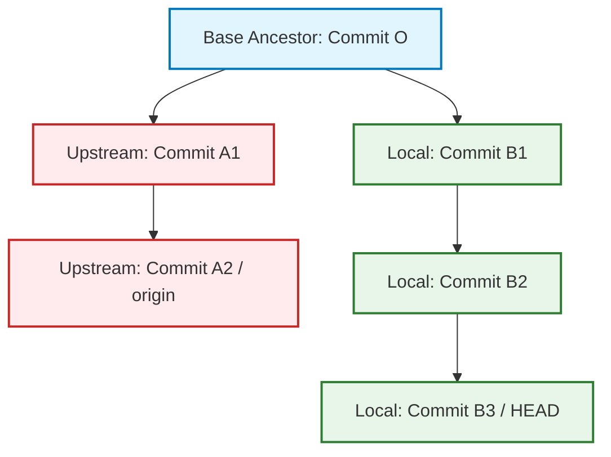

> "Git doesn't consider each commit to be a diff from the previous one, but rather a snapshot of the repository over time." — Scott Chacon

# never blindly push: audit your local commit stack first

*Why eighteen commits ahead of your remote tracking branch is not a badge of honor, and how to inspect your local DAG before your peers do.*

### 🎯 The Thursday Evening Collision

It was 5:42 PM on a Thursday when Marcus typed `git push origin feature/orchestrator-upgrade` and closed his laptop. He had spent three days updating the platform's core workflow engine dependencies, validating local tests, and fixing minor import discrepancies. His branch reported clean, all unit tests passed in his container, and he was eager to beat the evening commuter traffic.

At 5:58 PM, Elena—the on-call platform engineer—saw staging pipeline alerts fire. Three critical nightly batch workflows failed their DAG compilation pass. A stray configuration tweak had rewritten the environment loader signature, stripping away a legacy argument that production DAGs still depended on.

Marcus was pinged on his commute. "Did you change `blogs_client.py` and the pipeline loader in your dependency bump branch?"

Marcus answered honestly: "No, I only updated `requirements.txt`, `constraints.txt`, and bumped the Docker base image." 

Yet git blame told a completely different story. Commit `f4a819c`, authored by Marcus nine days earlier during an unrelated debugging session, was sitting squarely in the middle of his eighteen-commit stack. Marcus had branched off a dirty local experiment, completely forgotten the middle commits, and pushed the entire pile into the review pool.

Nobody was reckless. Marcus acted sensibly: his local suite passed, his terminal told him his working directory was clean, and he verified that his final lockfile was intact. Elena acted sensibly: she was guarding the shared cluster against undocumented contract breaks. The defect was not carelessness; it was an invisible assumption. Marcus treated `git push` like uploading a file, forgetting that Git pushes an entire unpruned directed acyclic graph (DAG).

```
"Your branch is ahead of 'origin/feature/orchestrator-upgrade' by 18 commits."
```

Every engineer has seen that line. Before you push those commits, you must answer one question with mathematical precision: **what is actually inside them?**

---

### 🧠 The 30-Second Version: Choosing the Right Lens

Inspecting a stack of commits requires matching the tool to the question. Using a full patch view when you need a top-level file manifest wastes cognitive load; checking a commit log when you need net file impact creates false panic over intermediate churn.

| Command Pattern | Scope & Lens | Cognitive Cost | When to Use |
|---|---|---|---|
| `git status -sb` | Tracking branch parity check | Near zero | First reflex: verify how many commits ahead/behind after a fetch. |
| `git log --oneline @{u}..HEAD` | Narrative sequence | Low | Reading the commit titles to construct a PR summary. |
| `git diff --stat @{u}..HEAD` | Net structural impact | Low | Verifying that you didn't touch files outside your scope. |
| `git log -p --reverse @{u}..HEAD` | Chronological code review | Medium-High | Auditing your own implementation logic from beginning to end. |
| `git range-diff @{u}...HEAD` | Meta-diff (diff of diffs) | Medium | Proving that a rebase against upstream introduced zero accidental changes. |
| `git diff @{u}..HEAD` | Full cumulative diff | High | Simulating exactly what the reviewer sees in the aggregate review tool. |

> 📌 **Takeaway:** Never review a multi-commit branch using a single tool. Start with the net footprint (`git diff --stat`) to spot rogue files, inspect the narrative order (`git log --reverse`) to verify logical flow, and verify the aggregate diff (`git diff`) to eliminate intermediate noise.

---

### 🏗️ The Mental Model: Revision Ranges Are Set Operations, Not Intervals

The root cause of most Git inspection confusion is the intuitive belief that Git revisions behave like a physical ruler: that `A..B` represents the span of numbers between A and B on a timeline. 

It does not.

In Git, **a revision range is a set subtraction operation on a directed acyclic graph**. 

```
^A B  ==  { Commits reachable from B }  \  { Commits reachable from A }
```

The prefix `^` denotes exclusion: "exclude everything reachable from this node." The two-dot notation `A..B` is purely syntactic sugar for `^A B` or `B ^A`. 

Because this is pure set theory on graph topologies, the order in which you specify exclusions does not matter. The following three invocations are functionally identical to the Git revision parser:

```bash
git log @{u}..HEAD
git log HEAD ^@{u}
git log ^@{u} HEAD
```

You can compose multiple exclusion boundaries across branches:

```bash
# Show commits on my branch that are neither in main nor in release/2.10
git log HEAD ^main ^release/2.10

# Union of two release tags excluding an older baseline
git log v2.11.2 v2.11.1 ^v2.10.0
```

Because reachability is strictly topological, `A..B` can easily return commits whose commit timestamps are chronologically **earlier** than A. Timestamps in Git are metadata annotations written by local machine clocks; graph ancestry is structural reality. This is why filtering commit histories by real-world calendar time frequently yields bizarre, misleading anomalies.

#### The Anatomy of Shorthand Notation

Typing long tracking branches like `origin/feature/orchestrator-upgrade` invites typos. Git exposes ergonomic aliases designed for stack auditing:

*   `@{u}` or `@{upstream}`: The upstream tracking branch configured for the current branch (`branch.<name>.remote` combined with `branch.<name>.merge`). If missing, Git throws `no upstream configured`.
*   `@{push}`: The target branch where `git push` sends your commits (differs from upstream in asymmetric/triangular fork workflows).
*   `@`: A bare shorthand for `HEAD`.
*   `HEAD~3`: Walk back exactly three generations along the **first parent** spine.
*   `HEAD^2`: Select the **second parent** of a merge commit.
*   `HEAD@{2}`: The position where `HEAD` pointed two transitions ago in your local **reflog** (operational journal, not graph topology).

🩸 **Hard-won warning:** Never confuse `~` with `^`. The caret (`^`) selects *which parent* to branch into on a merge commit (`HEAD^2` = parent two). The tilde (`~`) steps *linearly backward* along parent one (`HEAD~2` = grandparent via parent one). Hence `HEAD~2` equals `HEAD^^`, but `HEAD^2` is distinctly different from `HEAD~2`. Note that on Windows `cmd.exe`, `^` is an escape character; running `HEAD^^^` there will silently strip carets unless properly quoted.

Reflog references also accept temporal expressions: `git log master@{yesterday}` or `HEAD@{2.days.ago}` query your local repository's past pointers. When an interactive rebase goes sideways on a Tuesday afternoon, `HEAD@{1}` or checking `git reflog` is the emergency winch that retrieves your lost commit SHAs before garbage collection kicks in.

> 📌 **Takeaway:** Git commit inspection is set algebra on graph nodes. When inspecting `@{u}..HEAD`, you are asking Git: "What nodes can I touch from my local cursor that cannot be touched from the remote tracking reference?"

---

### 💡 The Mechanism: Two Dots vs. Three Dots

The single biggest operational trap in Git auditing is the difference between two dots (`..`) and three dots (`...`). The behavior flips completely depending on whether you are running `git log` or `git diff`.



Let us analyze what happens across these references:

```bash
# git log comparison
git log A..B    # Set subtraction: reachable from B, excluding A (B1, B2, B3)
git log A...B   # Symmetric difference: reachable from either A or B, but NOT both (A1, A2, B1, B2, B3)

# git diff comparison
git diff A..B   # Direct tree comparison between tip of A and tip of B (equivalent to git diff A B)
git diff A...B  # Diff from the merge-base(A, B) to B (ignoring changes in A1, A2 entirely)
```

Notice the inversion: in `git log`, three dots (`...`) is **broader** than two dots because it exposes commits on both divergent flanks. In `git diff`, three dots (`...`) is **narrower** than two dots because it anchors the diff to the common ancestor (the merge base `O`), showing strictly what *your branch introduced*, blind to upstream changes on `A`.

GitHub and GitLab Pull Request "Files Changed" screens render a three-dot diff (`git diff upstream...HEAD`). That is why your PR can look completely clean in the web interface while the branch itself cannot merge cleanly against target master: the PR UI hides upstream divergence.

Since Git 2.30, you can discard ambiguous punctuation in diffs by using the explicit merge-base flag:

```bash
git diff --merge-base main HEAD
```

🩸 **Hard-won warning:** `git status` performs zero network I/O. The announcement *"ahead by 18 commits"* compares your local branch pointer strictly to your locally cached remote-tracking branch (`refs/remotes/origin/...`). If a team member pushed breaking modifications an hour ago, Git does not know. Always run `git fetch` first. `git fetch` writes safely to `refs/remotes/*` and internal packfiles without touching your working tree or index. Never substitute `git pull`, which merges or rebases uninspected remote code directly into your current context.

> 📌 **Takeaway:** The dot notations invert their semantics across subcommands: in `git log`, two dots performs set subtraction while three dots takes symmetric difference; in `git diff`, two dots compares endpoints directly while three dots measures divergence from the merge base.

---

### 🛠️ The Fix: The Five Zoom Levels of Stack Auditing

Returning to Marcus and Elena: how does an engineer prevent rogue commits and unwanted modifications from escaping local machines? 

Adopt the **Five Zoom Levels**. Audit your work progressively from 10,000 feet down to the individual byte.

```bash
# Step 0: Ensure local knowledge matches remote reality
git fetch
```

#### Level 1: The Inventory Manifest (Commit Titles)

Verify how many commits you have accumulated and check their high-level titles:

```bash
git rev-list --count @{u}..HEAD
# Output: 18

git log --oneline --graph @{u}..HEAD
```

Passing `--graph` implicitly forces `--topo-order`, ensuring that parent commits are never displayed after their children. Without `--graph`, Git sorts commits by default according to author or committer date, which produces an incoherent visual order on rebased branches.

#### Level 2: The File Surface Area (Name and Status)

Identify precisely which files were added, deleted, or modified across the stack:

```bash
git log --name-status --oneline @{u}..HEAD
```

Git uses compact single-character status codes: `A` (Added), `M` (Modified), `D` (Deleted), `R` (Renamed), `C` (Copied), and `T` (Type change, e.g., symlink replacing a file).

If you need numeric statistics:

```bash
git log --numstat --oneline @{u}..HEAD
```

🩸 **Hard-won warning:** Do not attempt to parse `git log --stat` in scripts. The `+++---` histogram bar in `--stat` is dynamically scaled to your current terminal column width. A file listed as `5 +++--` might reflect 3 insertions and 2 deletions, or 300 insertions and 200 deletions compressed into five characters. Always parse raw, unscaled tab-delimited records using `--numstat`.

#### Level 3: The Narrative Patch Walk (Chronological)

Read your branch as a story from start to finish. Human brains struggle to read diffs backward, yet `git log` prints the newest commit first by default.

```bash
git log -p --reverse @{u}..HEAD
```

Adding `--reverse` arranges the diff patches in the order they were conceived. You can focus the patch review on sensitive files:

```bash
git log -p --reverse @{u}..HEAD -- requirements.txt
```

#### Level 4: Aggregate Net Impact (The Reviewer's Perspective)

Individual commit histories contain process churn: you create a debug harness in commit 3, edit it in commit 8, and delete it in commit 14. `git log --stat` reports all those operations. Your reviewer, however, evaluates net delta.

```bash
# Single-line summary: N files changed, X insertions(+), Y deletions(-)
git diff --shortstat @{u}..HEAD

# Net file list
git diff --name-status @{u}..HEAD

# Full aggregate patch
git diff @{u}..HEAD
```

If `git diff --name-status @{u}..HEAD` lists files you did not intend to alter (such as Marcus's unintended changes to `blogs_client.py`), you have discovered pollution before publishing it.

#### Level 5: Granular Inspection of Single Commits

When a specific commit looks questionable, drill into its contents:

```bash
git show <sha>
git show --stat <sha>

# Inspect a single file's diff inside a commit
git show <sha> -- path/to/file.py

# Extract historical content of a file directly to stdout (no checkout needed)
git show <sha>:path/to/file.py
```

🩸 **Hard-won warning:** Running `git show <merge-sha>` on a merge commit often prints a brief header and **zero diff output**. By default, Git generates a combined diff (`--cc`), displaying only hunks where the merge commit conflicts with *all* parents simultaneously. A conflict-free merge produces an empty combined diff. To see the true payload introduced by a merge, inspect changes relative to the parent spine using `git show -m <sha>` or `git show --first-parent <sha>`.

#### Closing the Incident: How Marcus and Elena Recovered

Back on Thursday evening, Marcus pulled over, opened his laptop on a mobile hotspot, and executed Level 2 auditing: `git log --name-status @{u}..HEAD`. `blogs_client.py` leaped out immediately under commit `f4a819c`. 

He initiated an interactive rebase (`git rebase -i @{u}`), marked commit `f4a819c` as `drop`, and verified the resulting tree with `git diff --stat @{u}..HEAD`. Only `requirements.txt`, `constraints.txt`, and the Dockerfile remained. Marcus force-pushed the cleansed branch. Elena triggered a manual rebuild on the staging pipeline; DAG compilation completed cleanly across all workflows, well before the scheduled nightly execution window.

> 📌 **Takeaway:** Audit downward through the five zoom levels—from top-level commit counts and file manifests to chronological narrative patches and granular single-commit diffs—to intercept accidental modifications before local state becomes shared state.

---

### 🧭 Advanced Forensic Tools

When standard logs fail to explain how a bug entered your stack, three specialized tools resolve historical anomalies:

#### 1. The Pickaxe (`-S` and `-G`)

When `git blame` only shows the engineer who re-indented a file, use the pickaxe to locate the exact commit that introduced or removed an identifier:

```bash
# Searches for commits changing the frequency of the exact string
git log -S 'apache-airflow==' --oneline
git log -S 'OLLAMA_HOST' --oneline -- .

# Regular expression search across the diff text
git log -G 'ollama_(url|host)' --oneline
```

The pickaxe (`-S`) counts occurrences in the pre-image and post-image. If a commit moves an identifier without altering its net count in the file, `-S` ignores it. If you need regex pattern matching against diff bodies, use `-G`.

#### 2. Fine-Grained Line and Function Tracing (`-L`)

Track the architectural evolution of a single function or block of lines without reading unrelated surrounding edits:

```bash
# Trace by function name delimiter
git log -L :parse_dag:dags/loader.py

# Trace by explicit line range
git log -L 250,270:blogs_client.py
```

Git uses internal regex heuristics to find the function envelope, outputting only the discrete patch revisions that modified that specific subroutine over time.

#### 3. Validating Clean Rebases with `range-diff`

When you rebase a 10-commit feature branch onto an updated upstream baseline, how do you verify that resolving conflicts did not accidentally alter your business logic?

```bash
git range-diff @{u}...HEAD
# Explicit form:
git range-diff main old-feature-tip new-feature-tip
```

Introduced in Git 2.19, `range-diff` computes a "diff of diffs". It pairs commits between two ranges using `patch-id` hashes (which hash code deltas while discarding author metadata and whitespace) and highlights any drift introduced during conflict resolution. If your rebase was purely mechanical, `range-diff` displays each commit paired cleanly with ` = `, confirming no accidental payload changes occurred.

```bash
# Check for equivalent upstream patches via patch-id
git log --cherry-mark --oneline @{u}...HEAD
git cherry -v @{u}
```

#### 4. Rename Detection Mechanics

Git does not track file rename events in commit metadata. Commits store snapshots of the directory tree, not transactional deltas. Renames are derived dynamically during output generation using similarity heuristics (default threshold: 50% content similarity).

```bash
git log --stat -M @{u}..HEAD      # Default rename detection
git log --stat -M20% @{u}..HEAD   # Aggressive similarity matching threshold
git log --stat -C @{u}..HEAD      # Detect file copies as well
git log --follow -- path/file.py  # Follow single-file history across renames
```

Because renames are computed at runtime, editing 80% of a file while simultaneously renaming it causes Git to treat the event as a separate delete and add. Note that `--follow` is a targeted heuristic: it only functions when auditing a single path.

#### 5. Two Identities, Two Timestamps

Every Git commit contains two distinct actors and dates:

```bash
git log --pretty=fuller @{u}..HEAD
```

*   `AuthorDate` (`%ad`): When the code was originally written.
*   `CommitDate` (`%cd`): When the commit object was created or updated (e.g., via `rebase`, `cherry-pick`, or `commit --amend`).

Rebasing a branch updates the `CommitDate` while preserving the original `AuthorDate`. When you inspect `git log` without flags, Git orders by commit dates, which is why a branch rebased ten minutes ago may still present commits labeled "three weeks ago".

```bash
# Custom format for forensic audit
git log --pretty=format:'%h %ad %an %s' --date=short @{u}..HEAD
git shortlog -sn @{u}..HEAD
```

> 📌 **Takeaway:** Advanced auditing commands like `git range-diff` and `git log -S` convert Git from a passive file history viewer into an active forensic analysis environment, catching semantic slips before code hits shared integration pipelines.

---

### ⚖️ Honest Tradeoffs and Boundaries

Auditing your commit stack adds rigor, but like any engineering process, it incurs overhead and has real failure modes.

1.  **Inspection Friction vs. Local Momentum:** Pausing to execute a 5-level audit before every local push is unnecessary on small, single-commit spikes or disposable prototype branches. Apply exhaustive audits when crossing trust boundaries: pushing to shared feature branches, requesting PR reviews, or triggering continuous deployment pipelines.
2.  **Rename Heuristic Failures:** Large refactors combining variable renames with structural directory moves will defeat Git's similarity algorithms (`-M`). In such cases, `git diff` produces thousands of additions and deletions, hiding subtle defects. Do not trust Git's rename inference blindly; separate pure structural renames from behavioral code changes into isolated commits.
3.  **Merge Commits Add Graph Noise:** Running `git diff @{u}..HEAD` on a branch that contains intermediate merge commits pulls in changes from merge parents unless filtered via `--first-parent`. For linear auditing, teams that enforce rebase-based workflows enjoy significantly cleaner diff audits than those with nested merge bubbles.

---

### 🛠️ The Debugging Playbook

| Symptom | Underlying Cause | Exact Remediation Command |
|---|---|---|
| `fatal: no upstream configured for branch` | Current branch lacks tracking metadata. | Set it explicitly: `git branch -u origin/<branch-name>` |
| `git status` says ahead, but colleagues report missing commits. | Local index is ahead, but changes haven't been pushed to origin. | `git push -u origin HEAD` |
| `git status` reports clean, but remote branch has new commits. | Local remote-tracking branch is stale because network I/O hasn't run. | Refresh cache: `git fetch origin` |
| `git show <sha>` prints commit metadata but zero file changes. | Target is a clean merge commit; combined diff (`--cc`) has no conflict hunks. | View full parent diff: `git show -m <sha>` or `git show --first-parent <sha>` |
| Need to verify if rebase accidentally altered code. | Rebase may have introduced bad manual conflict resolutions. | Compare patch topologies: `git range-diff @{u}...HEAD` |
| Commit dates are wildly out of chronological order in `git log`. | Commits were rebased or cherry-picked; committer dates differ from author dates. | Force topological parent order: `git log --graph --topo-order` |
| A string disappeared from the codebase, but `git blame` is useless. | Someone removed it inside an unrelated refactor. | Run the pickaxe search: `git log -S 'target_string' -p` |

---

### 🧭 Engineering Principles: Beyond the Git Graph

Mastering your local commit stack reveals truths that generalize across systems engineering.

#### 1. Visibility Must Precede Publication
*Mechanism:* In any buffered architecture, state changes remain provisional until an irreversible broadcast event occurs. If the interface between local buffer and public propagation lacks inspection tools, downstream actors inherit unverified state.

*Cross-Domain Parallel:* In modern aviation, pilots running through pre-flight instrumentation checks do not test control surfaces while accelerating down the runway. A dedicated, low-stakes audit occurs at the gate before the plane requests clearance to enter the active taxiway.

> Generalize: Wherever a local staging buffer exists in your architecture—whether an outbound message broker queue, an application cache, or a database transaction—build explicit, low-cost inspection barriers before the publication boundary commits.

#### 2. Process Churn Is Not Net Impact
*Mechanism:* Intermediate operational transitions frequently carry noise, regressions, and corrections that cancel each other out. Evaluating a state change by its transaction count rather than its cumulative delta misallocates analytical resources.

*Cross-Domain Parallel:* In double-entry accounting and banking compliance, daily audit reconciliations focus on the final cleared balance across accounts. While the intermediate transaction log is preserved for forensics, solvency assessments examine the net settled ledger.

> Generalize: When reporting metrics or presenting designs to peers, decouple the narrative log of how you solved the problem from the net architectural delta your change actually applies to the system.

#### 3. Topology Outranks Timestamps
*Mechanism:* Distributed systems cannot rely on physical clock synchronization to establish causal order. Only explicit dependency links (such as Lamport timestamps or cryptographic DAG parent pointers) determine causality.

*Cross-Domain Parallel:* In epidemiology and contact tracing, knowing the chronological date someone felt ill is secondary to mapping the structural transmission tree of who was in the room with whom. Ancestry dictates causality; clocks provide merely descriptive labels.

> Generalize: In distributed data stores and microservice orchestration, never rely on wall-clock time to infer causal sequences. Structure your payloads with explicit causality tokens.

---

### 🏁 Action Items and Immediate Next Steps

1.  **Audit Your Current Stack Now:** Open a terminal in your active project and run the following pipeline to inspect unpushed work before your next commit:
    ```bash
    git fetch && git diff --stat @{u}..HEAD
    ```
2.  **Add a Narrative Log Alias:** Add an alias to your global git configuration for reading chronological commit diffs:
    ```bash
    git config --global alias.review "log -p --reverse @{u}..HEAD"
    ```
3.  **Try Interactive Terminal Browsing:** Install `tig` (a terminal interface for git) or explore `gitk` to inspect local DAG branch points visually:
    ```bash
    gitk @{u}..HEAD
    ```
4.  **Non-Technical Team Action:** In your next team retrospective, ask: *"Are we reviewing pull requests based on the total net diff, or are we reading the commit history as a narrative?"* If engineers push messy, uninspected 20-commit stacks expecting the reviewer to make sense of the noise, consider establishing branch squashing or pre-push review expectations.

---

*Code is written for computers to execute, but commit stacks are written for human beings to review. Inspect your own draft before you ask someone else to read it.*
