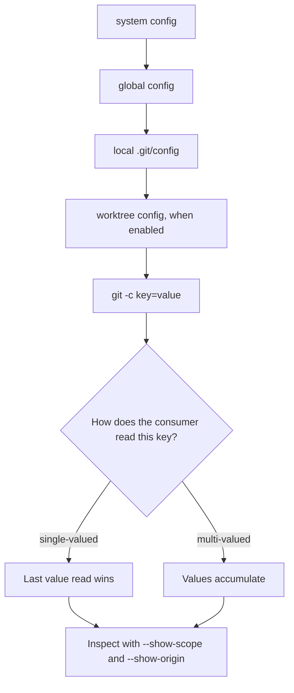

> "Programs must be written for people to read, and only incidentally for machines to execute." — Harold Abelson and Gerald Jay Sussman

# The Missing Git Security Skill: Inspect Config Provenance, Not Just Values

*Git configuration decides more than aliases. It also decides which local behavior is merely convenient and which policy was never enforceable.*

Git 2.26 or newer:

```bash
git config --show-scope --show-origin --get-regexp '^alias\.'
```

On older Git installations, omit `--show-scope`:

```bash
git config --show-origin --get-regexp '^alias\.'
```

```text
global  file:~/.gitconfig  alias.up pull --rebase --autostash
local   file:.git/config   alias.up pull
```

Two definitions of the same verb. The local one wins. Most people will inspect the value and stop there; the important fact is where it came from.

Run that command in a repository before you finish this article. You will be able to distinguish harmless personal Git ergonomics from configuration that changes shared behavior, find the winning definition, and put real invariants on a surface that can enforce them.

The surprise is that aliases are not the interesting part. They are the legible edge of a client-side configuration cascade that can also alter history shape, content bytes, conflict resolution, and which programs Git executes.

## The fifteen-second alias audit has sharp edges

The smaller command is still useful:

```bash
git config --get-regexp '^alias\.'
```

It might print:

```text
alias.st status -sb
alias.up pull --rebase --autostash
alias.pf push --force-with-lease
alias.nah !git reset --hard && git clean -df
```

Three details are worth getting right.

- `--get-regexp` matches **configuration key names**, not values. Its pattern is a POSIX extended regular expression: no `\d`, `\w`, or lookahead. It is unanchored, so `alias` can match more than `alias.*`; use `'^alias\.'`.
- No match produces no output and exit status `1`. That means an empty result, not a damaged Git installation. A bootstrap script running under `set -e` needs to guard that result.
- An alias cannot shadow a Git built-in. `alias.push = push --force-with-lease` does not wrap `git push`; the built-in wins. A safety wrapper needs a distinct command name, and a safety guarantee needs an enforcement point outside the alias system.

The last point invalidates a surprising amount of Git “hardening” advice. A wrapper that users can bypass is a convenience feature wearing a helmet.

## Share this table with the person writing policy in `.gitconfig`

| Plane | Put this there | What it guarantees | What it cannot guarantee |
|---|---|---|---|
| Client config | aliases, identity selection, default pull behavior | local ergonomics and nudges | uniform behavior across machines |
| Repository content | `.gitattributes`, `.editorconfig`, reviewed tooling | versioned, reviewable shared inputs | rejection of invalid pushes |
| Server or forge | branch protection, required checks, push rules | auditable invariants at one source of truth | a pleasant local workflow |

> **Client config is an ergonomics plane, never an enforcement plane.**

That is the boundary I would draw. A competent counterargument is that centrally managed client configuration can reduce drift while preserving a fast local workflow. It can, and a documented baseline is often worthwhile. It still cannot make a repository invariant true: clients can be stale, bypassed, replaced by IDE integrations, or invoked with command-line overrides. Use managed defaults for convenience; use the server for rules that must hold.

## Git reads a cascade, not “your `.gitconfig`”

Git resolves configuration through ordered sources. The familiar sources are system, global, local repository, optional per-worktree, and command-line configuration such as `git -c key=value ...`. Later definitions generally take precedence for single-valued keys.



`[include]` and `[includeIf]` make this less like a stack of files and more like source order: included files are read at the point where they are included. File identity does not decide the winner; read order does.

For single-valued settings, earlier values are shadowed rather than merged. For multi-valued settings such as `remote.origin.fetch`, `include.path`, and `safe.directory`, values accumulate. Git configuration has no universal schema that tells you which behavior applies; the code consuming a key determines it.

There is another awkward asymmetry: section and variable names are case-insensitive and Git normalizes them in output, while subsection names such as `remote."Origin"` are case-sensitive. Two configurations can look nearly identical while resolving differently.

This is the same failure family as CSS precedence, Kustomize overlays, Spring profile layering, Terraform variable precedence, and the usual mixture of system files and user dotfiles. Mature tools eventually need provenance views because an effective value without its origin is an incomplete diagnosis. Git provides `--show-origin` and, since Git 2.26, `--show-scope`; they should be the default habit, not the command you discover after a bad afternoon.

I think Git not showing origin by default in `git config --list` is one of its largest configuration usability defects.

## The behavior hidden behind aliases is wider than aliases

Aliases are visible. The configuration that arrives beside them is often more consequential:

- `pull.rebase`, `rebase.autoStash`, and `merge.ff` affect history shape.
- `core.autocrlf`, `core.eol`, and their interaction with `.gitattributes` affect content bytes.
- `merge.conflictStyle` affects the information available while resolving a conflict.
- `core.hooksPath` and `init.templateDir` affect which code participates in commit workflows.
- `filter.*.clean`, `filter.*.smudge`, `diff.external`, `core.pager`, `core.editor`, and `sequence.editor` can cause external processes to run during ordinary Git operations.
- `credential.helper` affects where credentials are obtained or stored.

Some IDE-embedded Git clients do not expand shell aliases at all; they may invoke Git differently or use another implementation. The same developer can therefore get terminal behavior and IDE-button behavior that differ in the same repository. Most organizations have no telemetry for that client configuration plane.

That absence matters as an organization grows. Unversioned onboarding state gets copied from one dotfiles repository or setup script to another. A copy does not receive later corrections, so generations of configuration accumulate. Local environments also diverge from CI by construction: CI images are commonly sparse, while developer machines are not. When a workflow is demonstrated as a sequence of private aliases, the team learns a private vocabulary instead of the underlying Git operation.

**Aliases are a distributed, per-machine cache of team intent—and no one implemented invalidation.**

That model gives practical rules:

- Inspect provenance as you would inspect a cache entry.
- Point to reviewed shared configuration with an include instead of copying it. Copies are caches with infinite TTL.
- Let aliases shorten commands, but be cautious when they change semantics around rebase, reset, clean, or force-push.
- Keep the source of truth for invariants outside every laptop.

## A composite failure pattern: correct intent, wrong winning value

The following is a composite pattern, not a report of one incident.

A team consolidated service repositories into a monorepo and documented a linear-history policy. Some contributors configured `pull.rebase = true` globally. A migration or bootstrap step also preserved repository-local settings, including `pull.rebase = false`. Local configuration overrode global configuration.

The visible symptom was merge commits from a stable subset of contributors despite everyone believing the written policy. Repeating the policy, adding it to a pull-request template, or grepping commit messages treats the output, not the resolution rule that produced it. The diagnostic is:

```bash
git config --show-scope --show-origin --get-regexp 'pull\.|rebase\.|merge\.'
```

On Git versions older than 2.26, omit `--show-scope` from this and the later provenance commands.

The immediate repair is to remove the offending local key. The structural repair has two parts:

1. Put reviewed shared defaults in a versioned file, for example `tools/git/team.gitconfig`, and have bootstrap configure an include pointing to it. An include is a pointer; copying settings into each clone creates frozen state.
2. Enforce linear history with server-side branch protection or an equivalent forge rule. The server can reject a history shape that client configuration merely requests.

The same distinction explains why `.gitattributes` is usually the right answer to line-ending consistency. It is repository content: versioned, reviewed, and present for every clone. `core.autocrlf` is per-machine configuration. Same broad concern, radically different provenance.

## Audit execution-capable configuration, not just aliases

An alias starting with `!` is shell execution:

```ini
[alias]
example = !sh -c 'git push origin HEAD && ./scripts/task.sh'
```

Treat it as executable code running with the access available to the developer environment. Git clone does not copy a remote repository’s `.git/config`, so the simplistic “clone a repository and inherit its aliases” path is not how this normally happens. Git also added repository ownership protections through `safe.directory` in response to CVE-2022-24765.

The more realistic exposure is unreviewed setup material: bootstrap or dotfile installer scripts, broadly writable shared dotfiles, development-container setup, pasted environment-repair snippets, and base images carrying system Git configuration. A pager is particularly easy to overlook because `git log`, `git diff`, and `git show` do not feel like a code-execution boundary.

Start with these checks:

```bash
# Shell aliases anywhere in the resolved cascade
git config --show-scope --show-origin --get-regexp '^alias\.' | grep -- '!'

# Configuration whose values can select external programs or filters
git config --show-scope --show-origin --get-regexp \
'^(core\.(pager|editor|hooksPath|fsmonitor)|sequence\.editor|diff\..*\.(command|textconv)|filter\..*\.(clean|smudge)|init\.templateDir)$'

# A provenance-preserving inventory
git config --show-scope --show-origin --list | sort
```

A zero-result `grep` also exits nonzero, so do not paste the first command unguarded into a script using `set -e`.

## Conditional includes are useful only if you can debug them

A single global configuration is usually wrong for at least some repositories. Conditional includes can separate common aliases, identities, and context-specific defaults:

```ini
# ~/.gitconfig
[include]
    path = ~/.config/git/aliases.common

[includeIf "gitdir:~/projects/app/"]
    path = ~/.config/git/work.gitconfig

[includeIf "gitdir:/path/to/other-repos/"]
    path = ~/.config/git/oss.gitconfig
```

The included files should use neutral placeholders where identity is needed, such as `<YOUR_NAME>` and `<YOUR_EMAIL>`, rather than copied personal details.

Git also supports conditional inclusion based on a matching remote URL through `includeIf "hasconfig:remote.*.url:…"`. That can express the real intent better than directory naming: remote identity is often what you mean, while a filesystem path is only a proxy.

The raw version history behind these features deserves verification against the Git release notes for the versions your readers run. In particular, the modern `git config get --regexp` subcommand form arrived in Git 2.46; older installations use `git config --get-regexp`. `--show-origin`, `--show-scope`, path-based `includeIf`, branch-based `includeIf`, remote-URL conditional includes, and value-matching options also arrived across different releases. Check `git --version` before standardizing on the newer syntax.

Conditional includes trade one confusing file for several files and a resolution rule. If a team will not adopt `--show-origin`, it should be cautious about adding include complexity. A monolith you can inspect is safer than a cascade nobody can read.

## Put each guarantee where it can survive drift

I would not standardize personal shorthand. Whether someone types `st`, `s`, or the full command is not a platform concern.

I would version and distribute aliases that encode team semantics, especially commands involving force-push, reset, clean, rebase, or history shape. I would teach provenance inspection alongside basic Git recovery. I would add a self-serve configuration dump to CI-parity and incident-debugging checklists. And I would move every actual invariant to the forge.

This does cost some autonomy and setup complexity. A baseline can become bureaucratic if it tries to colonize every local preference, and server rules can be too blunt for legitimate exceptional workflows. The useful boundary is narrow: standardize behavior that affects shared repositories; leave private ergonomics private.

There is one broader rule here: **prefer the plane with provenance.** It holds because reviewed, versioned, centrally enforced artifacts make both effective behavior and change history inspectable. It stops applying when local customization has no shared semantic effect, where the cost of central control exceeds the coordination benefit.

Generalize: when two mechanisms can solve the same problem, ask which one lets you answer, “Who set this value, when, and can the system reject violations?”

Open a repository now and run the provenance command. Which value in your effective Git configuration would surprise the person who wrote your team’s workflow?
