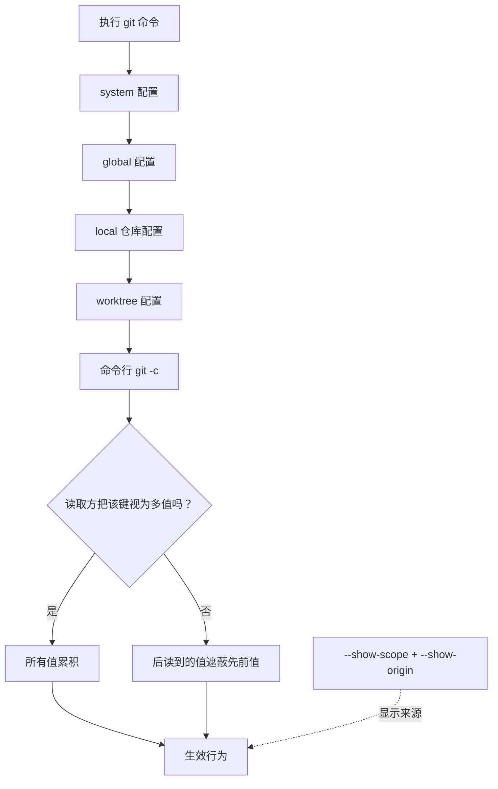

> "Git 是一个愚蠢的内容跟踪器。" — Linus Torvalds

# 别只看 Git 配置值：用 Provenance 找出每一项配置的真正来源

*Alias 看起来是个人习惯；它背后却藏着一套按机器漂移、默认没有溯源的配置级联。*

“Git alias 只是个人效率工具，统一它是在刷自行车棚。”这话大部分时候没错。

错在它把 alias 当成了孤立的字符串替换。alias 只是 Git 客户端配置平面里最显眼的一块：同一条共享命令，可能在不同机器上生成不同的历史形状、处理不同的行尾，甚至在普通 Git 操作中启动不同的外部程序。

先花一分钟运行这条命令：

```bash
git config --show-scope --show-origin --get-regexp '^alias\.'
```

你会看到的不是“我有哪些缩写”，而是“这些缩写从哪里来、谁覆盖了谁”。读完本文，你应当能诊断 Git 配置的生效来源，把共享默认值做成可更新的指针，并把真正必须成立的规则移到能强制它的地方。

```text
global  file:~/.gitconfig       alias.up pull --rebase --autostash
local   file:.git/config        alias.up pull
```

同一个动词，两个定义；后一条在这个仓库里胜出。

> **先查来源，再相信配置值。**

这六行输出，比“列出 alias”重要得多。

## Alias 有三个容易被写错的细节

最朴素的列举命令仍然有用：

```bash
git config --get-regexp '^alias\.'
```

例如：

```text
alias.st status -sb
alias.up pull --rebase --autostash
alias.pf push --force-with-lease
alias.nah !git reset --hard && git clean -df
```

但请精确理解它。

- `--get-regexp` 匹配的是**键名**，不是值；模式使用 POSIX 扩展正则，不支持 `\d`、`\w` 或前向断言。匹配默认不是锚定的，所以应使用 `'^alias\.'`，避免把 `my.aliases.legacy` 也捞进来。
- 没有匹配时，它没有输出且退出码为 `1`。这表示结果为空，不表示 Git 坏了；在启用了 `set -e` 的环境初始化脚本中，必须显式处理。

```bash
if git config --get-regexp '^alias\.' >/dev/null 2>&1; then
  echo 'found aliases'
fi
```

- alias 不能覆盖内置命令。`alias.push = push --force-with-lease` 不会给 `git push` 加护栏；内置命令优先。要包装危险操作，只能起另一个名字，例如 `pf`。

这也是许多“用 Git alias 加固 push”的建议站不住脚的原因：你以为装上的安全层，Git 根本不会调用。

## Git 读的不是一个文件，而是一次级联

多数人的心智模型是“Git 读我的 `.gitconfig`”。更接近现实的模型是：Git 按优先级读取多个来源，并让消费该配置的代码决定如何解释重复项。



常见优先级从低到高是：`system`、`global`、`local`、`worktree`、命令行 `git -c key=value`。worktree 配置需要启用 `extensions.worktreeConfig`。此外，`[include]` 和 `[includeIf]` 会在被声明的位置插入内容；决定覆盖关系的是包含顺序，不是文件名看起来多“官方”。

单值配置通常表现为后者遮蔽前者，例如 `pull.rebase`。多值配置则可能累积，例如 `remote.origin.fetch`、`include.path`、`safe.directory`。关键麻烦在于：一个键是否按多值处理，是读取它的 Git 代码的属性；配置文件没有一份可供你查询的 schema。

还有一个不对称：section 和 key 不区分大小写，输出会归一化为小写；subsection 区分大小写。`remote."Origin"` 和 `remote."origin"` 看上去很像，语义却可能不同。

我认为，`git config --list` 默认不显示来源，是 Git 配置系统最大的可用性缺陷。它把“有效值”端到你面前，却把解释这个值的证据藏起来。

## 共享动词加上机器语义，就是协调型故障

一个经过匿名化的迁移案例说明了这件事的成本。团队把多个仓库合并到单一仓库，约定主分支保持线性历史：合并前 rebase，不要 merge commit。迁移脚本为了“保留原有设置”，在仓库的 local 配置中写入了 `pull.rebase = false`。

一些人全局设置了 `pull.rebase = true`，却被 local 配置静默覆盖；另一些人没有设置全局值，反而一直凭习惯手动 rebase。随后，主分支出现了不符合约定的历史形状，依赖线性历史的排查工具开始给出误导性结果。

重申规范、修改 PR 模板、从提交信息中筛查某些文本，都没有触到根因。诊断命令只有这一条：

```bash
git config --show-scope --show-origin --get-regexp 'pull\.|rebase\.|merge\.'
```

修复分三层，价值递增：删除错误键可以止血；用仓库内经评审的配置文件，通过 `[include]` 接入，可以避免复制配置变成陈旧快照；最后，在代码托管平台用分支保护拒绝不符合规则的更新，才能让线性历史成为不变量。

**客户端配置是人机工效平面，永远不是强制平面。**

把策略写进 `.gitconfig`，等于在浏览器里做校验：对愿意遵守的人很友好，对系统保证没有约束力。

反对意见也值得认真对待：平台团队不该殖民开发者的个人环境。强制每个人把 `st` 写成同一个缩写，既无必要，也会消耗信任。问题不在个人速记，而在那些编码了团队语义、又被当作共享词汇使用的命令。有人在 runbook 里写“先跑 `git up`”，它就不再只是个人偏好；而若 `up` 在不同机器上分别等于 `pull` 与 `pull --rebase --autostash`，团队共享的是名字，不是行为。

Alias 还是一种危险操作的摩擦调节器。`push --force` 与 `push --force-with-lease` 只差一个 flag，却关系到并发工作是否会被覆盖。把 `reset`、`clean`、强推压缩成几个字符，有时是在提高效率，有时是在移走原本承担提醒职责的摩擦力。

## Alias 只是露出水面的那一块

真正值得审计的，是和 alias 同一条级联里的其他键：

| 配置区域 | 会改变什么 | 更合适的归属 |
|---|---|---|
| `pull.rebase`、`rebase.autoStash`、`merge.ff` | 历史形状 | 服务端规则与团队默认值 |
| `core.autocrlf`、`core.eol` | 工作区内容字节 | `.gitattributes` |
| `merge.conflictStyle` | 冲突呈现与处理体验 | 客户端偏好，必要时文档化 |
| `core.hooksPath`、`init.templateDir` | 提交时可运行的内容 | 入库 hooks 加引导机制 |
| `core.pager`、`core.editor`、`sequence.editor`、`filter.*`、`diff.external` | Git 操作期间启动的外部程序 | 经审查的客户端基线 |
| `credential.helper` | 凭据由何处管理 | 明确的安全基线 |

`.gitattributes` 值得单独强调。行尾一致性应优先由它承担，因为它是仓库内容：版本化、经评审、所有 clone 一致。用 `core.autocrlf` 解决同一问题，则把答案放进每台机器的状态里。能力相近时，优先选择有溯源的平面。

IDE 还会让事情更复杂。许多 IDE 的 Git 集成并不展开 shell 中的 alias：它们可能调用 Git 的底层能力，或者使用自己的实现。因此，同一个仓库、同一分钟，终端里的 `git up` 和 IDE 的“更新项目”按钮未必遵循同一条路径。多数团队没有开发者机器配置的遥测，于是这种方差通常只会在失败后被发现。

## 共享配置要指向，不要复制

把团队默认配置复制进每个人的配置文件，等于制造 TTL 为无穷的缓存：它会被复制、被遗忘、永远收不到更新。

更好的做法是把共享部分放入可版本化、可评审的文件，再通过 include 引用它：

```ini
# ~/.gitconfig
[include]
    path = ~/.config/git/aliases.common

[includeIf "gitdir:~/work/"]
    path = ~/.config/git/work.gitconfig

[includeIf "gitdir:~/oss/"]
    path = ~/.config/git/oss.gitconfig
```

`includeIf` 让“所有仓库共用一份全局配置”的假设不再成立。按路径分流是实用起点；按远端 URL 分流通常更贴近真实意图：当你说“这是工作仓库”，真正表达的往往不是它恰好位于哪个目录，而是它指向哪个远端。`includeIf "hasconfig:remote.*.url:…"` 可用于这一类条件，但应先用 `git --version` 核对本机支持情况，再查对应版本的 release notes。

代价也很明确：多个文件加上一条解析规则，可能比一个大文件更难读。若团队不养成 `--show-origin` 的诊断习惯，就不要平白引入这层复杂度；一个可读的巨石配置，胜过一个无人能解释的级联。

## 先审计有执行能力的配置

以 `!` 开头的 alias 会经 shell 执行。它不是普通缩写，而是一段可在开发者权限上下文中运行的命令。`git clone` 不会复制远端仓库的 `.git/config`，因此“仅靠 clone 就把远端 alias 带回来”的直觉攻击路径并不成立；Git 的仓库归属检查也针对类似风险做过加固，`safe.directory` 与 CVE-2022-24765 有直接背景。

现实暴露面更平常：未经审查的环境初始化脚本、多人维护却缺少审查边界的 dotfiles、开发容器初始化步骤、故障处置时传播的临时命令，以及带有 `/etc/gitconfig` 的基础镜像。它们都可能把配置写入 global 或 system 作用域。尤其是 `core.pager`，因为它会在 `git log`、`git diff`、`git show` 等高频命令中触发，往往最不被当作信任边界。

先做一份带来源的快照：

```bash
# 是否存在值以 ! 开头的 shell 型 alias？
git config --show-scope --show-origin --get-regexp '^alias\.' |
  awk -F '\t' '$3 ~ /^alias\./ && $4 ~ /^!/'

# 审计可能启动外部程序的配置
git config --show-scope --show-origin --get-regexp \
  '^(core\.(pager|editor|hooksPath|fsmonitor)|sequence\.editor|diff\..*\.(command|textconv)|filter\..*\.(clean|smudge)|init\.templateDir)$'

# 保存完整、可追溯的配置快照
git config --show-scope --show-origin --list | sort
```

我主张：工程组织至少应提供一条“打印我的 Git 配置及其来源”的自助命令，并记录一份期望基线。它不是设备管控；它让每个人有能力解释自己的环境。这样做会把排查入口从“猜谁的机器不一样”变成“看证据”。

## 保证必须住在能拒绝破坏它的平面

这个原则来自一个简单机制：客户端配置可以漂移、被覆盖、被绕过；仓库内容可被评审和复现；服务端规则拥有对写入操作的最终裁决权。保证若放在前两者，仍要依赖每个客户端合作；放在服务端，违规更新可以直接被拒绝。

所以边界应当清楚：个人 alias 保持个人；涉及 force-push、reset、clean、rebase 或历史语义的团队约定，可以通过经评审的 included 配置分发；每一条真正必须成立的规则，交给分支保护、必需检查、push 规则或其他服务端机制。

这个原则的边界也清楚：服务端不该接管编辑器、pager、个人速记和身份切换等人机工效。把所有客户端偏好收归集中管理，通常会损失信任，却仍无法消除所有差异。

> 举一反三：当你把一条策略写进某个客户端默认值时，问一句——它被破坏后，究竟有没有一个拥有单一真相来源的地方能拒绝它？

现在打开一个常用仓库，运行带 `--show-scope --show-origin` 的那条命令。你能否解释每一个会改变团队行为的配置，究竟是谁写进去的？
