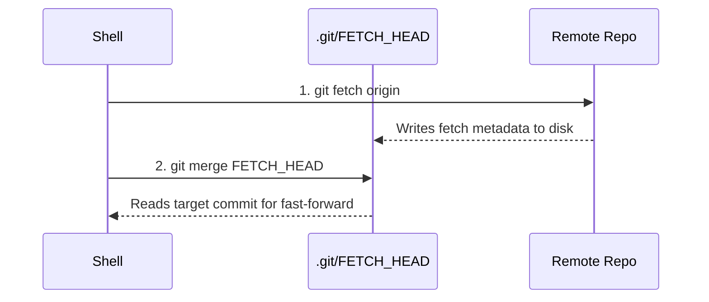

# "fatal: Cannot fast-forward to multiple branches."

*Why your clean, single-branch repository throws an impossible merge error.*

I spent forty minutes inspecting `.git/config` on a repo with exactly one remote branch because I forgot my editor was running commands behind my back. If you have ever run a routine pull and received a complaint about multiple branches when only one branch exists in your checkout, you will understand the suspicion. Git told me two divergent heads were trying to merge at the exact same instant.

By the end of this autopsy, you will know the exact millisecond sequence that corrupts `.git/FETCH_HEAD`, why it is not a Git bug, and the single setting that stops your IDE from interfering with your shell.

### The Impossible Failure on a Single Branch

The environment was boring: one tracking branch (`main`), one remote (`origin`), zero uncommitted changes.

```bash
$ git pull --ff-only
fatal: Cannot fast-forward to multiple branches.
```

A fast-forward merge requires a single commit target to walk forward to. The error explicitly says Git found multiple targets to merge simultaneously.

My first assumption was a typo in the local configuration. I checked `.git/config`:

```ini
[branch "main"]
    remote = origin
    merge = refs/heads/main
```

There were no secondary remotes, no wildcard refspecs, and no local tracking branches mapped to `origin/dev` or anything else. Running `git status` showed the working tree was completely clean.

Running the command a second time five seconds later succeeded instantly:

```bash
$ git pull --ff-only
Updating 4f8a291..a91c0b3
Fast-forward
 src/main.rs | 2 +-
 1 file changed, 1 insertion(+), 1 deletion(-)
```

Transient errors in deterministic, local CLI tools are an oxymoron. If software behaves nondeterministically without network degradation, something external is modifying state between instructions.

### The Two-Stage Anatomy of `git pull`

To understand why multiple branches appeared out of thin air, examine how `git pull` actually executes. `git pull` is not an atomic command. It is a convenience wrapper around two distinct plumbing operations:



Because stage one and stage two are separate processes, Git needs an on-disk handoff mechanism to communicate what was just downloaded. That handoff mechanism is `.git/FETCH_HEAD`.

When `git fetch` runs, it appends or overwrites `.git/FETCH_HEAD` with a list of references fetched from the remote. Each line carries metadata: the commit SHA, whether it is for merge or not, and the ref name:

```text
a91c0b31...012		branch 'main' of github.com:org/repo
```

In stage two, `git merge --ff-only` opens `.git/FETCH_HEAD`, parses the lines that do not have the `not-for-merge` marker, and tries to advance your local branch pointer. If that file contains more than one mergeable head without an explicit branch argument, Git throws the error you saw.

### The Ghost in the Millisecond Gap

Your shell is not a single-tenant environment when an IDE is watching the directory.

Modern editors like VS Code, Cursor, and various language-server plugins run background daemons to keep your Source Control sidebar synchronized. In VS Code, this lives under the `git.autofetch` configuration, which runs periodic fetches every few minutes.

Here is the race condition documented across developer reports and Microsoft's tracker (such as VS Code Issue #158309):

| Timeline | Shell Process | IDE Background Process | State of `.git/FETCH_HEAD` |
| :--- | :--- | :--- | :--- |
| **T0** | User executes `git pull --ff-only` | Idle (timer ticks down) | Existing baseline |
| **T1** | Phase 1: `git fetch` starts | Periodic timer fires | Fetch in progress |
| **T2** | Phase 1 writes single line to `FETCH_HEAD` | Background `git fetch --prune` triggers concurrently | Shell write completes |
| **T3** | Process yields between `fetch` and `merge` | Background fetch writes full remote branch table | **Overwritten with multiple refs** |
| **T4** | Phase 2: `git merge --ff-only` reads `FETCH_HEAD` | Background fetch finishes | **Fails: multiple merge candidates detected** |

Between the moment your shell's `git fetch` finished writing its single target line and the moment `git merge` opened `.git/FETCH_HEAD`, the background fetch wrote its own broader view of the remote references into that exact same file.

Git did not hallucinate. The file on disk genuinely contained multiple branches when the merge step read it.

### How to Verify and Fix It

If you see this error, you can inspect `.git/FETCH_HEAD` before executing any other command. In a normal single-branch pull, it holds one line marked for merge. During or immediately after this race condition, you will find lines detailing all remote branches pulled by the background fetch.

To eliminate the contention, pick one of two approaches.

#### Option 1: Disable Auto-Fetching in the Editor

If you spend the majority of your day inside the terminal, disable background repository mutations entirely. In VS Code or Cursor, open `settings.json` and set:

```json
{
  "git.autofetch": false
}
```

This guarantees that no external process mutates `.git/` files while you are running manual operations.

#### Option 2: Pull an Explicit Branch Name

If you prefer keeping automatic background fetches for GUI indicators, bypass `.git/FETCH_HEAD` parsing by passing the explicit target:

```bash
$ git pull --ff-only origin main
```

When given an explicit remote and branch, Git ignores the unannotated contents of `.git/FETCH_HEAD` and fast-forwards directly against the resolved ref (`refs/remotes/origin/main`).

### The Limit of File-Based IPC

Disabling `git.autofetch` solves this specific race, but it does not fix the underlying design choice. Git was built in 2005 around POSIX filesystem assumptions: small CLI tools communicating through dotfiles on local disk, assuming a single developer typing commands sequentially.

Today, a typical workspace runs an editor extension host, a language server (LSP), a file watcher, and a terminal multiplexer—all pointing at the same `.git` directory simultaneously. Without kernel-level advisory locking across all tools touching that directory, filesystem handoffs like `.git/FETCH_HEAD` remain inherently prone to interleaved writes.

Have you seen other tools in your stack choke because a background file watcher touched `.git` at the wrong millisecond?
