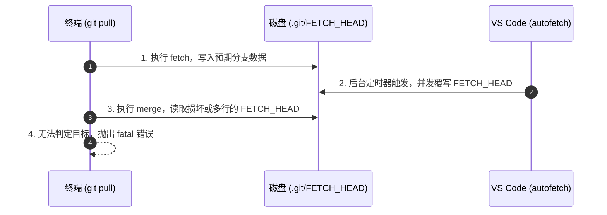

# 明明只有一个分支，为什么 Git 报错 Cannot fast-forward to multiple branches？

*终端敲下的常规同步，遇上了现代编辑器最热心也最隐蔽的并发写入。*

```text
$ git pull --ff-only
fatal: Cannot fast-forward to multiple branches.
```

你停在终端前，第一反应通常是怀疑键盘：是不是刚才手滑多敲了远程分支名？

输入 `git branch -vv`，当前明明只处于一个干净的本地分支，紧贴着对应的单一 upstream。打开 `.git/config`，里面的 `branch.*.merge` 指向唯一，没有任何多余的跟踪项。你孤身一人坐在终端前，Git 却斩钉截铁地宣告：这里有多个分支正在同时尝试并入。

**机器里没有幽灵，所有的反常都只是另一个你没注意到的进程恰好在同一毫秒动了同一个文件。**

读完这篇，你不仅能彻底看懂这个“灵异报错”的精确触发时钟，还会明白为什么现代 IDE 的贴心设计，正在悄悄破坏命令行工具对于“单用户单进程”的古老假设。

### 检查清单：60 秒排查现场

如果你此刻就卡在这个报错面前，无需改动任何远程分支配置，按顺序确认这三件事：

1. 检查是否存在后台进程正在轮询远程：在终端运行 `git status`，看仓库锁文件是否存在。
2. 直接重新执行一遍原命令：竞态窗口通常在毫秒级，第二次执行几乎必然恢复正常。
3. 查看最近一次写操作来源：观察你的 IDE 是否刚刚完成了后台抓取。

### `git pull` 并非原子操作：两棒交接处的命门

许多人习惯把 `git pull` 当成原子命令，但在底层设计里，它自始至终是一次组合调用：

1. 第一步：运行 `git fetch`，从远程服务器拉取最新的 commit 对象与引用数据。
2. 第二步：运行 `git merge`（或者本例中的 `git merge --ff-only`），将远程的变更快进或并入当前工作树。

两步交接所依赖的中间状态，被暂存在磁盘文件 `.git/FETCH_HEAD` 中。



第一步的 `git fetch` 把拉取结果按行写入 `.git/FETCH_HEAD`。正常的单分支快进合并中，`git merge` 只会寻找该文件中第一行未被标记为 `not-for-merge` 的目标分支引用。

如果在单终端、无外界干扰的环境下，这个读取写入的交接确实万无一失。但是，现代操作系统与工具链早已打破了“终端独占仓库”的宁静。

### 真正的第三者：谁在同一毫秒重写了交接棒

这个报错的始作俑者，正是现代开发者开箱即用的 IDE（比如 VS Code 或 Cursor）。

为了让左下角的提交状态指示器永远保持最新、为了让源代码管理面板能平滑展示未拉取的改动，VS Code 默认开启了 `git.autofetch` 机制。它会静默启动一个基于定时器的后台轮询，每隔几分钟自动执行一次隐蔽的远程抓取。

整个故障链条在微秒级的时间窗口内收网：

1. **T0**：你在终端敲下 `git pull --ff-only`。子进程 `git fetch` 启动，向 `.git/FETCH_HEAD` 写入了单行合法引用。
2. **T1**：还没等你的终端调用第二步 `git merge`，IDE 的内部定时器到期。后台进程以自己的参数执行了并发的 `git fetch`。
3. **T2**：`.git/FETCH_HEAD` 被 IDE 的进程在瞬间清空、重新写入。由于并发文件锁竞争或批量引用的抓取，文件在读取瞬间要么处于写出一半的半截状态，要么包含着不符合终端预期的多行追踪记录。
4. **T3**：你的终端启动 `git merge --ff-only`，读入被窜改的临时文件，在尝试提取合并目标时彻底迷茫，直接中止：`fatal: Cannot fast-forward to multiple branches.`

在微软官方的 VS Code 仓库 Issue #158309 中，工程师们详细还原过这场并发竞态。终端与 IDE 之间的文件读写交错，触发了典型的进程间竞态条件（Race Condition）。

### 破局方式：临时忽略还是永久物理隔离？

理解了根因，应对策略取决于你对开发环境确定性的洁癖程度。

| 处理策略 | 具体操作 | 适用场景 | 代价与妥协 |
| :--- | :--- | :--- | :--- |
| **原样重试** | 直接按方向键上键，再次运行 `git pull --ff-only` | 偶发遇到，不常高频 pull 的日常工作 | 治标不治本，下一次并发冲突时仍会偶发中断 |
| **关闭自动后台抓取** | 在 IDE 设置中将 `git.autofetch` 设为 `false` | 重度终端用户，习惯所有版本控制自己掌控 | 编辑器的 Git 面板不再实时高亮远端落后状态 |
| **调整定时周期** | 延长 `git.autofetchPeriod`（例如从默认设置调整为 600 秒以上） | 既想留着 IDE 提示，又想减少碰撞概率 | 仅能降低竞态发生率，在理论上依然存在冲突截面 |

🩸 **血泪提醒**：如果你在编写本地自动化运维脚本、批量同步几十个微服务仓库，务必在无 GUI 编辑器干扰的独立子 shell 环境下跑，或者显式禁用编辑器的外部监控，否则并发的静默抓取会让自动化脚本随机中断。

> 📌 **本节要点**：Git 命令行工具在设计之初假设自己独占 `.git` 目录下的元数据，任何未经协调的后台并发进程，都在将原子性幻想撕开一道口子。

### 隐式自动化的边界碰撞

这个报错的争议之处在于：我们是否应该为了“省心”而承受无防备的隐式并发？

一些开发者认为，像 `git.autofetch` 这种贴心的自动化特性早就应该在检测到外部终端活跃时主动退让。但从操作系统的角度看，IDE 与终端进程平等，没有谁是宿主，没有谁该让步。只要共享文件系统的元数据缺乏细粒度的强制互斥协议，这类由于隐式便利带来的边缘冲突就永远存在。

下次再遇到看似“毫无逻辑”的工具报错时，不妨查一查：此时此刻，你的机器上究竟有几个后台工具正自作主张地替你“提供便利”？
