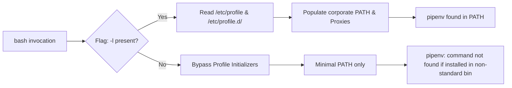

# Why Your Disposable Lock Container Needs a Login Shell and an Inode Mount

*Every flag in a one-line CI task exists to prevent a distinct operating system or packaging failure mode.*

At 4:30 PM on a Friday, an engineer on our team bumped a minor utility dependency, ran `pipenv lock` locally on an M2 MacBook, and pushed. CI passed without a hitch. But twenty minutes after deployment, the Linux staging service crashed on boot: a compiled wheel had resolved against Darwin ABI binaries instead of the target production Linux architecture.

When the team initially tried running the lock generation inside a quick CI Docker step to fix the discrepancy, a second wave of headaches hit. Runners ran out of disk space overnight from hundreds of orphaned stopped containers. Internal proxy certificates vanished into thin air. And at one point, the updated lockfile generated inside the container completely failed to appear on the host.

That pain led to this battle-hardened enterprise recipe for locking dependencies without poisoning the host runner or creating phantom artifacts:

```bash
docker run --rm -v "$PWD":/w -w /w python:3.8-slim bash -lc \
  "pip install --index-url https://pypi.example.com/repository/pypi-all/simple pipenv && pipenv lock"
```

To a casual observer, this looks like an over-engineered one-liner. To the host kernel, the container runtime, and the package manager, it is a choreographed handoff across three isolation boundaries. By the end of this breakdown, you will know the exact kernel, shell, and packaging failure modes prevented by every token in this single-line command.

---

## 🛠️ The Runtime Boundary: Daemon Dispatch and Writable Layers

When you type `docker run`, the client does not execute the container. It serializes the command into a REST API payload and transmits it over `/var/run/docker.sock` to `dockerd`.

The daemon treats `run` as a composition of `create` and `start`. It looks up `python:3.8-slim` in the local image cache. If absent, it pulls the image manifest and unpacks the read-only image layers into the local storage driver (typically `overlay2`). It then stacks a thin, ephemeral writable layer directly on top of the immutable lower layers.

Without `--rm`, that writable layer survives process termination. Every manual run and every failed CI step leaves a dead container record in `docker ps -a`, consuming disk metadata and dangling layer directories inside `/var/lib/docker/overlay2/`. Adding `--rm` instructs the daemon to invoke the equivalent of `docker rm` the instant the primary process yields an exit code. In continuous delivery, omitting `--rm` is a slow disk exhaustion leak.

---

## 🧠 File Projection: Why Inodes Make the Lock Emerge on the Host

The bridge between your host repo and the disposable environment hinges on `-v "$PWD":/w` and `-w /w`.

A common misunderstanding is that Docker copies your repository into the container on start and synchronizes it back on exit. It does neither. Docker executes a Linux `mount --bind` syscall. A bind mount does not copy files; it projects an existing inode across a mount namespace boundary. The host directory and the container mount point point to the exact same filesystem entry.

| Mechanism | Data Location | Inode Identity | Initial State | Primary Utility |
|---|---|---|---|---|
| **Bind Mount** (`-v /path:/path`) | Arbitrary host path | Shared directly with host | Mirrors host contents immediately | Ephemeral builds, source-tree compilation |
| **Named Volume** (`-v name:/path`) | Docker storage (`/var/lib/docker/volumes/`) | Managed isolated filesystem | Fills from target container directory | Persistent state (PostgreSQL, Redis) |
| **Writable Layer** (No mounts) | Ephemeral overlay layer | Unique ephemeral container inode | Inherits base image lower directory | Scratched runtime state, discarded on exit |

Because the inodes are identical, when `pipenv lock` writes bytes to `/w/Pipfile.lock` inside the container, the host kernel writes those blocks directly to the host filesystem. No export step exists.

Setting `-w /w` sets the process working directory before executing the command, equivalent to an inline `WORKDIR`. Because `pipenv` discovers project context by scanning the current working directory for a `Pipfile`, `-v` without `-w` mounts the repository into an isolated silo while the process executes in the container root (`/`), failing immediately with a missing manifest error.

> 📌 **Takeaway:** Bind mounts operate on shared kernel inodes; your disposable container never copies project files, which is why host write permissions and directory paths must align exactly.

---

## 🏗️ The Execution Layer: Why `-lc` Is Defensive Engineering

The base image `python:3.8-slim` configures `CMD ["python3"]`. Passing `bash` explicitly replaces that command with an interactive shell binary, but the flags attached to it dictate whether installed tools remain reachable.

`-c` tells bash to read instructions from the subsequent string argument rather than waiting on standard input. The critical flag beside it is `-l`, which forces a **login shell**.

A non-login subshell invoked via `bash -c` executes in a bare-bones environment, bypassing profile initialization scripts. A login shell reads `/etc/profile` and sources `/etc/profile.d/*.sh`. When CLI tools install into user directories (such as `~/.local/bin`) or enterprise environments inject internal corporate proxy configurations and certification bundles into `/etc/profile.d/`, a non-login shell cannot see them.



Wrapping the commands in `bash -lc` guarantees that standard directory paths and enterprise initialization scripts execute before Python attempts to run `pipenv`.

---

## 💡 Packaging Security: The Difference Between Index Flags

The command routes package installation through an internal artifact repository:

```bash
pip install --index-url https://pypi.example.com/repository/pypi-all/simple pipenv && pipenv lock
```

The choice between `--index-url` and `--extra-index-url` is an architectural security boundary, not syntax preference.

`--index-url` completely overrides the default Python Package Index (`https://pypi.org/simple`). Pip queries only the single repository specified. In a hardened environment, that internal URL points to a group repository: a proxy that caches approved public packages alongside internally hosted proprietary wheels.

🩸 **The Danger:** Had this command used `--extra-index-url`, pip would query both the internal proxy and the public PyPI registry. If an external attacker uploads a package to public PyPI with the same name as an internal library but a higher version number, pip installs the public wheel by default. Alex Birsan proved this dependency confusion attack across dozens of major tech organizations in 2021. Using `--index-url` exclusively eliminates multi-source ambiguity.

The command chains the operations with `&&`. If network instability or TLS handshake failures cause `pip install` to return a non-zero exit code, execution halts immediately. A semicolon (`;`) would proceed blindly to `pipenv lock`, which would then fail with a missing binary error and obscure the underlying network fault.

---

## 🧭 Resolvers and Modern Realities

Why does `pipenv lock` take minutes inside an ephemeral container?

Dependency resolution is NP-complete. Since pip 20.3, the resolution engine relies on `resolvelib`, an backtracking algorithm that searches for an intersection of constraints across all transitive dependencies. When package constraints diverge across transitive trees, the resolver backtracks and tests alternative versions:

```text
Package Alpha depends on: numpy >= 1.21, < 1.23
Package Beta  depends on: numpy >= 1.24
==> Constraint conflict: resolver halts, rewinds, and inspects older metadata candidates.
```

Every backtracking step sends HTTP requests to the PEP 503 Simple Repository endpoint on the internal repository mirror to parse candidate versions. Under enterprise latency, backtracking through hundreds of metadata tags degrades performance severely.

### The Honest Limit

Running dependency lock generation inside ad-hoc container invocations during local development is worth the virtualization latency penalty on macOS.

On Linux, bind mounts execute at native hardware speed. On macOS or Windows, bind mounts must cross a virtualization boundary (VirtioFS or gRPC FUSE). Resolving dependencies in an ephemeral container on macOS incurs noticeable I/O latency while generating lock metadata. Developers frequently protest that local virtual environments are five times faster. They are correct about the speed. What they overlook is that local environments mask Python minor-version differences, whereas the ephemeral container guarantees that the generated hashes match the Linux production deployment target.

### Where the Ecosystem Moved

If you maintain legacy services pinned to older runtimes like Python 3.8 (which reached official End of Life in October 2024), this disposable container pattern keeps build environments reproducible without contaminating modern developer workstations.

For modern greenfield services, the ecosystem has moved beyond invoking runtime shells to run `pipenv`. Modern workflows use Rust-based toolchains like `uv` directly from dedicated base images:

```bash
docker run --rm -v "$PWD":/w -w /w ghcr.io/astral-sh/uv:latest uv lock
```

This strips out the intermediate `bash` layer, eliminates the startup penalty of installing the locking tool inside the container, and resolves the transitive SAT problem in sub-second timelines.

Open your primary continuous integration repository and inspect your dependency-locking step. Does it specify `--index-url` or `--extra-index-url` against your internal proxy, and what happens to your build if someone registers your private package names on public PyPI tonight?