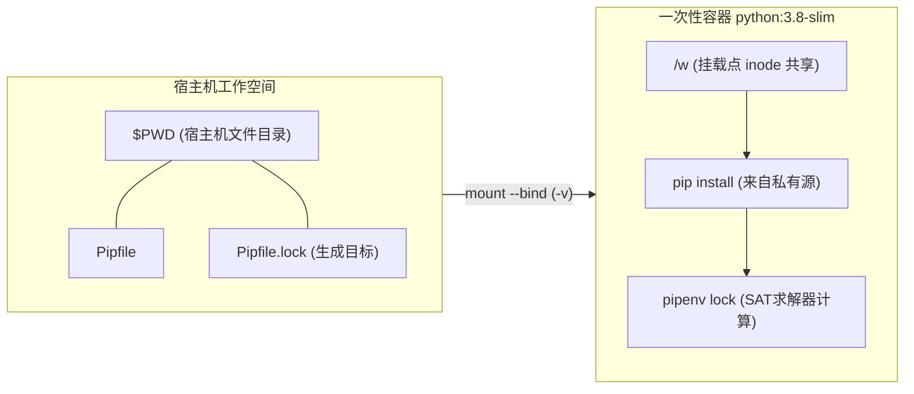

# 为什么顶尖团队的 CI 脚本里总有这样一条 Docker 命令？

*为什么顶尖团队宁可在一次性容器里用 `bash -lc` 绕一大圈，也不愿在宿主机上敲下那行依赖锁命令*

周五下午四点半，刚加入团队两周的小陈正顺手重构流水线。

翻看遗留仓库的 CI 脚本时，他被一段又臭又长的单行命令彻底整懵了：

```bash
docker run --rm -v "$PWD":/w -w /w python:3.8-slim bash -lc \
  "pip install --index-url https://nexus.internal-repo.net/repository/pypi-all/simple pipenv && pipenv lock"
```

「这不典型的脱裤子放屁吗？」小陈心里嘀咕：宿主机上明明配好了 Python 环境，直接敲一行 `pipenv lock` 撑死两秒钟，为什么要大动干戈起一个容器、挂载目录、换源装包，再在容器里做依赖锁？

他果断删掉了这个"过度设计"的命令，改成了清爽利落的本地调用并提交 MR。半小时后，他的改动就引发了一场小型风暴：流水线生成的文件在测试集群抛出 `GLIBC` 符号缺失错误直接崩溃，而安全扫描工具更是亮起刺眼的警报——他的本地环境绕过了私有镜像网关，从公网意外拉取到了影子依赖。

老架构师赶来回滚时只对他说了一句话：**「看懂这条命令的人，看到的是一套完整的无菌操作规范；看不懂的人，只看到了一长串莫名其妙的参数。」**

今天我们就把这行看似笨重的古怪命令掰开揉碎。读完它，你不仅能看懂背后这套精密的沙盒设计，还能顺手排查出团队构建脚本里隐蔽的供应链安全死角。

---

## 🛠️ 拆解：10 个 Token 下的内核语义

很多人以为 Docker 只是虚拟机的轻量替代品，但在这条命令里，它扮演的是一个一次性沙盒。



我们按字节拆开它的执行流：

1. **`docker run`**：并不神秘，它是 `docker create` 加上 `docker start` 的语法糖。Docker daemon 会在底层分配 namespace、初始化 cgroup，并拉起一个独立且可写的 OverlayFS 容器顶层薄层（thin layer）。
2. **`--rm`**：容器退出那一刹那，自动执行 `docker rm` 抹掉上述可写层。这是 CI 和批处理脚本里最重要的卫生习惯——漏掉它，你的宿主机磁盘早晚会被 `docker ps -a` 里的成千上万具容器僵尸啃光。
3. **`-v "$PWD":/w`**：这是关键的 **Bind Mount**（而非 Docker volume）。宿主环境的当前绝对路径，通过内核系统调用 `mount --bind` 直接映射到容器内的 mount namespace。二者共享底层的同一个 inode，无额外文件拷贝开销。容器内写文件，宿主机立刻生效。
4. **`-w /w`**：将容器的运行时工作目录切换到挂载点。依赖解析工具启动时必须在自己的当前目录看到输入文件，二者缺一不可。
5. **`python:3.8-slim`**：选择官方 Debian 裁剪版。相比动辄大几百兆的 full 镜像，slim 砍掉了构建套件，但保留了完整的 glibc 运行时，能直接跑大多数 pre-built wheel，避开 Alpine（musl libc）在 Python 生态中频繁遭遇的现场源码编译灾难。
6. **`bash -lc`**：**最容易被当作废话砍掉的两个字符**。覆盖默认入口的同时，`-l`（login shell）强制 bash 按照顺序加载 `/etc/profile` 及系统初始化环境变量。很多企业自定义镜像内部的代理路由、安全证书配置和可执行路径（如 `~/.local/bin`），全靠 login profile 注入。少一个 `-l`，某些特殊环境下命令就会死于 `command not found`。
7. **`&&` 与逻辑穿透**：只有依赖工具安装退出码为 `0` 时，才允许执行锁定命令，拒绝把脏状态写回宿主机。

---

## 致命边界：为什么是 `--index-url` 而不是 `--extra-index-url`？

在这条命令里，有极多人在写内网配置时犯过一个看似无伤大雅的错误：用 `--extra-index-url` 去挂载内部私有仓库。

> 🩸 **血泪提醒**：千万不要用 `--extra-index-url` 指向你的企业私有仓库。这不仅是配置偏好问题，这是一道敞开的供应链安全后门。

安全研究员 Alex Birsan 在 2021 年公开的**依赖混淆攻击（Dependency Confusion）**，就是利用了这个心理盲区。来看看这两者的致命差异：

| 配置指令 | 行为定义 | 安全评级与潜在后果 |
|---|---|---|
| `--index-url` | **彻底替换**默认源。包管理器只且仅只向指定源发起查询 | **安全**。所有流量被企业内部制品库（Nexus/Artifactory）收口与阻断 |
| `--extra-index-url` | **追加**查询源。包管理器会并发或顺序同时轮询官方 PyPI 与额外源 | **极高危**。当公网上出现同名且版本号更高的恶意包时，客户端会直接拉取公网恶意包 |

规范的企业架构中，Nexus 或 Artifactory 会作为一个 Group Repository：内部同时聚合了指向公网官方 PyPI 的只读缓存 Proxy，以及用于存放自研私有组件的 Hosted 仓库。通过 `--index-url` 将流量死死按在内部网关中，企业才能实现全量 CVE 阻断、许可证合规审计与网络隔离。

---

## 为什么要在一次性容器里做 Dependency Resolution？

如果你问一个初级工程师：生成依赖锁文件为什么不能在宿主机直接跑？他可能会说“容器方便”。但这根本没有触及技术核心。

### 1. 消除环境标记（Environment Markers）的虚假一致
Python 的依赖声明标准（PEP 508）允许依赖包含环境判断。例如某个库可以声明：
```text
importlib-metadata; python_version < "3.8"
foo-runtime; sys_platform == "linux"
```
如果开发者在自己的 macOS（Python 3.11）宿主机上执行 lock，解析器得出的树形图可能与目标生产环境（Linux + Python 3.8）产生致命分歧。在与生产镜像完全同源的 Docker 镜像内 lock，是把“在我电脑上能跑”这种幽灵问题彻底扼杀在摇篮里的唯一方法。

### 2. 为什么你的解析器动不动卡死几分钟？
依赖锁定本质上是一个 **NP-Complete 问题**（可等价规约至布尔可满足性问题 SAT）。当你的大型系统里同时引用了数十个上游依赖，而依赖 A 要求 `numpy>=1.21,<1.23`，依赖 B 又要求 `numpy>=1.24` 时，解析器（如 pip 内部基于回溯的 resolvelib）就会进入漫长的树形搜索回溯。

如果在每一次回溯探测版本时，客户端都要穿透内网代理往返查询一遍元数据，依赖锁定耗时几分钟到十几分钟绝非罕见。

---

## 🏗️ 进化：2026 年我们如何重写这一套逻辑？

技术演进不是线性的，往往是跨维度的替换。回顾上面的整套工作流，它解决了环境隔离与安全溯源，但代价极其昂贵：容器启动、现场拉取包管理器、SAT 穷举回溯。

### 一个可直接带走的现代化替代范式
如果你在维护新项目，彻底扔掉老旧工具链，用基于 Rust 重写的现代工具链替换：

```bash
# 现代化等价命令：零依赖安装，基于 Astral uv 的极速依赖锁定
docker run --rm -v "$PWD":/w -w /w ghcr.io/astral-sh/uv:latest \
  uv lock --index-url https://nexus.internal-repo.net/repository/pypi-all/simple
```

为什么这个组合能把几分钟压到两秒内？
1. **内置单二进制文件**：官方 `uv` 镜像不需要临时在容器内部执行任何包管理安装。
2. **解算器性能飞跃**：`uv` 内部采用 PubGrub 算法与系统级缓存，依赖解析速度相比老旧工具链有 10 到 100 倍的断代式提升。
3. **更清晰的边界**：老旧版本的生命周期（Python 3.8 已经在 2024 年末彻底到达 EOL，不应再接收任何公开安全修补）应当在基础设施层面被直接阻拦，而不是在容器单行里苟延残喘。

> 📌 **本节要点**：一次性构建沙盒的核心原则是「现场不装工具、解析不查全网、状态全靠挂载」。用带有预置解算器的轻量镜像替代“裸镜像+临时 pip 安装”，才是现代团队的标准动作。

---

## 尚未闭合的攻击面

我们回过头看这串看似臃肿的脚本：它像极了无菌手术室的操作规程——宿主机是不能随便污染的本体，容器是无菌隔离间，`-v` 是唯一的开创手术窗口，`--rm` 是一次性手术刀具，而 `--index-url` 则是严格锁死、杜绝假药的药品采购准入。

但这里依然存在一个未闭合的风险点：**在上面的命令中，虽然仓库地址走的是内部私有源，但依赖工具安装本身并没有提供固定的版本约束或 SHA256 哈希防线。**

打开你目前公司的主力 CI/CD 仓库，搜一下你们流水线里类似的一键打包与锁版本脚本。看看你们用的到底是 `--index-url` 还是 `--extra-index-url`？再看看你们是否也还在一次性容器里，毫无防备地安装着未锁死版本的构建工具？
