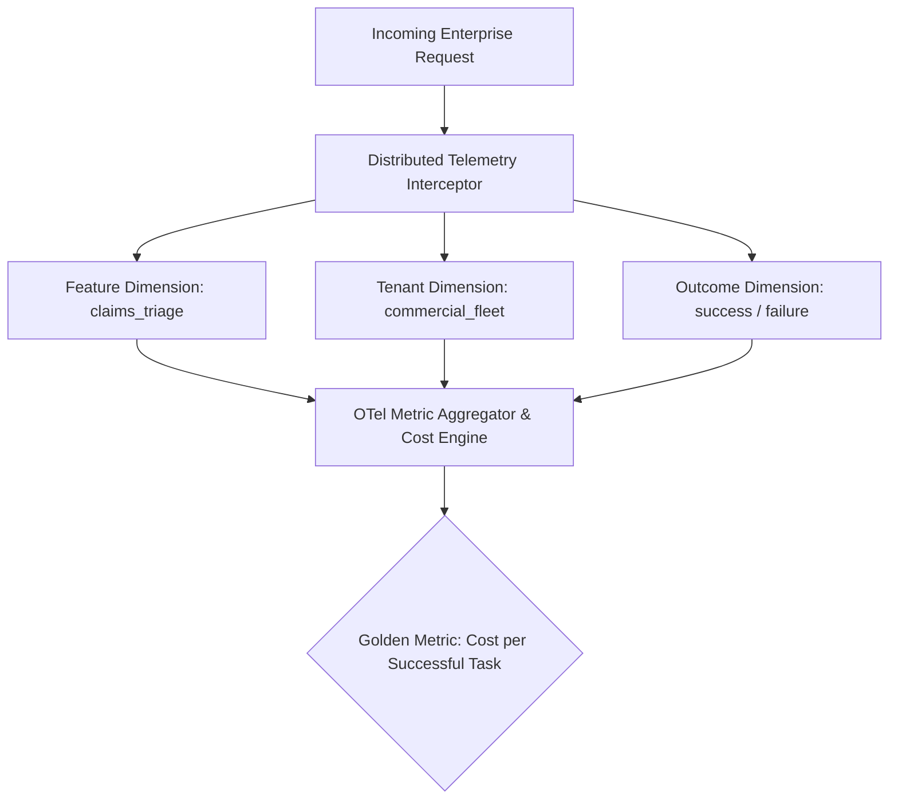
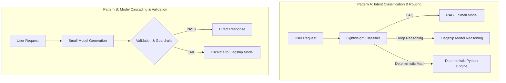
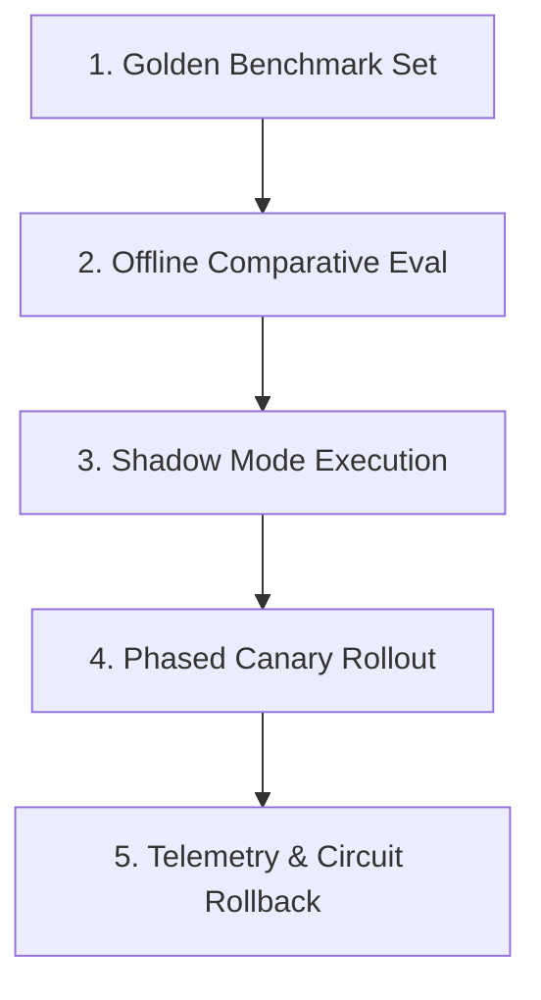
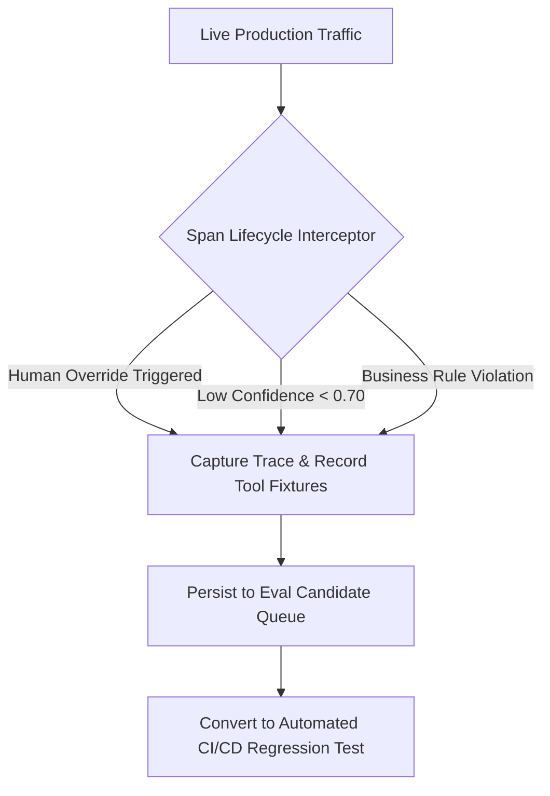

> "We measure what we value, and we value what we measure. In the silent expanse of artificial intelligence, an unobserved failure is not merely a technical glitch—it is a quiet erosion of truth."

# The Silent Cost of AI: Observability, Multi-Model Routing, and Production Telemetry in Enterprise Systems

*In high-concurrency, heavily regulated enterprise AI architectures, cost is not an accounting afterthought reviewed at the end of the month—it is a first-class engineering constraint that must be governed from day one.*

> **【Enterprise Context Note】**
> In this deep-dive production guide, **Aegis** (derived from the mythical shield of steadfast protection and rigorous risk governance) is used as an enterprise pseudonym for a global Tier-1 insurance and financial carrier (Fortune Global 100). This honors confidentiality boundaries while presenting authentic, production-grade AI-native engineering under strict compliance and high transaction volumes.

Open your cloud billing portal and APM dashboard, and answer one critical question: over the past seven days, what was the average cost of completing a single successful task in your production AI pipeline?

If your systems can only output a macro token consumption total or a monthly aggregated cloud invoice, your architecture is operating completely blind. Without knowing which specific feature drives consumption, and without quantifying how much budget is burned on retries, fallbacks, and failed invocations, any attempt at "model downscaling" or "cost cutting" is mere guesswork.

As a Lead AI Engineer navigating architectural reviews, the worst posture when addressing budget concerns is to pitch a grab-bag of isolated cost-saving tricks. Senior engineering leadership requires a structured, principled approach: **establish the framework first, then implement the mechanisms**. Management and architecture committees care that you treat cost as a first-class engineering constraint, not that you panic after receiving the invoice.

The genuine prerequisite to cost optimization is a comprehensive evaluation (eval) suite coupled with granular telemetry. Without an evaluation foundation, you cannot safely swap in a smaller model—because without measurement, you have no way of knowing how much quality degraded. Once end-to-end observability and rigorous benchmarking are in place, cost optimization becomes a natural byproduct.

## 1. First Principles of Cost Engineering and the 3D Attribution Matrix

In distributed enterprise architectures and autonomous agent systems, **cost must be attributable**. Without fine-grained telemetry, any optimization strategy amounts to blind conjecture.

In daily engineering practice, constructing a production-grade cost attribution framework demands four foundational pillars:

1. **Granular Span Tracing**: Every model invocation and tool execution must be encapsulated as a distinct distributed tracing Span, faithfully capturing input tokens, output tokens, precise model identifiers, and exact execution duration.
2. **Three-Dimensional Attribution Matrix**: Cost cannot be aggregated into a single indiscriminate billing bucket. It must resolve across three distinct operational dimensions:
   - **Feature Dimension**: Pinpointing whether the claims triage agent, policy comparison engine, or internal helpdesk is driving token consumption.
   - **Tenant Dimension**: Distinguishing whether enterprise clients or specific internal divisions are exceeding budgeted allocations.
   - **Outcome Dimension**: Explicitly differentiating between successful task completions and anomalous executions that triggered multi-round compensatory retries.
3. **The Core Paradigm Shift: Cost per Call vs. Cost per Successful Task**: Many engineering teams obsess over comparing per-1k-token API price sheets across model vendors. This single-call perspective is profoundly misleading. Failed calls burn real budget. If a lightweight, low-cost model fails, hallucinating and requiring three retries before finishing, its aggregate token volume, network I/O latency, and degraded customer perception will dwarf the cost of a flagship model that succeeded on the first attempt. **Cost per successful task is the single golden metric that production systems must optimize.**
4. **The Evaluation Triad**: In offline benchmarking and online shadow evaluation, cost, latency, and accuracy must be treated as co-equal first-class metrics. Any prompt revision or routing policy update must demonstrate balanced performance across all three dimensions, eliminating the trap of sacrificing correctness for superficial savings.



```flowchart
Incoming Enterprise Request
            ↓
Distributed Telemetry Interceptor
     ┌──────┼──────┐
     ↓      ↓      ↓
  Feature Tenant Outcome
  Dimension Dimension Dimension
     └──────┼──────┘
            ↓
OTel Metric Aggregator & Cost Engine
            ↓
Golden Metric: Cost per Successful Task
```

### Safety Guardrails Against Runaway Agent Loops

In regulated financial and insurance environments, preventing unbounded autonomous agent loops is an existential reliability requirement. For every runtime session, the execution engine must enforce three hard circuit-breaker ceilings:

- **Max Steps Ceiling**: Capping multi-step reasoning cycles (e.g., maximum 10 steps per invocation), preventing agents from getting trapped in endless reflection cycles.
- **Max Tokens Ceiling**: Setting hard per-session token limits (e.g., soft threshold at 32k tokens, hard cutoff at 64k tokens).
- **Max Tool Calls Ceiling**: Restricting total external tool executions to prevent catastrophic recursive loops triggered by bad parameters.

Combined with real-time tenant rate limiting and automated budget anomaly alerts, these guardrails eliminate the risk of an agent draining cloud quotas overnight due to logic flaws. This is reliability engineering first, and financial defense second.

## 2. The Four-Tier Cost Optimization Matrix Ordered by Leverage

Once attribution metrics and safety guardrails are established, optimization initiatives can proceed methodically. In technical reviews and architectural planning, cost reduction techniques must be prioritized strictly by leverage, rather than wasting engineering cycles on low-yield tweaks.

| Optimization Tier | Typical Leverage | Core Strategies and Implementation Focus | Architectural Recommendation |
|---|---|---|---|
| **Architecture Tier** | **10x** (Highest Priority) | Deterministic intent interception, pruning redundant agent hops, content-addressed semantic caching | The vast majority of standard requests should never hit autonomous reasoning pipelines |
| **Model Routing Tier** | **3x ~ 5x** | Small model triage, model cascading, eval-proven downscaling | Replace intuition with benchmarked evaluation; enforce tight structured output lengths |
| **Token Context Tier** | **30% ~ 60%** | Byte-stable prompt caching, tool schema slimming, context compaction, precision reranking | Keep static system prompt prefixes byte-aligned; eliminate dynamic timestamps in prefixes |
| **Runtime Ops Tier** | **20% ~ 50%** | Asynchronous batch processing, streaming perceived latency optimization, hard tenant quotas | Maximize offline discounts; route non-real-time workloads to half-price batch endpoints |

### 1. Architecture Layer: Intercepting 90% of Unnecessary Reasoning

The architectural layer delivers an entire order of magnitude in cost savings. The root cause of token budget crises in most enterprises is treating autonomous agent loops as an indiscriminate entry point for all incoming traffic.

- **Deterministic Routing and Fast-Path Interception**: In production, the overwhelming majority of user queries fall into common, high-frequency categories (such as standard policy definitions or routine workflow triggers). Positioning a lightweight classifier at the system boundary routes straightforward intents directly to deterministic code or standard retrieval pipelines, reserving autonomous agents purely for complex, ambiguous reasoning.
- **Pruning Redundant Agent Reasoning Hops**: In an autonomous agent, each iterative reasoning hop re-transmits the complete cumulative conversational history and all previous tool outputs. An interaction that could complete in three hops but drags out to eight hops due to poor task decomposition will experience quadratic token growth.
- **Content-Addressed Result Caching**: For deterministic extraction tasks, static policy document indexing, and common intent tags, results should be cached using content-addressed hashes. Never invoke an LLM repeatedly on identical immutable inputs.

### 2. Model Routing Layer: Small Models First with Cascaded Escalation

- **Tiered Dynamic Routing**: Decompose incoming requests so that lightweight models handle entity extraction, structured argument parsing, and initial path selection, while high-tier reasoning models are invoked exclusively for final synthesis and nuanced legal or risk judgements.
- **Evaluation-Backed Model Downscaling**: Engineers must never downgrade production models based on casual manual testing. Downscaling policies require rigorous evaluation on representative golden test sets. A lightweight model should only be deployed to production when verified data proves zero degradation against task-specific acceptance thresholds.
- **Structured Schema Output and Strict Truncation**: Output tokens are typically priced three to four times higher than input tokens and directly determine response latency. Enforcing strict JSON Schemas and setting hard output length limits prevents models from inflating costs with verbose pleasantries.

### 3. Token Context Layer: Maximizing Information Density per Byte

- **The Byte-Stability Trap in Prompt Caching**: Cloud providers and model platforms offer prompt caching mechanisms where cache-hit input tokens receive 50% to 90% pricing discounts. However, many systems inadvertently break this mechanism by injecting dynamic timestamps (e.g., `Current Time: 2026-10-09 22:15:00`) or unique request IDs into the system prompt prefix. This destroys byte-level alignment, dropping the cache hit rate to zero. **System prompts, tool definitions, and reference documentation must remain strictly static and byte-aligned at the prefix.**
- **Tool Schema Pruning**: During function calling, the JSON Schema definitions for all available tools are serialized into the model's context on every invocation round. Equipping an agent with 20 bloated, overlapping tools can consume thousands of tokens per step. Consolidating and pruning these into 7 clean, orthogonal tool definitions cuts recurring token overhead while dramatically improving tool selection accuracy.
- **Context Compaction and Sub-Agent Sandboxing**: Multi-turn sessions require periodic compaction. Sub-tasks with high internal verbosity should be dispatched to isolated sub-agents; only their final structured findings should return to the primary orchestrator, preventing intermediate exploratory noise from polluting the main context window.
- **Precision Retrieval over Candidate Flooding**: In RAG pipelines, delivering Top-5 tightly reranked passages consistently outperforms dumping Top-50 raw vector matches into the context. Flooding context windows not only burns tokens, but it also degrades generation quality through attention dilution and increased hallucination risk.

### 4. Runtime Layer: Batch Processing and Operational Safeguards

- **Asynchronous Batch API Processing**: For non-real-time workloads—such as overnight document auditing, knowledge base re-indexing, or historical compliance reviews—traffic should be routed to asynchronous Batch APIs, which offer standard 50% price discounts for 24-hour delivery turnarounds.
- **Streaming for Perceived Latency**: While streaming does not reduce token volume, it compresses time-to-first-token (TTFT) to milliseconds, mitigating user waiting anxiety and preventing teams from prematurely upgrading to expensive high-tier compute solely for perceived responsiveness.

## 3. Production-Grade Multi-Model Dynamic Routing: Architecture and Python Implementation

In enterprise AI systems, **Small Model First, Large Model When Needed** is the defining architectural pattern for sustainable scalability. This is far more than a localized token-saving trick; it represents a comprehensive system design spanning dynamic model routing, model cascading, and cost governance.

The foundational design principle is straightforward: **never allow the most expensive compute resource in your fleet to handle routine, trivial interactions.** A lightweight classifier or deterministic rule must first evaluate the intent category, semantic complexity, and regulatory risk of the request; only when lightweight models lack sufficient reasoning capacity or when regulatory risk demands it should the pipeline escalate to flagship models.

### 1. Four Production-Grade Dynamic Routing Patterns



- **Pattern A: Intent Classification and Routing**: A lightweight classifier evaluates incoming requests and dispatches them to appropriate execution paths. Ideal for customer service assistants, enterprise knowledge bases, and IT helpdesks.
  ```flowchart
  * Policy FAQ Query         → RAG + Small Model
  * Deep Contract Reasoning  → Flagship LLM
  * Financial Calculation    → Deterministic Python Tool
  * Out-of-Bounds Request    → Safety Guardrail Interception
  ```
- **Pattern B: Model Cascading**: A small model generates an initial answer, which undergoes immediate deterministic quality checks. If validation fails or confidence is low, the request escalates to a larger model. Ideal for structured information extraction and document summarization.
  ```flowchart
  User Request
       ↓
  Small Model Generation
       ↓
  Quality & Rule Validation
   ↙                    ↘
  PASS                  FAIL
   ↓                      ↓
  Return Result      Escalate to Flagship Model
  ```
- **Pattern C: Complexity-Based Routing**: Queries are graded into complexity tiers based on semantic embeddings and multi-factor heuristics: simple questions route to small models, moderate reasoning routes to mid-tier models, and complex multi-step analysis routes to flagship models.
- **Pattern D: Semantic Cache and Routing Combined**: High-frequency queries pass through a vector-similarity semantic cache before touching any model. Cache hits return validated responses immediately with zero token expenditure.
  ```flowchart
  Incoming Request
         ↓
  Semantic Vector Cache
   ↙               ↘
  Cache Hit        Cache Miss
   ↓                 ↓
  Return Response  Trigger Dynamic Router
  ```

### 2. Managed Cloud Routers vs. Custom In-House Routing

Modern cloud ecosystems offer managed routing capabilities, such as Amazon Bedrock's **Intelligent Prompt Routing**. These managed services automatically balance cost and response quality across supported models within the same family.

```flowchart
Enterprise Application
           │
           ▼
Bedrock Intelligent Prompt Router
           │
           ├── Simple Query (Target Quality Met) ──► Small Model (e.g., Claude Haiku)
           │
           └── Complex Query (High Reasoning) ────► Flagship Model (e.g., Claude Sonnet)
```

However, in heavily regulated financial environments like Aegis, managed routers have notable limitations: they cannot route across heterogeneous cloud providers, cannot embed proprietary deterministic business validation rules, and lack internal compliance auditing hooks. **Building a custom, fully observable in-house router in Python provides the control, transparency, and adaptability needed for enterprise governance.**

### 3. Production-Ready Python Dynamic Router Implementation

Below is a production-hardened multi-model dynamic router implementation in Python, complete with Pydantic validation, deterministic fast-paths, a lightweight classifier, a Fail-Closed fallback policy, deterministic tool dispatch, and millisecond latency telemetry:

```python
# -*- coding: utf-8 -*-
import json
import time
from typing import Literal, Optional
from pydantic import BaseModel, Field


# ---------------------------------------------------------------------------
# Data Models and Type Definitions
# ---------------------------------------------------------------------------

class RouteDecision(BaseModel):
    """Structured decision emitted by the lightweight classification model."""
    intent: Literal[
        "faq",
        "policy_inquiry",
        "policy_comparison",
        "complex_claim_analysis",
        "calculation",
        "greeting",
        "unknown"
    ]
    complexity: Literal["low", "medium", "high"]
    confidence: float = Field(ge=0.0, le=1.0, description="Classifier confidence score")
    reasoning: str = Field(description="Architectural rationale for path selection")


# ---------------------------------------------------------------------------
# Backend Adapters and Model Configuration
# ---------------------------------------------------------------------------

SMALL_MODEL = "claude-3-5-haiku-20241022"
LARGE_MODEL = "claude-3-7-sonnet-20250219"

# Deterministic greetings requiring zero model invocation
FAST_PATH_GREETINGS = {"hi", "hello", "hey", "greetings", "good morning", "good afternoon"}


def call_mock_llm(model: str, prompt: str) -> str:
    """Mock interface representing authenticated internal model endpoints."""
    time.sleep(0.05 if "haiku" in model else 0.2)
    return f"[{model}] Verified response to query: '{prompt[:35]}...'."


def classify_request(question: str) -> Optional[RouteDecision]:
    """
    Evaluates query intent and complexity using a lightweight model.
    Returns None if classifier execution fails or JSON output is invalid.
    """
    q_lower = question.strip().lower()
    
    if "stolen" in q_lower or "theft" in q_lower or "claim" in q_lower:
        return RouteDecision(
            intent="complex_claim_analysis",
            complexity="high",
            confidence=0.88,
            reasoning="Requires legal clause reasoning over overseas exclusions."
        )
    elif "calculate" in q_lower or "excess amount" in q_lower or "deductible" in q_lower:
        return RouteDecision(
            intent="calculation",
            complexity="low",
            confidence=0.95,
            reasoning="Exact financial calculation required; route to deterministic engine."
        )
    elif "what is" in q_lower or "define" in q_lower:
        return RouteDecision(
            intent="faq",
            complexity="low",
            confidence=0.92,
            reasoning="Standard definition query; lightweight RAG pipeline is sufficient."
        )
    else:
        return RouteDecision(
            intent="unknown",
            complexity="medium",
            confidence=0.65,
            reasoning="Ambiguous phrasing; confidence falls below safety margin."
        )


# ---------------------------------------------------------------------------
# Core Production Routing Engine
# ---------------------------------------------------------------------------

def handle_request(question: str) -> dict:
    """
    Production-grade dynamic multi-model dispatcher.
    Follows Fail-Closed security: on classification errors or low confidence,
    the request safely escalates to the flagship model.
    """
    started_at = time.perf_counter()
    clean_q = question.strip()
    
    route: str = "unknown"
    reason: str = "init"
    answer: str = ""
    
    # Phase 1: Deterministic fast-path (0 token cost, microsecond latency)
    if clean_q.lower() in FAST_PATH_GREETINGS:
        route = "fast_rule"
        reason = "deterministic_greeting"
        answer = "Hello! I am the Aegis Enterprise Assistant. How may I assist your policy inquiry today?"
        
    else:
        # Phase 2: Lightweight classification with error containment
        try:
            decision = classify_request(clean_q)
        except Exception:
            decision = None
            
        # Phase 3: Risk-aware path dispatch (Fail-Closed Architecture)
        if decision is None:
            # Classification failure fallback: escalate to flagship model
            route = "large_model"
            reason = "classifier_failure_fallback"
            answer = call_mock_llm(LARGE_MODEL, clean_q)
            
        elif decision.confidence < 0.80:
            # Confidence threshold breach: escalate to maintain accuracy
            route = "large_model"
            reason = f"low_classifier_confidence ({decision.confidence:.2f})"
            answer = call_mock_llm(LARGE_MODEL, clean_q)
            
        elif decision.intent in {"policy_comparison", "complex_claim_analysis", "unknown"} or decision.complexity == "high":
            # High-risk policy analysis: route directly to flagship model
            route = "large_model"
            reason = f"high_risk_intent ({decision.intent})"
            answer = call_mock_llm(LARGE_MODEL, clean_q)
            
        elif decision.intent == "calculation":
            # Numerical calculation: dispatch to verified deterministic tool
            route = "deterministic_tool"
            reason = "calculation_engine_dispatch"
            answer = "[Deterministic Math Engine] Excess evaluated at precisely $250.00 AUD."
            
        else:
            # High-confidence, routine query: execute via lightweight model
            route = "small_model"
            reason = f"safe_simple_intent ({decision.intent})"
            answer = call_mock_llm(SMALL_MODEL, clean_q)

    latency_ms = round((time.perf_counter() - started_at) * 1000, 2)
    
    return {
        "question": question,
        "route_selected": route,
        "decision_reason": reason,
        "latency_ms": latency_ms,
        "final_answer": answer
    }


if __name__ == "__main__":
    queries = [
        "Hello",
        "What is excess under my travel insurance policy?",
        "My laptop was stolen overseas during transit. Can I claim full replacement?",
        "Calculate the total excess amount for two combined claims."
    ]
    for q in queries:
        print(json.dumps(handle_request(q), indent=2))
```

### 4. Mathematical Cost Verification: 100,000 Invocations

The table below quantifies the financial return of implementing dynamic routing over 100,000 enterprise requests, demonstrating why routing overhead must be factored into the equation:

| Parameter | Baseline Value |
|---|---|
| **Small Model Invocations Unit Cost** | $0.001 |
| **Large Model Invocations Unit Cost** | $0.020 |
| **Classifier Invocations Unit Cost** | $0.0002 |
| **Percentage Routed to Large Model** | 20% |
| **Percentage Resolved by Small Model** | 80% |

- **All Traffic to Large Model**:
  $$100{,}000 \times \$0.020 = \$2{,}000$$
- **Dynamic Classification and Tiered Dispatch**:
  $$\begin{aligned}
  C &= 100{,}000 \times \$0.0002 \text{ (Classifier Cost)} \\
  &\quad + 80{,}000 \times \$0.001 \text{ (Small Model Cost)} \\
  &\quad + 20{,}000 \times \$0.020 \text{ (Large Model Cost)} \\
  &= \$20 + \$80 + \$400 \\
  &= \$580
  \end{aligned}$$
- **Total Net Cost Reduction**:
  $$\frac{\$2{,}000 - \$580}{\$2{,}000} = \mathbf{71.0\%}$$

The architectural lesson is unambiguous: **the compute and latency overhead of the router itself must be accounted for in the system's financial model.** Evaluating savings by simply contrasting API list prices is insufficient.

### 5. Mitigating Selection Bias and the 5-Stage Safe Deployment Workflow

When evaluating multi-model routing architectures, teams often fall victim to **selection bias**: because the tasks routed to small models are inherently simpler, comparing small-model task accuracy directly against large-model task accuracy yields distorted conclusions.

Production evaluations require controlled testing across identical representative benchmarks, followed by a disciplined five-stage release workflow:



1. **Representative Golden Benchmark**: Curate representative production prompts covering high-frequency queries, multi-turn dialogues, edge cases, and compliance boundaries.
2. **Offline Comparative Evaluation**: Compare all-large-model vs. dynamically-routed pipelines across task accuracy, p95 latency, and token expenditure.
3. **Shadow Mode Execution**: Deploy the router in production shadow mode. The router evaluates live traffic asynchronously without exposing results to end users, logging dispatch accuracy.
4. **Phased Canary Rollout**: Progressively enable routing from 5% to 20% to 50% of live traffic, continuously tracking escalation rates and fallback frequencies.
5. **Continuous Telemetry and Automated Rollback**: Monitor quality metrics per business division; if quality degrades below safety thresholds, instantly fall back to verified configurations.

## 4. The Mental Model of Spans and the Genealogy of Distributed Tracing

When engineering cost governance and execution reliability in enterprise AI, every operational decision ultimately anchors to one core telemetry primitive: **the Span** and the discipline of **Distributed Tracing**.

### 1. The Minimal Mental Model of a Span

**The Span was not invented by OpenTelemetry.** A Span represents an indivisible unit of contiguous work within a distributed system, bounded by explicit start and end timestamps, execution status, and contextual attributes.

A production-grade Span contains the following essential components:

- **Unique Identity System**: A globally unique Trace ID (identifying the entire end-to-end transaction), the current Span ID, and a Parent Span ID.
- **High-Precision Timestamps**: Nanosecond-resolution start and end times, establishing precise operational duration.
- **Semantic Operation Name**: Describing the nature of the execution (e.g., `chat claude-3-7-sonnet` or `execute_tool lookup_policy`).
- **Execution Status**: Explicitly indicating `OK` or `ERROR`, with standardized error types.
- **Structured Attributes**: Strongly-typed key-value metadata (model names, token metrics, tenant IDs, user hashes).
- **Point-in-Time Events**: Timestamped annotations recording significant milestones within the Span's lifecycle (e.g., initial token streaming onset).
- **Causal Links**: Pointers establishing causal relationships across asynchronous batches or fan-out operations.

```
Complete Span Causal Tree for an Enterprise Insurance Claim Inquiry:
trace_id: a4f8e9102c4b... (Globally Unique Transaction Identifier)
└── [Span] invoke_agent claims_assistant                (4.2s, $0.031)  ← Root Span
    ├── [Span] execute_tool lookup_policy               (120ms)
    ├── [Span] execute_tool search_policy_documents     (340ms)
    │     retrieval.top_score=0.81  retrieval.k=5
    ├── [Span] chat claude-3-7-sonnet                   (2.1s)
    │     input_tokens=8420  cache_read=6100  output_tokens=310
    ├── [Span] execute_tool calculate_excess            (8ms)
    └── [Span] chat claude-3-7-sonnet (final)           (1.4s)
          confidence=0.62  grounding_rate=0.93
          → routed_to_human=true  (Confidence threshold breached; safe human handoff)
```

In system architecture, the operational boundaries between **Metrics, Logs, and Spans** must remain clearly defined:

- **Metrics** provide aggregated numerical health: answering macro questions like system throughput, error rates, and total token spend. They cannot explain why a specific interaction stalled for two minutes.
- **Logs** capture discrete, isolated events: in asynchronous, multi-agent architectures, millions of interleaved log lines are nearly impossible to reconstruct into causal execution chains.
- **Spans** provide structured causal topologies: by leveraging parent-child hierarchies and cross-process context propagation, Spans pinpoint exactly which sub-tool failed, which reasoning step drifted, and where latency accumulated.

### 2. The Golden Rule: What Deserves a Span?

When instrumenting enterprise AI applications, avoid both under-instrumentation and noisy over-instrumentation. The senior engineering heuristic is simple:

> **If this operation fails, throws an unhandled exception, or degrades in latency, would you urgently need to isolate its duration and metadata in an incident post-mortem?**

- ✅ **Every LLM Model Call**: The most computationally expensive and variable component of the system.
- ✅ **Every Tool and External API Invocation**: The primary point of failure for network timeouts, authentication errors, and payload mismatches.
- ✅ **Every Vector Database Retrieval**: Directly dictating RAG context quality; requires tracking search latency and Top-K scores.
- ✅ **The Master Agent Lifecycle**: Representing the root span coordinating multi-step state transitions.
- ❌ **Pure Internal Memory Computations**: Deterministic helper utilities executing in nanoseconds should never spawn Spans, which adds memory overhead and clutters telemetry.

### 3. Distributed Tracing Genealogy: From Dapper to OpenTelemetry (2026)

Tracing the historical evolution of distributed tracing reveals why contemporary industry standards took their current shape:

- **Academic Exploration (2002–2007)**: As distributed computing gained traction, traditional logging failed. Academic pioneers introduced systems like Pinpoint (2002), Microsoft Research's Magpie (2004), and UC Berkeley's X-Trace (2007), though vocabulary remained fractured (Request Tracks vs. Task Trees).
- **Google's Dapper Paper (2010)**: Google published *Dapper, a Large-Scale Distributed Systems Tracing Infrastructure*. Dapper formally crystallized the concepts of **Trace, Span, Parent Span ID, Annotations (now Attributes/Events), Context Propagation, and Tail Sampling**. Virtually every modern tracing framework descends from Dapper's model.
- **Open-Source Implementations (2012–2017)**: Twitter open-sourced Zipkin in 2012, bringing Dapper's concepts to the public; Uber followed with Jaeger in 2015, subsequently donating it to the Cloud Native Computing Foundation (CNCF) in 2017.
- **Standardization Mergers (2016–2019)**: The industry faced a split between CNCF's **OpenTracing** (an API-only standard) and Google's **OpenCensus** (which included SDK implementations). In May 2019, the two merged to create **OpenTelemetry (OTel)**, providing a unified standard for metrics, traces, and logs.
- **W3C Trace Context**: Cross-process propagation was standardized at the HTTP header level through W3C Trace Context (`traceparent` and `tracestate`), allowing diverse programming languages and vendor platforms to stitch together continuous distributed traces.

| Tracing Layer | Governing Body / Specification | Core Responsibility |
|---|---|---|
| **Conceptual Model** | Google Dapper (2010) | Defines Spans, causal tree relationships, and distributed context propagation |
| **API & Data Model** | OpenTelemetry (OTel) | Standardizes Span lifecycles, SDK architectures, and attribute typing |
| **Wire Propagation** | W3C Trace Context | Standardizes HTTP header encoding formats (`traceparent`) |
| **Transport Protocol**| OTLP (OpenTelemetry Protocol) | Standardizes wire-level binary serialization and network ingestion |
| **Semantic Conventions**| OTel Semantic Conventions | Standardizes naming dictionaries for `http.*`, `db.*`, and `gen_ai.*` |

**OpenTelemetry's enduring contribution was not inventing the Span, but unifying instrumentation so that organizations can write telemetry once and route it to any backend.**

## 5. OpenTelemetry GenAI Semantic Conventions: Architecture and Implementation

### 1. The 2026 Reality: A Graduated Core Alongside Rapidly Shifting AI Conventions

To engineer reliable telemetry in 2026, teams must recognize a fundamental dichotomy:

- **Core Tracing Has Officially Graduated**: On May 21, 2026, OpenTelemetry achieved full CNCF Graduated status, cementing its place as the industry standard. Cloud providers and APM platforms natively consume OTLP streams.
- **GenAI Semantic Conventions Remain in Development**: Every `gen_ai.*` attribute, span name, and metric definition in the official registry carries a "Development" stability tag. On a standard GenAI Span, the only "Stable" attributes are `error.type` and network host/port—both inherited from legacy core conventions.
- **The June 12, 2026 Split (v1.42.0)**: All GenAI semantic conventions (including OpenAI-specific conventions and Model Context Protocol attributes) were decoupled from the core repository and migrated to `open-telemetry/semantic-conventions-genai`. This separation allows AI conventions to iterate much faster than the conservative stability requirements of core OTel.

In production engineering, this demands a defensive architectural posture:

> "We must standardize instrumentation on OpenTelemetry, because its cross-process propagation and ecosystem dominance are unassailable. However, for `gen_ai.*` attributes that remain subject to renaming, **business code must never hardcode literal string keys**. All interaction must pass through an internal Adapter layer. When upstream conventions evolve, we update the Adapter in one place without touching core business logic."

### 2. Production-Grade Adapter Layer and Span Instrumentation

Below is the verified implementation of a GenAI telemetry adapter, demonstrating how to capture Prompt Caching and Reasoning Tokens while maintaining complete decoupling:

```python
# -*- coding: utf-8 -*-
import json
import time
from contextlib import contextmanager
from functools import wraps
import hashlib
from opentelemetry import trace
from opentelemetry.trace import Status, StatusCode

tracer = trace.get_tracer("aegis.enterprise.ai", "2.0.0")

PROMPT_VERSION = "2026.10.v3"


# ---------------------------------------------------------------------------
# Architecture Anti-Corruption Layer (Adapter Layer)
# ---------------------------------------------------------------------------

class GenAIAttrs:
    """Centralized registry for GenAI semantic conventions, isolating upstream churn."""
    OPERATION     = "gen_ai.operation.name"
    REQ_MODEL     = "gen_ai.request.model"
    RES_MODEL     = "gen_ai.response.model"
    FINISH_REASON = "gen_ai.response.finish_reasons"
    CONV_ID       = "gen_ai.conversation.id"
    
    # Usage metrics
    IN_TOKENS     = "gen_ai.usage.input_tokens"
    OUT_TOKENS    = "gen_ai.usage.output_tokens"
    CACHE_READ    = "gen_ai.usage.cache_read.input_tokens"
    REASONING_OUT = "gen_ai.usage.reasoning.output_tokens"
    
    TOOL_NAME     = "gen_ai.tool.name"


# ---------------------------------------------------------------------------
# Context Manager: LLM Invocation Lifecycle & Cost Telemetry
# ---------------------------------------------------------------------------

@contextmanager
def llm_span(model: str, conversation_id: str, *, feature: str, tenant: str):
    """
    Context manager wrapping an individual model invocation.
    Follows official convention: Span name format '{operation} {model}'.
    """
    span_name = f"chat {model}"
    with tracer.start_as_current_span(span_name) as span:
        span.set_attribute(GenAIAttrs.OPERATION, "chat")
        span.set_attribute(GenAIAttrs.REQ_MODEL, model)
        span.set_attribute(GenAIAttrs.CONV_ID, conversation_id)
        
        # Enterprise multidimensional attribution dimensions
        span.set_attribute("app.feature", feature)
        span.set_attribute("app.tenant", tenant)
        span.set_attribute("app.prompt_version", PROMPT_VERSION)
        
        yield span


def record_usage(span, resp, model_pricing_fn):
    """
    Extracts usage data and computes real-time USD cost on completion.
    """
    usage = resp.usage
    in_tokens = usage.input_tokens
    out_tokens = usage.output_tokens
    cache_read = getattr(usage, "cache_read_input_tokens", 0)
    reasoning_tokens = getattr(usage, "reasoning_output_tokens", 0)
    
    span.set_attribute(GenAIAttrs.IN_TOKENS, in_tokens)
    span.set_attribute(GenAIAttrs.OUT_TOKENS, out_tokens)
    span.set_attribute(GenAIAttrs.CACHE_READ, cache_read)
    span.set_attribute(GenAIAttrs.REASONING_OUT, reasoning_tokens)
    span.set_attribute(GenAIAttrs.RES_MODEL, resp.model)
    span.set_attribute(GenAIAttrs.FINISH_REASON, [resp.stop_reason])
    
    # Real-time financial settlement
    cost_usd = model_pricing_fn(resp.model, in_tokens, out_tokens, cache_read)
    span.set_attribute("app.cost_usd", cost_usd)


# ---------------------------------------------------------------------------
# Tool Execution Decorator with Audit Flags
# ---------------------------------------------------------------------------

IRREVERSIBLE_TOOLS = {"execute_claim_payout", "cancel_policy", "wire_transfer"}


def hash_args(kwargs: dict) -> str:
    """One-way cryptographic hash of arguments to avoid logging plain PII."""
    serialized = json.dumps(kwargs, sort_keys=True, default=str)
    return hashlib.sha256(serialized.encode("utf-8")).hexdigest()[:16]


def traced_tool(fn):
    """
    Decorator instrumenting tool execution spans.
    Logs execution latency, status codes, and irreversible financial audit flags.
    """
    @wraps(fn)
    def wrapper(*args, **kwargs):
        span_name = f"execute_tool {fn.__name__}"
        with tracer.start_as_current_span(span_name) as span:
            span.set_attribute(GenAIAttrs.OPERATION, "execute_tool")
            span.set_attribute(GenAIAttrs.TOOL_NAME, fn.__name__)
            span.set_attribute("app.tool.args_hash", hash_args(kwargs))
            
            try:
                res = fn(*args, **kwargs)
                span.set_status(Status(StatusCode.OK))
            except Exception as e:
                span.set_attribute("error.type", type(e).__name__)
                span.set_status(Status(StatusCode.ERROR, str(e)))
                raise
                
            if fn.__name__ in IRREVERSIBLE_TOOLS:
                span.set_attribute("app.irreversible_action", True)
                
            return res
    return wrapper
```

Two implementation details are critical for production reliability:

1. **`app.prompt_version` Must Not Be Omitted**: In live systems, prompt adjustments deployed without code updates are the leading cause of silent quality drift. Without a prompt version tag, root-cause correlation is impossible.
2. **`cache_read` and `reasoning_output_tokens` Require Independent Tracking**: Modern reasoning models charge distinct rates for thinking tokens and exempt them from caching discounts. Failing to record them separately makes reconciliation against vendor invoices impossible.

## 6. Enterprise Data Governance: SDK-Layer Dynamic PII Sanitization

In financial, insurance, and enterprise deployments, the primary compliance risk in telemetry is **the accidental ingestion of sensitive customer prompts and model completions into APM backends.**

### 1. The Opt-In Principle for Sensitive Semantic Attributes

Under OpenTelemetry GenAI semantic conventions, attributes containing raw message payloads (such as `gen_ai.input.messages`, `gen_ai.output.messages`, `gen_ai.system_instructions`, and `gen_ai.tool.definitions`) are classified as **Opt-In**. By default, compliant SDK probes must never log message contents.

**This default-off posture is vital for enterprise security.** However, relying solely on defaults is insufficient; production systems must enforce an active redactor within the client SDK pipeline before data ever leaves the host process.

### 2. Client-Side Sanitization: `RedactingSpanProcessor` Architecture

Data masking must execute inside the application memory space prior to serialization and export. Once unredacted data crosses a network boundary and hits an external APM collector, a data breach has occurred.

```python
# -*- coding: utf-8 -*-
import re
from opentelemetry.sdk.trace import SpanProcessor
from opentelemetry.sdk.trace.export import BatchSpanProcessor

# PII regex patterns covering policy numbers, emails, phone numbers, and tax identifiers
PII_PATTERNS = re.compile(
    r"(?P<POLICY_ID>\b[A-Z]{2,4}-\d{6,10}\b)|"
    r"(?P<EMAIL>\b[A-Za-z0-9._%+-]+@[A-Za-z0-9.-]+\.[A-Z|a-z]{2,}\b)|"
    r"(?P<PHONE>\b(?:\+?\d{1,3}[- ]?)?\(?\d{3}\)?[- ]?\d{3}[- ]?\d{4}\b)|"
    r"(?P<TFN>\b\d{3}[- ]?\d{3}[- ]?\d{3}\b)"
)

CAPTURE_CONTENT_ENABLED = False  # Global safety toggle: strictly disabled by default


class RedactingSpanProcessor(BatchSpanProcessor):
    """
    Subclasses the standard BatchSpanProcessor.
    Enforces deterministic PII masking on all candidate attributes
    before spans are queued for network export.
    """
    SENSITIVE_KEYS = {
        "gen_ai.input.messages",
        "gen_ai.output.messages",
        "gen_ai.system_instructions",
        "gen_ai.tool.definitions"
    }

    def on_end(self, span) -> None:
        if span.attributes:
            for key in self.SENSITIVE_KEYS:
                if key in span.attributes:
                    if not CAPTURE_CONTENT_ENABLED:
                        # Production default: purge sensitive keys entirely, preserving token counts
                        span.attributes.pop(key, None)
                    else:
                        raw_val = span.attributes[key]
                        if isinstance(raw_val, str):
                            span.attributes[key] = redact_text(raw_val)
                            
        super().on_end(span)


def redact_text(text: str) -> str:
    """Applies regex masking and local NER entity redaction."""
    # Step 1: Deterministic regex masking of structured identifiers
    masked = PII_PATTERNS.sub(lambda m: f"<{m.lastgroup}_REDACTED>", text)
    # Step 2: Local lightweight NER model for names and street addresses
    return masked
```

### 3. Three Immutable Data Governance Principles for Regulated Environments

1. **Default-Off, Scoped Activation**: Content logging remains globally disabled. In the event of critical production incidents, security administrators can temporarily enable scoped capture for targeted test tenants under strict audit logging.
2. **Dedicated Encrypted Short-Lived Sinks**: When raw text capture is essential for troubleshooting, payloads must never route to general APM indices. They must stream to dedicated encrypted S3 buckets protected by distinct KMS keys, configured with aggressive lifecycles (7 to 30 days), where every decryption access triggers a high-severity security event.
3. **Reproducibility Without Plaintext Persistence**: Incident reproducibility should be achieved via **Content-Addressed Storage**. By indexing requests via canonical SHA-256 hashes, post-mortems can re-run reproduction suites using secured offline test fixtures, eliminating the need to persist customer plaintext permanently in monitoring stores.

## 7. Cost Attribution Metrics and Production Counter Instrumentation

Tagging Spans enables deep forensic debugging of individual requests; however, reporting to financial controllers and engineering executives requires **aggregated OpenTelemetry Metric streams**.

### 1. Metric Counter Architecture and Custom Dimensions

Using OpenTelemetry Metrics, we instantiate a centralized token usage counter enriched with high-cardinality business dimensions:

```python
# -*- coding: utf-8 -*-
from opentelemetry import metrics

meter = metrics.get_meter("aegis.enterprise.cost", "1.0.0")

# Standard GenAI Token Usage Counter
token_counter = meter.create_counter(
    name="gen_ai.client.token.usage",
    description="Measures token consumption across features, tenants, and models",
    unit="{token}"
)


def record_cost_metrics(usage_record: dict):
    """
    Emits token usage metrics enriched with multidimensional business attributes.
    """
    common_attrs = {
        "gen_ai.operation.name": "chat",
        "gen_ai.request.model": usage_record["model"],
        "app.feature": usage_record["feature"],     # Identifies the consuming feature
        "app.tenant": usage_record["tenant_id"],    # Tracks enterprise client allocation
        "app.outcome": usage_record["outcome"],     # Watershed dimension: success vs failure
    }
    
    # Emit separate metrics for input and output tokens
    token_counter.add(
        usage_record["input_tokens"],
        {**common_attrs, "gen_ai.token.type": "input"}
    )
    token_counter.add(
        usage_record["output_tokens"],
        {**common_attrs, "gen_ai.token.type": "output"}
    )
```

### 2. The Critical Role of the `app.outcome` Dimension

The inclusion of the `app.outcome` dimension (categorized strictly as `success` or `failure`) distinguishes mature cost engineering from novice implementations.

With `app.outcome`, monitoring dashboards can isolate the golden metric: **Cost per Successful Task**.

Without this dimension, teams make naive architectural choices: "Model A is 40% cheaper per token, so let's migrate all traffic." When factoring in downstream retries and validation repairs, however, Model A may require four attempts and 30k tokens to complete tasks that Model B finishes in a single 6k-token turn. The "cheap" model ends up being twice as expensive in production reality.

This telemetry foundation powers **three vital executive dashboards**:
- **By Feature**: Instantly pinpointing which newly released product feature is burning budget disproportionately.
- **By Tenant**: Tracking whether enterprise tier contracts are operating within sustainable gross margin thresholds.
- **By Outcome**: Highlighting how much capital is wasted on failed tool calls, prompt rejections, and network timeouts.

## 8. Enterprise APM vs. LLM-Native Observability: The Selection Matrix

Selecting the appropriate observability platform often sparks vigorous debate during architectural governance reviews. The chosen strategy must align with existing infrastructure investments, data residency mandates, and internal engineering capacity.

| Observability Path | Key Strengths & Sweet Spot | Primary Tradeoffs & Operational Costs | Data Sovereignty & Compliance |
|---|---|---|---|
| **Pure OTel + Existing APM**<br>(Datadog / Grafana / CloudWatch) | Leverages existing enterprise APM investments; AI traces and microservice traces live on the same timeline for seamless triage | Lacks out-of-the-box prompt management, offline evaluation playgrounds, and LLM-native dataset curation | Maximum (completely enclosed within internal networks) |
| **Langfuse**<br>(Open Source / Self-Hosted) | Unified tracing, automated evaluation, and prompt versioning; natively compatible with OTel; **fully self-hostable in private VPCs** | Smaller plugin ecosystem than general-purpose APMs; requires managing self-hosted infrastructure | Maximum (full enterprise VPC isolation and data ownership) |
| **LangSmith**<br>(Commercial SaaS / Enterprise) | Zero-friction integration if stack is already built on LangChain/LangGraph; polished developer experience | Strong ecosystem coupling; self-hosted enterprise licensing is costly; SaaS tiers face audit barriers in regulated industries | Moderate (SaaS deployment restricted by financial regulations) |
| **Arize / Phoenix** | Deep model analytics; outstanding embedding space visualization, drift detection, and offline experiment tracking | Oriented toward ML researchers and data scientists; weaker on distributed microservice tracing and network I/O analysis | High (offers robust self-hosted versions) |
| **Cloud-Native Managed**<br>(Bedrock + CloudWatch) | Deeply integrated into cloud infrastructure; strict IAM controls and VPC boundaries; simplifies compliance audits | Locked to single cloud ecosystem; limited cross-cloud visibility; basic evaluation tooling | Maximum (native to primary cloud security boundary) |

### The Two-Tier Decoupled Architecture Recommendation

When presenting to architecture review boards, author recommends a **Two-Tier Decoupled Strategy**:

> **"The Instrumentation Layer must remain 100% vendor-neutral, adhering strictly to OpenTelemetry standards.** This guarantees that AI reasoning spans and legacy transactional microservice spans link into a single distributed trace without data silos.
> 
> **At the Presentation and Governance Layer, we integrate an LLM-native platform (such as a self-hosted Langfuse deployment or cloud-native consoles)** dedicated to prompt version management, regression benchmarking, and human annotation workflows.
> 
> By enforcing vendor neutrality at the instrumentation tier, we retain the freedom to upgrade or swap our upstream analytics platform in the future without altering a single line of production application code."

A practical detail worth highlighting: OpenLLMetry (Traceloop) is built on OpenTelemetry, and early OTel GenAI semantic conventions originated in part from its upstream contributions. However, several releases still emit deprecated attributes (such as `gen_ai.prompt` and `gen_ai.completion`). Abstracting attributes behind an internal Adapter layer safeguards applications against these transitional quirks.

## 9. Adaptive Telemetry Feedback: From Passive Dashboards to Automated Evaluation Suites

The highest ambition of an observability framework is not rendering attractive dashboard charts for periodic operational reviews. **The true objective of production telemetry is automatically converting real-world production failures into robust, regression-tested evaluation cases.**

Without an active telemetry feedback loop, even the most meticulous initial evaluation suite will drift away from production reality within three months.



### 1. Automated Regression Ingestion Hook Implementation

```python
# -*- coding: utf-8 -*-
from typing import Optional


def on_span_finished_hook(span):
    """
    Lifecycle hook executed upon Span completion.
    Automatically identifies high-value degraded traces and captures them
    as golden candidates for continuous regression evaluation.
    """
    human_override = span.attributes.get("app.human_override", False)
    confidence = span.attributes.get("app.confidence", 1.0)
    constraint_violation = span.attributes.get("app.constraint_violation", False)
    
    # Ingestion criteria: human intervention, low confidence, or policy violation
    if human_override or confidence < 0.70 or constraint_violation:
        enqueue_eval_candidate(
            trace_id=span.context.trace_id,
            failure_reason=classify_failure_cause(span),
            mock_fixtures=extract_tool_responses(span)  # Snapshot tool responses for deterministic replay
        )


def classify_failure_cause(span) -> str:
    if span.attributes.get("app.human_override"):
        return "human_agent_override"
    if span.attributes.get("app.confidence", 1.0) < 0.70:
        return "low_model_confidence"
    return "business_constraint_violation"


def extract_tool_responses(span) -> dict:
    """Extracts historical tool payloads to enable deterministic sandbox replays."""
    return {
        "recorded_tools": span.attributes.get("app.recorded_tool_calls", []),
        "environment_version": span.attributes.get("app.prompt_version", "unknown")
    }


def enqueue_eval_candidate(trace_id: int, failure_reason: str, mock_fixtures: dict):
    # Persists payload to asynchronous message queue for offline triage and test creation
    pass
```

### 2. Tail-Based Sampling Strategy

Persisting 100% of full-text message payloads for high-throughput enterprise systems will trigger prohibitive storage bills and degrade throughput. High-scale systems must deploy a mature **Tail-Based Sampling strategy**:

- **Span Metadata Captured at 100%**: Numerical metrics, latencies, status codes, token counters, and business tags are computationally lightweight and must be retained in full.
- **Low-Frequency Sampling for Healthy Traffic**: Routine, high-confidence interactions that succeed without human intervention have their text payloads sampled at a modest 1% to 5% rate.
- **Anomalous Traces Captured at 100%**: Any request that throws an unhandled exception, breaches the p99 latency SLA, triggers a human override, or exhibits low confidence is flagged by the tail-sampling collector upon completion, guaranteeing that 100% of anomalous traces and execution snapshots are preserved for forensic review.

Tail-based sampling minimizes storage spend while ensuring that every production failure retains an uncorrupted audit trail.

## 10. Architectural Defense: Enterprise Q&A and Leadership Strategy

As a Lead AI Engineer guiding system design, addressing scrutiny from executive leadership, enterprise architects, and compliance officers requires grounded technical mastery and proactive strategic clarity.

### 1. In-Depth Architectural Triage Q&A

#### Q1: Can the system sustain the network and storage overhead of ubiquitous distributed tracing?
> **Answer**: "We enforce a strict **hierarchical tail-sampling architecture**. Lightweight numerical metrics and Span metadata are captured at 100%, creating negligible storage footprint. Sensitive plaintext is disabled by default. Only traces that encounter unhandled exceptions, low model confidence, or manual human overrides are retained in full by our tail-sampling collectors. This provides complete forensic ammunition while capping telemetry overhead to under 1.5% of overall infrastructure expenditure."

#### Q2: How do we reliably correlate causal chains across asynchronous, multi-agent architectures?
> **Answer**: "This is precisely why OpenTelemetry is non-negotiable—it provides standard **cross-process context propagation**. At the network layer, standard HTTP headers transmit W3C Trace Context across microservices. At the domain layer, `gen_ai.conversation.id` anchors long-running multi-turn interactions. Furthermore, semantic conventions for the Model Context Protocol (MCP) were recently consolidated into the official registry; when tooling runs on MCP, cross-agent correlation is available out of the box."

#### Q3: Why did early single-process prototypes bypass OTel, while enterprise production requires it from day one?
> **Answer**: "Architectural patterns must fit the operational envelope. In early single-process prototypes, the causal chain was contained within one process memory space, making content-addressed hashing and append-only JSONL files completely sufficient. In an enterprise production environment like Aegis—where multi-agent pipelines span distributed microservices, asynchronous message queues, and multi-tenant VPCs—**as soon as the causal chain crosses process boundaries**, distributed standards become mandatory. We reject adding operational complexity where it is unneeded, but we never tolerate unobserved gaps in production."

#### Q4: If upstream GenAI conventions are changing rapidly, doesn't early instrumentation accumulate technical debt?
> **Answer**: "The fluid nature of emerging standards is exactly why we decoupled telemetry behind an **Adapter layer**. More importantly, even if specific attribute keys change, **the fundamental causal topology of Spans and attribution dimensions (Feature, Tenant, Outcome, and Irreversible Audits) represents immutable business reality**. Attribute keys are merely transient variable bindings; the structural decomposition of your system is the durable architectural asset."

#### Q5: How do we objectively prove the ROI of observability investments to business leadership?
> **Answer**: "We benchmark our success against **MTTD (Mean Time to Detect)** for silent quality regressions. Crucially, we prove this capability through **proactive chaos engineering drills**: during off-peak windows, we deliberately inject synthetic retrieval degradation or simulate model drift to confirm that automated telemetry alerts fire within five minutes. **Observability that is validated through operational drills is genuine engineering resilience.**"

### 2. Strategic Communication Framework for Executive Leadership

When presenting strategy to executive committees and steering boards, summarize the vision in a concise, authoritative framing:

> "The concept of the Span originated in Google's 2010 Dapper paper and was standardized through OpenTelemetry, achieving full CNCF Graduated status in 2026 as the undisputed industry standard. At the infrastructure tier, OTel has no viable competitors; the only meaningful decision is selecting the right analytical backend.
> 
> However, we maintain clear architectural discipline: while core tracing protocols are fully mature, GenAI semantic conventions remain in active Development, recently moving to an independent repository to accelerate releases.
> 
> Our implementation strategy balances both realities: **we anchor our instrumentation firmly on vendor-neutral OpenTelemetry to ensure seamless interoperability with core microservices, while insulating our business logic behind an Adapter layer against volatile `gen_ai.*` fields. We build on solid foundations where standards are settled, and maintain defensive decoupling where they are still evolving.**
> 
> Simultaneously, we tie cost governance directly to our evaluation framework, optimizing for Cost per Successful Task to unlock over 70% in sustainable compute savings through dynamic multi-model routing."

This framing demonstrates technical pedigree, contemporary industry insight, and the strategic foresight required of senior technical leadership.

---

📌 **Core Architectural Takeaway**: The goal of cost optimization is not reactive budget slashing, but transforming compute consumption into a measurable, attributable, and resilient engineering constraint. Without comprehensive observability, cost cutting is blind guesswork; when production telemetry automatically feeds offline regression suites, the system gains the capacity for continuous, autonomous self-improvement.
