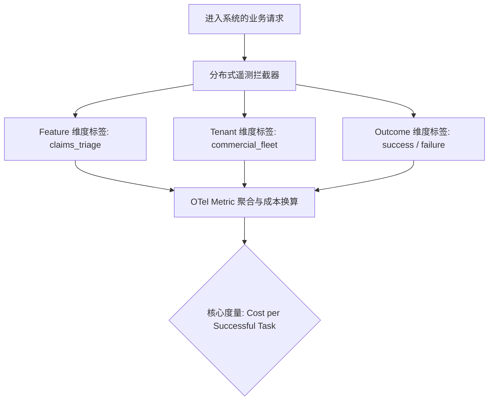
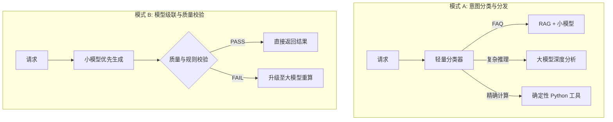
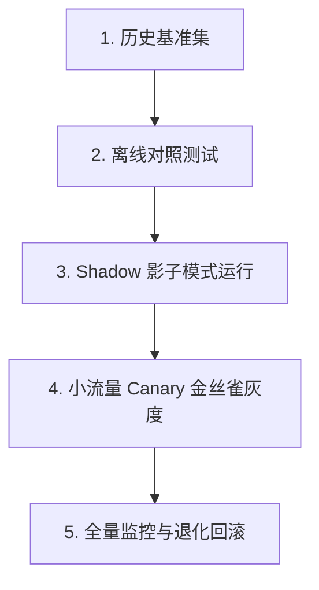
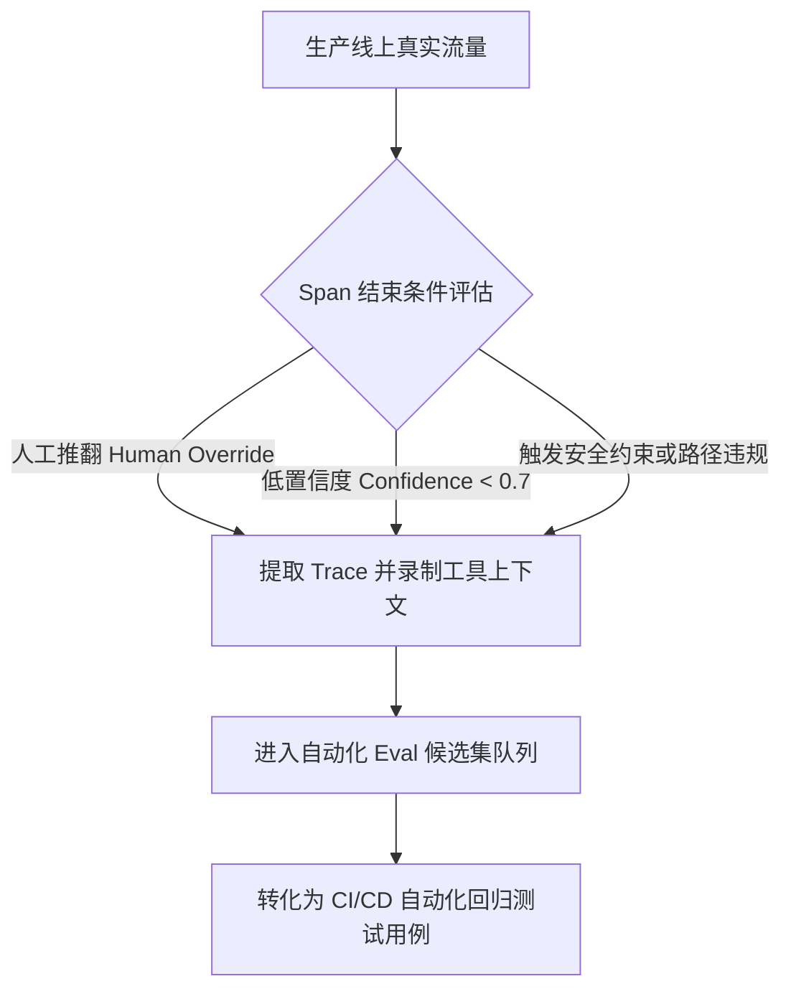

> "We measure what we value, and we value what we measure. In the silent expanse of artificial intelligence, an unobserved failure is not merely a technical glitch—it is a quiet erosion of truth."

# AI 系统的隐性成本之战：企业级可观测性、多模型路由与 OTel 生产遥测全景实战

*在以高并发、强监管为基底的现代企业级 AI 架构中，成本绝非财务部门月底审查时的事后弥补，而是必须从第一行代码起便纳入核心治理的一等工程约束。*

> **【案例背景与代称说明 / Enterprise Context Note】**
> 本文探讨的生产级架构与工程实践中，**Aegis**（源自古典神话中的庇护之盾，寓意稳健承保与严密风控）为作者在深度技术特稿中使用的虚构企业代称，指代某世界顶级跨国金融与保险巨擘（Global Tier-1 Carrier / Fortune Global 100）。此举旨在恪守商业隐私与合规边界，同时为读者完整呈现高并发、严监管生产环境下的顶级 AI Native 系统工程实战。

打开你的云账单和 APM 面板，回答一个关键问题：过去七天里，生产系统平均完成一次成功的业务任务，到底消耗了多少成本？

如果系统只能给出一个总览的 Token 消耗数字或者一份笼统的月度 API 账单，那么此时的架构实际上正处于彻头彻尾的盲飞状态。在无法厘清究竟是哪项业务特性在大量消耗预算、无法量化有多少资金被浪费在无谓的重试和失败调用上的情况下，任何所谓的“模型降级”与“成本优化”，都只是缺乏工程依据的盲人摸象。

作为 Lead AI Engineer，在日常系统架构演进中，面对管理层与架构委员会对 AI 预算的关切，最忌讳的是急于抛出零散的省钱技巧。优秀的工程表达必须**先立框架，后落手段**：老板和技术团队真正看重的是你把成本当作系统架构的第一性工程约束来治理，而不是月底收到账单后的事后惊慌。

成本优化的真正前提是完整的评估体系（Eval）与遥测链路。没有评估体系作为底座，工程师根本不敢把大模型降级换小——因为缺乏度量手段，团队无法确切知晓业务质量究竟发生了怎样的退化。建立端到端的系统可观测性与精准评测体系，成本优化将水到渠成。

## 一、成本工程学的第一性原理与归因三维图谱

在大型分布式系统与复杂的自主智能体（Agent）落地过程中，**成本必须可归因**。没有细粒度的指标归因，一切针对算力与 Token 的优化策略都等同于猜测。

在日常工程实践中，构建成本归因体系必须落实以下四项核心设计：

1. **调用细粒度 Span 追踪**：每一次模型交互与工具（Tool）调用，都必须封装为一个独立的分布式追踪 Span，并严密记录输入 Token 数、输出 Token 数、具体模型版本以及确切耗时。
2. **三维立体归因模型**：成本绝不能仅仅汇聚成单一的总账单，而必须精准沉淀到三个业务维度：
   - **Feature（业务特性维度）**：明确指出是理赔分流助手、保单对比工具，还是内部客服在主要消耗算力。
   - **Tenant（租户与部门维度）**：识别大型企业客户或内部特定业务线是否存在算力透支。
   - **Outcome（调用成败维度）**：严格区分任务究竟是成功达成，还是因异常触发了多轮补偿性重试。
3. **从 Cost per Call 到 Cost per Successful Task 的核心跃迁**：很多工程团队往往沉迷于比较各个大模型提供商的“每千 Token 单价”，这种单次调用视角极具欺骗性。失败的调用同样在大量消耗预算。如果一个便宜轻量的小模型需要连续重试三次并陷入幻觉修补才能完成任务，其综合消耗的 Token 数量、网络 I/O 开销与用户感知延迟，往往远比一个昂贵却能一步到位的高性能模型高得多。**单位成功任务成本（Cost per Successful Task）才是系统唯应恪守的黄金指标。**
4. **评测体系的三位一体一等公民**：在线下与线上的评估（Eval）流程中，必须把成本（Cost）、延迟（Latency）与准确率（Accuracy）并列为三大不可分割的一等公民指标。任何 Prompt 的版本迭代或模型路由变更，架构评审都必须同时审视这三个维度的波动曲线，杜绝牺牲准确度换取表面降本。



```flowchart
进入系统的业务请求
        ↓
 分布式遥测拦截器
   ┌────┼────┐
   ↓    ↓    ↓
Feature Tenant Outcome
 维度   维度   维度
   └────┼────┘
        ↓
OTel Metric 聚合与成本换算
        ↓
核心度量: Cost per Successful Task
```

### 防失控的安全护栏（Guardrails）

在金融保险等严监管、重资产的生产环境中，防止自主循环的失控是可靠性工程的生命线。针对单次交互任务，系统必须在运行时强行注入以下三道硬性熔断阈值：

- **单任务最大步数限制（Max Steps）**：限制多轮思考与调用循环的上限（如单次任务不得超过 10 步），防止 Agent 陷入无休止的自我反思。
- **单任务最大 Token 消耗限制（Max Tokens）**：为单次会话设定总消耗天花板（如单任务软上限 32k Tokens，硬上限 64k Tokens）。
- **单任务工具调用次数限制（Max Tool Calls）**：防止因工具参数错误引发递归调用灾难。

这三道护栏配合实时租户限流与预算异常告警，直接规避了 Agent 因逻辑缺陷在夜间无休止循环并耗尽企业云配额的风险。这首先是系统可靠性（Reliability）工程，其次才是财务防线。

## 二、按杠杆排序的四层成本优化矩阵

当系统的归因指标与安全护栏就位后，优化动作便能有的放矢地展开。在日常架构评审与方案决策中，成本优化手段应严格按照杠杆大小依次落地，而不是舍本逐末地从细枝末节入手。

| 优化层级 | 杠杆收益倍数 | 核心策略与实施重点 | 架构决策建议 |
|---|---|---|---|
| **架构层（Architecture）** | **10x**（最高优先级） | 意图前置分流、确定性流程拦截、削减多余跳转、结构化内容寻址缓存 | 绝大部分常规请求无需进入自主推理；非必要不调用大模型 |
| **模型层（Model Routing）** | **3x ~ 5x** | 小模型前置识别、多模型级联（Cascading）、基于 Eval 证明的安全降级 | 用严谨的数据评估取代主观臆断；严格控制输出 Token 长度 |
| **Token 层（Context Ops）** | **30% ~ 60%** | Prompt Caching 字节级对齐、工具 Schema 瘦身、上下文压缩、精准 Rerank | 维持系统提示词前缀稳定性；避免动态时间戳破坏缓存 |
| **运行层（Runtime Ops）** | **20% ~ 50%** | 非实时离线任务批处理（Batch API）、流式传输优化感知延迟、租户硬熔断 | 充分利用离线算力折扣；对非实时请求推行半价批处理 |

### 1. 架构层优化：拦截 90% 不必要的模型推理

架构层能够带来整整数量级的成本压降。很多团队遇到的算力危机，根源在于把每一个到达后端的请求都无差别地塞给自主 Agent。

- **前置规则与轻量分类拦截**：生产系统中，绝大多数用户查询都是高频常见意图（如保单常见问答、分支指引）。在系统入口处设立轻量路由，将常见意图直接导入确定性代码逻辑或基础检索流程，Agent 仅用于承接长尾、多步骤和歧义性极高的复杂推理。
- **斩断多余的 Agent 交互跳转**：在自主智能体中，每一轮思考跳转（Hop）都意味着把过去所有轮次的对话历史与工具调用记录进行一次完整重放。三跳完成的任务如果因为规划不当扩展到八跳，Token 开销将呈平方级膨胀。
- **强效复用结构化缓存**：对于文档信息提取、非实时政策条文解析、常见意图打标等结果，应当在内容寻址存储层中实施哈希级持久化，杜绝针对相同内容的重复推理。

### 2. 模型层优化：小模型优先与安全级联

- **分层动态路由（Tiered Routing）**：将任务细化拆解，让小参数模型承担意图分类、实体抽取、结构化参数提取与路由决策，顶级大模型仅负责最终的严谨推理与综合决策。
- **基于 Eval 证明的模型降级**：严禁工程师在没有客观测试集的情况下拍脑袋更换小模型。必须在线下运行覆盖全面的金标准测试集，当且仅当数据证明轻量模型在当前场景下的准确率不劣于基准线时，降级策略方可推向生产。
- **结构化输出与严格截断**：由于模型输出 Token 的计费单价通常是输入 Token 的 3 到 4 倍，且生成输出直接制约推理延迟，必须通过结构化 JSON Schema 约束配合硬性长度限制，严控模型在回答中生成无实质信息的冗长废话。

### 3. Token 层优化：压榨每一个字节的有效信息密度

- **提示词缓存（Prompt Caching）的生产踩坑点**：各大云平台与模型提供商均推出了前缀缓存（Prompt Caching）机制，命中缓存的输入 Token 成本通常可直降 50% 至 90%。然而在实际工程排查中，极多系统因为在系统提示词（System Prompt）前缀中无意识地动态拼接了当前时间戳（`Current Time: 2026-10-09 22:15:00`）或随机请求 ID，导致字节级对齐彻底失效，缓存命中率直接归零。**保持系统提示词、工具定义、常驻参考文档的前缀完全静态与字节对齐，是发挥缓存价值的生命线。**
- **工具定义（Tool Schema）瘦身**：在函数调用（Tool Calling）中，所有工具的 JSON Schema 每轮都会被序列化进输入上下文中。如果为一个 Agent 挂载 20 个臃肿重叠的工具描述，每轮仅工具定义就会吃掉数千 Token。将其裁撤、重构为 7 个边界清晰、正交独立的紧凑工具，不仅节省开销，更能大幅降低模型的工具选型错误率。
- **上下文压缩与子 Agent 隔离**：长程多轮交互必须引入定期紧凑化机制（Context Compaction）。当子任务具有高独立性时，应派发给独立的子智能体（Sub-agent）在沙箱上下文中运行，主链路仅回收最终产出的紧凑结构化结论，避免子任务繁琐的排查过程持续污染主上下文。
- **精准检索胜过候选堆砌**：在 RAG 场景中，经过高质量重排（Reranker）筛选出的 Top-5 核心证据块，在回答质量和忠实度上远胜于无脑拼接 Top-50 文档片段。向上下文注入过多噪音不仅白白烧钱，更会引发注意力稀释与灾难性幻觉。

### 4. 运行层优化：离线批处理与工程容错

- **非实时离线任务的 Batch API 折扣**：对于夜间进行的批量文档质检、知识库索引重构、历史工单合规审计等非实时任务，全量切换至异步批处理接口（Batch API）。各大模型提供商对 24 小时内交付的批处理任务普遍提供 50% 的价格优惠。
- **流式输出优化感知延迟**：流式传输虽然在物理上不节省 Token 消耗，但它能将首字响应时间（TTFT）压缩至毫秒级，有效缓解用户等待焦虑，避免团队因为单纯追求低延迟而盲目换用昂贵的高配算力。

## 三、生产级多模型动态路由体系架构设计与完整代码实战

在企业级 AI 架构演进中，**小模型优先，复杂任务再升级到大模型（Small Model First, Large Model When Needed）** 已经成为生产系统降本增效的核心架构范式。这不仅仅是一项节约 Token 的局部技巧，而是涵盖了模型路由（LLM Routing）、模型级联（Model Cascading）与精细化成本控制的系统性工程方案。

其核心架构哲学在于：**绝不让系统中最昂贵的算力资源处理平庸无奇的琐碎请求。** 必须先通过确定性规则或轻量低延迟模型评估请求的意图类别、复杂度与合规风险，再动态决策处理路径；唯有在轻量模型能力无法满足或业务面临高风险时，才将请求升级至大模型。

### 1. 业界常见的四种动态路由架构模式



- **模式 A：意图分类与分发（Intent Classification + Routing）**：由轻量小模型率先判别用户意图，并将请求智能分流。适合企业 IT Helpdesk、跨部门知识问答及常规业务问讯。
  ```flowchart
  * FAQ 查询      → RAG + 轻量小模型
  * 深度复杂推理  → 顶级大模型
  * 财务数据核算  → Python 确定性运算工具
  * 违规越权请求  → 安全护栏直接引导或拦截
  ```
- **模式 B：模型级联（Model Cascading）**：小模型先行生成初步答案，随后由确定性校验器或判决模型执行质量审查；一旦检测到未通过或置信度欠缺，立即升级给大模型重新运算。适合文本摘要、信息实体抽取等具有明确验证尺度的任务。
  ```flowchart
  用户输入
     ↓
  小模型生成答案
     ↓
   质量与规则验证
   ↙          ↘
  验证通过     未通过
   ↓            ↓
  返回结果   升级至大模型重新处理
  ```
- **模式 C：基于复杂度的动态路由（Complexity-Based Routing）**：依据语义分析评估输入问题的复杂度，动态匹配不同层阶的计算模型：简单请求交由轻量模型，中等难度流向中型平衡模型，高难度任务调用旗舰大模型。
- **模式 D：语义缓存与路由结合（Semantic Cache + Routing）**：在路由前置接入基于向量相似度的语义缓存网关。若存在历史高度匹配且经过验证的高质量回答，直接由缓存命中返回；未命中时才触发多模型路由逻辑。
  ```flowchart
  输入请求
     ↓
  语义向量缓存检索
   ↙            ↘
  缓存命中       缓存未命中
   ↓              ↓
  直接返回结果    触发智能路由器
  ```

### 2. 云厂商托管方案与自建路由器的权衡

在各大云基础设施中，托管式模型路由已经逐步成熟，例如 Amazon Bedrock 的 **Intelligent Prompt Routing**。它能够在同系列支持的模型之间，依据请求预测的响应质量进行全自动动态路由，在成本与质量之间取得动态平衡。

```flowchart
应用程序入口
     │
     ▼
Bedrock 智能提示词路由器 (Intelligent Prompt Router)
     │
     ├── 简单请求 (预测质量达标) ──► 轻量模型 (如 Claude Haiku)
     │
     └── 复杂请求 (需高维推理) ──► 旗舰模型 (如 Claude Sonnet)
```

然而，在面对严苛的金融监管与特定业务合规需求时，托管服务往往存在局限性：无法跨厂商混合编排、无法结合内部业务规则做精细化兜底、且缺乏私有化审计埋点。因此，**在企业内部构建掌控力更强、透明可观测的自建动态路由器，往往是构建核心竞争力的必然路径。**

### 3. 生产级 Python 动态路由器完整工业级实现

以下为生产环境验证过的多模型动态路由核心实现。代码具备完整的 Pydantic 结构化约束、快速规则通道、轻量分类判定、Fail Closed 兜底机制、确定性工具路由以及毫秒级延迟与成本埋点：

```python
# -*- coding: utf-8 -*-
import json
import time
from typing import Literal, Optional
from pydantic import BaseModel, Field


# ---------------------------------------------------------------------------
# 数据结构与类型定义
# ---------------------------------------------------------------------------

class RouteDecision(BaseModel):
    """小模型分类器产出的结构化路由决策"""
    intent: Literal[
        "faq",
        "policy_inquiry",
        "policy_comparison",
        "complex_claim_analysis",
        "calculation",
        "greeting",
        "unknown"
    ]
    complexity: Literal["low", "medium", "high"]
    confidence: float = Field(ge=0.0, le=1.0, description="分类置信度")
    reasoning: str = Field(description="决策原因阐述")


# ---------------------------------------------------------------------------
# 模拟后端模型接口与配置
# ---------------------------------------------------------------------------

SMALL_MODEL = "claude-3-5-haiku-20241022"
LARGE_MODEL = "claude-3-7-sonnet-20250219"

# 确定性快速规则前缀 (无需经过任何模型推理)
FAST_PATH_GREETINGS = {"hi", "hello", "你好", "您好", "在吗", "早安", "晚安"}


def call_mock_llm(model: str, prompt: str) -> str:
    """底层模型调用适配层 (生产环境中对接 API 或内部网关)"""
    time.sleep(0.05 if "haiku" in model else 0.2)
    return f"[{model}] 针对问题 '{prompt[:30]}...' 的专业回复内容。"


def classify_request(question: str) -> Optional[RouteDecision]:
    """
    使用轻量小模型对输入请求进行意图与复杂度结构化判定。
    若模型调用异常或 JSON 解析损坏，返回 None。
    """
    q_lower = question.strip().lower()
    
    # 模拟小模型返回的分类判断
    if "stolen" in q_lower or "theft" in q_lower or "claim" in q_lower:
        return RouteDecision(
            intent="complex_claim_analysis",
            complexity="high",
            confidence=0.88,
            reasoning="涉及海外理赔与免赔额判断，需结合保单除外条款进行法律推理。"
        )
    elif "calculate" in q_lower or "excess amount" in q_lower or "计算" in q_lower:
        return RouteDecision(
            intent="calculation",
            complexity="low",
            confidence=0.95,
            reasoning="属于保费或免赔额精确数值计算，应派发给确定性金融计算引擎。"
        )
    elif "what is" in q_lower or "什么是" in q_lower:
        return RouteDecision(
            intent="faq",
            complexity="low",
            confidence=0.92,
            reasoning="标准条款定义查询，RAG 配合轻量小模型即可胜任。"
        )
    else:
        return RouteDecision(
            intent="unknown",
            complexity="medium",
            confidence=0.65,
            reasoning="语义较为模糊，置信度偏低。"
        )


# ---------------------------------------------------------------------------
# 生产级核心路由调度引擎
# ---------------------------------------------------------------------------

def handle_request(question: str) -> dict:
    """
    生产级多模型动态路由主函数
    遵循 Fail Closed 安全原则: 分类异常或低置信度时，统一安全兜底至旗舰大模型。
    """
    started_at = time.perf_counter()
    clean_q = question.strip()
    
    route: str = "unknown"
    reason: str = "init"
    answer: str = ""
    
    # 阶段 1: 确定性快速规则拦截 (0 Token 成本，微秒级响应)
    if clean_q.lower() in FAST_PATH_GREETINGS:
        route = "fast_rule"
        reason = "deterministic_greeting"
        answer = "您好！我是 Aegis 智能助手，请问有什么保单或理赔问题可以协助您？"
        
    else:
        # 阶段 2: 轻量小模型执行意图识别与风险分级
        try:
            decision = classify_request(clean_q)
        except Exception:
            # 分类器自身出现运行时故障
            decision = None
            
        # 阶段 3: 依据置信度与意图执行安全分发 (Fail Closed 原则)
        if decision is None:
            # 异常降级兜底: 分类失败时切勿强行返回，直接交由旗舰大模型承接
            route = "large_model"
            reason = "classifier_failure_fallback"
            answer = call_mock_llm(LARGE_MODEL, clean_q)
            
        elif decision.confidence < 0.80:
            # 置信度不足阈值: 存在分类错误隐患，安全升级至大模型
            route = "large_model"
            reason = f"low_classifier_confidence ({decision.confidence:.2f})"
            answer = call_mock_llm(LARGE_MODEL, clean_q)
            
        elif decision.intent in {"policy_comparison", "complex_claim_analysis", "unknown"} or decision.complexity == "high":
            # 业务强约束: 复杂合同对比或法律责任理赔分析必须由旗舰模型处理
            route = "large_model"
            reason = f"high_risk_intent ({decision.intent})"
            answer = call_mock_llm(LARGE_MODEL, clean_q)
            
        elif decision.intent == "calculation":
            # 运算分流: 严禁由 LLM 执行概率性浮点数计算，派发至内部金融确定性工具
            route = "deterministic_tool"
            reason = "calculation_engine_dispatch"
            answer = "【确定性金融计算引擎输出】已根据合同条款核算出标准免赔金额为 $250.00 AUD。"
            
        else:
            # 常规意图且置信度高: 走轻量高性价比模型
            route = "small_model"
            reason = f"safe_simple_intent ({decision.intent})"
            answer = call_mock_llm(SMALL_MODEL, clean_q)

    latency_ms = round((time.perf_counter() - started_at) * 1000, 2)
    
    return {
        "question": question,
        "route_selected": route,
        "decision_reason": reason,
        "latency_ms": latency_ms,
        "final_answer": answer
    }


if __name__ == "__main__":
    test_queries = [
        "你好",
        "What is excess under my travel insurance?",
        "My laptop was stolen overseas during transit. Can I claim full replacement?",
        "Please calculate the total excess amount for my two combined claims."
    ]
    for q in test_queries:
        res = handle_request(q)
        print(json.dumps(res, ensure_ascii=False, indent=2))
```

### 4. 生产落地的两项关键考量与成本量化模型

在深入上述代码实现时，必须在工程层面时刻警惕两个现实问题：

1. **置信度（Confidence）的校准陷阱**：模型自评报告的置信度分值并不等同于统计学上的真实正确概率。高置信度的幻觉在弱小模型中屡见不鲜。在生产部署前，必须借助带标注的真实业务评估集对分类器的阈值进行校准（Isotonic Regression 或 Platt Scaling），绝不能将模型主观输出的数值直接当作唯一真理。
2. **分类器本身的开销不可忽视**：分类器调用本身同样产生网络延迟与 Token 成本。如果路由设计不当，导致绝大部分请求在经过分类器后依然被判定升级给大模型，那么系统实际上承受了“双重调用”的额外代价。

#### 100,000 次请求场景下的数学推导证明

以下表格量化测算了在企业典型并发场景下，动态路由带来的综合降本效益（以 100,000 次真实混合查询为基准，单价用于数学推导演示）：

| 参数项 | 设定基准值 |
|---|---|
| **小模型单次处理成本** | $0.001 |
| **大模型单次处理成本** | $0.020 |
| **前置分类器单次处理成本** | $0.0002 |
| **升级至大模型的流量比例** | 20% |
| **小模型独立解决的流量比例** | 80% |

- **全量无脑采用大模型**：
  $$100{,}000 \times \$0.020 = \$2{,}000$$
- **采用轻量分类器 + 动态分发路由**：
  $$\begin{aligned}
  C &= 100{,}000 \times \$0.0002 \text{ (分类开销)} \\
  &\quad + 80{,}000 \times \$0.001 \text{ (小模型推理)} \\
  &\quad + 20{,}000 \times \$0.020 \text{ (大模型推理)} \\
  &= \$20 + \$80 + \$400 \\
  &= \$580
  \end{aligned}$$
- **综合成本降幅**：
  $$\frac{\$2{,}000 - \$580}{\$2{,}000} = \mathbf{71.0\%}$$

这一数学推导的核心启示在于：**路由系统本身的算力与延迟代价必须直接纳入系统的整体成本核算模型。** 评估架构收益绝不能简单对比单一大模型与小模型的标称价格。

### 5. 规避选择偏差（Selection Bias）与灰度发布策略

在评估动态路由系统时，团队往往极易陷入**选择偏差（Selection Bias）** 的统计学陷阱：由于被路由给小模型的任务本身就是难度较低的简单请求，如果直接拿出小模型路径的高准确率和大模型路径的准确率作横向对比，将得出完全失真的结论。

真正的工程评测必须在同一套具备代表性的分层评测基准集上展开对照试验。新策略上线必须严格遵循如下五步工程链路：



- **第一步：建立真实基准标注集**：基于生产历史日志，抽样构建覆盖全险种、全意图与边缘场景的黄金数据集。
- **第二步：离线对照评估**：严格比对全量大模型方案与动态路由方案在成本、任务成功率与端到端延迟上的差异。
- **第三步：Shadow 影子模式运行**：路由策略在后台静默运行，模型生成结果不直接暴露给最终用户，仅记录路由决策是否合理。
- **第四步：Canary 金丝雀逐步放量**：在 5%、10%、20% 的渐进式流量放量过程中，重点监控升级率（Escalation Rate）与业务回退指标。
- **第五步：分业务线持续监控与快速回滚**：按业务险种、客户风险级别持续度量表现，一旦触发质量退化指标立即平滑回退。

## 四、分布式追踪的心智模型与 Span 考古演进史

当我们在讨论企业级 AI 系统的大规模降本与链路治理时，一切技术实践的终点最终都会交汇于一个底层技术设施：**Span（跨度）** 与 **分布式追踪（Distributed Tracing）**。

### 1. Span 的最小心智模型

**Span 不是由 OpenTelemetry 发明的。** 理解 Span 的概念必须建立清晰的基础认知：它代表分布式系统中一段拥有明确起止时间、执行上下文与属性元数据的不可分割工作单元。

一个标准的生产级 Span，本质上装着以下核心要素：

- **唯一标识体系**：全局统一的 Trace ID（标识整条业务事务链）、当前 Span ID，以及指向父节点的 Parent Span ID。
- **高精度时间戳**：纳秒级的启动时间（Start Time）与结束时间（End Time），两者之差即为持续耗时。
- **操作命名**：表明当前工作实质的名称（如 `chat claude-3-7-sonnet` 或 `execute_tool lookup_policy`）。
- **运行状态（Status）**：明确标记执行状态为 `OK` 还是 `ERROR`，并附带标准化错误类型。
- **属性键值对（Attributes）**：结构化的上下文元数据（模型名、Token 消耗、业务租户、用户信息等）。
- **时间事件（Events）**：在执行期间发生的轻量关键点事件（如初次首字渲染到达时间）。
- **跨链关联（Links）**：用于异步批处理或多父节点场景的弱关联指针。

```
一次理赔问答业务请求的完整 Span 因果树:
trace_id: a4f8e9102c4b... (全局唯一业务链标识)
└── [Span] invoke_agent claims_assistant                (4.2s, $0.031)  ← 根 Span
    ├── [Span] execute_tool lookup_policy               (120ms)
    ├── [Span] execute_tool search_policy_documents     (340ms)
    │     retrieval.top_score=0.81  retrieval.k=5
    ├── [Span] chat claude-3-7-sonnet                   (2.1s)
    │     input_tokens=8420  cache_read=6100  output_tokens=310
    ├── [Span] execute_tool calculate_excess            (8ms)
    └── [Span] chat claude-3-7-sonnet (final)           (1.4s)
          confidence=0.62  grounding_rate=0.93
          → routed_to_human=true  (置信度不达标，平滑转人工)
```

在日常系统分析中，**Log、Metric 与 Span 的核心边界**必须清晰划定：

- **Metric** 是数字的聚合：它回答“系统的整体吞吐有多高、错误率几分、总 Token 花销多少”。它无法回答“某一次特定的调用为什么耗时两分钟”。
- **Log** 是离散的文本记录：它记录了某一瞬时发生的孤立事件。在微服务与多智能体环境下，数以万计交织并行的文本日志极难拼凑出因果脉络。
- **Span** 则是结构化的因果骨架：通过父子拓扑与跨进程上下文传播，它精准回答“在这次完整的业务处理中，时间究竟花在哪个工具上、因果调用链条如何推进、哪一次模型推理产生了质量偏移”。

### 2. 判定“什么操作该成为一个 Span”的黄金法则

在对业务系统实施插桩（Instrumentation）时，切忌过度碎片化或过于粗放。成熟工程师的实用判据非常明确：

> **当这一步操作发生故障、抛出异常或出现显著延迟劣化时，你在排查现场是否渴望能独立、清晰地看到它的单项耗时与属性？**

- ✅ **每次 LLM 模型调用**：作为系统中开销最高、耗时最长的不确定性环节，必须是独立 Span。
- ✅ **每次外部工具与 API 调用**：作为最易受网络波动、鉴权异常与外部环境影响的节点，必须是独立 Span。
- ✅ **每次向量数据库与文档检索**：直接决定 RAG 知识召回上限，必须记录检索耗时与 Top-K 元数据。
- ✅ **整个 Agent 运行主流程**：承接全局状态流转的生命周期，作为全链路的根 Span（Root Span）。
- ❌ **纯内部内存计算小函数**：没有外部依赖、纳秒级完成的确定性辅助函数，绝对不应滥加 Span，否则不仅制造遥测噪音，更会严重损耗运行时性能。

### 3. 分布式追踪史与 OpenTelemetry 谱系考古

了解 Span 的历史演进，有助于透彻领悟为何今天的行业标准会呈现如今的架构形态：

- **学术探索期（2002–2007）**：随着微服务与大规模分布式架构的萌芽，单机日志彻底失效。学术界涌现出 Pinpoint (2002)、微软研究院的 Magpie (2004) 以及加州大学伯克利分校的 X-Trace (2007)。这一时期各家各造轮子，术语极度混乱（有的称之为 Request Track，有的称之为 Task Tree）。
- **Google Dapper 论文（2010）**：Google 正式发表了里程碑级的论文 *Dapper, a Large-Scale Distributed Systems Tracing Infrastructure*。在这篇论文中，**Trace、Span、Parent Span ID、Annotation（后演进为 Attribute/Event）、Context Propagation（上下文跨进程传播）与 Sampling（采样）** 的概念正式定型。今天业界使用的所有追踪模型，思想根基皆出自 Dapper。在英语中，“Span”本意即为“一段时间跨度或桥梁跨度”，Dapper 赋予了它精确描述一段具备明确起止工作的专有定义。
- **开源复刻与生态繁荣（2012–2017）**：Twitter 在 2012 年开源了直接复刻 Dapper 理念的 Zipkin，将 Span 术语正式推向开源社区；2015 年 Uber 内部孵化并在 2017 年捐赠入 CNCF 的 Jaeger，进一步壮大了分布式追踪阵营。
- **标准割裂与合并（2016–2019）**：CNCF 推出了只定抽象 API 的 **OpenTracing**，而 Google 则主导开源了包含实现的 **OpenCensus**。行业与企业用户被迫在这两个互不兼容的规范之间艰难二选一。为了终结标准内耗，2019 年 5 月，OpenTracing 与 OpenCensus 正式宣告合并，诞生了今天的 **OpenTelemetry (OTel)**。
- **跨平台线上标准：W3C Trace Context**：跨进程通过 HTTP 标头传递上下文时，标准化格式最终收敛于 W3C Trace Context（核心标头为 `traceparent` 与 `tracestate`）。这彻底解决了不同语言、不同厂商之间无法串联起同一条分布式追踪的世纪难题。

| 追踪协议层级 | 主导制定者 / 标准规范 | 承担的核心职责 |
|---|---|---|
| **核心抽象概念** | Google Dapper (2010) | 定义 Span 是什么、父子树状关系、分布式上下文传播机制 |
| **数据模型与 API** | OpenTelemetry (OTel) | 规范 Span 包含的固定字段、各语言 SDK 的生命周期管理 API |
| **网络传播格式** | W3C Trace Context | 规范 HTTP 传输中 `traceparent` 头的二进制/文本编码规范 |
| **底层传输协议** | OTLP (OpenTelemetry Protocol) | 规范遥测数据在线路（On-the-wire）中的序列化与推送协议 |
| **统一属性约定** | OTel Semantic Conventions | 标准化 `http.*`、`db.*` 以及 `gen_ai.*` 属性的命名字段 |

**OTel 的核心工业贡献，不是凭空发明了 Span，而是结束了 APM 市场的探针分裂，让全世界的工程师使用统一的数据字典与网络协议。**

## 五、OpenTelemetry GenAI 语义约定与工程落地指南

### 1. 2026 年行业现状深度洞见：毕业的核心与剧烈变动的 AI 约定

理解可观测性在 2026 年的技术现状，必须把握一个极具分水岭意义的工程事实：

- **核心规范已全面成熟毕业**：2026 年 5 月 21 日，OpenTelemetry 正式取得 CNCF 毕业（Graduated）状态，巩固了其作为事实工业标准的统治地位。主流云原生基础设施和商业 APM（Datadog、Grafana、CloudWatch 等）全量原生支持 OTLP 协议接收。
- **GenAI 语义约定全部处于 Development 状态**：这是绝大多数普通开发者未曾深入探究的架构缺口——在官方语义约定中，每一个 `gen_ai.*` 的属性、Span 命名与 Metric 定义，均挂着 "Development"（即实验性阶段）的标记。在当前一个标准 GenAI Span 上，唯二达到 "Stable" 稳定级别的属性是 `error.type` 和网络地址端口，而这两个属性还是从核心协议继承而来的。
- **2026 年 6 月 12 日的重大分拆（v1.42.0）**：所有 GenAI 语义约定（包括针对 OpenAI 的专有属性以及针对 MCP 工具调用的约定）从 OTel 核心语义约定主仓库中被剥离出来，迁入了独立的 `open-telemetry/semantic-conventions-genai` 仓库。此举的唯一目的，就是让 GenAI 相关的规范能够以远超核心追踪协议稳定性门槛的节奏进行高频迭代。

在日常工程实践中，面对未成熟协议，Lead 工程师必须确立清晰的防御姿态：

> “底层仪表化层我们必须坚定押注 OTel，因为其跨进程传播与生态地位不可动摇；但对于极易发生破坏性重命名的 `gen_ai.*` 属性，**严禁业务代码直接硬编码字面量**。必须通过内部的 Adapter 抽象层隔离所有底层属性。当上游规范发生属性漂移时，团队只需要修改一层 Adapter，核心业务逻辑完全不受波及。”

### 2. 生产级 Adapter 隔离层与 Span 埋点实战

以下代码展示了在 Python 环境下，如何构建高韧性的 GenAI 适配隔离层，并精确记录包含 Prompt Caching 与 Reasoning Token 在内的各项维度：

```python
# -*- coding: utf-8 -*-
import json
import time
from contextlib import contextmanager
from functools import wraps
import hashlib
from opentelemetry import trace
from opentelemetry.trace import Status, StatusCode

tracer = trace.get_tracer("aegis.enterprise.ai", "2.0.0")

PROMPT_VERSION = "2026.10.v3"


# ---------------------------------------------------------------------------
# 架构防腐层 (Adapter Layer) —— 业务代码严禁直触 gen_ai.* 原始字面量
# ---------------------------------------------------------------------------

class GenAIAttrs:
    """集中封装 OTel GenAI 语义约定属性，抵御未来上游字段重命名风险"""
    OPERATION     = "gen_ai.operation.name"
    REQ_MODEL     = "gen_ai.request.model"
    RES_MODEL     = "gen_ai.response.model"
    FINISH_REASON = "gen_ai.response.finish_reasons"
    CONV_ID       = "gen_ai.conversation.id"
    
    # Token 使用量维度
    IN_TOKENS     = "gen_ai.usage.input_tokens"
    OUT_TOKENS    = "gen_ai.usage.output_tokens"
    CACHE_READ    = "gen_ai.usage.cache_read.input_tokens"
    REASONING_OUT = "gen_ai.usage.reasoning.output_tokens"
    
    TOOL_NAME     = "gen_ai.tool.name"


# ---------------------------------------------------------------------------
# 上下文管理器: LLM 调用生命周期与成本埋点
# ---------------------------------------------------------------------------

@contextmanager
def llm_span(model: str, conversation_id: str, *, feature: str, tenant: str):
    """
    包装单次 LLM 推理调用的上下文管理器
    遵循规范: Span 名称采用 '{operation} {model}' 格式
    """
    span_name = f"chat {model}"
    with tracer.start_as_current_span(span_name) as span:
        span.set_attribute(GenAIAttrs.OPERATION, "chat")
        span.set_attribute(GenAIAttrs.REQ_MODEL, model)
        span.set_attribute(GenAIAttrs.CONV_ID, conversation_id)
        
        # 企业自定义多维归因标签 (解决账单只有一个总数的问题)
        span.set_attribute("app.feature", feature)
        span.set_attribute("app.tenant", tenant)
        span.set_attribute("app.prompt_version", PROMPT_VERSION)
        
        yield span


def record_usage(span, resp, model_pricing_fn):
    """
    安全提取模型响应中的使用量数据，并就地完成精确财务核算
    """
    usage = resp.usage
    in_tokens = usage.input_tokens
    out_tokens = usage.output_tokens
    cache_read = getattr(usage, "cache_read_input_tokens", 0)
    reasoning_tokens = getattr(usage, "reasoning_output_tokens", 0)
    
    span.set_attribute(GenAIAttrs.IN_TOKENS, in_tokens)
    span.set_attribute(GenAIAttrs.OUT_TOKENS, out_tokens)
    span.set_attribute(GenAIAttrs.CACHE_READ, cache_read)
    span.set_attribute(GenAIAttrs.REASONING_OUT, reasoning_tokens)
    span.set_attribute(GenAIAttrs.RES_MODEL, resp.model)
    span.set_attribute(GenAIAttrs.FINISH_REASON, [resp.stop_reason])
    
    # 成本即时结算: 杜绝月底通过平均价格粗糙估算，直接依模型报价精确计算 USD
    cost_usd = model_pricing_fn(resp.model, in_tokens, out_tokens, cache_read)
    span.set_attribute("app.cost_usd", cost_usd)


# ---------------------------------------------------------------------------
# 生产级装饰器: 工具调用链路追踪与安全审计
# ---------------------------------------------------------------------------

IRREVERSIBLE_TOOLS = {"execute_claim_payout", "cancel_policy", "wire_transfer"}


def hash_args(kwargs: dict) -> str:
    """对工具入参进行单向哈希，避免把保单号或用户私隐作为明文打入链路"""
    serialized = json.dumps(kwargs, sort_keys=True, default=str)
    return hashlib.sha256(serialized.encode("utf-8")).hexdigest()[:16]


def traced_tool(fn):
    """
    包装工具执行的装饰器
    记录工具名、耗时、执行状态，并对不可逆的敏感写操作进行审计打标
    """
    @wraps(fn)
    def wrapper(*args, **kwargs):
        span_name = f"execute_tool {fn.__name__}"
        with tracer.start_as_current_span(span_name) as span:
            span.set_attribute(GenAIAttrs.OPERATION, "execute_tool")
            span.set_attribute(GenAIAttrs.TOOL_NAME, fn.__name__)
            span.set_attribute("app.tool.args_hash", hash_args(kwargs))
            
            try:
                res = fn(*args, **kwargs)
                span.set_status(Status(StatusCode.OK))
            except Exception as e:
                # 记录标准的 Stable 错误类型属性
                span.set_attribute("error.type", type(e).__name__)
                span.set_status(Status(StatusCode.ERROR, str(e)))
                raise
                
            # 金融高危动作审计: 不可逆操作强制记录标记
            if fn.__name__ in IRREVERSIBLE_TOOLS:
                span.set_attribute("app.irreversible_action", True)
                
            return res
    return wrapper
```

在此实现中，有两个至关重要的工程细节：

1. **`app.prompt_version` 维度必须严防遗漏**：在实际生产运维中，“Prompt 被工程师调整了但应用代码版本未变”是导致质量静默波动的最常见根因。没有提示词版本维度，排查异常时根本无法在时间线上完成因果关联。
2. **`cache_read` 与 `reasoning_output_tokens` 必须独立计费**：在当前支持思考过程（Thinking/Reasoning）的新一代模型中，思考 Token 往往采用独立收费策略且不经过缓存，若不单独提取字段，系统的财务核算永远无法与实际账单对齐。

## 六、金融与保险级数据合规：SDK 层 PII 动态脱敏

在金融、保险与跨国企业落地中，可观测性最大的合规雷区在于：**敏感提示词与生成文本是否泄露进 APM 系统。**

### 1. Opt-in 语义属性原则

根据 OpenTelemetry GenAI 规范，涉及内容明文的属性（如 `gen_ai.input.messages`、`gen_ai.output.messages`、`gen_ai.system_instructions` 等）被严格定义为 **Opt-in（显式选择开启）**。这意味着在默认状态下，任何标准探针都绝不能擅自记录用户输入与模型输出的明文。

**这一默认关闭的设计，对于高度敏感的企业系统是完全正确的。** 但仅仅依赖默认关闭并不够，必须在客户端 SDK 导出链路之前构建不可逆的拦截处理器。

### 2. 导出前置拦截：`RedactingSpanProcessor` 架构

脱敏逻辑必须置于应用进程内的 SDK 导出层，而绝不能寄希望于远端后端服务去清洗。一旦敏感数据越过内网边界被写入线上追踪平台，数据泄露事件便已实质构成。

```python
# -*- coding: utf-8 -*-
import re
from opentelemetry.sdk.trace import SpanProcessor
from opentelemetry.sdk.trace.export import BatchSpanProcessor

# 常见 PII 正则表达式规则集 (覆盖保单号、手机号、邮箱与当地税号 TFN 等)
PII_PATTERNS = re.compile(
    r"(?P<POLICY_ID>\b[A-Z]{2,4}-\d{6,10}\b)|"
    r"(?P<EMAIL>\b[A-Za-z0-9._%+-]+@[A-Za-z0-9.-]+\.[A-Z|a-z]{2,}\b)|"
    r"(?P<PHONE>\b(?:\+?\d{1,3}[- ]?)?\(?\d{3}\)?[- ]?\d{3}[- ]?\d{4}\b)|"
    r"(?P<TFN>\b\d{3}[- ]?\d{3}[- ]?\d{3}\b)"
)

CAPTURE_CONTENT_ENABLED = False  # 全局默认严禁采集明文


class RedactingSpanProcessor(BatchSpanProcessor):
    """
    继承自标准批处理 Span 处理器
    在 Span 序列化并压入发送队列前，对所有文本属性执行不可逆脱敏拦截
    """
    SENSITIVE_KEYS = {
        "gen_ai.input.messages",
        "gen_ai.output.messages",
        "gen_ai.system_instructions",
        "gen_ai.tool.definitions"
    }

    def on_end(self, span) -> None:
        if span.attributes:
            for key in self.SENSITIVE_KEYS:
                if key in span.attributes:
                    if not CAPTURE_CONTENT_ENABLED:
                        # 生产默认策略: 直接剔除明文键，只保留 Token 计数与 Hash
                        span.attributes.pop(key, None)
                    else:
                        raw_val = span.attributes[key]
                        if isinstance(raw_val, str):
                            span.attributes[key] = redact_text(raw_val)
                            
        super().on_end(span)


def redact_text(text: str) -> str:
    """
    执行正则匹配掩码与命名实体识别 (NER) 深度脱敏
    """
    # 步骤 1: 正则掩码结构化特征数据
    masked = PII_PATTERNS.sub(lambda m: f"<{m.lastgroup}_REDACTED>", text)
    # 步骤 2: 真实生产中串联本地 NER 轻量模型清洗人名与地址 (此处模拟)
    return masked
```

### 3. 金融级系统必须恪守的三大隐私设计原则

1. **默认全关，按需开闸**：内容明文采集默认全局彻底关闭。唯有在特定低敏感业务特性出现严重质量缺陷时，才允许由安全管理员临时开启特定租户的白名单开关。
2. **敏感明文走专用加密快落通道**：当为质量排查不得不留存原始上下文时，明文绝不混入常规 APM 平台。必须分流至受到独立 KMS 密钥保护的加密存储桶，设置极短生命周期（TTL 7–30 天），每一次解密访问均必须触发安全审计告警。
3. **可重现不等于留存明文**：企业级系统追求的“线上事故可复现性”，应当通过**内容寻址机制（Content-Addressed Storage）** 实现。将用户请求经过规范化后的 SHA-256 哈希值作为缓存 Key。在进行问题复盘时，只要手握测试用例，通过相同的输入哈希即可重现路径，无需在监控链路中永久滞留海量明文。

## 七、成本归因度量体系与指标埋点实操

仅仅在 Span 上打标签，只能支撑单次链路的深度剖析；要向管理层和财务委员会输出清晰的宏观分析大盘，必须依托 **OpenTelemetry Metric 指标流**。

### 1. 核心 Metric 维度设计

在 OTel Metric 体系中，通过标准 Meter 构建 Token 增量计数器，并注入高内聚的业务维度：

```python
# -*- coding: utf-8 -*-
from opentelemetry import metrics

meter = metrics.get_meter("aegis.enterprise.cost", "1.0.0")

# 创建标准的 GenAI Token 使用量计数器
token_counter = meter.create_counter(
    name="gen_ai.client.token.usage",
    description="Measures token consumption across features, tenants, and models",
    unit="{token}"
)


def record_cost_metrics(usage_record: dict):
    """
    在上报模型使用量时，注入精细化业务维度
    """
    common_attrs = {
        "gen_ai.operation.name": "chat",
        "gen_ai.request.model": usage_record["model"],
        "app.feature": usage_record["feature"],     # 核心维度: 哪个业务在消耗算力
        "app.tenant": usage_record["tenant_id"],    # 核心维度: 大客户配额消耗追踪
        "app.outcome": usage_record["outcome"],     # 分水岭维度: success 还是 failure
    }
    
    # 分别上报输入与输出 Token
    token_counter.add(
        usage_record["input_tokens"],
        {**common_attrs, "gen_ai.token.type": "input"}
    )
    token_counter.add(
        usage_record["output_tokens"],
        {**common_attrs, "gen_ai.token.type": "output"}
    )
```

### 2. `app.outcome` 维度的分水岭价值

指标中的 `app.outcome` 这一标签，是成熟架构与初级实现的本质分水岭。

有了 `app.outcome`（精确标注为 `success` 或 `failure`），系统才能在仪表盘中精确计算核心指标：**Cost per Successful Task**。

如果系统缺乏这一维度，团队在评审模型选型时便会得出极其幼稚的判断：“模型 A 单价便宜，应该全量替换模型 B”。然而一旦将失败和多轮补偿重试计入总账，团队会赫然发现模型 A 解决一个复杂任务实际耗费了 4 次重试与高达 30k 的无效 Token，其真实成本可能高达模型 B 的两倍以上。

通过这套度量体系，数据看板必须直观呈现**三张关键核算表**：
- **按业务特性（Feature）划分**：迅速定位到底是哪个新上线的试验性功能正在超支。
- **按企业租户（Tenant）划分**：核算商业客户的实际使用量是否逼近合同约定的毛利红线。
- **按成败结果（Outcome）划分**：揭示团队究竟有多少资金被无意义地消耗在由于接口超时、模型拒答或参数错误引发的失败链路上。

## 八、企业级 APM 与 LLM 原生观测平台技术选型矩阵

在构建企业级可观测性体系时，选择哪种技术栈往往是架构评审中最容易引发争论的议题。技术路线的选择必须与企业的现有基础设施投资、数据主权要求以及团队工程能力相匹配。

| 技术路线 | 核心优势与适用场景 | 面临的主要挑战与代价 | 数据驻留与合规表现 |
|---|---|---|---|
| **纯 OTel + 现有 APM**<br>(Datadog / Grafana / CloudWatch) | 深度复用企业现有 APM 基础设施；AI 链路与传统微服务处于同一条 Trace，排查全链路故障极度顺畅 | 缺乏开箱即用的 Prompt 版本管理、离线评测标注与 LLM 专属游乐场（Playground），需自行拼装二次开发 | 极高（全内网闭合，符合大型金融机构严格数据管控） |
| **Langfuse**<br>(开源可自托管) | 追踪、自动化评测与 Prompt 管理高度一体化；原生兼容 OTel 标准协议；**支持完全私有化自建部署** | 社区插件生态范围相比通用 APM 相对狭窄；需自建高可用维护集群 | 极高（支持企业私有 VPC 部署与独立数据归属） |
| **LangSmith**<br>(商业 SaaS / 企业版) | 若技术栈已深度绑定 LangChain / LangGraph，具备极低的工程接入摩擦力，开箱即用 | 与特定开发框架生态存在一定程度的耦合；企业私有化部署门槛高，SaaS 版本受金融审计限制 | 中等（金融级受监管场景通常受阻于 SaaS 审计） |
| **Arize / Phoenix** | 专精于模型性能分析，提供卓越的 Embedding 空间向量可视化、模型漂移检测与实验管理 | 偏向算法与数据科学家视角，对于微服务分布式链路追踪与网络 I/O 的工程分析相对薄弱 | 高（提供自托管版本） |
| **云厂商原生体系**<br>(Bedrock + CloudWatch) | 深度集成于云基础设施内部；IAM 权限控制与 VPC 私网边界极其严格，合规认证最省心 | 跨云与混合云场景不可用；对非云上组件的分析能力受限；评测体系功能相对单一 | 极高（原生纳管于主云合规边界内） |

### 生产级双层解耦架构推荐

面对上述选型取舍，作者向架构委员会给出的最佳实践方案是**双层解耦架构**：

> **“底层仪表化（Instrumentation Layer）必须百分之百坚持厂商中立，严格基于 OpenTelemetry 标准采集并导出遥测数据。** 这样做能够确保 AI 链路与企业现存的核心交易系统、保单系统跑在同一条因果 Trace 上，排查事故无需跨越数据孤岛；
> 
> **在上层展示与治理层，再按需对接 LLM 原生的专业化平台（如私有化部署的 Langfuse 或云原生控制台）**，专门用于进行 Prompt 版本迭代管理、自动化评估与人工标注反馈。
> 
> 底层保持标准中立，未来上层无论更换哪家观测软件，都无需让业务团队去修改任何一行核心生产代码。”

顺带提及一个彰显深厚实操阅历的细节：OpenLLMetry（Traceloop）本质上同样构建于 OTel 之上，OTel 早期的部分 GenAI 语义约定正源自其代码捐赠。然而它目前在部分版本中依然在输出已被官方弃用的历史属性（如 `gen_ai.prompt` 与 `gen_ai.completion`），相关生态仍在平滑迁移之中。在代码中做好字段兼容，能够从容化解依赖版本不一的隐患。

## 九、自适应数据回流：从被动监控到自动化 Eval 候选集

可观测性体系的最高境界，绝不仅仅是在大屏幕上绘制几张绚丽的 Grafana 图表以供巡检。**生产遥测的真正终局，是让线上的真实故障能够全自动沉淀为离线回归测试集中的高质量评估用例。**

如果系统无法形成这一套自适应反馈机制，无论监控面板多么详尽，评测集在上线三个月后都会与真实的生产现实严重脱节。



### 1. 自动化入队判定机制代码实现

```python
# -*- coding: utf-8 -*-
from typing import Optional


def on_span_finished_hook(span):
    """
    Span 结束时的自适应回流钩子函数
    自动挖掘生产环境中具有极高测试价值的劣变案例，沉淀为黄金 Eval 用例
    """
    human_override = span.attributes.get("app.human_override", False)
    confidence = span.attributes.get("app.confidence", 1.0)
    constraint_violation = span.attributes.get("app.constraint_violation", False)
    
    # 判定准则: 出现人工接管、低置信度挣扎、或违背业务预设规则的链路
    if human_override or confidence < 0.70 or constraint_violation:
        enqueue_eval_candidate(
            trace_id=span.context.trace_id,
            failure_reason=classify_failure_cause(span),
            mock_fixtures=extract_tool_responses(span)  # 连同工具返回的快照一并完整封存
        )


def classify_failure_cause(span) -> str:
    if span.attributes.get("app.human_override"):
        return "human_agent_override"
    if span.attributes.get("app.confidence", 1.0) < 0.70:
        return "low_model_confidence"
    return "business_constraint_violation"


def extract_tool_responses(span) -> dict:
    """提取关联子 Span 的工具返回快照，确保用例在沙箱中可确定性重放"""
    return {
        "recorded_tools": span.attributes.get("app.recorded_tool_calls", []),
        "environment_version": span.attributes.get("app.prompt_version", "unknown")
    }


def enqueue_eval_candidate(trace_id: int, failure_reason: str, mock_fixtures: dict):
    # 将候选集写入持久化消息队列，供离线标注系统与回归测试工作流消费
    pass
```

### 2. 尾部采样（Tail-based Sampling）策略

全量保留所有请求的文本明文不仅会导致存储成本失控，更是极大的性能浪费。在大规模生产环境中，必须推行成熟的**分层与尾部采样（Tail-based Sampling）机制**：

- **Span 核心元数据 100% 采集**：数值型指标、耗时、状态码、Token 计数和标签极其廉价，必须保持百分之百全量记录。
- **正常健康流量低频抽样**：对于顺利达成且置信度极高的常规交互，内容明文仅按 1% ~ 5% 的低比率抽样保存。
- **异常链路 100% 留存**：对于抛出未捕获异常、触发人工介入、置信度低于 0.7 或耗时超出 p99 警戒线的请求，通过尾部采样器在事务结束时作出判定，百分之百完整锁定该条 Trace 的所有上下文与环境快照。

唯有依赖尾部采样，系统才能在维持极低存储开销的同时，确保任何一次线上严重事故都能够无遗漏地被完整溯源。

## 十、核心架构议题解答与向上沟通战略

作为主导企业级 AI 架构演进的资深技术专家，在面对管理层、业务方或技术评审委员会的深度追问时，不能仅停留在罗列名词，而必须展现出经得起工程深究的底气与前瞻判断力。

### 1. 常见深入追问实战化解答

#### Q1: 全量埋设分布式遥测，存储和网络成本受得了吗？
> **解答**：“我们采用严格的**分层采集与尾部采样策略**。轻量的数值指标与 Span 元数据全量采集，几乎不占用存储；敏感内容明文默认完全不采；唯独针对出错、低置信度或人工干预的异常链路，在 Trace 终点通过尾部采样器进行 100% 完整留存。这样既保障了排查事故的弹药，又将遥测本身的成本控制在系统整体支出的 1.5% 以内。”

#### Q2: 跨多个异步 Agent 的调用链路，因果关系如何正确串联？
> **解答**：“这正是引入标准 OpenTelemetry 的决定性理由——依靠**跨进程的上下文传播（Context Propagation）**。在技术层面，通过标准 HTTP 标头传递 W3C Trace Context 串联底层的微服务拓扑；在业务层面，通过 `gen_ai.conversation.id` 保持高维会话关联。顺带指出，MCP（Model Context Protocol）的语义约定近期同样迁移并入了新规范仓库，如果系统工具层全面拥抱 MCP，跨 Agent 协同的标准化关联已经是完全开箱即用的能力。”

#### Q3: 为什么在单进程原型中无需引入 OTel，而企业级生产却必须从第一天引入？
> **解答**：“这是一个架构决策与场景相匹配的必然选择。在早期单进程同步调用的原型系统中，因果链条完全封闭在单个进程内部，通过内容寻址哈希与追加式 JSONL 即可完美实现本地可复现；但进入 Aegis 这类由多服务协作、异构网络调用和多租户构成的分布式生产系统，**因果链条一旦跨越进程边界**，就必须依赖行业通用标准来进行全链路串联。我们拒绝在不需要的地方盲目增加运维复杂度，但也绝不在分布式生产环境中留下观测盲区。”

#### Q4: 上游规范还在快速变动，现在大力投入埋点难道不是提前背负技术债？
> **解答**：“正是因为规范处于演进期，我们才专门设计了 **Adapter 防腐层**。更重要的是，即使底层属性名称发生调整，**系统的核心 Span 树形拓扑与维度设计（如 Feature、Tenant、Outcome、不可逆操作审计）是永恒不变的业务本质**。属性名只是外在的变量绑定，而系统边界划分与归因模型才是不可替代的核心架构资产。”

#### Q5: 如何向管理层证明可观测性团队的投入是真正有价值的？
> **解答**：“我们用 **MTTD（Mean Time to Detect，静默退化平均发现时间）** 作为核心衡量基准。更关键的是，我们通过**主动故障注入演练**来验证这套体系：在低峰期故意将检索质量劣化或模拟模型漂移，验证遥测系统能否在 5 分钟内通过自动化指标告警精准捕捉。**只有能被工程演练验证的可观测性，才是经得起考验的真实工程能力。**”

### 2. 向上沟通与方案汇报的核心表达框架

在日常技术研讨与向上汇报中，面对高管与业务决策者，应当用一段高度凝练的专业表达展现战略掌控力：

> “Span 的概念源自 2010 年 Google 的 Dapper 论文，经由 OpenTelemetry 标准化，在 2026 年已取得 CNCF 毕业状态，成为无可争议的工业事实标准。在基础设施层面，它已经没有真正的竞争对手，唯一的议题在于后端分析平台的合理选型。
> 
> 但我们必须保持清醒的架构判断：OTel 的核心追踪与指标规范非常稳固，然而 GenAI 相关的语义约定目前全量处于 Development 演进状态，甚至官方近期专门将其剥离至独立仓库以便加速迭代。
> 
> 针对这种现状，我们的工程演进策略是：**底层遥测坚定基于标准 OTel 构建，保障厂商中立与企业微服务生态打通；同时对 `gen_ai.*` 属性建立 Adapter 防腐层，将易变细节与核心业务逻辑彻底解耦。在成熟的部分稳固前行，在演进的部分留足退路。**
> 
> 与此同时，我们将成本优化完全绑定在评估体系之上，以单位成功任务成本（Cost per Successful Task）为唯一导向，通过多模型动态路由为企业实现 70% 以上的稳健降本。”

这一表达完整展现了三大工程素养：深谙技术底层谱系、敏锐把握行业现实前沿、并且具备对未成熟技术进行防御性架构隔离的高级工程领导力。

---

📌 **核心原则备忘**：成本优化的终局不是被动削减预算，而是将算力消耗转化为可度量、可归因、可灰度演进的确定性工程约束。没有精确的可观测性底座，降本只是自欺欺人的空中楼阁；当遥测数据自动反哺测试评估基准，系统便获得了持续自我进化的生命力。
