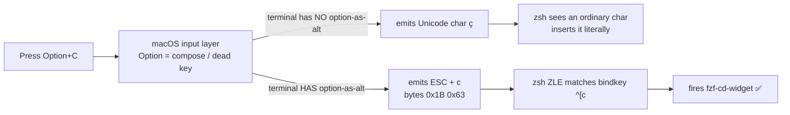
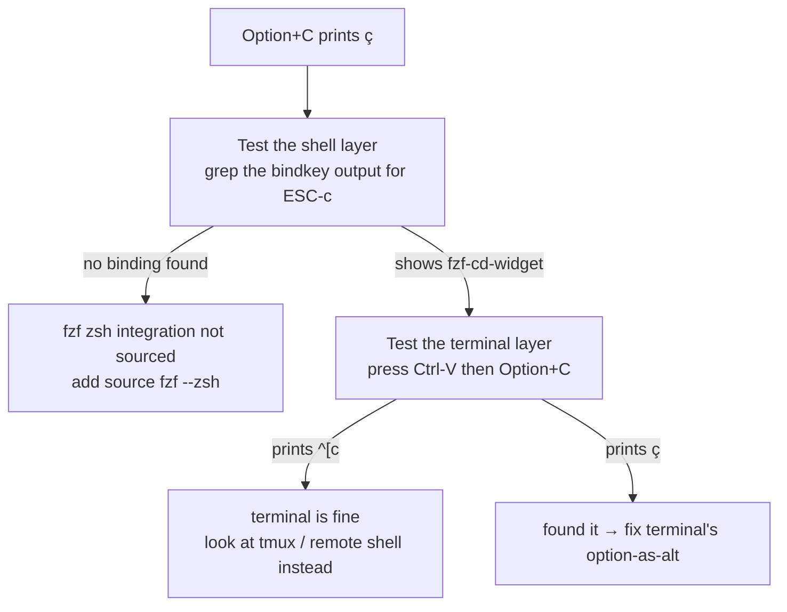
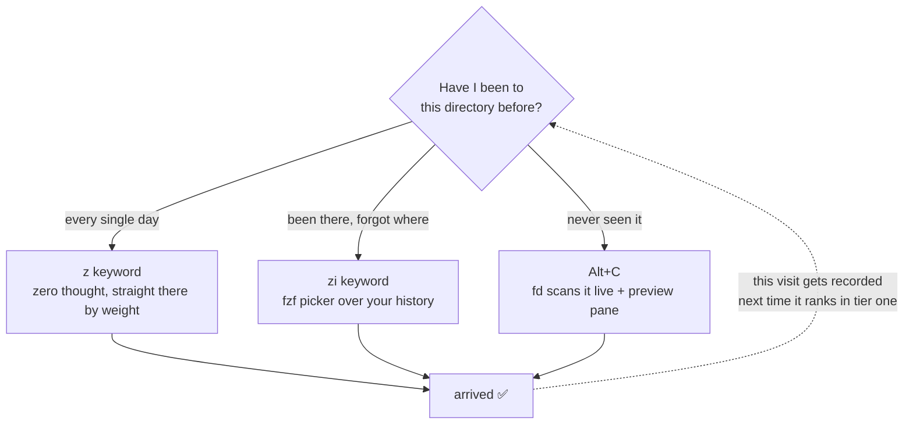

## Confession time: your `cd` and `ls` are two decades out of date

Quick, painfully honest question: how many times today did you type `cd ../../../` like you're feeling around in the dark? And how many times did you squint at a wall of white text from `ls -la` trying to spot the one directory you actually wanted?

No shame — I did this for years too. Then I put together `fzf` + `fd` + `zoxide` + `eza`, and realized the terminal doesn't have to be a guessing game. You can *search* instead of *guess*. This post is the full breakdown — the logic, the config, the cross-platform landmines — so you can copy-paste into `~/.zshrc` and stop white-knuckling your way through directory trees in five minutes.

---

## Part 1: `Alt+C` — the shortcut 90% of fzf users never discover

**Straight answer: once fzf is installed, just press `Alt+C`** (that's `Option+C` on a Mac — where it will most likely fail on your first try; see Part 1.5 for why and how to fix it).

It lists every subdirectory under your current path, lets you fuzzy-filter by typing, and drops you right in on Enter. Zero config, zero learning curve — yet most people install fzf purely for command history (`Ctrl+R`) and never notice this sitting right there.

```
Alt+C → type "logs" → highlighted candidate → Enter → you're in mq-airflow/dags/logs
```

Verify it's actually wired up:

```bash
bindkey | grep '\^\[c'   # should show a binding to fzf-cd-widget
```

If that comes back empty, your zsh integration for fzf isn't sourced properly — go check `~/.fzf.zsh`.

---

## Part 1.5: You pressed `Option+C` on a Mac and got `ç`. That's not fzf's fault.

This is the first wall every macOS user hits after installing fzf, and it's badly misdiagnosed: `bindkey` clearly shows the binding is there, you press the keys, and a `ç` pops into your prompt. So you start doubting your fzf install.

**It's fine. Your keypress never reached zsh at all.**

### First, see how many layers one keystroke crosses



The key insight: `Alt` (Meta) is not a real independent modifier in the terminal world. Its conventional implementation is **prefixing the character with a single ESC byte (0x1B)**. macOS, by default, treats Option as an accent-composing key — `Option+C` is already translated into `ç` at the OS input layer. Once that character exists, the ESC prefix will never appear, and no amount of correct `bindkey` config downstream can save you.

**So this is a terminal-emulator configuration problem, not a shell problem.** Getting that boundary right saves you an hour of pointlessly editing `.zshrc`.

### Test the two layers separately instead of guessing



That `Ctrl-V` trick deserves its own place in your toolbox: it's zsh's `quoted-insert`, which prints the *raw bytes* of the next keypress instead of interpreting them. It's the shortest path to knowing what your terminal actually sent — more direct than any log. Any time a keybinding mysteriously doesn't fire, this should be step one.

### Where to change it, per terminal (macOS)

| Terminal | What to set | How it takes effect |
|---|---|---|
| **Ghostty** | add `macos-option-as-alt = true` to `~/.config/ghostty/config` | `Cmd+Shift+,` to reload config, or restart |
| **VS Code integrated terminal** | add `"terminal.integrated.macOptionIsMeta": true` to `settings.json` | applies to **newly created** terminals only — kill and reopen |
| **Warp** | Settings → Features → Terminal → enable *Use Option as Meta key* | restart Warp |
| **iTerm2** | Profiles → Keys → set Left/Right Option key to `Esc+` | immediate |
| **Terminal.app** | Settings → Profiles → Keyboard → check "Use Option as Meta key" | immediate |

**A nicer Ghostty option**: that setting accepts `left` / `right` in addition to `true` / `false`. Setting `macos-option-as-alt = left` gives left-Option to Alt bindings while the right one keeps composing accented characters — the best of both worlds if you actually type both.

### One hidden Warp trap (learned the hard way)

Warp has no plain-text config file for this toggle. It lives in macOS defaults, under key names you can only find by digging through the app binary:

```bash
defaults write dev.warp.Warp-Stable Extra_Meta_Keys_Left  -bool true
defaults write dev.warp.Warp-Stable Extra_Meta_Keys_Right -bool true
```

**But you must fully quit Warp before writing them.** macOS preferences follow a "hold a copy in process memory, flush on exit" model (cfprefsd caching plus the app's own writeback). Write while Warp is running and the moment it quits it overwrites your change with its stale in-memory values — the command reports success and the setting silently vanishes. That's the worst class of failure to debug.

If there's a UI toggle, use the UI toggle. Don't race a running app for the same plist. This rule generalizes to every macOS app, not just Warp.

### Be honest about the cost

Once option-as-alt is on, **inside that terminal** you can no longer type `ç`, `é`, `ø`, `—`, or anything else that needs Option to compose. Your editor and every other app are unaffected.

For anyone writing code, this trade is nearly free — you'll hit `Alt+C` / `Alt+F` / `Alt+B` dozens of times a day and type an accented character in a terminal approximately never. If you genuinely need both, use the Ghostty `left` approach above.

---

## Part 2: Swap the engine — `fd` is the real speedup

fzf defaults to `find` under the hood, which is slow and happily drags `.git` and `node_modules` into your candidate list like uninvited guests. Swap in `fd` and you get an order-of-magnitude speedup, plus sane exclusions by default:

```bash
export FZF_ALT_C_COMMAND='fd --type d --hidden --exclude .git --exclude node_modules'
export FZF_DEFAULT_COMMAND='fd --type f --hidden --exclude .git'
export FZF_CTRL_T_COMMAND="$FZF_DEFAULT_COMMAND"
```

**A real cross-platform landmine**: on macOS, `brew install fd` gives you the `fd` command directly. On WSL/Ubuntu, `apt install fd-find` installs it as `fdfind` — a leftover Debian package-name collision. Add this fallback or your config will behave inconsistently across your two machines and you'll waste an afternoon debugging nothing:

```bash
command -v fd &> /dev/null || alias fd='fdfind'
```

---

## Part 3: Add a preview pane — stop selecting blind

Picking a file or directory by name alone is a guessing game. Add a live preview pane and you actually see what you're about to jump into:

```bash
# Directory preview: tree view via eza, falls back to ls
export FZF_ALT_C_OPTS="--preview 'eza --tree --level=2 --color=always {}' --preview-window right:50%"

# File preview: syntax-highlighted via bat
export FZF_CTRL_T_OPTS="--preview 'bat --color=always --line-range :100 {}' --preview-window right:60%"
```

Here's what that actually looks like — fuzzy search on the left, live preview on the right, so you see before you commit:

```text
┌─ Alt+C ────────────────────────┬─ preview (eza --tree) ──────────┐
│ > logs                         │ logs                            │
│                                │ ├── scheduler                   │
│   3/128 ───────────────────    │ │   ├── 2026-07-29              │
│ ▶ mq-airflow/dags/logs         │ │   └── 2026-07-30              │
│   mq-airflow/logs              │ ├── dag_processor_manager       │
│   v3/dags/prd/logs             │ └── dag_id=sync_uac_to_sfec     │
│                                │                                 │
└────────────────────────────────┴─────────────────────────────────┘
   ↑ type to filter                  ↑ refreshes as the cursor moves
```

Once this is in place, `Alt+C` shows a live tree on the right as you browse directories, and `Ctrl+T` shows syntax-highlighted file content as you browse files. Your terminal quietly upgrades from "command line" to "lightweight IDE."

---

## Part 4: `zoxide` — the laziest possible upgrade

If fzf+fd is the "fuzzy search" camp, `zoxide` is the "too lazy to even search" camp. It's not an fzf config tweak — it's a different mental model entirely: **you don't search for the directory, the directory lines itself up waiting for you.**

```bash
brew install zoxide          # macOS
# or curl -sS https://webinstall.dev/zoxide | bash   # WSL

eval "$(zoxide init zsh)"    # add to ~/.zshrc
```

### Three commands, that's all you need

```bash
z <keyword>       # jump to the best match (covers 90% of cases)
zi <keyword>       # interactive mode, fzf picker over candidates
zoxide query -l    # list everything in the database (for debugging)
```

**The catch everyone hits first**: right after installing, `z xxx` will find nothing — the database starts empty. It only ranks directories by "frequency × recency" once you've actually `cd`'d (or `z`'d) into them a few times. That's not a broken install, it just hasn't been fed yet.

### The ideal division of labor

For directories you visit constantly (your `mq-airflow` project root, say), `z air` gets you there instantly — no fuzzy searching needed every time. For genuinely new, unexplored territory, fall back to `Alt+C` (the fd+preview version from Part 3) for one-off exploration. The two don't conflict — install both, let them cover different jobs.



Notice that dotted line — it's the whole point of running these together: **every time you use `Alt+C` to explore somewhere new, you're feeding zoxide at the same time.** The path you had to search for today becomes a one-keystroke `z` next week. It's a positive feedback loop: the longer you use it, the less work it takes.

---

## Part 5: `eza` — `ls` gets a renaissance

**Common mix-up first**: it's `eza`, not "eva" (no, not the anime). It's the actively-maintained community fork of the now-abandoned `exa`, written in Rust.

### One-line pitch

A colorized, icon-aware, git-status-aware replacement for `ls`.

### Three commands cover daily use

```bash
eza -la                # ls -la, with automatic color coding
eza --tree --level=2   # tree, capped at two levels so it doesn't flood your screen
eza -la --git          # shows git status (M/?/A) next to each file
```

### The one alias worth doing: replace ls outright

```bash
alias ls='eza --icons --group-directories-first'
alias ll='eza -la --icons --group-directories-first --git'
alias lt='eza --tree --level=2 --icons'
```

`--group-directories-first` is criminally underrated — mixing files and directories in one flat list slows down visual scanning more than you'd think. Add this flag and the difference is immediate.

### Deeper rabbit holes, pick what interests you

1. **`--git-ignore`**: `eza -la --git-ignore` auto-hides anything covered by `.gitignore`, so browsing a repo isn't flooded with `node_modules`/`.venv`
2. **`--sort` variants**: sort by modification time or file size — great for "what changed recently" or "what's eating my disk"
3. **Pairing with the fzf preview pane**: exactly what Part 3 already set up — `eza --tree` feeding straight into `FZF_ALT_C_OPTS`

---

## The full config — paste into `~/.zshrc`

```bash
# === fzf + fd + zoxide + eza terminal navigation stack ===

# fd fallback for WSL/Debian's package naming quirk
command -v fd &> /dev/null || alias fd='fdfind'
if command -v fd &> /dev/null; then
  export FZF_ALT_C_COMMAND='fd --type d --hidden --exclude .git --exclude node_modules'
  export FZF_DEFAULT_COMMAND='fd --type f --hidden --exclude .git'
  export FZF_CTRL_T_COMMAND="$FZF_DEFAULT_COMMAND"
fi

# Preview pane: eza if available, plain ls as fallback
if command -v eza &> /dev/null; then
  export FZF_ALT_C_OPTS="--preview 'eza --tree --level=2 --color=always {}' --preview-window right:50%"
else
  export FZF_ALT_C_OPTS="--preview 'ls -la {}' --preview-window right:50%"
fi

# Ctrl+T file picker preview, syntax-highlighted via bat
if command -v bat &> /dev/null; then
  export FZF_CTRL_T_OPTS="--preview 'bat --color=always --line-range :100 {}' --preview-window right:60%"
fi

# zoxide: only init if installed, avoids errors on machines without it
if command -v zoxide &> /dev/null; then
  eval "$(zoxide init zsh)"
fi

# eza replaces ls
if command -v eza &> /dev/null; then
  alias ls='eza --icons --group-directories-first'
  alias ll='eza -la --icons --group-directories-first --git'
  alias lt='eza --tree --level=2 --icons'
fi
```

---

## Cross-platform install cheat sheet

| Tool | macOS (brew) | WSL Ubuntu |
|---|---|---|
| fzf | `brew install fzf` | Clone the official repo (apt's version tends to lag) |
| fd | `brew install fd` | `apt install fd-find` (command is `fdfind`, needs an alias) |
| zoxide | `brew install zoxide` | `curl -sS https://webinstall.dev/zoxide \| bash` or apt |
| eza | `brew install eza` | `apt install eza` (needs a newer Ubuntu, or the official repo on older ones) |

---

## TL;DR

- **`Alt+C`** — for exploring directories you don't know yet
- **`z keyword`** — for arriving instantly at directories you already know
- **`eza`** — gives `ls` output eyes that actually work
- **Stack all three** — your terminal stops being something you memorize commands for and starts being something you search. Set it up once, keep the payoff forever.
- **One extra step for Mac users** — turn on option-as-alt in your terminal first, or `Alt+C` just hands you a `ç`. And when any keybinding misfires, hit `Ctrl-V` to see what bytes the terminal actually sent before you touch `.zshrc`.

Next time someone asks how you type so little and still ship so fast, just send them this post.
