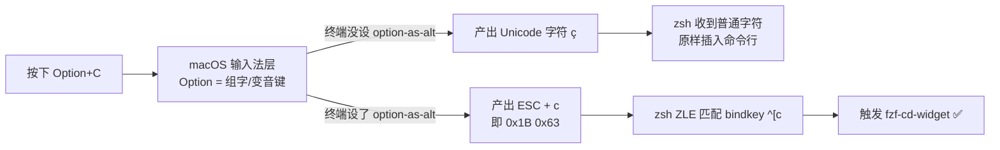
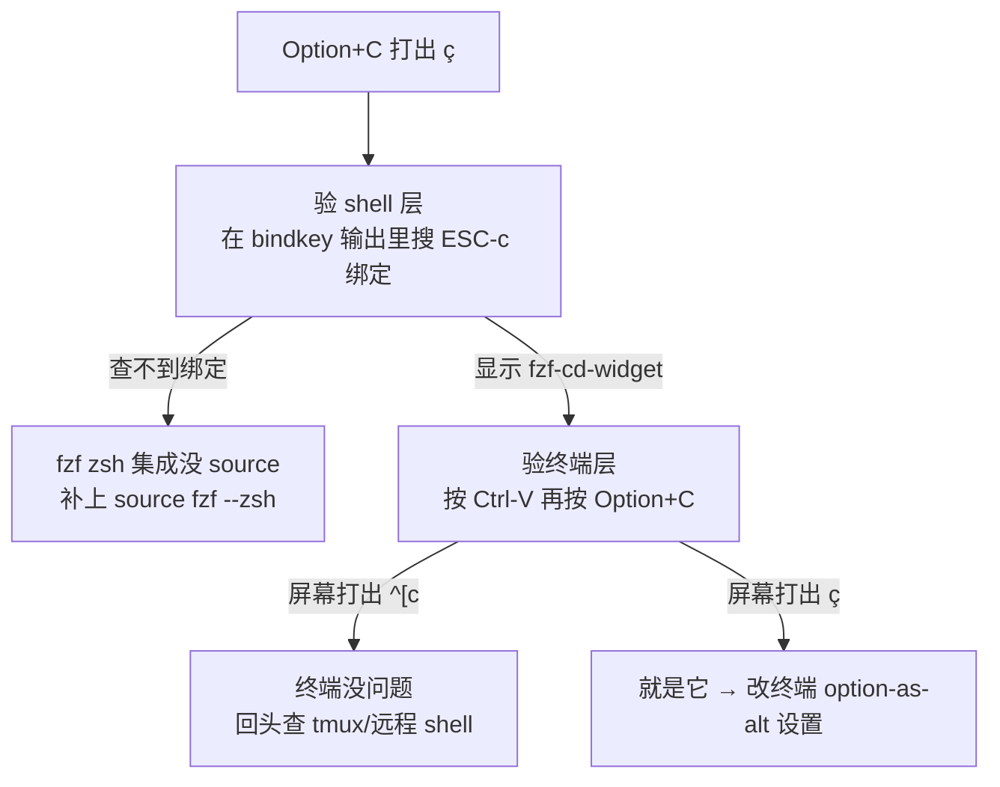
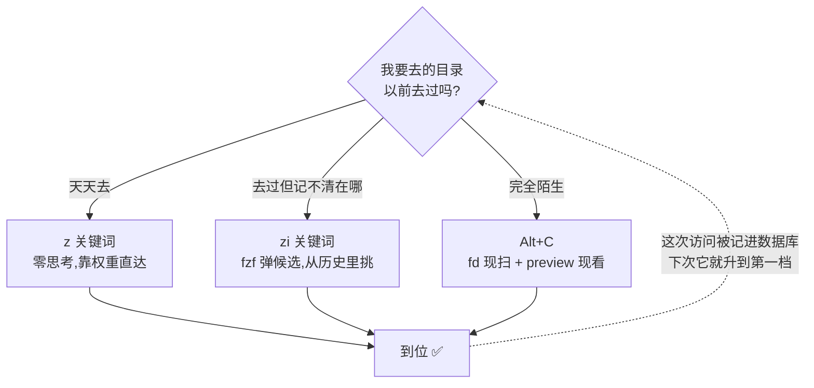

## 写在前面：你的 `cd` 和 `ls` 已经过时二十年了

先问个扎心的问题：你今天敲了多少次 `cd ../../../` 这种"盲人摸象式"路径？又敲了多少次 `ls -la` 然后眯着眼睛在一堆白字里找那个目录？

别不好意思，我也是这么过来的。直到把 `fzf` + `fd` + `zoxide` + `eza` 这四件套攒齐，才发现原来终端可以不用"猜"，可以"搜"。这篇就是把这套组合拳的原理、配置、和踩坑记录一次性讲透，你复制粘贴到 `~/.zshrc` 就能用，五分钟劝退焦虑式敲路径。

---

## Part 1：`Alt+C`，被 90% 的人闲置的快捷键

**直接答案：装好 fzf 后，直接按 `Alt+C`**（Mac 上对应 `Option+C`，但**大概率第一次按会失败**，原因和解法见 Part 1.5）。

它会自动列出当前目录下所有子目录，输入关键字模糊过滤，回车直接 `cd` 进去。零配置，零学习成本，但知道的人少得可怜——大部分人装了 fzf 只用来搜命令历史（`Ctrl+R`），完全没发现这个隐藏福利。

```
Alt+C → 输入 "logs" → 高亮候选 → Enter → 你已经在 mq-airflow/dags/logs 里了
```

验证有没有生效：

```bash
bindkey | grep '\^\[c'   # 应该能看到绑定到 fzf-cd-widget
```

如果这一步就报错或者查不到，说明 fzf 的 zsh 集成没装对，回去检查 `~/.fzf.zsh` 有没有被 source。

---

## Part 1.5：Mac 上按 `Option+C` 打出个 `ç`？—— 这不是 fzf 的锅

这是 macOS 用户装完 fzf 后第一个会撞上的墙，而且极容易误诊：`bindkey` 查出来明明绑好了，按下去却在输入框里蹦出一个 `ç`，然后你开始怀疑 fzf 装坏了。

**没坏。你的按键根本没走到 zsh 那一层。**

### 先看清一次按键要穿过几层



关键认知：`Alt`（Meta）在终端世界里不是一个独立的物理修饰键，它的约定实现是**在字符前面加一个 ESC 字节（0x1B）**。而 macOS 默认把 Option 当作"变音组字键"用——`Option+C` 在系统层就已经被翻译成 `ç` 了。字符一旦生成，ESC 前缀就永远不会出现，zsh 那边的 `bindkey` 绑得再对也没机会被触发。

**所以这是终端模拟器的配置问题，不是 shell 的问题。** 分清这一点，能省下一小时瞎改 `.zshrc` 的时间。

### 两层分开验，别一起猜



`Ctrl-V` 那一招值得单独记：它是 zsh 的 `quoted-insert`，作用是"把下一个按键的原始字节原样打印出来，不做解释"。这是判断"终端到底发了什么字节"的最短路径，比任何日志都直接——以后调试任何快捷键失灵，第一步都该是这个。

### 各终端改哪里（macOS）

| 终端 | 改什么 | 生效方式 |
|---|---|---|
| **Ghostty** | `~/.config/ghostty/config` 里加 `macos-option-as-alt = true` | `Cmd+Shift+,` 重载配置，或重启 |
| **VS Code 内置终端** | `settings.json` 里加 `"terminal.integrated.macOptionIsMeta": true` | 只对**新开的**终端生效，杀掉旧的重开 |
| **Warp** | Settings → Features → Terminal → 打开 *Use Option as Meta key* | 重启 Warp |
| **iTerm2** | Profiles → Keys → Left/Right Option key 设为 `Esc+` | 立即生效 |
| **Terminal.app** | 设置 → 描述文件 → 键盘 → 勾选"将 Option 键用作 Meta 键" | 立即生效 |

**Ghostty 的进阶用法**：这个配置项除了 `true/false`，还接受 `left` / `right`。写 `macos-option-as-alt = left` 就是"左 Option 当 Alt 用，右 Option 保留输入变音字符的能力"——想两头都要的话，这是最优解。

### Warp 的一个隐藏坑（踩过才知道）

Warp 没有明文配置文件承载这个开关，它落在 macOS 的 defaults 里，键名藏在 app 二进制里：

```bash
defaults write dev.warp.Warp-Stable Extra_Meta_Keys_Left  -bool true
defaults write dev.warp.Warp-Stable Extra_Meta_Keys_Right -bool true
```

**但是：必须先完全退出 Warp 再写。** 原因是 macOS 的偏好设置是"进程内存里持有一份、退出时回写"的模型（cfprefsd 缓存 + 应用自己 flush），你在 Warp 运行时写进去，Warp 退出那一刻会用它内存里的旧值把你的修改覆盖掉——命令返回成功，设置却静默丢失，是那种最难查的失败。

能点 UI 就点 UI，别跟一个正在运行的 app 抢同一份 plist。这条规律对所有 macOS 应用通用，不止 Warp。

### 代价说清楚：你会失去什么

打开 option-as-alt 之后，**在那个终端里**你再也打不出 `ç`、`é`、`ø`、`—` 这类需要 Option 组字的字符了（编辑器和其他 app 完全不受影响）。

对写代码的人来说这买卖几乎稳赚——一天用 `Alt+C`/`Alt+F`/`Alt+B` 几十次，一年在终端里打变音字母可能一次都没有。真的两头都要，就用上面 Ghostty 的 `left` 方案。

---

## Part 2：给 fzf 换引擎——`fd` 才是真正的加速器

fzf 默认用 `find` 扫目录，慢，还会把 `.git`、`node_modules` 这种垃圾目录一起扫进来污染你的候选列表。换成 `fd` 之后，速度快一个数量级，而且默认就跳过这些目录：

```bash
export FZF_ALT_C_COMMAND='fd --type d --hidden --exclude .git --exclude node_modules'
export FZF_DEFAULT_COMMAND='fd --type f --hidden --exclude .git'
export FZF_CTRL_T_COMMAND="$FZF_DEFAULT_COMMAND"
```

**一个真实的跨平台坑**：macOS 上 `brew install fd` 装完命令就叫 `fd`；但 WSL/Ubuntu 上 `apt install fd-find` 装完命令叫 `fdfind`（因为 Debian 系一个包名冲突的历史遗留问题）。加这一行兜底，不然你的配置在两台机器上表现不一致，会怀疑人生：

```bash
command -v fd &> /dev/null || alias fd='fdfind'
```

---

## Part 3：给候选列表加"预览窗口"，别再盲选

选目录/文件的时候，光看名字不够,加个预览窗口右边实时显示内容,不用猜:

```bash
# 目录预览:用 eza 画树状图,没装就退化成 ls
export FZF_ALT_C_OPTS="--preview 'eza --tree --level=2 --color=always {}' --preview-window right:50%"

# 文件预览:直接用 bat 高亮显示前 100 行
export FZF_CTRL_T_OPTS="--preview 'bat --color=always --line-range :100 {}' --preview-window right:60%"
```

配完之后长这样——左边模糊搜索,右边实时预览,选之前就看见:

```text
┌─ Alt+C ────────────────────────┬─ preview (eza --tree) ──────────┐
│ > logs                         │ logs                            │
│                                │ ├── scheduler                   │
│   3/128 ───────────────────    │ │   ├── 2026-07-29              │
│ ▶ mq-airflow/dags/logs         │ │   └── 2026-07-30              │
│   mq-airflow/logs              │ ├── dag_processor_manager       │
│   v3/dags/prd/logs             │ └── dag_id=sync_uac_to_sfec     │
│                                │                                 │
└────────────────────────────────┴─────────────────────────────────┘
   ↑ 输入即过滤                      ↑ 光标移动就刷新,不用进去看
```

这一步做完,`Alt+C` 选目录时右边会实时刷新树状结构,`Ctrl+T` 选文件时右边会实时刷新语法高亮内容——终端体验直接从"命令行"变成"轻量级 IDE"。

---

## Part 4：`zoxide` —— 比 fzf 更懒的终极方案

如果说 fzf+fd 是"模糊搜索党",那 `zoxide` 就是"懒到极致党"。它不是配置 fzf,是换一套心智模型:**不再是你去搜目录,而是目录自己排好队等你**。

```bash
brew install zoxide          # macOS
# 或 curl -sS https://webinstall.dev/zoxide | bash   # WSL

eval "$(zoxide init zsh)"    # 加到 ~/.zshrc 里
```

### 核心命令,记这三个就够

```bash
z <关键词>       # 跳到最匹配的目录(核心,90% 场景够用)
zi <关键词>      # 交互模式,配合 fzf 弹出候选列表选
zoxide query -l  # 列出数据库里所有记录(调试用)
```

**关键认知误区**:装完立刻用 `z xxx` 大概率搜不到东西——因为 zoxide 的数据库一开始是空的,得先靠正常 `cd`(或者用 `z` 本身)"喂"它几次,它才会按"访问频率 × 最近程度"排出权重。这不是没装好,是还没喂饱。

### 最佳分工

日常高频目录(比如 `mq-airflow` 项目根目录)用 `z air` 秒达,不用每次模糊搜索;真正陌生、没去过的新目录,才用 `Alt+C`(配置了 fd+preview 那个)做一次性探索。两者不冲突,可以同时装,互相补位。



注意那条虚线——这才是这套组合的精髓:**每次用 `Alt+C` 探索陌生目录,都在同时给 zoxide 喂数据**。今天靠搜索找到的路径,一周后就变成 `z` 一下就到。用得越久越省力,是个正反馈系统。

---

## Part 5：`eza` —— ls 的"文艺复兴"

**先纠正个常见误会**:是 `eza`,不是 `eva`(不是那个动画),读作 "eza",是已停更的 `exa` 的社区继续维护版本,Rust 写的。

### 一句话定位

彩色、带图标、懂 git 状态的 `ls` 替代品。

### 记住这三个命令就够日常用

```bash
eza -la                # 替代 ls -la,自带颜色分类
eza --tree --level=2   # 替代 tree,只看两层深度,不会一下刷屏
eza -la --git          # 每个文件旁边直接显示 git 状态(M/?/A)
```

### 最实用的一步:直接顶替 ls,不用改肌肉记忆

```bash
alias ls='eza --icons --group-directories-first'
alias ll='eza -la --icons --group-directories-first --git'
alias lt='eza --tree --level=2 --icons'
```

`--group-directories-first` 这个参数被严重低估——目录文件混排着看,人眼扫描效率会明显下降,加了这个瞬间清爽,强烈建议无脑加上。

### 进阶玩法,挑感兴趣的深挖

1. **`--git-ignore`**:`eza -la --git-ignore` 自动隐藏被 `.gitignore` 掉的文件,看仓库目录不再被 `node_modules`/`.venv` 刷屏
2. **`--sort` 系列**:按修改时间/文件大小排序,排查"磁盘被谁吃了"或者"这个目录最近改了啥"特别好用
3. **和 fzf 预览窗口联动**:就是 Part 3 里配的那个,`eza --tree` 直接喂给 `FZF_ALT_C_OPTS`

---

## 完整配置,直接粘贴进 `~/.zshrc`

```bash
# === fzf + fd + zoxide + eza 终端导航四件套 ===

# fd 存在才启用,没有就 fallback 到默认 find
command -v fd &> /dev/null || alias fd='fdfind'   # WSL/Debian 系包名坑
if command -v fd &> /dev/null; then
  export FZF_ALT_C_COMMAND='fd --type d --hidden --exclude .git --exclude node_modules'
  export FZF_DEFAULT_COMMAND='fd --type f --hidden --exclude .git'
  export FZF_CTRL_T_COMMAND="$FZF_DEFAULT_COMMAND"
fi

# 预览窗口: 优先 eza, 没有就 ls -la
if command -v eza &> /dev/null; then
  export FZF_ALT_C_OPTS="--preview 'eza --tree --level=2 --color=always {}' --preview-window right:50%"
else
  export FZF_ALT_C_OPTS="--preview 'ls -la {}' --preview-window right:50%"
fi

# Ctrl+T 文件选择配预览, 用 bat 语法高亮
if command -v bat &> /dev/null; then
  export FZF_CTRL_T_OPTS="--preview 'bat --color=always --line-range :100 {}' --preview-window right:60%"
fi

# zoxide: 装了才 init, 避免报错
if command -v zoxide &> /dev/null; then
  eval "$(zoxide init zsh)"
fi

# eza 顶替 ls 三连
if command -v eza &> /dev/null; then
  alias ls='eza --icons --group-directories-first'
  alias ll='eza -la --icons --group-directories-first --git'
  alias lt='eza --tree --level=2 --icons'
fi
```

---

## 跨平台安装速查表

| 工具 | macOS (brew) | WSL Ubuntu |
|---|---|---|
| fzf | `brew install fzf` | `git clone` 官方仓库安装(apt 版本常年偏旧) |
| fd | `brew install fd` | `apt install fd-find`(命令名是 `fdfind`,需要 alias) |
| zoxide | `brew install zoxide` | `curl -sS https://webinstall.dev/zoxide \| bash` 或 apt |
| eza | `brew install eza` | `apt install eza`(较新 Ubuntu 才有,旧版要加官方 repo) |

---

## 一句话总结

- **`Alt+C`**:探索陌生目录
- **`z 关键词`**:秒达常去目录,不解释
- **`eza`**:让 `ls` 的输出重新长出眼睛能用的样子
- **三者叠加**:你的终端从"背命令"进化成"搜索引擎",而且这套东西装一次,用一辈子。
- **Mac 用户额外一步**:先把终端的 option-as-alt 打开,否则 `Alt+C` 只会给你一个 `ç`。快捷键失灵先按 `Ctrl-V` 看终端到底发了什么字节,别急着改 `.zshrc`。

下次有人问你"为什么你打字这么少还干活这么快",把这篇甩过去就行。
