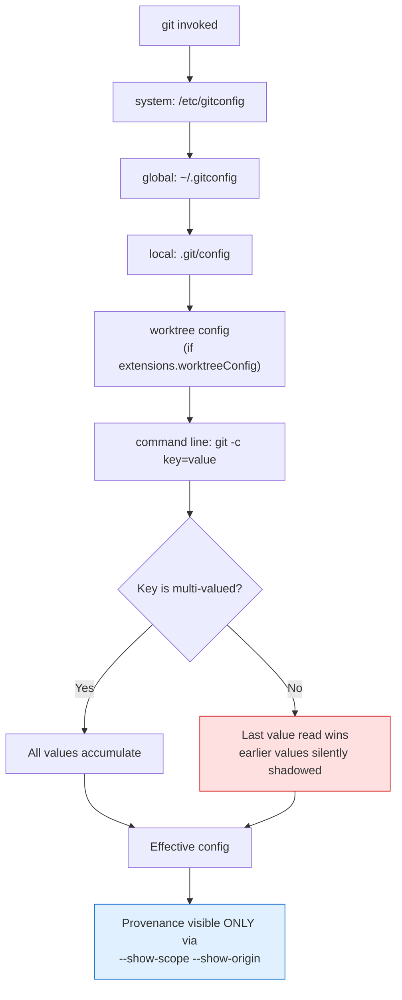
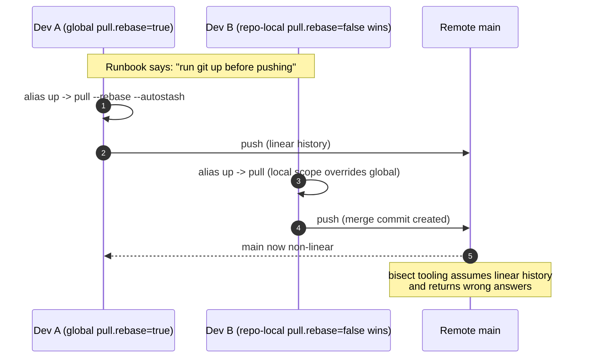
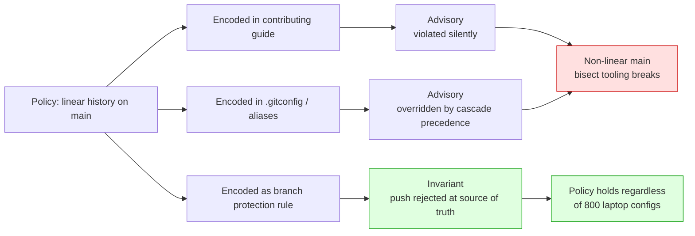
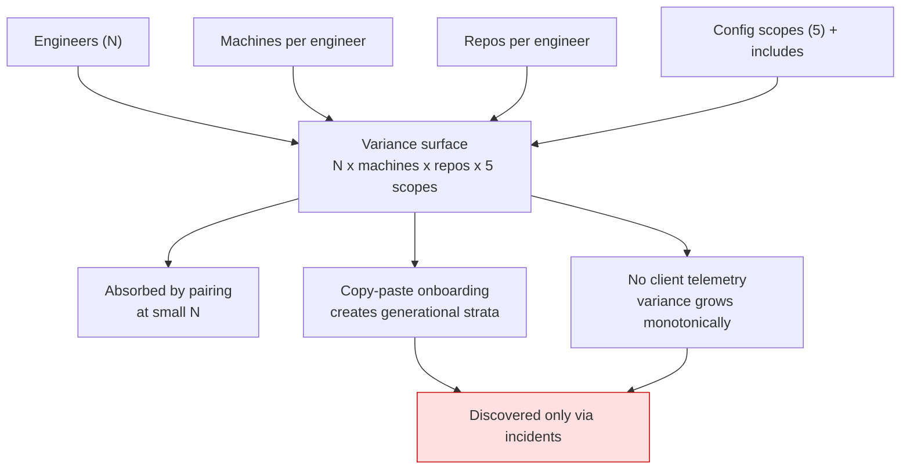
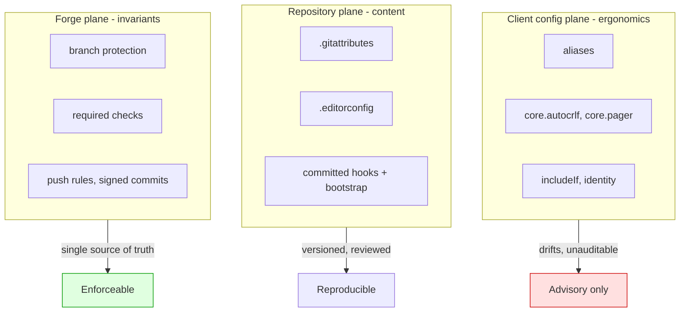

title
Git Config Provenance — EN — Every Engineer Is Running a Private Fork of Your Toolchain
content
---
title: "Every Engineer Is Running a Private Fork of Your Toolchain"
subtitle: "What one boring Git command tells you about configuration provenance, and why client-side config is the last unaudited surface in your platform"
platforms: [Medium, InfoQ, Dev.to, Substack, LinkedIn]
audience: [Senior, Staff, Principal, SRE, Platform Engineering, Architects]
status: draft-for-review
language: en-AU
---

> **Author's note on accuracy.** Two corrections to earlier drafts of this material, kept here deliberately because the article claims authority:
> 1. The subcommand syntax (`git config get --regexp`) landed in **Git 2.46**, not 2.30.
> 2. The value-matching option is `--value=<pattern>` (plus `--fixed-value`), added around **2.30**; the long-standing form is a positional `value-pattern` argument. `--value-pattern` does not exist.
>
> All version numbers in this article are from memory and should be verified against the Git release notes for your audience's versions. The *project-alpha* narrative is a **composite pattern**, not a single documented incident — keep it labelled that way for InfoQ, since their editors ask.

---

# 1. Headline

**Every Engineer Is Running a Private Fork of Your Toolchain**

*What one boring Git command tells you about configuration provenance, and why client-side config is the last unaudited surface in your platform*

# 2. Alternative Headlines

1. `git config --get-regexp '^alias\.'` — The Cheapest Audit in Your Engineering Org
2. Config Without Provenance Is Just Untested State
3. Your Git Aliases Are a Distributed Cache of Team Intent (And Nobody Invalidates It)
4. Stop Enforcing Policy on the Client: A Git Config Postmortem
5. The Cascade Problem: Why CSS, Kubernetes, and Git Fail the Same Way

# 3. Executive Summary

Most engineers treat Git aliases as personal ergonomics — harmless, below the threshold of architectural interest. That framing is a category error.

Aliases are **user-space extensions to the API surface of your version control system**, and they arrive bundled with a much larger payload: the layered, precedence-resolved, provenance-free configuration cascade that governs how every engineer's machine interprets shared commands. The same shell verb produces different history shapes, different line endings, different conflict resolutions, and different force-push semantics across your team — silently, and with no telemetry.

`git config --get-regexp '^alias\.'` is the trivial command that opens this door. The interesting part is what's behind it: a cascade resolution algorithm structurally identical to the CSS cascade, Kustomize overlays, and Spring profiles, sharing their central failure mode — **last-write-wins with no visible origin**.

The strategic conclusion: **client configuration is an ergonomics plane, never an enforcement plane.** Teams that encode policy in `.gitconfig` are writing validation in the browser and calling it security.

---

# 4. Main Article

## The command, and why it's the wrong thing to focus on

```bash
git config --get-regexp '^alias\.'
```

Output:

```
alias.st status -sb
alias.up pull --rebase --autostash
alias.pf push --force-with-lease
alias.nah !git reset --hard && git clean -df
```

Four lines. Fifteen seconds. Now run the version that actually matters:

```bash
git config --show-scope --show-origin --get-regexp '^alias\.'
```

```
global file:/home/dev/.gitconfig alias.up pull --rebase --autostash
local file:.git/config alias.up pull
```

Two definitions of the same verb. The second wins. Nobody knows it exists.

That is the entire article in six lines of terminal output. Everything below explains why it costs more than you think.

---

## Layer 1 — Surface: what engineers see

An alias is a string substitution. `git st` → `git status -sb`. Cheap, personal, forgettable.

Three surface-level facts worth having exactly right, because all three get repeated wrongly in every Git blog post:

**Fact:** `--get-regexp` matches **key names**, not values. The pattern is a POSIX extended regular expression (ERE) — no `\d`, no `\w`, no lookahead. It is unanchored, so `alias` matches `alias.st` *and* `my.aliases.legacy`. Anchor it: `'^alias\.'`.

**Fact:** with no matches, the command produces no output and exits **1**. Under `set -e`, that terminates your bootstrap script. This bites people in onboarding automation constantly.

**Fact:** aliases **cannot shadow built-in commands**. `alias.push = push --force-with-lease` does nothing. The safety wrapper you thought you installed does not exist. (This single fact invalidates a surprising amount of "hardening your Git" advice found in the wild.)

---

## Layer 2 — Mechanism: it's a cascade, not a file

The mental model most engineers hold is "Git reads my `.gitconfig`". The actual model is an ordered merge over up to five sources:

| Precedence | Scope | Location |
|---|---|---|
| 1 (lowest) | `--system` | `/etc/gitconfig` |
| 2 | `--global` | `~/.gitconfig`, `~/.config/git/config` |
| 3 | `--local` | `$GIT_DIR/config` |
| 4 | `--worktree` | per-worktree, requires `extensions.worktreeConfig` |
| 5 (highest) | command line | `git -c key=value …` |

Plus `[include]` and `[includeIf]` directives, which splice additional files in **at the point of inclusion** — meaning include order, not file identity, determines the winner.

Resolution semantics that surprise people:

- For **single-valued** keys, the last value read wins. Earlier values are not merged, they are shadowed.
- For **multi-valued** keys (`remote.origin.fetch`, `include.path`, `safe.directory`), all values accumulate. Which class a key belongs to is a property of the *consuming code*, not the config file — there is no schema.
- Section and key names are case-insensitive and normalised to lowercase on output. **Subsection** names (`remote."Origin"`) are case-sensitive. This asymmetry produces configs that look identical and behave differently.

This is a cascade with precedence and no schema. The comparison set is instructive: the CSS cascade, Kustomize overlay merging, Spring profile layering, Terraform variable precedence, `/etc` + user dotfiles in general. Every one of them generates the same class of bug, and every mature one eventually grows the same fix: **provenance tooling**. Browser devtools show you which stylesheet rule won. `kubectl kustomize` renders the merged output. Git's answer is `--show-origin` (Git 2.8-era) and `--show-scope` (2.26-era).

**Opinion:** the fact that `--show-origin` is not the *default* for `git config --list` is the single largest usability defect in Git's configuration system.

---

## Layer 3 — System: the alias layer is wider than the alias

The dangerous config is not the aliases. It's what travels with them.

Aliases are the visible tip of a client-side configuration plane that includes:

- `pull.rebase`, `rebase.autoStash`, `merge.ff` → **history shape**
- `core.autocrlf`, `core.eol`, `.gitattributes` interaction → **content bytes**
- `merge.conflictStyle` (`merge` vs `diff3` vs `zdiff3`) → **conflict resolution outcomes**
- `core.hooksPath`, `init.templateDir` → **which code runs on commit**
- `filter.*.clean` / `filter.*.smudge`, `diff.external`, `core.pager`, `core.editor`, `sequence.editor` → **arbitrary process execution during ordinary Git operations**
- `credential.helper` → **where your tokens live**

And crucially: **IDE-embedded Git clients frequently do not expand your aliases** — they call plumbing or their own libgit2/JGit implementation. So the same engineer gets different behaviour from the terminal and from the IDE's "Update Project" button, on the same repo, in the same minute. Most teams have never noticed this because nobody instruments the client.

There is no telemetry plane for developer machine configuration. You have observability on your services and none on the tools that produce them.

---

## Layer 4 — Scale: variance is multiplicative

The variance surface is roughly `engineers × machines × repos × scopes`. At 8 engineers this is noise you absorb through pairing. At 800 it is a measurable reliability input, because three things change:

1. **Onboarding fans out unversioned state.** Someone's dotfiles repo becomes the de facto standard by being copy-pasted. It is a *copy*, so it never receives updates. You now have generational strata of config: people who joined before the `zdiff3` change and people who joined after.
2. **CI diverges from local by construction.** CI containers have a near-empty global config. Local machines are thick with it. Every "passes locally, fails in CI" bug where the diff is invisible is a candidate for a config-cascade root cause.
3. **Tribal workflows become unteachable.** When the senior engineer's demo is `git up && git nah && git pf`, the knowledge transferred is the alias, not the operation. Juniors learn a vocabulary that doesn't exist on any other machine, and can't debug it when it fails. This is the organisational cost, and it's the one that compounds.

---

## Layer 5 — Failure: a narrative

*(Composite pattern, not a single documented incident.)*

**Context.** A platform team at a company we'll call *project-alpha* consolidates 40 service repos into a monorepo. The stated branch policy is linear history: rebase before merge, no merge commits on `main`. It's documented in the contributing guide and repeated in onboarding.

**Trigger.** Three weeks after migration, `main` accumulates merge commits at roughly one per day. Not from everyone — from a stable subset of about a dozen engineers. The bisect tooling the team built for the old repos assumes linear history and starts producing wrong answers during a latency regression hunt.

**Escalation.** The obvious solution is applied first: reiterate the policy, add it to the PR template, add a lint step that greps commit messages for "Merge branch". The merge commits keep arriving. Two engineers insist, credibly, that they *did* rebase — and they're not wrong about their intent.

**Investigation.** The migration script, written to preserve per-repo settings, wrote a `.git/config` into the new monorepo clone instructions. That local config contained, among 30 harmless lines, `pull.rebase = false`. Local scope beats global. Engineers who had `pull.rebase = true` in their own global config — the ones who had configured themselves correctly — were silently overridden. Engineers with *no* global setting were unaffected by the override in any way they'd notice, because they were already rebasing manually out of habit.

The diagnostic was one command:

```bash
git config --show-scope --show-origin --get-regexp 'pull\.|rebase\.|merge\.'
```

Which nobody ran for three weeks, because config is not where engineers look for behavioural bugs. They look at code.

**Resolution.** Three changes, in ascending order of value:

1. Remove the offending key. (Fixes the incident. Fixes nothing structurally.)
2. Replace copied config with an *included* config: a reviewed `tools/git/team.gitconfig` in the repo, wired in via `[include] path = ../tools/git/team.gitconfig`. A pointer receives updates; a copy does not.
3. **Enforce linear history server-side.** A branch protection rule rejecting non-linear merges. Now the invariant holds regardless of what 800 laptops believe.

**Lesson.** The client config was never the control. It was an *expression of hope* that the client would behave. The moment the invariant mattered, it had to move to the only place with a single source of truth.

Generalised: **any policy expressed only in client configuration is advisory. If you need it to be true, it belongs on the server.**

---

## Layer 6 — Strategic: draw the boundary once

This is the Principal-level reframing, and it is not really about Git.

| Plane | Owns | Properties | Correct instrument |
|---|---|---|---|
| **Client config** | ergonomics, speed, defaults, safety *nudges* | per-user, drifting, unauditable, unenforceable | `[include]`, `[includeIf]`, docs, sane team defaults |
| **Repository content** | reproducibility of *content* | versioned, reviewed, shared | `.gitattributes`, `.editorconfig`, committed hooks + `core.hooksPath` bootstrap |
| **Server / forge** | invariants | single source of truth, enforceable, auditable | branch protection, required checks, push rules, signed commits |

The failure mode I see most often in mature orgs is not ignorance of this table. It's putting things one column to the left of where they belong, because the left column is cheaper to change. Client config is the path of least resistance and the path of least guarantee.

`.gitattributes` deserves a specific callout: it is the correct answer to line-ending chaos precisely because it is *content*, not *config*. It's versioned, reviewed, and identical for everyone who clones. `core.autocrlf` is the wrong answer to the same question because it's per-machine. Same problem, two planes, radically different reliability. **Prefer the plane with provenance.**

---

## Security: the `!` prefix

An alias beginning with `!` executes through the shell:

```
alias.deploy !sh -c 'git push origin HEAD && ./scripts/deploy.sh'
```

This is arbitrary code execution, running with your developer credentials, cloud tokens, SSH agent, and package registry access.

**Facts:** `git clone` does *not* copy the remote's `.git/config`, so the naive attack ("clone this repo, get pwned by an alias") doesn't work. Git has also hardened repository-ownership checks — `safe.directory` was introduced in response to CVE-2022-24765, where a repository in a directory owned by another user could get its config trusted.

**Where the real exposure sits, in my experience:** not clones, but the things engineers run *without review* —

- `curl … | bash` bootstrap and dotfile-installer scripts
- shared dotfiles repos with dozens of contributors and no CODEOWNERS
- devcontainer and Codespaces setup steps
- "just run this to fix your environment" snippets pasted in chat during incidents
- CI images inheriting a base image's `/etc/gitconfig`

Any of these can write `alias.*`, `core.pager`, `core.hooksPath`, or `filter.*.clean` into a global config. `core.pager` is the elegant one: it executes on `git log`, `git diff`, `git show` — commands engineers run reflexively and would never treat as a trust boundary.

**Practical control, cheap to adopt:** make client config auditable at all.

```bash
# Any shell-escaping aliases anywhere in the cascade?
git config --show-scope --show-origin --get-regexp '^alias\.' | grep -- '!'

# Execution-capable keys
git config --show-scope --show-origin --get-regexp \
'^(core\.(pager|editor|hooksPath|fsmonitor)|sequence\.editor|diff\..*\.(command|textconv)|filter\..*\.(clean|smudge)|init\.templateDir)$'

# Full inventory with provenance, checked into your dotfiles as a snapshot
git config --show-scope --show-origin --list | sort
```

**Opinion:** every engineering org above ~50 people should have a one-command "print my Git config with provenance" and a documented expected baseline. Almost none do. The cost is an afternoon.

---

## The primitive almost nobody uses: `includeIf`

If you take one operational technique from this article, take this. Conditional includes let you stop maintaining a single global config that's wrong for half your repos.

```ini
# ~/.gitconfig
[user]
name = Alex Engineer
email = alex@example.com

[include]
path = ~/.config/git/aliases.common # versioned, shared, reviewed

[includeIf "gitdir:~/work/"]
path = ~/.config/git/work.gitconfig # work identity, signing key, rebase policy

[includeIf "gitdir:~/oss/"]
path = ~/.config/git/oss.gitconfig # public identity, no corp signing key
```

Version support, **which you should verify against your own Git** (`git --version`, then the release notes for your version):

| Directive | Introduced around |
|---|---|
| `includeIf "gitdir:…"` | 2.13 |
| `includeIf "onbranch:…"` | 2.23 |
| `includeIf "hasconfig:remote.*.url:…"` | 2.36 |
| `--show-origin` | 2.8 |
| `--show-scope` | 2.26 |
| `--fixed-value`, `--value=<pattern>` | 2.30 |
| `git config get/set/list/unset` subcommands | 2.46 |

`hasconfig:remote.*.url:` is the underrated one: it keys off the *remote*, not the filesystem path, which is what you actually mean when you say "in company repos, use my company identity." Directory conventions are a proxy; the remote is the truth.

**Trade-off, stated honestly:** conditional includes trade one confusing file for several files plus a resolution rule. Debuggability drops unless you also adopt `--show-origin` as a habit. If your team won't adopt the diagnostic, don't adopt the complexity — you'll have built a cascade you can't read, which is worse than a monolith you can.

---

# 5. Contrarian Insight

## The Popular Belief

> Git aliases are personal productivity tooling. Standardising them across a team is bikeshedding, mildly authoritarian, and a poor use of a platform team's attention.

## Why It Seems Correct

It's correct about most of what it claims. Developer autonomy in local tooling is genuinely valuable. Aliases have no runtime footprint, ship to no customer, and appear in no dependency graph. Mandating `st` over `s` is real bikeshedding, and engineers are right to resent it. The belief also has good sociology behind it: platform teams that colonise personal environments lose trust, and trust is the resource they run on.

## Where It Breaks Down

Three hidden assumptions:

**Assumption 1: aliases are private.** They aren't — they're *vocabulary*. The moment a senior engineer says "just run `git up`" in a pairing session, an incident channel, or a runbook, the alias has entered shared language while remaining a per-machine artifact. Shared vocabulary with per-machine semantics is the definition of a coordination bug.

**Assumption 2: the blast radius is one developer.** `alias.pf = push --force` and `alias.pf = push --force-with-lease` differ by one flag and by whether concurrent work survives. Aliases that wrap destructive operations convert a deliberate, typed-out, thought-about command into three characters of muscle memory. That is not a productivity gain; it is the removal of a friction that was doing load-bearing safety work.

**Assumption 3: the alias is the object of concern.** It never was. Aliases are just the most *legible* entry in the cascade. Auditing them is valuable mainly because it's the habit that makes you audit `core.hooksPath` and `pull.rebase` too.

## A Better Mental Model

**Aliases are a distributed, per-machine cache of team intent — and no one implemented invalidation.**

Everything follows from that framing:

- Caches need **provenance** → `--show-scope --show-origin` is your cache-inspection tool.
- Caches need **invalidation** → `[include]` a versioned file (a pointer) instead of copying config (a snapshot). Copies are caches with infinite TTL.
- Caches must be **semantics-preserving** → a personal alias may shorten a command; it must not change what the command *means*. `co = checkout` is fine forever. `up = pull` on a team with a rebase policy is a lie with a short name.
- Caches are **not a source of truth** → invariants live server-side. Always.

The practical policy that falls out is neither "standardise everything" nor "ignore it":

1. **Don't standardise personal shorthand.** Truly nobody's business.
2. **Do version and distribute the aliases that encode team semantics** — anything touching force-push, reset, clean, rebase, or history shape — via a reviewed included file.
3. **Do make the cascade inspectable**, and teach `--show-origin` in onboarding alongside `git log`.
4. **Do move every actual invariant to the forge**, and treat client config as ergonomics only.

That's a much smaller intervention than "standardise aliases," and it's the one that survives contact with 800 engineers.

---

# 6. Principal Engineer Perspective

## Junior Engineer — *implementation*

Asks: *how do I list my aliases?*
`git config --get-regexp '^alias\.'`. Learns that `--get-regexp` matches keys, and that no output plus exit 1 means "none found," not "broken."

## Senior Engineer — *correctness and maintainability*

Asks: *which definition is actually winning, and why?*
Uses `--show-scope --show-origin` by default. Knows single-valued keys shadow rather than merge, that subsection names are case-sensitive, that aliases can't override built-ins, and that `!` aliases are shell code. Reaches for `.gitattributes` over `core.autocrlf` without needing to think about it.

## Staff Engineer — *architecture and team impact*

Asks: *what variance can our workflow tolerate, and where do we absorb the rest?*
Recognises the cascade as a distributed configuration problem and stops solving it with documentation. Ships a versioned `team.gitconfig` distributed by `[include]`, not by copy-paste. Adds a config-provenance dump to the CI-parity checklist and the incident template. Notices that IDE Git clients bypass aliases and decides explicitly whether to care.

## Principal Engineer — *evolution, organisational cost, strategic risk*

Asks: *which plane should own this class of guarantee, permanently?*

Four positions:

1. **Client config is an ergonomics plane. Never an enforcement plane.** Policy in `.gitconfig` is validation in the browser. If it must be true, the forge enforces it and CI verifies it.
2. **Prefer the plane with provenance.** Between two mechanisms of equal power, choose the one whose effective value can be traced to a reviewed artifact. `.gitattributes` over `core.autocrlf`; committed hooks over per-machine hooks; server rules over etiquette.
3. **Copying is the anti-pattern; pointing is the pattern.** Every copy of shared config is an unversioned fork with infinite TTL. Onboarding scripts that `cp` a dotfile are creating tomorrow's generational drift.
4. **Unobserved planes accrue risk at organisational scale.** You have no telemetry on developer machine config, which means variance grows monotonically and is only discovered through incidents. The cheap mitigation is a documented baseline plus a self-serve provenance dump — not an MDM-style mandate, which costs trust and buys compliance you can't verify anyway.

The strategic risk if you skip all of it: your engineering org's most-used tool has a per-user behavioural surface that no one reviews, no one monitors, and everyone assumes is uniform. That assumption is load-bearing in your postmortems.

---

# 7. Recommended Diagrams

## Diagram 1 — Git config cascade resolution

**Purpose:** replace "Git reads my .gitconfig" with an ordered-merge model, and show where provenance is lost.



## Diagram 2 — Divergent outcomes from one shared verb

**Purpose:** show how identical instructions produce different history across two engineers.



## Diagram 3 — Failure flow: policy expressed on the wrong plane

**Purpose:** make the "client = advisory, server = invariant" boundary undeniable.



## Diagram 4 — Variance surface growth

**Purpose:** show why this is noise at 10 engineers and a reliability input at 800.



## Diagram 5 — Plane ownership model

**Purpose:** the one-slide artifact to bring to an architecture review.



---

# 8. Frequently Asked Questions

**Q1. What exactly does `git config --get-regexp alias` do?**
It prints every configuration entry whose **key name** matches the ERE pattern `alias`, as `key value` lines. Because all Git aliases live under `alias.*`, it functions as "list my aliases." The pattern is unanchored, so prefer `git config --get-regexp '^alias\.'` to avoid matching unrelated keys such as `my.aliases.legacy`.

**Q2. Why does it exit with code 1 and print nothing?**
No keys matched. That is a normal, successful execution with an empty result set — Git signals "not found" through the exit code. Guard it in scripts (`if git config --get-regexp '^alias\.' >/dev/null 2>&1; then … fi`) rather than letting `set -e` abort your bootstrap.

**Q3. How do I find out which config file a setting came from?**
`git config --show-scope --show-origin --get-regexp '^alias\.'`. `--show-origin` (≈Git 2.8) prints the file; `--show-scope` (≈2.26) prints system/global/local/worktree/command. This is the single most useful diagnostic in Git's configuration system and should be a habit, not a last resort.

**Q4. Which config scope wins when the same key is set twice?**
For single-valued keys: system → global → local → worktree → command line, highest wins, and earlier values are shadowed rather than merged. For multi-valued keys (e.g. `remote.origin.fetch`, `include.path`, `safe.directory`) values accumulate. Whether a key is single- or multi-valued is determined by the code that reads it; there is no schema you can consult.

**Q5. Can a Git alias override a built-in command like `git status`?**
No. Built-ins always take precedence, so `alias.status = log` has no effect. This matters practically: you cannot make `git push` safer by aliasing it. Use a distinct name (`alias.pf = push --force-with-lease`) and enforce the real constraint server-side.

**Q6. Are aliases starting with `!` dangerous?**
They execute through the shell with your full developer credentials, so they are arbitrary code execution. `git clone` does not copy a remote's `.git/config`, so the naive "malicious repo" path is closed, and Git added ownership checks (`safe.directory`, after CVE-2022-24765). The realistic exposure is unreviewed bootstrap scripts, shared dotfiles repos, devcontainer setup, and CI base images writing into global config. Audit with `git config --show-scope --show-origin --get-regexp '^alias\.' | grep -- '!'`, and extend the audit to `core.pager`, `core.hooksPath`, `filter.*.clean/smudge` and `diff.*.command`.

**Q7. Should a team standardise Git aliases?**
Not personal shorthand. Do version and distribute aliases that encode team *semantics* — anything wrapping force-push, reset, clean, or rebase — as a reviewed file pulled in via `[include]`, so recipients get updates instead of a frozen copy. And move anything that must actually hold, such as linear history, to branch protection on the forge. Client config is advisory by construction.

**Q8. What's the best way to manage different identities for work and open source?**
Conditional includes. `[includeIf "gitdir:~/work/"]` (≈2.13) keys off path; `[includeIf "hasconfig:remote.*.url:…"]` (≈2.36) keys off the remote URL, which is usually what you actually mean. Verify support with `git --version`. Accept the trade-off: more files plus a resolution rule, so pair it with the habit of `--show-origin`.

---

# 9. Key Takeaways

1. `git config --get-regexp '^alias\.'` matches **key names** with an unanchored ERE; empty output plus exit 1 means "no matches," not failure.
2. Git config is a **five-level cascade with no schema**. Single-valued keys shadow; multi-valued keys accumulate; subsection names are case-sensitive while sections and keys are not.
3. **`--show-scope --show-origin` is the real command.** Provenance, not values, is what you're missing.
4. Aliases **cannot shadow built-ins** — client-side "safety wrappers" for `push` do not exist.
5. The aliases aren't the risk; **what travels with them is** — `pull.rebase`, `core.autocrlf`, `core.hooksPath`, `core.pager`, `filter.*.clean`.
6. **Prefer the plane with provenance:** `.gitattributes` over `core.autocrlf`, committed hooks over per-machine hooks, forge rules over etiquette.
7. **Point, don't copy.** `[include]` a versioned team config; a copied dotfile is an unversioned fork with infinite TTL.
8. **Client config is ergonomics; the forge is enforcement.** Policy that exists only in `.gitconfig` is validation in the browser.
9. `includeIf` — especially `hasconfig:remote.*.url:` — is the most under-used primitive in Git configuration.
10. At scale, **unobserved planes accrue risk monotonically**. You have no telemetry on developer config; a documented baseline plus a self-serve provenance dump costs an afternoon.

---

# 10. SEO Metadata

**Primary Title:** Every Engineer Is Running a Private Fork of Your Toolchain: Git Config Provenance and the Limits of Client-Side Policy

**SEO Description (155 chars):**
Why `git config --get-regexp alias` matters: Git's config cascade, provenance with --show-scope, includeIf patterns, and why client config can never enforce policy.

**Keywords:**
`git config --get-regexp alias`, git config precedence, git config show-origin, git config show-scope, git alias list, git includeIf, hasconfig remote url, pull.rebase local vs global, core.autocrlf vs gitattributes, git config security, git alias shell execution, core.pager code execution, safe.directory CVE-2022-24765, developer environment drift, configuration provenance, client-side vs server-side policy enforcement, branch protection linear history, platform engineering developer experience, git config cascade, dotfiles drift at scale

**TL;DR:**
`git config --get-regexp '^alias\.'` lists your aliases by matching key names. The command that actually matters is `git config --show-scope --show-origin --get-regexp '^alias\.'`, because Git config is a five-level cascade where the last write wins invisibly. Aliases are the legible tip of an unaudited client-side configuration plane that also decides history shape, line endings, conflict resolution, and which code runs on commit. Treat client config as ergonomics: version shared config and `[include]` it rather than copying, use `includeIf` for identity, prefer `.gitattributes` over per-machine settings, and move every real invariant to server-side branch protection. Policy in `.gitconfig` is validation in the browser.

---

## Pre-publication checklist

- [ ] Verify every Git version number against release notes for your audience's versions
- [ ] Keep the *project-alpha* story labelled as a composite pattern (InfoQ editors ask)
- [ ] Confirm no real company names, internal domains, or project names remain
- [ ] Render all five Mermaid diagrams on the target platform (CSDN and WeChat need image exports)
- [ ] Mark opinion vs fact statements are still clearly distinguished after any edit
