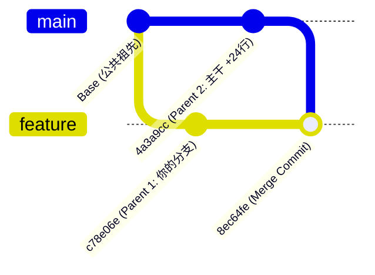

> "To understand Git, you have to understand the graph. The rest is just plumbing." — Git Core Philosophy

# 单亲提交（Normal Commit） vs 双亲提交（Merge Commit）：为什么你的 Diff 离奇“失踪”了？

场景：周五下午五点，你在终端里刚把最新的主线分支合并进依赖升级分支。解决完冲突后，你习惯性地敲下 `git show --stat` 想核对变更：屏幕上赫然写着 `DPS__Adyen_Load.py | 24 +-`。然而，当你输入 `git show <commit> -- DPS__Adyen_Load.py` 准备逐行审查这 24 行代码时，终端却陷入一片死寂——没有任何报错，也没有任何代码输出，只有空荡荡的换行符。

明明统计里显示有 24 行修改，为什么点进去具体查看时却什么也看不见？代码到底改了没有？

---

## 一、 案发现场：失踪的 24 行 Diff

在真实研发场景中，你刚刚完成了一个 Merge Commit（例如提交哈希为 `8ec64fec`）：

```text
commit 8ec64fec1f65a5438728e475db2618b605256ff8
Merge: c78e06e6e 4a3a9ccdf
Author: Todd Zhang <todd.zhang@example.com>
Date:   Fri Sep 11 11:39:07 2026 +1000

    DATAPLATCORE-1265 merge master, resolve conflicts

 dags/prd/edr/DPS__Adyen_Load.py                    |   24 +-
 pyproject.toml                                     |    6 +-
 requirements.txt                                   | 1545 ++++++++-------
```

当你查看特定文件时：

```bash
$ git show 8ec64fec -- dags/prd/edr/DPS__Adyen_Load.py
# (没有任何输出)
```

很多工程师遇到这种情况第一反应是：是不是 Git 出 Bug 了？或者本地 index 缓存坏了？

其实都不是。这是 Git 底层针对“合并提交”特有的 Diff 算法在发挥作用。

---

## 二、 核心机制：单亲与双亲的拓扑差异

理解这个现象的关键，在于区分普通提交与合并提交的血统差异。



### 1. 单亲提交（Normal Commit）：线性的绝对参照
日常开发中 90% 以上的 Commit 都是普通提交。它们只有一个父节点：

$$\Delta = \text{Commit}_B - \text{Commit}_A$$

状态转移是单向且确定的，Git 只需要拿当前树快照和父节点快照做逐文件差集比对即可。

### 2. 双亲提交（Merge Commit）：多维的参照困境
Merge Commit 是分支历史的汇合点。在上述例子中：
- **Parent 1 (`HEAD^1` = `c78e06e6e`)**：合并前的当前特性分支
- **Parent 2 (`HEAD^2` = `4a3a9ccdf`)**：被合并进来的目标主线分支

此时 Git 面临一个根本性难题：**当你要看这个 Commit 的变动时，它到底应该跟谁比？**
- 如果直接拿它跟 Parent 1 比：主线分支上引入的成千上万行改动都会倾泻出来，把你真正关心的冲突解决彻底淹没。
- 如果拿它跟 Parent 2 比：特性分支上的所有工作又会重复列出。

---

## 三、 Linus 的设计哲学：Combined Diff（组合对比）

为了避免代码审查被海量的合并噪音淹没，Git 默认对 Merge Commit 启用了 **Combined Diff（组合对比，即 `--cc` 格式）**。

📌 **Takeaway**: Combined Diff 的核心设计原则是：**只展示在合并过程中发生冲突、或者被合并者手动修改的代码行。**

### Combined Diff 的过滤规则：
1. 如果某一行代码完全来自 Parent 1，且合并后未改变 $\rightarrow$ **隐藏**。
2. 如果某一行代码完全来自 Parent 2，且合并后未改变 $\rightarrow$ **隐藏**。
3. **只有当合并结果中的代码与所有父节点都不相同时**（即人工裁决冲突或夹带修改） $\rightarrow$ **才会显示！**

在案发现场中：
- `DPS__Adyen_Load.py` 在你的特性分支上从未被修改过；
- 主线分支对其进行了修改（升级为 ECS Operator，共 24 行）；
- 合并时，Git 自动采纳了主线分支的版本，**没有发生冲突**。

因此，该文件在 Merge Commit 后的快照与 Parent 2 (`master`) **100% 字节相同**。因为它是干净无冲突的平凡合并（Trivial Merge），Combined Diff 认定无需人工审查，**直接将其完全过滤为空白**！

---

## 四、 认知撕裂的元凶：为什么 `--stat` 又显示了 24 行？

这就是让无数工程师抓狂的地方：
- `git show` 打印具体代码块（Hunk）时，默认使用 **Combined Diff (`--cc`)**；
- 但 `git show --stat` 在输出文件级变更统计时，由于组合统计逻辑极为复杂，Git **默默回退到了仅对比第一父节点（Parent 1）**！

也就是说：
```text
git show --stat <merge_commit> 
等价于
git diff --stat <merge_commit>^1 <merge_commit>
```

- **概览视角（Stat）**：Git 拿特性分支为基准，告诉你“比起你合入前，这个文件多了 24 行变动”。
- **详情视角（Diff）**：Git 启用 Combined Diff，告诉你“这文件与 master 一致，没有冲突修改，隐藏”。

🩸 **Warning**: 千万不要因为 `git show` 输出为空就误以为变更没有生效！更不要在看到空输出后慌张地去手动拷贝代码覆盖，这往往会导致误将未测试的代码强行带入生产分支。

---

## 五、 两种文件的实际表现对比

| 文件 | 合并状态 | 与 Parent 1 差异 | 与 Parent 2 差异 | `git show` (Combined Diff) |
|---|---|---|---|---|
| `DPS__Adyen_Load.py` | 干净合并 (Clean) | 24 行变更 | 0 差异 (相同) | **完全空白 (隐藏)** |
| `pyproject.toml` | 冲突解决 (Conflicted) | 有冲突修改 | 有冲突修改 | **显示三方对比 (`@@@`)** |

我们看一下实际解决过冲突的文件在 Combined Diff 下的长相：

```diff
diff --cc pyproject.toml
index dbc897c4d,217f067cd..805566d7e
--- a/pyproject.toml
+++ b/pyproject.toml
@@@ -18,80 -18,80 +18,80 @@@
  teradatasql = "20.0.0.37"
- mako = "1.3.10"
+ mako = "1.3.12"
 -pydantic = "2.9.2"
 +pydantic = "2.12.5"
```
注意第一列是 Parent 1 的改动，第二列是 Parent 2 的改动，三方标记为 `@@@`。

---

## Action Items

当你在 Merge Commit 中需要清晰审阅代码时，请按以下标准化步骤操作：

1. **查看引入的外部改动（最推荐）**：使用 `--first-parent` 参数，强制单向对比第一父节点。
   ```bash
   git show --first-parent <commit> -- <file>
   ```
2. **拆解双亲独立查看**：使用 `-m` 参数，将合并提交拆分为对各个 Parent 的独立 Diff。
   ```bash
   git show -m <commit> -- <file>
   ```
3. **核对冲突解决质量**：直接使用默认 `git show`，专门审查是否有误解冲突、手抖漏代码的情况。
   ```bash
   git show <commit>
   ```
4. **验证文件是否与主线完全一致**：直接与第二父节点执行 `git diff`。
   ```bash
   git diff <commit>^2 <commit> -- <file>
   ```

---

## 🧭 Elevation
### 核心原理提炼
- **状态大于过程**：Git 记录的是树对象的哈希快照，Diff 只是动态计算出的展示视图。
- **降噪设计与上下文绑定**：Combined Diff 的本质不是展示“代码变成什么样”，而是展示“合并引入的增量熵增”。
- 举一反三：这种基于父节点角色的处理方式同样存在于 PR Review 平台与 CI 自动化工具中。例如 GitHub PR 的 “Files Changed” 并非比对 `origin/master..feature` 的简单 diff，而是比对 `git merge-base master feature` 到特性的改动；在编写自动化静态扫描脚本时，切忌直接在 Merge Commit 上跑普通的 `git diff HEAD~1`，而必须明确指定 `--first-parent` 才能避免误扫整个主线合并进来的存量代码。
