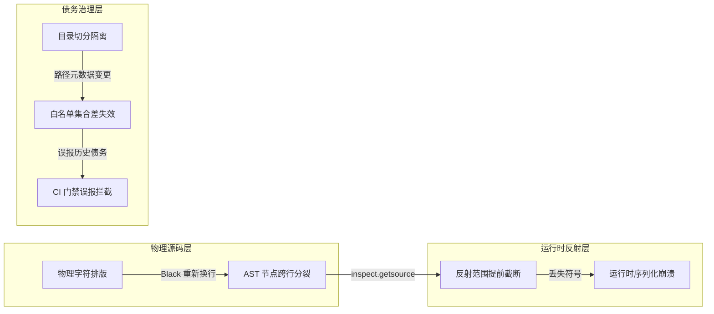

> “The most dangerous bugs are not the ones where the logic is wrong, but the ones where the environment lies to your tools.” — Software Engineering Field Notes

# CI 红灯下的幽灵：代码格式化的量子坍塌与多环境“祖父条款”陷阱

*从 Airflow 2.11 升级实战，深解 Python 源码内省反射机制与技术债务治理契约*

周二下午。数据平台核心大仓 `edr-airflow-dags` 的 PR #12852 正式发起——任务目标明确而沉重：全面拉平与 `master` 偏离的 1187 个 commits，并将 Apache Airflow 从 2.8 升级至 2.11.2，Python 切至 3.12。

本地 pre-commit 绿了，SIT 与 STG 环境的 DAG 测试分别在 7m59s 和 3m34s 跑通，Wiz 安全扫描全绿。然而，GitHub Actions 的总控面板上却猝不及防地亮起了两盏刺眼的红灯：

1. **`Run DAG Tests - DEV`**：在没有任何新业务逻辑变更的情况下，7 个历史悠久的 BTEQ 文件集体爆出 `assert not True`（`.EXPORT` 和 `.OS` 违规命令）。
2. **`Run Plugin Tests`**：一个最基础的 ECS 算子单元测试 `test_serialize_transform_callable` 报出令人百思不得其解的断言差异：
   `assert '[lambda row:..." ", row, ),]' == '[lambda row:... row, ), foo]'`

两处红灯，没有一行业务 Bug，却精准踩中了现代软件工程中极其隐蔽的两个深水区：
一个是**物理代码格式化对运行时源码反射（Introspection）的“量子坍塌”**；
另一个是**多环境 CI 动态隔离对遗留系统“祖父条款”（Grandfather Clause）的技术债务击穿**。

| 故障现象 | 表面报错 | 真实根因 |
|---|---|---|
| `test_bteq_files.py` (DEV) | 7 个文件含 `.EXPORT` / `.OS` 命令 | CI 打包裁剪只留 `dags/dev`，而豁免白名单只认 `./dags/sit/...` |
| `test_s3_to_s3_ecs.py` | 序列化字符串漏掉 `foo` 且格式不一致 | `black` 换行把 `, foo` 挤到下一行，`inspect.getsource` 提前截断 |

---

## 1. 深挖一：`# fmt: off` —— 当代码美化撞上源码反射

在 `S3ToS3Ecs` 算子中，Airflow 需要支持将用户传入的 Python 函数列表（如数据清洗规则）跨进程下发至远端 ECS 容器执行：

```python
def serialize_transform_callable(transform_callable):
    funcs_as_strings = [inspect.getsource(f).strip() for f in transform_callable][0]
    try:
        return funcs_as_strings.split("=", 1)[1].strip().strip(",")
    except IndexError:
        serialized_funcs = re.sub(r"\s+", " ", funcs_as_strings).strip()
        return f"[{serialized_funcs}]"
```

测试用例原本写得非常精巧：
```python
funcs1=[
    lambda row: re.sub(
        r"\uFFFD",
        " ",
        row,
    ), foo
]
```

### 反射的幽灵：`inspect.getsource` 的工作机制
很多人以为 Python 的反射机制是在内存中读取 AST 或字节码反编译。**完全不是**。
`inspect.getsource(obj)` 的底层实现是去磁盘上找到该对象对应的 `.py` 物理文件，逐行回溯并截取代码字符串！

当 pre-commit 中的 `black` 运行时，它遵循 PEP 8 规则将多参数拆行：
```python
funcs1 = [
    lambda row: re.sub(
        r"\uFFFD",
        " ",
        row,
    ),
    foo,
]
```

这一“人眼看起来更舒服”的排版，直接触发了灾难：
1. Python 解释器在对 `funcs1[0]`（即 lambda 表达式）进行源码边界判定时，发现 lambda 在 `),` 处语句闭合。
2. 下一行的 `foo,` 变成了独立的行。
3. `inspect.getsource(funcs1[0])` 截取出来的字符串**不再包含 `foo`**！
4. 结果序列化函数只拿到了第一行，`foo` 从此人间蒸发，断言直接崩溃。

同理，`funcs2` 也因为 Black 强制在逗号后插入空格，导致对源文本的强断言匹配失败。

```python
# 必须使用 # fmt: off 冻结物理文本排版
# fmt: off
funcs1=[
            lambda row: re.sub(
                r"\uFFFD",
                " ",
                row,
            ), foo
        ]
funcs2=[lambda row: re.sub(r"\uFFFD","",row,)]
funcs3 = [lambda r: r, foo]
# fmt: on
```

> 📌 **本节要点**：当代码本身作为被分析或反射的输入（Source Code as Data）时，物理排版（换行、空白）即是运行时语义的一部分。必须使用 `# fmt: off` / `# fmt: on` 建立格式化保护区。

---

## 2. 深挖二：`GRANDFATHERED_PROBLEMATIC_DAGS` —— 祖父条款的治理契约

在企业级 Teradata 数据仓库时代，BTEQ 脚本允许开发人员调用 `.EXPORT`（本地写盘）与 `.OS`（操作系统执行）。在迁移到容器化调度系统后，容器的无状态性使得本地导出极易丢失数据，而 `.OS` 更存在致命的容器逃逸与命令注入风险。

为了推进合规，平台设立了防御性静态门禁测试：
```python
# DO NOT ADD MORE. ONLY REMOVE.
GRANDFATHERED_PROBLEMATIC_DAGS = {
    "./dags/syd49/...",
    "./dags/sit/cim/bteqs/LEAD_CLEAN_UP/cleanup_script.sql",
    ...
}

def get_bteq_filenames():
    bteq_files = list()
    for root, dirs, files in os.walk(top="./dags/", topdown=False):
        if "bteq" in root:
            for file in files:
                bteq_files.append(os.path.join(root, file))
    return set(bteq_files) - GRANDFATHERED_PROBLEMATIC_DAGS
```

### 什么是祖父条款（Grandfather Clause）？
在架构重构中，你永远不可能要求所有业务团队在同一天重写 6000+ 个历史遗留脚本。
**祖父条款是架构师在现实约束与理想规范之间签下的休战协议**：允许既往不咎（Grandfathered），但绝不允许新增违规（DO NOT ADD MORE. ONLY REMOVE）。

### 为什么只有 DEV 环境炸了？
看看 CI 流水线 `run-dag-tests-env.yml` 的执行逻辑：
```bash
zip -r ${{ inputs.target-environment }}.zip dags/${{ inputs.target-environment }}
rm -r dags/
unzip ${{ inputs.target-environment }}.zip
```
为了隔离环境避免相互干扰，流水线每次只保留被测环境的目录。
- 测 SIT 时，磁盘上只有 `./dags/sit/...`，扫描到的 8 个遗留文件都在白名单内，集合相减结果为空，**SIT 完美通过**。
- 但在这一次升级中，我们为了复活 `develop` 分支，从 `sit` 镜像复制了一份 `dev`。
- 测 DEV 时，磁盘上只有 `./dags/dev/...`。虽然文件内容与 SIT 完全一致，但文件路径变成了 `./dags/dev/...`！
- 白名单里只有 `sit`、`prd`、`syd48`，**没有 `dev`**！集合减法失效，这 8 个历史遗留脚本瞬间被测试框架判定为“未被授权的新增违规代码”，亮起红灯。

> 📌 **本节要点**：技术债务白名单如果与包含环境名的绝对或相对路径强绑定，任何环境拓扑的扩展（新增 dev / dr 环境）都会造成白名单的元数据漂移。

---

## 3. 陷阱警示

> 🩸 **警惕将“代码美化器”视为无副作用的纯函数**：现代工程流普遍信赖 Pre-commit 中的自动修复工具（Black、Ruff format 等）。但在涉及 AST 解析、Docstring 宏、`inspect` 源码反射与多行正则时，格式化工具的折行与空格插入会直接破坏程序行为。永远不要轻视源码反射测试在格式化后的细微语义漂移！

---

## 4. 🧭 升维思考与架构跃迁



### 核心设计原则与迁移应用：

1. **原则一：源码即数据时，排版即契约**
   * 代码只要依赖 `inspect.getsource` 或物理文件回溯，物理排版就拥有了语义载荷。必须使用 `# fmt: off` 显式划定不可格式化保护区。
   * **举一反三**：在 SQL-in-Python、Jinja2 模板插值或大语言模型 Prompt 模版构建中，自动化代码美化工具同样容易破坏占位符缩进与边界，必须将所有非标准语法文本与格式化器严格隔离。

2. **原则二：技术债务白名单必须与动态拓扑解耦**
   * 静态祖父白名单若直接绑定环境名路径，会在 CI 动态裁剪（如 `zip/unzip`）或衍生分支环境中被击穿。白名单应设计为环境无感并配合递减单向收敛。
   * **举一反三**：无论是安全漏洞白名单（CVE waivers）还是 ESLint/Sonar 历史例外，校验逻辑前必须对元数据（环境前缀、绝对路径）进行标准归一化（Normalization），避免拓扑衍生带来虚假警报。

---

## 5. 立刻可以做的事

1. **排查仓库中的反射隐患**：全文检索 `inspect.getsource` 与 `inspect.stack`，检查其引用的代码块周围是否有 `# fmt: off` 保护。
2. **审查 Pre-commit 差异**：每次本地提交被 Black 或 Ruff 格式化修改后，执行 `git diff` 重点检查多行 Lambda、SQL 字符串与紧凑参数列表。
3. **规范化技术债务清单**：对所有类似 `GRANDFATHERED_*` 的白名单添加路径归一化函数，解耦特定环境前缀。
4. **验证门禁递减机制**：在 CI 中加入针对历史豁免项的计数校验，防止有人在白名单中悄悄加入新债务。

---

*格式化雕琢的是代码的外貌，而工程规范守护的是系统的灵魂。*
