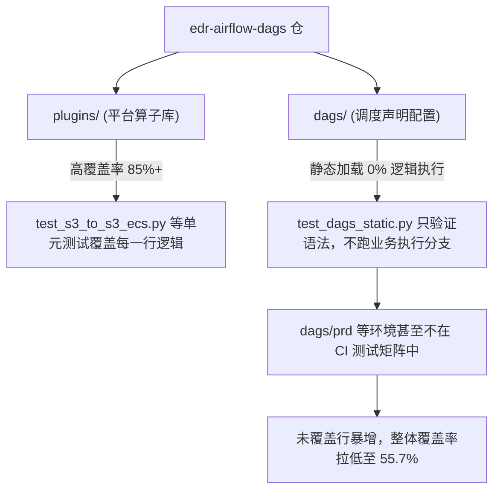
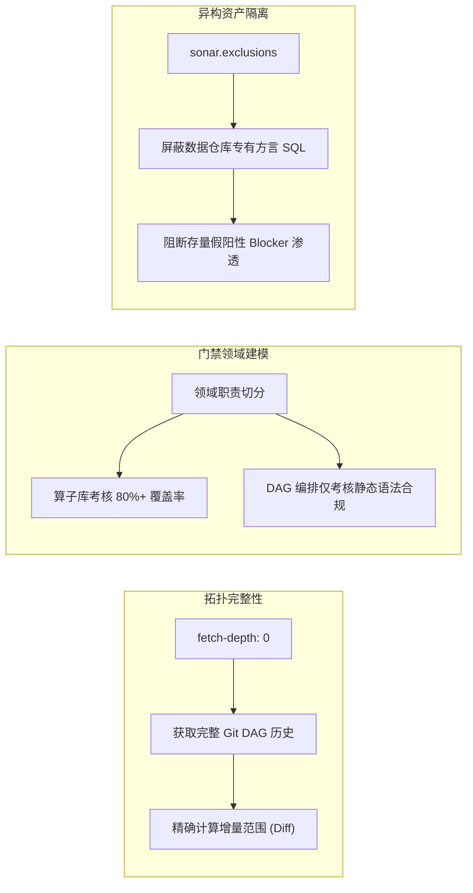

> “When your tools measure delta without a frame of reference, history itself becomes a bug.” — Continuous Inspection Principles

# 71 万行代码与 1.7 万个报错：SonarQube 基线膨胀与浅克隆陷阱

*从 Airflow 分支全量同步实战，看“Clean as You Code”门禁的三大至暗时刻*

周二下午三点。数据平台核心大仓 `edr-airflow-dags` 的 PR #12852 前四项测试全绿——Plugin 算子单测、DEV/SIT/STG 三套环境的 DAG 解析测试全部满分通过。然而，紧随其后的 `Sonar Analysis` 任务在跑了 8 分钟后轰然挂红。

点开 SonarQube 仪表盘，屏幕上赫然弹出一组令人眩晕的巨额数字：
- **`713k New Lines`**（71.3 万行“全新代码”）
- **`17k New Issues`**（1.7 万个“新增缺陷”）
- **`Coverage: 55.7% < 70.0%`**（覆盖率未达标，门禁挂掉）
- **`Reliability Rating: E`**（可靠性评级直接坠入最差等级 E）
- **`Security Rating: E`**（安全性评级直接坠入最差等级 E）

工程师的第一直觉通常是：“代码哪里写错了？为什么平白无故多了 1.7 万个 Bug？”

但作为领域技术专家（SME），看到这组数据的核心直觉是：**没有任何人能在一次 PR 里手写 70 万行代码，更不可能犯下 1.7 万个 Bug。这是“基线膨胀（Baseline Explosion）”与静态分析器机制冲突下的典型系统性误报**。

| 表面现象 | 仪表盘展示 | 底层真实根因 |
|---|---|---|
| 增量代码爆炸 | `713k New Lines` | `actions/checkout` 默认 `fetch-depth: 1` 丢失祖先节点，Sonar 找不到 `develop` 分支基准 |
| 覆盖率坍塌 | `55.7% < 70.0%` | 静态检查将缺乏单测的 `dags/prd/` 等数千行调度配置强行算入覆盖率分母，拉出 0% 洼地 |
| 评级直坠 E 级 | Reliability & Security 均为 E | 3,568 个历史 Teradata 专有 SQL 脚本被通用语法分析器误判，触发 Blocker 级别规则一票否决 |

---

## 1. 深挖一：`fetch-depth: 1` 浅克隆如何撕裂 Git Diff

SonarQube 治理 pull request 的核心信条是 **“Clean as You Code”（只考核增量代码，不为历史技术债务惩罚当前开发者）**。

要实现“只审增量”，SonarQube Scanner 必须在运行容器中定位到当前分支与目标分支（`develop`）的公共祖先节点（Merge-Base），从而计算出增量代码范围：
```bash
git merge-base origin/develop HEAD
git diff origin/develop...HEAD
```

### 浅克隆的物理截断
在 GitHub Actions 中，为了优化拉取几十万行大仓的速度，官方 `actions/checkout@v4` 默认采用浅克隆：`fetch-depth: 1`。这意味着 Runner 磁盘上**只有当前 PR HEAD 这孤零零的一个提交**，没有上游历史，也没有任何远程分支引用！

CI 日志中隐蔽地暴露了这一关键警报：
```text
WARN: Could not find ref 'develop' in refs/heads, refs/remotes, refs/remotes/upstream or refs/remotes/origin
```

当 Sonar 拿着标尺寻找 `develop` 时，本地 Git 库根本没有这个分支。失去对比基准的 Scanner 无法界定增量范围，只能将所有文件一股脑当成“全量新增”，瞬间将原本仅涉及数十行配置升级的 PR 撑大成 71.3 万行的庞然大物。

```yaml
# 解决方案：在 CI 中显式声明完整历史深度
- name: Checkout repository
  uses: actions/checkout@v4
  with:
    fetch-depth: 0
```

> 📌 **本节要点**：任何基于增量分析（Incremental Analysis）的静态门禁，都以完整的版本拓扑图为前提。浅克隆节约了网络传输的数十秒，却会彻底摧毁静态分析工具的分支差集计算。

---

## 2. 深挖二：DAG 是编排配置，不是可测试业务函数

数据平台代码库与标准后端应用库有着本质不同：它由 **核心算子库（`plugins/`）** 与 **调度配置编排（`dags/`）** 两部分构成。



在 PR #12852 中，我们将落后主干 1,187 个 Commits 的变更向回同步。这带来了数千个位于 `dags/prd/` 与 `dags/syd48/` 下的 Python DAG 文件。
* CI 流水线基于安全与效率考虑，仅配置了 `sit`, `stg`, `dev` 三套环境的 DAG 解析测试。
* `dags/prd` 根本没有对应的 `coverage-prd.xml` 报告。
* 结果在 SonarQube 眼中，这些属于“变更代码”的成百上千行 Python DAG，执行行数为 0，成为了吞噬覆盖率的 **0% 绝对洼地**。

```properties
# 正确的治理契约：在 sonar-project.properties 中剔除配置型 DAG
sonar.coverage.exclusions=**/tests/**,**/airflow/**,dags/**,**/templates/**,**/bteqs/**
sonar.python.coverage.reportPaths=coverage.xml,coverage-*.xml
```

> 📌 **本节要点**：永远不要把声明式的调度编排配置与命令式的业务逻辑混在同一套单元测试覆盖率门禁中考核。为非测试目标划定 `coverage.exclusions`，是保护代码门禁严肃性的必要边界。

---

## 3. 深挖三：3,568 个历史 SQL 脚本如何诱发 17k 问题雪崩

仓库的 `dags/` 目录下散落着 3,568 个 `.sql` 与 `.bteq` 脚本。这些包含复杂 Teradata 专有方言（如 `QUALIFY ROW_NUMBER() OVER (...)`、`CREATE VOLATILE TABLE`）的历史技术资产，在大批量同步过程中直接引发了灾难：

1. **语法冲突**：SonarQube 默认的通用 SQL 分析器无法正确解析 Teradata 方言，抛出密密麻麻的 `WARN: Unable to fully parse`。
2. **规则误判**：通用分析器按照标准企业规范，对未参数化、未命名临时表、跨库查询进行地毯式扫描，在 3,500 多个文件中扫出了惊人的 **17,000 个违规项**。
3. **一票否决**：在 Sonar 的评级模型中，只要新增代码中包含 **1 个 Blocker 级别的安全或可靠性缺陷**，该项指标就直接判定为最低等级 **E**（A 级为 0 Blocker）。1.7 万个警告中混入了历史遗留的 Blocker 缺陷，直接将 Reliability 与 Security 封死在 E 级。

这些代码已经在生产环境稳定运行数年，它们是存量资产而非本 PR 引入的新风险。在基线同步 PR 中强行对其进行通用静态规则审查，属于典型的“工具错配”。

---

## 4. 陷阱警示

> 🩸 **警惕在分支基线大版本同步时盲目“修 Bug”**：当跨分支同步（Rebase / Merge）触发数千个静态扫描报警时，千万不要试图手动去修改历史老代码来取悦门禁！老业务 SQL 的微小变动极易在生产环境引发严重的静默数据污染。面对基线膨胀，唯一的正确解法是审查 CI 拓扑与扫描范围的治理配置，或由架构师执行合规的基线覆盖（Quality Gate Bypass）。

---

## 5. 🧭 升维思考与架构跃迁



### 核心设计原则与迁移应用：

1. **原则一：CI 增量审查依赖拓扑对称性**
   * 静态分析工具必须能访问目标分支的真实 commit。在任何涉及 pull request 增量比对的 workflow 中，必须明确评估浅克隆的副作用。
   * **举一反三**：类似的问题同样会出现在依赖 Git 历史生成变更日志（Conventional Changelog）、语义化发版（Semantic Release）或静态漏洞对比（Trivy/Snyk diff）的流水线中。任何需要找寻基准分支的操作，都必须保证完整的 Git 历史拓扑。

2. **原则二：测试指标的领域分层与防腐设计**
   * 并非所有 `.py` 文件都具有等同的可测性。框架级核心库与声明式配置必须在度量指标上建立防腐层。
   * **举一反三**：在前端项目（React/Vue）中，UI 页面、纯组件、路由配置与核心工具函数也应当分层设定质量指标，切忌用统一的 80% 单元测试覆盖率红线一刀切，导致团队被迫写无意义的伪断言测试。

---

## 6. 立刻可以做的事

1. **修正 CI 中的浅克隆**：检查项目中所有涉及 SonarQube、CodeQL 或 Git Diff 的 GitHub Actions，确保其结伴配置了 `fetch-depth: 0`。
2. **审查覆盖率排除项**：在 `sonar-project.properties` 中确保工作流编排配置（`dags/**`）被加入 `sonar.coverage.exclusions`，只向门禁呈报核心逻辑组件的覆盖率。
3. **隔离专有方言脚本**：将大数据仓库特有的 BTEQ、HQL、Teradata 脚本加入 `sonar.exclusions`，避免通用静态分析器产生大量误报。
4. **多环境覆盖率报告汇总**：确保所有被考核环境的 coverage xml 都在 Sonar 的 `sonar.python.coverage.reportPaths` 中完整注册，避免单测遗漏造成的覆盖率断层。

---

*工具是对现实的度量，当度量尺度脱离了系统上下文，最精准的规尺也会量出最荒谬的幻象。*
