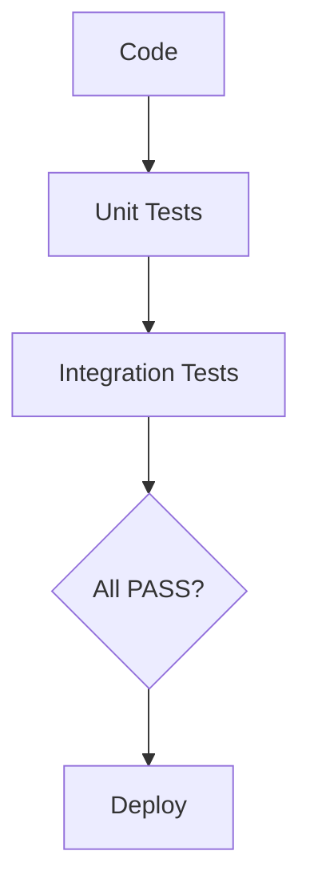
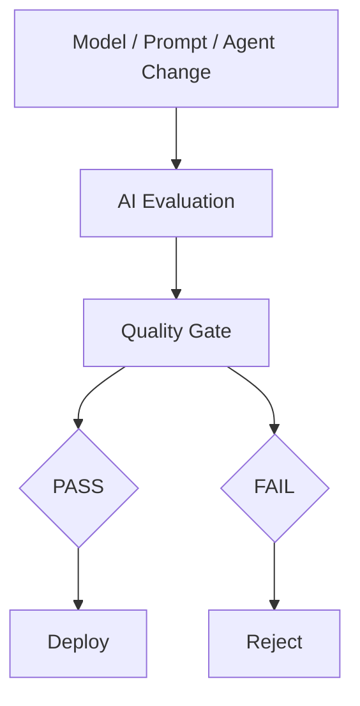

*Power without boundaries is a flood; power within boundaries is an engine. The true art of AI engineering lies not in unleashing the model, but in architecting its constraints.*

> **【案例背景与代称说明 / Enterprise Context Note】**
> 本文探讨的生产级架构与工程实践中，**Aegis**（源自古典神话中的庇护之盾，寓意稳健承保与严密风控）为作者在深度技术特稿中使用的虚构企业代称，指代某世界顶级跨国金融与保险巨擘（Global Tier-1 Carrier / Fortune Global 100）。此举旨在恪守商业隐私与合规边界，同时为读者完整呈现高并发、严监管生产环境下的顶级 AI Native 系统工程实战。

---

# Agent Governance
作为 Lead AI Engineer，在日常工作中，Agent Governance Options（AI 智能体治理选项） 是一个很重要的话题。它考察的不是你会不会给 Agent 加一个 guardrail，而是：当 AI 可以自主选择工具、访问保险数据、调用业务 API 并执行操作时，你如何让它在明确的权限和风险边界内行动？

我建议从五个角度掌握：自主程度、权限控制、运行时拦截、人工审批和治理架构。

## 一、先理解：Agent Governance 到底管什么？

传统应用程序通常由开发者明确编写业务流程。Agent 则可能根据用户目标动态决定下一步做什么、调用哪个工具，以及如何处理工具返回结果。

例如，保险客户问：

> My laptop was stolen. Am I covered under my policy?

一个 Agent 可能执行以下流程：

1. 查询客户身份和保单。

2. 检索相关保险条款。

3. 查询理赔记录。

4. 判断现有证据是否足够。

5. 向客户解释可能适用的条款。

6. 如果符合条件，进一步尝试创建理赔申请或更新理赔系统。

第 5 步主要涉及信息生成；第 6 步已经涉及真实业务操作。治理必须确保 Agent 不会因为模型判断错误，就擅自批准理赔、修改关键记录或支付款项。

the cloud provider 的智能体安全指南特别指出，自主性、工具访问、持久化记忆和多系统权限会扩大传统应用的安全风险。


the cloud provider Prescriptive Guidance

## 二、四种自主程度：从只读到受控执行

这是在日常方案评审中最容易向团队解释清楚的第一种分类方式。

Level 1 — Read-only assistant

低风险

Agent 只能读取授权资料、检索保单和回答问题，不能更改业务状态。

示例：解释盗窃险条款，列出相关免责条件。

Level 2 — Recommend and draft

有限业务影响

Agent 可以生成理赔摘要、填写草稿、推荐下一步，但不直接提交高影响操作。

示例：准备理赔申请，等待理赔人员确认。

Level 3 — Bounded execution

受控自主执行

Agent 可以执行预先授权、影响有限且可撤销的操作，但必须通过确定性的权限与业务规则检查。

示例：更新理赔案件标签、安排回电、发送已批准的模板通知。

Level 4 — High-impact execution with approval

高风险

可能涉及赔付、拒赔、承保决定或其他重大业务后果。Agent 可以收集证据并提出建议，但必须经过规定的授权或人工审批。

示例：准备理赔支付建议，由有权限的理赔人员最终批准。

这四个 Level 是用于设计治理策略的实用分类，并非某个统一的行业标准。

Lead Engineer 的判断标准： 不要追求让 Agent 获得最大的自主权，而应在满足业务目标的前提下，授予完成任务所需的最小自主权。

## 三、技术上有哪些治理选项？

这部分才是日常工作中老板或 Team Lead 在架构评审时会继续深挖的核心设计。

| 治理选项                            | 如何工作                                             | 局限或注意事项                    |
| ------------------------------- | ------------------------------------------------ | -------------------------- |
| 1. Prompt-level guardrails      | 在 System Prompt 中定义行为规则和边界                       | 模型可能违反指令，不能作为安全边界          |
| 2. Application-level validation | 在业务代码中验证输入、参数、业务状态                               | 如果各个 Agent 自己实现，规则容易分散和不一致 |
| 3. Tool gateway                 | 所有工具调用统一经过网关，负责身份、权限、参数验证和审计                     | 必须确保 Agent 无法绕过网关直接访问后端    |
| 4. Policy engine                | 用确定性规则评估是否允许某项操作                                 | 需要维护规则、权限上下文和策略版本          |
| 5. Runtime interception         | 在 Agent 执行各个阶段拦截请求，实施 allow、deny、warn 或 escalate | 需要与 Agent runtime 正确集成     |
| 6. Human approval               | 在高风险操作执行前要求有权限的人确认                               | 审批必须发生在操作生效之前，并提供足够证据      |
| 7. Monitoring and audit         | 追踪工具调用、政策决策、失败、安全事件和模型版本                         | 只能发现或调查部分问题，不能代替执行前控制      |

核心原则是：不要把治理只放在 Prompt 里。应该把关键规则放进系统能够强制执行、记录和审计的控制层。

Microsoft 的 Agent Control Specification（ACS）在 2026 年提出了一种运行时治理方案，通过标准化的拦截点，在 Agent 生命周期内评估和执行策略；它描述了输入、模型调用前后、工具调用前后、最终输出等八个拦截点。它是值得了解的新规范，但不代表每个企业都必须使用它。


Command Line

## 四、推荐的企业级架构：集中定义策略，分散执行控制

对于 Aegis 这样的保险企业，我会优先考虑 Centralised Policy, Distributed Enforcement，即集中管理治理策略，在各个 Agent 和工具的实际执行路径中强制执行。

User / Business Application

客户、理赔人员、内部业务系统

Identity & Access Control

身份验证、用户权限、数据访问边界

Agent Orchestrator

规划步骤、检索资料、选择工具、处理结果

### Runtime Governance Layer

Policy Engine

规则与授权

Approval Workflow

人工审批

Data Controls

敏感数据与访问标签

Audit & Telemetry

审计与运行追踪

Tool Gateway

统一的工具调用入口，执行授权和参数验证

Business Systems

Policy API · Claims API · Payment API

这个架构里最关键的不是画出了多少组件，而是 Agent 不具备绕过治理层执行受保护操作的路径。

例如，即使模型生成了一个看似合理的 `approve_claim` 调用，系统也必须单独校验调用者身份、案件状态、操作权限、业务规则和所需审批。模型认为应该批准，并不等于系统允许批准。

the cloud provider 的企业级 Agent 安全参考架构同样强调最小权限、集中管理工具访问、敏感操作的额外控制、会话隔离和运行时可观测性。


the cloud provider Prescriptive Guidance

+1

## 五、治理策略如何真正执行？

考虑 Agent 尝试执行下面的工具调用：

JSON

```
{
  "tool": "approve_claim_payment",
  "arguments": {
    "claim_id": "CLM-10428",
    "amount": 12000
  }
}
```

治理层应当按顺序进行检查，而不是直接相信模型生成的参数。

| 检查点                  | 需要验证的问题                 |
| -------------------- | ----------------------- |
| Identity             | 当前用户或 Agent 是否经过身份验证？   |
| Authorization        | 它是否有权访问这个案件、发起这种操作？     |
| Business policy      | 案件状态、赔付金额和相关业务规则是否满足要求？ |
| Risk policy          | 该操作是否超过自动执行范围，必须升级审批？   |
| Parameter validation | 案件 ID、金额、币种和其他参数是否合法？   |
| Approval             | 所需审批是否已经完成，且对应这一次具体操作？  |
| Audit                | 是否记录调用者、目标操作、政策判定和审批记录？ |

治理层最后可以返回四种典型结果：

* Allow：允许继续执行。

* Warn：允许执行，但需要告警或附加记录；只适用于不会破坏硬性安全边界的情况。

* Deny：拒绝执行。

* Escalate：转人工审批或升级到具有相应权限的处理流程。

对于未经授权的支付、禁止的数据披露或不符合硬性业务规则的操作，不能通过简单警告放行。若关键的授权服务或策略检查失败，也应采用 fail-closed（默认拒绝） 策略，防止系统因为治理组件故障而放任操作。

## 六、在日常工作中你的老板或者team lead会提问的三个关键问题

1. Why isn't a system prompt sufficient for governance?

Prompt 是模型的行为指引，但不是强制的安全边界。模型可能误解指令，检索文档也可能包含恶意提示注入。关键权限必须通过后端授权、工具网关和确定性策略检查强制执行，不能仅依赖模型自我约束。

2. How do you govern a multi-agent system?

3. How do you balance autonomy with safety?

## 七、Lead Engineer 架构阐述与方案设计：可以直接练习的英文版本

写作

I would approach agent governance as an architectural and runtime enforcement problem, rather than relying solely on prompts or model-level guardrails.

First, I would classify agents and individual actions by their business impact, reversibility, and regulatory risk. A read-only policy assistant should have very different permissions from an agent that can modify claims or initiate payments.

Second, I would enforce least-privilege access through identity-aware tool gateways and deterministic policy checks. Every sensitive tool call should be validated before execution, including the caller's authorization, tool arguments, business rules, and any required approval.

Third, I would introduce runtime governance at key interception points, such as before model calls, before and after tool execution, and before releasing the final response. Depending on the risk, the system should allow, deny, warn, or escalate an action. Critical controls should fail closed.

Finally, I would integrate auditability, continuous evaluation, monitoring, and release gates into the agent lifecycle. I would start with bounded autonomy and expand it only when evaluation evidence demonstrates that the controls are effective.

My core principle is that the model may recommend an action, but the system must independently determine whether that action is authorized and safe to execute.

最后记住一句话： 对于 Lead AI Engineer，Agent governance 的核心不是让模型“学会守规矩”，而是设计一个即使模型犯错，也能限制其权限、阻止危险操作、升级高风险决策并留下审计证据的系统。


---

这个概念非常值得你深入掌握，因为 “risk-based quality gate” 是把 AI Evaluation 从“测模型”提升到“生产治理”的关键一步。

对于 Aegis 这样的保险公司，我会把它理解成一句话：

不是要求所有 AI 请求达到同一个质量标准，而是根据 AI 决策的业务风险，定义不同的质量、安全、人工审核和发布门槛。

⸻

1. 什么叫 Quality Gate？

先不要管 risk-based。

普通软件 CI/CD：



```flowchart
Code
  ↓
Unit Tests
  ↓
Integration Tests
  ↓
All PASS?
  ↓
Deploy
```

AI 系统：



```flowchart
Model / Prompt / Agent Change
            ↓
       AI Evaluation
            ↓
       Quality Gate
            ↓
     ┌──────┴──────┐
    PASS          FAIL
     ↓             ↓
 Deploy          Reject
```

Quality Gate 本质就是：

在进入下一阶段之前，必须满足一组预定义条件。

例如：

Correctness       ≥ 90%
Groundedness      ≥ 95%
Safety             ≥ 99%
P95 Latency       ≤ 3 sec
Cost/request      ≤ $0.05

全部满足：

```flowchart
PASS → deploy
```

否则：

```flowchart
FAIL → don't deploy
```

⸻

2. 那为什么还要加 Risk-Based？

问题来了。

假设在 Aegis 内部有两个核心 AI Agent：

AI A

“把我的保险条款总结成简单英语。”

AI B

“根据我的保单判断这个 claim 是否应该支付。”

显然两者不能使用同一套门槛。

⸻

AI A

如果偶尔：

少解释了一条次要条款。

风险可能比较低。

⸻

AI B

如果：

把“不赔”判断成“赔”。

可能导致：

* financial loss
* regulatory risk
* customer harm
* reputational damage

所以：

AI B 的 Quality Gate 必须严格得多。

这就是：

Risk-Based Quality Gate

⸻

3. 一个非常清楚的 Aegis 例子

假设 Aegis 有一个 AI Agent：

Claims Assistant

它可以做四种事情：

Use case	风险
Policy FAQ	🟢 Low
Policy summarisation	🟢 Low
Claim guidance	🟠 Medium
Claim eligibility / payment recommendation	🔴 High

我们不要：

```flowchart
所有 AI
   ↓
Accuracy ≥ 90%
```

而是：

```flowchart
                    AI Use Cases
                         │
          ┌──────────────┼──────────────┐
          ▼              ▼              ▼
        Low            Medium          High
         │               │              │
       FAQ          Claim Guidance   Claim Decision
         │               │              │
       Gate A          Gate B         Gate C
```

⸻

4. Gate A：Low Risk

例如：

“What does my policy say about luggage?”

我们可以允许：

Correctness       ≥ 90%
Groundedness      ≥ 95%
Safety             ≥ 99%
P95 latency       ≤ 4 sec

允许：

automated response

不需要人工审核每一次。

⸻

5. Gate B：Medium Risk

例如：

“Based on my policy, can I make a claim?”

这个回答已经可能影响客户行为。

所以：

Correctness       ≥ 95%
Groundedness      ≥ 98%
Safety             ≥ 99.5%
Critical facts    100%

并且：

```flowchart
No evidence
    ↓
No answer
    ↓
Escalate
```

可以加入：

human review for ambiguous cases

⸻

6. Gate C：High Risk

例如：

“Should Aegis approve this claim for $50,000?”

这就完全不同。

你不能简单：

```flowchart
LLM
 ↓
YES
 ↓
Pay customer
```

应该：

```flowchart
                    LLM Agent
                        ↓
                  Recommendation
                        ↓
                ┌───────┴────────┐
                ▼                ▼
          Policy Rules        Human Review
                │                │
                └───────┬────────┘
                        ▼
                  Final Decision
```

Quality Gate 可能要求：

Critical factual accuracy    = 100%
Policy grounding             = 100%
PII violation                 = 0
Unsafe action                 = 0
Tool authorization            = 100%
Human approval                = required

注意：

High-risk AI 不一定意味着“模型必须 100% accurate”。

而是：

系统必须设计成即使模型犯错，也不会直接造成不可接受的业务后果。

这才是成熟的 AI Engineering。

⸻

7. 这是一个非常重要的区别

在日常工作中你的老板或者team lead会提问：

“Are you saying high-risk AI needs 100% model accuracy?”

千万不要回答：

Yes.

因为现实中很难做到。

你应该说：

No. For high-risk use cases, I would not rely on model accuracy alone. I would combine stricter evaluation thresholds with deterministic controls, constrained tool permissions and human approval.

然后画：

Model
  +
RAG
  +
Rules
  +
Authorization
  +
Guardrails
  +
Human-in-the-loop

这就是 enterprise AI。

⸻

8. Risk-Based Gate 实际上不是一个数字

很多人误解成：

Low risk = 90%
High risk = 99%

其实成熟的 framework 是多维的：

```flowchart
                 Risk-Based Gate
                       │
       ┌───────────────┼────────────────┐
       ▼               ▼                ▼
    Quality          Safety           Reliability
       │               │                │
 correctness       PII leakage       availability
```
 groundedness      prompt injection   latency
```flowchart
 completeness      unsafe tools       timeout
       │               │                │
       └───────────────┼────────────────┘
                       ▼
                  Business Risk
                       │
              ┌────────┴────────┐
              ▼                 ▼
        Auto decision       Human review
```

所以你不是只说：

accuracy threshold。

而是：

quality + safety + reliability + business impact

一起决定是否允许进入下一阶段。

⸻

9. 再举一个非常实际的例子

假设我们正在发布一个新的 LLM。

Current production model：

Model A

Candidate：

Model B

离线 evaluation：

Metric	Model A	Model B
Correctness	94%	97%
Groundedness	97%	98%
Safety	99.7%	99.8%
Latency	2.0s	2.8s
Cost	$0.04	$0.09

表面上：

Model B 更准确。

但是：

Cost +125%
Latency +40%

如果这是低风险 FAQ：

可能值得接受。

如果每天 10 million requests：

$0.04 × 10M = $400K
$0.09 × 10M = $900K

每天成本多：

$500K

所以 Quality Gate 应该把：

business economics

也考虑进去。

⸻

10. 更关键的例子：平均分会骗人

假设一个 Agent：

Overall accuracy = 96%

听起来很好。

但是拆开：

Low-risk FAQ              99%
Claim guidance             97%
Claim eligibility          91%
High-value claims          82%

如果只看：

Overall = 96%

你会：

PASS

但如果看：

High-value claims = 82%

应该：

FAIL

所以：

Risk-based gate 必须支持 segmentation

例如：

Overall                    ≥ 95%
AND
High-risk claims           ≥ 99%
AND
Safety violations          = 0
AND
PII leakage                = 0

而不是：

Overall score ≥ 95%

⸻

11. 这就是为什么作为 Lead AI Engineer 在日常工作中应当向团队明确强调：

“I would avoid a single global AI quality threshold.”

然后继续：

“I would define quality gates by risk tier and by failure mode.”

这句话非常强。

⸻

12. Failure Mode 也要单独设 Gate

假设：

Overall quality = 96%

但是：

Hallucination = 4%

对于普通 FAQ：

可能还可以接受。

但是：

Policy coverage interpretation

4% hallucination 可能完全不能接受。

所以：

Overall Score
     +
Critical Failure Rate

必须同时过关。

例如：

Overall correctness ≥ 95%
AND
Critical hallucination < 0.1%
AND
PII leakage = 0
AND
Unsafe tool calls = 0

⸻

13. 甚至可以做“硬门槛”和“软指标”

这是你作为 Lead 很值得讲的一个概念。

Hard Gate

一旦违反，直接 FAIL：

PII leakage > 0
Unsafe tool invocation > 0
Critical policy violation > threshold

Soft Gate

允许 trade-off：

Latency
Cost
General response quality

例如：

```flowchart
Safety violation
→ absolute blocker
Latency
→ potentially acceptable trade-off
```

这就是：

Not all metrics are equally important.

⸻

14. 在日常技术方案评审时可以展示这个架构图

```flowchart
                    Risk Classification
                           │
          ┌────────────────┼────────────────┐
          ▼                ▼                ▼
        LOW             MEDIUM             HIGH
          │                │                 │
          ▼                ▼                 ▼
       Gate A            Gate B             Gate C
          │                │                 │
   ┌──────┴──────┐  ┌──────┴──────┐   ┌─────┴──────┐
   │             │  │             │   │            │
Quality       Safety Quality     Safety Quality    Safety
   │             │  │             │   │            │
   ▼             ▼  ▼             ▼   ▼            ▼
 Auto          Auto/ Human       Human approval
```
 response      escalation        required

然后：

```flowchart
             Production
                  │
                  ▼
             Monitor
                  │
                  ▼
             Detect risk
                  │
                  ▼
             Re-evaluate
                  │
          ┌───────┴───────┐
          ▼               ▼
       Improve           Rollback
```

⸻

15. 日常工作中你的老板或者team lead会提问一：Who determines the risk level?

你的老板或Team Lead：

“How would you determine whether an AI use case is low, medium or high risk?”

不要回答：

“The engineering team decides.”

应该：

Risk classification should be a cross-functional decision involving engineering, product, security, legal/compliance and the business owner.

然后考虑：

Risk =
Impact × Probability

具体看：

* financial impact
* customer impact
* regulatory impact
* privacy impact
* reputational impact
* reversibility
* degree of automation
* human oversight

尤其是：

Can the AI action be reversed?

例如：

```flowchart
Generate explanation
→ reversible
Approve $100,000 claim
→ high impact / potentially irreversible
```

⸻

16. 日常工作中你的老板或者team lead会提问二：What if the overall score passes but one critical metric fails?

例如：

Overall = 97%
Safety = 98%
Required = 99.9%

你回答：

It fails. I would use non-compensatory gates for critical risk dimensions.

也就是说：

Overall score
        +
Critical gates

不能：

95% accuracy
+
terrible safety
=
average 90%
=
PASS

这是错误的。

⸻

17. 日常工作中你的老板或者team lead会提问三：Who sets the thresholds?

例如：

Why 95%? Why not 90%?

这是很好的追问。

你可以说：

The threshold should come from business risk and empirical baselines rather than an arbitrary number.

建立过程：

```flowchart
Historical production data
          ↓
Human-labelled baseline
          ↓
Current system performance
          ↓
Business impact analysis
          ↓
Risk tolerance
          ↓
Threshold
```

然后：

We should periodically recalibrate the thresholds as production evidence accumulates.

这比：

“95% is industry standard.”

高级很多。

⸻

18. 日常工作中你的老板或者team lead会提问四：What happens when the gate fails?

这是非常重要的。

不要只有：

Don’t deploy.

应该：

```flowchart
Evaluation FAIL
      │
      ▼
Identify failure mode
      │
 ┌────┼─────┐
 ▼    ▼     ▼
RAG  Agent  LLM
 │    │     │
 ▼    ▼     ▼
Fix  Fix   Fix
      │
      ▼
Re-run evaluation
```

如果已经 production：

```flowchart
Production degradation
       ↓
Alert
       ↓
Canary stop
       ↓
Rollback / fallback
       ↓
Root cause
       ↓
Regression test
```

这就和你的 SRE 背景连接起来了。

⸻

19. 日常工作中你的老板或者team lead会提问五：Can risk-based gates slow down innovation?

这是一个非常好的 Leadership 问题。

你回答：

Yes, if implemented as bureaucracy. My goal would be to make the gates automated and proportional to risk.

例如：

Low-risk

```flowchart
Automated evaluation
→ automated deployment
```

High-risk

Automated evaluation
+
security review
+
human approval
+
controlled rollout

所以：

Risk-based governance should accelerate low-risk experimentation while increasing controls only where the potential impact justifies them.

这句话很适合 Lead。

⸻

20. 再来一个非常容易被问的场景

你的老板或Team Lead：

“Your model improved from 94% to 98%, but you also saw a 20% increase in latency and 50% increase in cost. Would you deploy it?”

千万不要简单：

Yes，因为 accuracy 提高了。

也不要：

No，因为 cost 增加。

Lead 的回答应该是：

It depends on the risk tier and business value.

然后：

```flowchart
                    Model B
                       │
          ┌────────────┼────────────┐
          ▼            ▼            ▼
       Quality       Latency       Cost
```
         +4%           +20%         +50%

如果：

High-risk claim decision

可能：

Yes, because the quality improvement may justify the additional cost.

但如果：

Low-value FAQ

可能：

No, because the incremental quality doesn’t justify the operational cost.

所以最终：

The gate is a business decision expressed through engineering metrics.

这是非常强的 Lead-level 表达。

⸻

21. 你在 Aegis 最应该说的完整答案

在日常工作中你的老板或者team lead直接提问：

“How would you establish risk-based quality gates for our AI agents?”

你可以这样回答：

I wouldn’t use a single global quality threshold for all AI use cases.

For an insurance environment, I would first classify the use case based on potential customer, financial, regulatory, privacy and reputational impact, as well as whether the AI action is reversible and whether a human is involved.

For example, a policy summarisation assistant could be low risk, while a claims eligibility recommendation or payment decision would be high risk.

I would then define different evaluation gates for each risk tier.

The gates would cover multiple dimensions: correctness, groundedness, retrieval quality, agent task completion, safety, latency and cost.

Importantly, some metrics would be hard gates. For example, a critical privacy violation, unsafe tool invocation or critical policy hallucination should fail the release regardless of the overall score.

For high-risk use cases, I would combine stricter automated evaluation with deterministic business rules, constrained tool permissions, human-in-the-loop approval and controlled rollout.

I would also avoid relying only on an overall average score. I would segment evaluation by risk category and critical failure mode, because a 96% overall score isn’t meaningful if the remaining 4% contains high-impact claim decisions.

Finally, I would make these gates part of the CI/CD and production feedback loop. A model or agent change has to pass the offline evaluation gates before deployment, then pass canary and production quality checks after deployment. Production failures are fed back into the golden dataset as regression tests.

So the principle is:

risk determines the required level of evidence and control, and the quality gate turns that risk policy into measurable engineering criteria.

⸻

22. 最后你一定要理解一个非常重要的思想

Risk-based quality gate ≠ “高风险要求模型准确率 99%”。

真正的意思是：

```flowchart
                     Business Risk
                           │
                           ▼
                  Required Assurance
                           │
              ┌────────────┼────────────┐
              ▼            ▼            ▼
          Evaluation     Controls      Human
            strictness                oversight
              │            │            │
              └────────────┼────────────┘
                           ▼
                     Quality Gate
                           │
                      PASS / FAIL
```

所以你作为 Lead Engineer 真正负责的不是：

“把模型 accuracy 从 95% 做到 97%。”

而是：

“对于这个业务场景，我们需要什么程度的 evidence，什么情况下允许 AI 自动行动，什么情况下必须阻断或交给人，以及如何把这些要求自动化成 production gate。”

这已经从 AI model engineering 上升到了 AI system engineering + risk engineering + production governance。

对于 Aegis 这种保险公司，这个层次尤其重要。

```flowchart
作为 Lead AI Engineer，在日常工作中如果能把 risk → evaluation → controls → human oversight → deployment gate → production feedback 这条链完整讲出来，向团队和管理层展现的就不是一个“会 RAG 的 AI Developer”，而是一个真正可以负责 AI production platform 的 Lead Engineer。
```

---

这个概念非常值得你深入掌握，因为 **“risk-based quality gate” 是把 AI Evaluation 从“测模型”提升到“生产治理”的关键一步**。

对于 Aegis 这样的保险公司，我会把它理解成一句话：

> **不是要求所有 AI 请求达到同一个质量标准，而是根据 AI 决策的业务风险，定义不同的质量、安全、人工审核和发布门槛。**

---

# 1. 什么叫 Quality Gate？

先不要管 risk-based。

普通软件 CI/CD：

```text


```flowchart
```flowchart
Code
  ↓
Unit Tests
  ↓
Integration Tests
  ↓
All PASS?
  ↓
Deploy
```
```
```

AI 系统：

```text


```flowchart
```flowchart
Model / Prompt / Agent Change
            ↓
       AI Evaluation
            ↓
       Quality Gate
            ↓
     ┌──────┴──────┐
    PASS          FAIL
     ↓             ↓
 Deploy          Reject
```
```
```

Quality Gate 本质就是：

> **在进入下一阶段之前，必须满足一组预定义条件。**

例如：

```text
Correctness       ≥ 90%
Groundedness      ≥ 95%
Safety             ≥ 99%
P95 Latency       ≤ 3 sec
Cost/request      ≤ $0.05
```

全部满足：

```text
PASS → deploy
```

否则：

```text
FAIL → don't deploy
```

---

# 2. 那为什么还要加 Risk-Based？

问题来了。

假设在 Aegis 内部有两个核心 AI Agent：

### AI A

> “把我的保险条款总结成简单英语。”

### AI B

> “根据我的保单判断这个 claim 是否应该支付。”

显然两者不能使用同一套门槛。

---

## AI A

如果偶尔：

> 少解释了一条次要条款。

风险可能比较低。

---

## AI B

如果：

> 把“不赔”判断成“赔”。

可能导致：

* financial loss
* regulatory risk
* customer harm
* reputational damage

所以：

> **AI B 的 Quality Gate 必须严格得多。**

这就是：

# Risk-Based Quality Gate

---

# 3. 一个非常清楚的 Aegis 例子

假设 Aegis 有一个 AI Agent：

> **Claims Assistant**

它可以做四种事情：

| Use case                                   |        风险 |
| ------------------------------------------ | --------: |
| Policy FAQ                                 |    🟢 Low |
| Policy summarisation                       |    🟢 Low |
| Claim guidance                             | 🟠 Medium |
| Claim eligibility / payment recommendation |   🔴 High |

我们不要：

```text
所有 AI
   ↓
Accuracy ≥ 90%
```

而是：

```text
                    AI Use Cases
                         │
          ┌──────────────┼──────────────┐
          ▼              ▼              ▼
        Low            Medium          High
         │               │              │
       FAQ          Claim Guidance   Claim Decision
         │               │              │
       Gate A          Gate B         Gate C
```

---

# 4. Gate A：Low Risk

例如：

> “What does my policy say about luggage?”

我们可以允许：

```text
Correctness       ≥ 90%
Groundedness      ≥ 95%
Safety             ≥ 99%
P95 latency       ≤ 4 sec
```

允许：

> automated response

不需要人工审核每一次。

---

# 5. Gate B：Medium Risk

例如：

> “Based on my policy, can I make a claim?”

这个回答已经可能影响客户行为。

所以：

```text
Correctness       ≥ 95%
Groundedness      ≥ 98%
Safety             ≥ 99.5%
Critical facts    100%
```

并且：

```text
No evidence
    ↓
No answer
    ↓
Escalate
```

可以加入：

> human review for ambiguous cases

---

# 6. Gate C：High Risk

例如：

> “Should Aegis approve this claim for $50,000?”

这就完全不同。

你不能简单：

```text
LLM
 ↓
YES
 ↓
Pay customer
```

应该：

```text
                    LLM Agent
                        ↓
                  Recommendation
                        ↓
                ┌───────┴────────┐
                ▼                ▼
          Policy Rules        Human Review
                │                │
                └───────┬────────┘
                        ▼
                  Final Decision
```

Quality Gate 可能要求：

```text
Critical factual accuracy    = 100%
Policy grounding             = 100%
PII violation                 = 0
Unsafe action                 = 0
Tool authorization            = 100%
Human approval                = required
```

注意：

> **High-risk AI 不一定意味着“模型必须 100% accurate”。**

而是：

> **系统必须设计成即使模型犯错，也不会直接造成不可接受的业务后果。**

这才是成熟的 AI Engineering。

---

# 7. 这是一个非常重要的区别

在日常工作中你的老板或者team lead会提问：

> **“Are you saying high-risk AI needs 100% model accuracy?”**

千万不要回答：

> Yes.

因为现实中很难做到。

你应该说：

> **No. For high-risk use cases, I would not rely on model accuracy alone. I would combine stricter evaluation thresholds with deterministic controls, constrained tool permissions and human approval.**

然后画：

```text
Model
  +
RAG
  +
Rules
  +
Authorization
  +
Guardrails
  +
Human-in-the-loop
```

这就是 enterprise AI。

---

# 8. Risk-Based Gate 实际上不是一个数字

很多人误解成：

> Low risk = 90%
> High risk = 99%

其实成熟的 framework 是多维的：

```text
                 Risk-Based Gate
                       │
       ┌───────────────┼────────────────┐
       ▼               ▼                ▼
    Quality          Safety           Reliability
       │               │                │
 correctness       PII leakage       availability
 groundedness      prompt injection   latency
 completeness      unsafe tools       timeout
       │               │                │
       └───────────────┼────────────────┘
                       ▼
                  Business Risk
                       │
              ┌────────┴────────┐
              ▼                 ▼
        Auto decision       Human review
```

所以你不是只说：

> accuracy threshold。

而是：

> **quality + safety + reliability + business impact**

一起决定是否允许进入下一阶段。

---

# 9. 再举一个非常实际的例子

假设我们正在发布一个新的 LLM。

Current production model：

```text
Model A
```

Candidate：

```text
Model B
```

离线 evaluation：

| Metric       | Model A |   Model B |
| ------------ | ------: | --------: |
| Correctness  |     94% |   **97%** |
| Groundedness |     97% |   **98%** |
| Safety       |   99.7% | **99.8%** |
| Latency      |    2.0s |      2.8s |
| Cost         |   $0.04 | **$0.09** |

表面上：

> Model B 更准确。

但是：

```text
Cost +125%
Latency +40%
```

如果这是低风险 FAQ：

> 可能值得接受。

如果每天 10 million requests：

```text
$0.04 × 10M = $400K
$0.09 × 10M = $900K
```

每天成本多：

> **$500K**

所以 Quality Gate 应该把：

> **business economics**

也考虑进去。

---

# 10. 更关键的例子：平均分会骗人

假设一个 Agent：

```text
Overall accuracy = 96%
```

听起来很好。

但是拆开：

```text
Low-risk FAQ              99%
Claim guidance             97%
Claim eligibility          91%
High-value claims          82%
```

如果只看：

> Overall = 96%

你会：

> PASS

但如果看：

> High-value claims = 82%

应该：

> **FAIL**

所以：

# Risk-based gate 必须支持 segmentation

例如：

```text
Overall                    ≥ 95%
AND
High-risk claims           ≥ 99%
AND
Safety violations          = 0
AND
PII leakage                = 0
```

而不是：

```text
Overall score ≥ 95%
```

---

# 11. 这就是为什么作为 Lead AI Engineer 在日常工作中应当向团队明确强调：

> **“I would avoid a single global AI quality threshold.”**

然后继续：

> **“I would define quality gates by risk tier and by failure mode.”**

这句话非常强。

---

# 12. Failure Mode 也要单独设 Gate

假设：

```text
Overall quality = 96%
```

但是：

```text
Hallucination = 4%
```

对于普通 FAQ：

> 可能还可以接受。

但是：

> **Policy coverage interpretation**

4% hallucination 可能完全不能接受。

所以：

```text
Overall Score
     +
Critical Failure Rate
```

必须同时过关。

例如：

```text
Overall correctness ≥ 95%

AND

Critical hallucination < 0.1%

AND

PII leakage = 0

AND

Unsafe tool calls = 0
```

---

# 13. 甚至可以做“硬门槛”和“软指标”

这是你作为 Lead 很值得讲的一个概念。

### Hard Gate

一旦违反，直接 FAIL：

```text
PII leakage > 0
Unsafe tool invocation > 0
Critical policy violation > threshold
```

### Soft Gate

允许 trade-off：

```text
Latency
Cost
General response quality
```

例如：

```text
Safety violation
→ absolute blocker

Latency
→ potentially acceptable trade-off
```

这就是：

> **Not all metrics are equally important.**

---

# 14. 在日常技术方案评审时可以展示这个架构图

```text
                    Risk Classification
                           │
          ┌────────────────┼────────────────┐
          ▼                ▼                ▼
        LOW             MEDIUM             HIGH
          │                │                 │
          ▼                ▼                 ▼
       Gate A            Gate B             Gate C
          │                │                 │
   ┌──────┴──────┐  ┌──────┴──────┐   ┌─────┴──────┐
   │             │  │             │   │            │
Quality       Safety Quality     Safety Quality    Safety
   │             │  │             │   │            │
   ▼             ▼  ▼             ▼   ▼            ▼
 Auto          Auto/ Human       Human approval
 response      escalation        required
```

然后：

```text
             Production
                  │
                  ▼
             Monitor
                  │
                  ▼
             Detect risk
                  │
                  ▼
             Re-evaluate
                  │
          ┌───────┴───────┐
          ▼               ▼
       Improve           Rollback
```

---

# 15. 日常工作中你的老板或者team lead会提问一：Who determines the risk level?

你的老板或Team Lead：

> **“How would you determine whether an AI use case is low, medium or high risk?”**

不要回答：

> “The engineering team decides.”

应该：

> **Risk classification should be a cross-functional decision involving engineering, product, security, legal/compliance and the business owner.**

然后考虑：

```text
Risk =
Impact × Probability
```

具体看：

* financial impact
* customer impact
* regulatory impact
* privacy impact
* reputational impact
* reversibility
* degree of automation
* human oversight

尤其是：

> **Can the AI action be reversed?**

例如：

```text
Generate explanation
→ reversible

Approve $100,000 claim
→ high impact / potentially irreversible
```

---

# 16. 日常工作中你的老板或者team lead会提问二：What if the overall score passes but one critical metric fails?

例如：

```text
Overall = 97%
Safety = 98%
Required = 99.9%
```

你回答：

> **It fails. I would use non-compensatory gates for critical risk dimensions.**

也就是说：

```text
Overall score
        +
Critical gates
```

不能：

```text
95% accuracy
+
terrible safety
=
average 90%
=
PASS
```

这是错误的。

---

# 17. 日常工作中你的老板或者team lead会提问三：Who sets the thresholds?

例如：

> Why 95%? Why not 90%?

这是很好的追问。

你可以说：

> **The threshold should come from business risk and empirical baselines rather than an arbitrary number.**

建立过程：

```text
Historical production data
          ↓
Human-labelled baseline
          ↓
Current system performance
          ↓
Business impact analysis
          ↓
Risk tolerance
          ↓
Threshold
```

然后：

> We should periodically recalibrate the thresholds as production evidence accumulates.

这比：

> “95% is industry standard.”

高级很多。

---

# 18. 日常工作中你的老板或者team lead会提问四：What happens when the gate fails?

这是非常重要的。

不要只有：

> Don't deploy.

应该：

```text
Evaluation FAIL
      │
      ▼
Identify failure mode
      │
 ┌────┼─────┐
 ▼    ▼     ▼
RAG  Agent  LLM
 │    │     │
 ▼    ▼     ▼
Fix  Fix   Fix
      │
      ▼
Re-run evaluation
```

如果已经 production：

```text
Production degradation
       ↓
Alert
       ↓
Canary stop
       ↓
Rollback / fallback
       ↓
Root cause
       ↓
Regression test
```

这就和你的 SRE 背景连接起来了。

---

# 19. 日常工作中你的老板或者team lead会提问五：Can risk-based gates slow down innovation?

这是一个非常好的 Leadership 问题。

你回答：

> **Yes, if implemented as bureaucracy. My goal would be to make the gates automated and proportional to risk.**

例如：

### Low-risk

```text
Automated evaluation
→ automated deployment
```

### High-risk

```text
Automated evaluation
+
security review
+
human approval
+
controlled rollout
```

所以：

> **Risk-based governance should accelerate low-risk experimentation while increasing controls only where the potential impact justifies them.**

这句话很适合 Lead。

---

# 20. 再来一个非常容易被问的场景

你的老板或Team Lead：

> “Your model improved from 94% to 98%, but you also saw a 20% increase in latency and 50% increase in cost. Would you deploy it?”

千万不要简单：

> Yes，因为 accuracy 提高了。

也不要：

> No，因为 cost 增加。

Lead 的回答应该是：

> **It depends on the risk tier and business value.**

然后：

```text
                    Model B
                       │
          ┌────────────┼────────────┐
          ▼            ▼            ▼
       Quality       Latency       Cost
         +4%           +20%         +50%
```

如果：

> High-risk claim decision

可能：

> **Yes, because the quality improvement may justify the additional cost.**

但如果：

> Low-value FAQ

可能：

> **No, because the incremental quality doesn't justify the operational cost.**

所以最终：

> **The gate is a business decision expressed through engineering metrics.**

这是非常强的 Lead-level 表达。

---

# 21. 你在 Aegis 最应该说的完整答案

在日常工作中你的老板或者team lead直接提问：

> **“How would you establish risk-based quality gates for our AI agents?”**

你可以这样回答：

I wouldn't use a single global quality threshold for all AI use cases.

For an insurance environment, I would first classify the use case based on potential customer, financial, regulatory, privacy and reputational impact, as well as whether the AI action is reversible and whether a human is involved.

For example, a policy summarisation assistant could be low risk, while a claims eligibility recommendation or payment decision would be high risk.

I would then define different evaluation gates for each risk tier.

The gates would cover multiple dimensions: correctness, groundedness, retrieval quality, agent task completion, safety, latency and cost.

Importantly, some metrics would be hard gates. For example, a critical privacy violation, unsafe tool invocation or critical policy hallucination should fail the release regardless of the overall score.

For high-risk use cases, I would combine stricter automated evaluation with deterministic business rules, constrained tool permissions, human-in-the-loop approval and controlled rollout.

I would also avoid relying only on an overall average score. I would segment evaluation by risk category and critical failure mode, because a 96% overall score isn't meaningful if the remaining 4% contains high-impact claim decisions.

Finally, I would make these gates part of the CI/CD and production feedback loop. A model or agent change has to pass the offline evaluation gates before deployment, then pass canary and production quality checks after deployment. Production failures are fed back into the golden dataset as regression tests.

So the principle is:

**risk determines the required level of evidence and control, and the quality gate turns that risk policy into measurable engineering criteria.**

---

# 22. 最后你一定要理解一个非常重要的思想

**Risk-based quality gate ≠ “高风险要求模型准确率 99%”。**

真正的意思是：

```text
                     Business Risk
                           │
                           ▼
                  Required Assurance
                           │
              ┌────────────┼────────────┐
              ▼            ▼            ▼
          Evaluation     Controls      Human
            strictness                oversight
              │            │            │
              └────────────┼────────────┘
                           ▼
                     Quality Gate
                           │
                      PASS / FAIL
```

所以你作为 Lead Engineer 真正负责的不是：

> “把模型 accuracy 从 95% 做到 97%。”

而是：

> **“对于这个业务场景，我们需要什么程度的 evidence，什么情况下允许 AI 自动行动，什么情况下必须阻断或交给人，以及如何把这些要求自动化成 production gate。”**

这已经从 **AI model engineering** 上升到了 **AI system engineering + risk engineering + production governance**。

对于 Aegis 这种保险公司，这个层次尤其重要。

```flowchart
**作为 Lead AI Engineer，在日常工作中如果能把 `risk → evaluation → controls → human oversight → deployment gate → production feedback` 这条链完整讲出来，向团队和管理层展现的就不是一个“会 RAG 的 AI Developer”，而是一个真正可以负责 AI production platform 的 Lead Engineer。**
```

