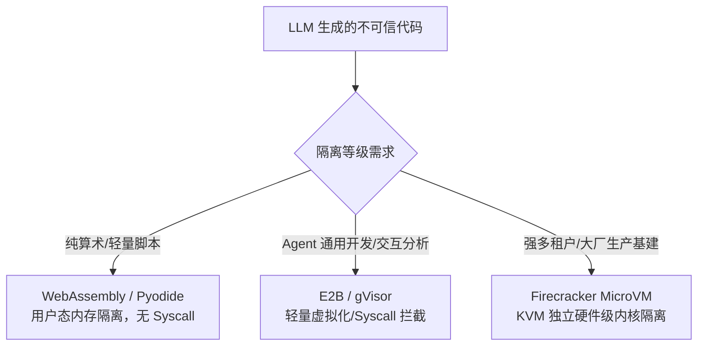
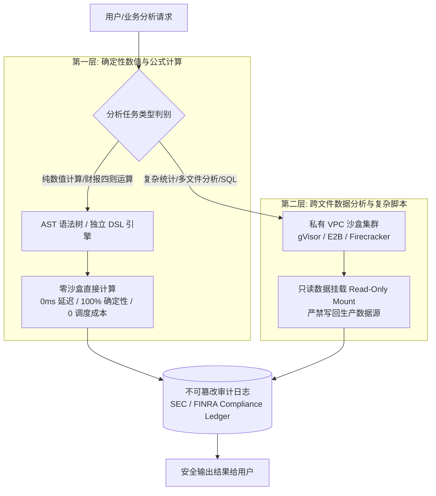

### 1. 🎯 30秒版本

让大模型（LLM）自由生成并执行代码是现代 AI Agent（如 Devin、OpenAI Code Interpreter、金融量化智能体）的核心能力，但也是最危险的安全敞口——在宿主机直接 `exec()` 或 `eval()` 无异于直接向外部不可信输入敞开 root 权限。

**代码执行沙盒（Code Execution Sandbox）** 解决的核心难题是**安全隔离度、冷启动延迟与资源开销的三角矛盾**。当前业界已经形成了阶梯式的成熟体系：从进程内轻量级的 **WebAssembly (Pyodide)**、面向 Agent 开发者的专用运行时 **E2B**、到 Google 的用户态系统调用拦截器 **gVisor** 与 AWS 的微型虚拟机 **Firecracker (MicroVM)**。在顶尖大厂与顶级金融对冲基金中，更进一步演进出了「AST 确定性解析 + 物理级销毁沙盒 + 只读挂载与全链路合规审计」的**纵深防御（Defense-in-Depth）**架构。

代码语境：使用目前 AI Agent 领域行业标准的 E2B 沙盒运行隔离代码：

```python
from e2b_code_interpreter import Sandbox

# 毫秒级拉起一个隔离的云端 Linux 执行环境
with Sandbox() as sandbox:
    # 在受控环境中执行 LLM 生成的 Python 脚本，捕获标准输出与图表产物
    execution = sandbox.run_code('''
import numpy as np
data = np.random.normal(0, 1, 1000)
print(f"Mean: {data.mean():.4f}, Std: {data.std():.4f}")
''')
    print(execution.text)
```

---

### 2. ⚙️ 底层原理

#### 2.1 主流沙盒技术矩阵与实现机制

代码沙盒的技术选型本质上是在**隔离边界（Isolation Boundary）**与**执行性能（Execution Overhead）**之间做权衡：



##### 1. E2B (e2b.dev) — AI Agent 领域的行业标准沙盒
- **核心机制**：专为 LLM 代码执行优化的轻量级虚拟化沙盒环境（基于 Linux 内核隔离与精简虚拟化）。
- **行业应用**：Cognition (Devin)、Perplexity、SWE-bench 自动化测试评估套件官方推荐底座。
- **关键特性**：
  - **毫秒级冷启动**：预热快照与轻量镜像调度，抹平传统虚拟机秒级启动的等待延迟。
  - **完备的运行时支持**：原生内置 Jupyter 内核与 Python/Node.js 运行环境，支持流式日志、实时绘图（Matplotlib/Seaborn 渲染回传）以及文件双向传输。
  - **网络细粒度受控**：支持完全断网（Air-gapped）或按白名单域名的出向（Egress）访问控制。

##### 2. WebAssembly (Pyodide / Wasmtime) — 零系统调用的用户态沙箱
- **核心机制**：通过 Emscripten 将 CPython 解释器编译为 WebAssembly (WASM) 字节码，直接在宿主进程的 V8 引擎或 Wasmtime 运行时中执行。
- **关键特性**：
  - **天然无 OS 访问**：WASM 运行在宿主机的沙盒内存堆中，默认不具备任何 Linux 系统调用接口（无宿主文件系统、无 Raw Socket、无 fork 进程权限）。
  - **极速与低资源**：几乎零启动开销，适合在浏览器前端、边缘 Edge Worker 或单节点高密进程中运行纯计算任务。

##### 3. Firecracker — AWS 开源的硬件级 MicroVM
- **核心机制**：由 AWS 开源、用 Rust 编写的极简 VMM（Virtual Machine Monitor），利用 Linux KVM 虚拟化模块直接构建轻量 MicroVM。每个沙盒拥有**完全独立的 Linux 内核**。
- **关键特性**：
  - **硬件级强隔离**：剔除了传统 QEMU 中庞大复杂的遗留设备仿真，攻击面极小。
  - **极致轻量**：启动时间仅需约 5 毫秒，单个 MicroVM 内存开销仅约 5MB。

##### 4. Google gVisor & nsjail — 用户态系统调用拦截
- **核心机制**：Google 用 Go 重写了一套 Linux 用户态内核（称为 Sentry）。应用程序的系统调用不会直接穿透到宿主机内核，而是全部被 Sentry 拦截并在用户态模拟实现。
- **关键特性**：兼顾了容器的轻量部署体验与接近虚拟机的安全边界，适合大规模容器集群的多租户防护。

| 方案 | 隔离边界 | 冷启动时间 | 内存开销 | 系统调用支持 | 网络控制能力 | 典型应用场景 |
| :--- | :--- | :--- | :--- | :--- | :--- | :--- |
| **WASM (Pyodide)** | 用户态内存沙箱 | < 1ms | 极低 (~10MB) | 受限（仅模拟接口） | 宿主完全接管 | 浏览器端/无依赖纯数据处理 |
| **E2B** | 轻量虚拟化/容器隔离 | 约 100~200ms | 中等 (~100MB) | 完整 Linux 环境 | 策略级白名单/隔离 | AI Agent (Devin)、数据分析 |
| **Google gVisor** | 用户态 Syscall 拦截 | 约 50~100ms | 低 (~30MB) | 覆盖大部分 POSIX | 容器网络命名空间 | 容器多租户平台、通用隔离 |
| **Firecracker** | 硬件级独立内核 (KVM) | 约 5~10ms | 极低 (~5MB) | 完整独立内核 | TAP/TUN 虚拟网卡隔离 | AWS Lambda、OpenAI Code Interpreter |

---

#### 2.2 OpenAI Code Interpreter 的生产级安全实践

OpenAI 在处理 ChatGPT 的 Advanced Data Analysis（代码解释器）时，面对全球海量用户的不可信代码，其安全防线设计尤为严密：

1. **底层设施**：基于 **Firecracker MicroVM** 构建高密度的执行集群，提供物理硬件辅助的虚拟化隔离。
2. **网络硬隔离（Air-Gapped Egress Blocked）**：
   - 默认**完全切断外部公网访问**（Egress Blocked）。
   - 这一策略彻底斩断了生成代码通过网络套接字将宿主会话中的私密数据、上下文 Prompt 偷传到外部恶意服务器（Data Exfiltration）的途径。
3. **会话级无状态物理销毁**：
   - 每个对话 Session 绑定独立的 MicroVM 实例。
   - 会话结束或超时后，MicroVM 连同其挂载的内存文件系统（tmpfs）被彻底销毁释放，不存在跨会话的状态污染或残留。
4. **基于 cgroups 的严格资源定额（Resource Quotas）**：
   - 限制脚本单次最大执行时间（如 60 秒硬超时），防止 `while True` 死循环耗尽 CPU。
   - 限制单实例内存上限（如 1GB）与存储限额，触发上限立即 SIGKILL 并向用户返回可控的 ResourceLimitExceeded 提示。

---

#### 2.3 顶级金融机构（Citadel / Two Sigma / Goldman Sachs）的纵深防御架构

在金融量化、财报分析与合规审计等高敏感场景下，单凭单一沙盒无法平衡性能、成本与合规要求。顶尖金融机构普遍采用**纵深防御策略（Defense-in-Depth）**：



##### 第一层：确定性数值计算的 AST / DSL 解析
- **应用场景**：财务报表问答（如 ConvFinQA）、基础指标统计、简单数学建模。
- **技术选型**：自主研发的 AST（抽象语法树）解析器或定制化的受限 DSL（Domain Specific Language）。
- **核心收益**：
  - **$0 虚拟机调度成本**：无需为简单的 `(Revenue_2025 - Revenue_2024) / Revenue_2024` 拉起 MicroVM 或容器。
  - **0 延迟与 100% 确定性**：消除网络 RPC 与环境初始化开销，且语法树中不包含任何系统级调用节点，从根本上杜绝代码注入。

##### 第二层：数据探索与跨表分析的受限沙盒池
- **应用场景**：量化回测代码、海量行数据分析、复杂 SQL 与 Python 科学计算。
- **技术选型**：部署在私有 VPC 隔离子网内的 gVisor / E2B 容器池与 MicroVM。
- **安全与合规要求**：
  - **只读挂载（Read-Only Mount）**：待分析的数据集仅以只读卷方式挂载进沙盒，脚本无法篡改原始数据湖或生产数据库。
  - **实时合规审计留痕（SEC/FINRA Audit Ledger）**：所有传入沙盒的代码文本、使用的依赖库、执行输出及系统调用记录全部实时落盘至不可篡改的 WORM（Write-Once-Read-Many）审计日志，满足严格的金融合规追溯标准。

---

### 3. 🔬 常见追问

**Q1: 为什么不能直接在宿主机上用普通的 `docker run` 作为 Agent 的代码沙盒？**
A: Docker 默认与宿主机共享同一个 Linux 内核，隔离依赖于 Linux Namespace 和 Cgroups。一旦内核出现提权漏洞（如著名的 Dirty COW、Dirty Pipe 等 CVE），容器内的恶意代码就可能实现**容器逃逸（Container Escape）**直接控制宿主机。此外，Docker 守护进程（dockerd）管理容器的启动和销毁通常需要数百毫秒至数秒，面对 Agent 高频、短生命周期的代码执行场景，并发吞吐量和延迟均无法满足要求。

**Q2: WebAssembly (Pyodide) 既然如此安全轻量，为什么业界没有全部采用它？**
A: **生态兼容性**是主要瓶颈。虽然 Pyodide 已经将大部分纯 Python 库和部分知名科学计算库（如 NumPy、Pandas）移植编译成了 WASM，但庞大的 Python 生态中仍有大量依赖 C/C++/Fortran/Rust 底层编译扩展、或需要与底层 OS 多线程/多进程通信的第三方库无法直接在 WASM 中运行。对于通用型 Agent（如要求自由 pip install 任何库的场景），仍需依赖完备的 Linux 微虚拟机或容器。

**Q3: 在 gVisor 和 Firecracker 之间，工程团队应该如何抉择？**
A: 核心权衡在于**性能损耗与隔离强度**。gVisor 属于进程级虚拟化，拦截每个系统调用并在用户态 Sentry 中处理，因此对于系统调用密集型（如高频 I/O、大量小文件读写、密集网络交互）的代码，可能会带来 10%~30% 甚至更高的性能惩罚；但其优点是与 Kubernetes 生态（如 runsc）无缝集成。Firecracker 则是真正的 MicroVM，拥有自己的独立内核，隔离边界更坚固，性能损耗更接近裸机，但对底层 CPU 硬件虚拟化（VT-x / AMD-V / KVM）有硬性要求。

**Q4: 金融量化系统为什么坚持把 AST/DSL 放在沙盒之前作为第一道防线？**
A: 金融场景对**可解释性、可审计性与成本**有着极苛刻的要求。对于诸如财报问答、估值比率等结构化计算，LLM 输出结构化 AST 或 DSL 可以确保计算逻辑 100% 透明可验，杜绝黑盒代码中潜藏的恶意逻辑或不可预期的副作用。更重要的是，高频交易与实时风控系统要求微秒级响应，AST 解析在本地进程内瞬间完成，彻底省去了微虚拟机冷启动、网络传输和沙盒实例调度的云资源成本。
