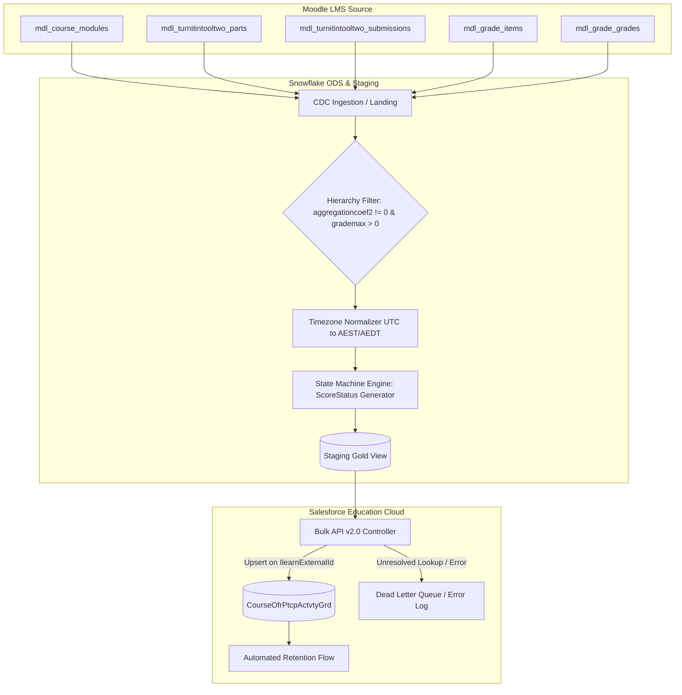
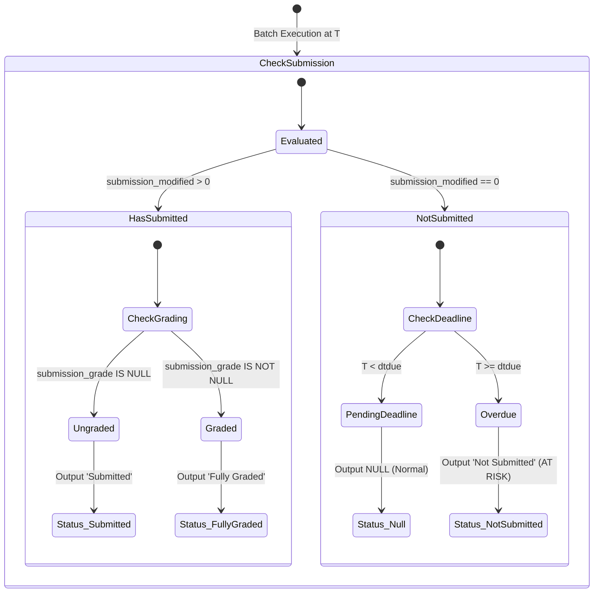

# The Boundary Problem: Why Enterprise Integrations Fail When Syncing Learning Signals to CRM (And How to Architect Them)

## Alternative Headlines
1. **The Illusion of Real-Time: Why Batch State Machines Still Dominate Enterprise LMS-to-CRM Pipelines**
2. **Beyond CDC: How to Architect High-Stakes Student Academic Warning Signals Without False Positives**
3. **Why Your Modern Data Stack Fails at the CRM Boundary: A Principal Engineer's Guide to Integration Topology**
4. **The Anatomy of a High-Trust Data Bridge: From Moodle LMS to Salesforce Education Cloud**
5. **State Machines Over Event Streams: Taming Timezones, Weight Trees, and Edge Cases in Enterprise Pipelines**

---

## Executive Summary
Modern enterprise data engineering often falls into the trap of dogmatic architecture: assuming that every system integration should be an event-driven Kafka stream, or that upstream operational databases can be mirrored directly into analytical and CRM targets without state recomputation. 

In high-stakes operational domains—such as student academic retention campaigns, financial credit scoring, or automated medical triage—syncing operational signals into customer relation platforms (like Salesforce Education Cloud) is not an ETL problem; it is a **distributed state boundary problem**. 

This article deconstructs the architecture required to ingest, clean, normalize, and sync complex academic signals (such as Turnitin assignment submissions, grades, deadlines, and gradebook hierarchies from LMS platforms like Moodle) into downstream CRM systems. We explore why trivial CDC approaches fail, why group submissions create toxic data anomalies, how timezone shifts silently corrupt risk alerts, and how to design an idempotent, resilient data bridge that balances freshness, governance, and operational reality.

---

## 1. Context & The Real Engineering Problem

In higher education, the first 6–8 weeks of an academic semester determine whether an at-risk undergraduate student persists or drops out. Universities deploy student success advisors and automated retention campaigns within platforms like Salesforce Education Cloud (EC). The efficacy of these campaigns depends entirely on the veracity of academic warning signals:
* Has the student missed their first major assessment deadline?
* Did they submit a draft that received a failing score?
* Is an unsubmitted item an actual zero, or is it an ungraded formative diagnostic with zero weighting?

The source of truth for these signals is the Learning Management System (LMS)—often a monolithic Moodle deployment running specialized plugins like Turnitin V2 (`mdl_turnitintooltwo`). 

On paper, this sounds like a standard integration task: extract submissions from LMS, join with student identity in the enterprise data warehouse (Snowflake), and upsert into the CRM object `CourseOfrPtcpActvtyGrd` (Course Offering Participant Activity Grade). 

In reality, simple integrations in this domain routinely trigger massive operational failures: false alarm spam sent to high-achieving students, delayed notifications for truly at-risk students, and CRM API throttling incidents.

```
+------------------+         +------------------+         +--------------------------+
|  Upstream LMS    |  CDC /  |  Snowflake ODS   |  Batch  |  Salesforce EC           |
|  (Moodle DB)     | ------> |  Aggregation &   | ------> |  CourseOfrPtcpActvtyGrd  |
|  - Turnitin V2   |  Batch  |  State Inference |  Upsert |  (Retention Triggers)    |
+------------------+         +------------------+         +--------------------------+
```

---

## 2. Deep Dive: The Six Layers of Integration Architecture

### 2.1 The Surface Layer
Engineers tasked with this pipeline initially see a straightforward relational schema:
- A course module (`mdl_course_modules`)
- An activity instance (`mdl_turnitintooltwo`)
- A parts table containing deadlines (`mdl_turnitintooltwo_parts.dtdue`)
- A submissions table (`mdl_turnitintooltwo_submissions`)
- A grade table (`mdl_grade_grades`)

The naive implementation:
```sql
-- The Naive Pipeline Query
SELECT 
    u.idnumber AS student_id,
    p.dtdue AS due_date,
    s.submission_score AS similarity_score,
    s.submission_grade AS score,
    CASE 
        WHEN s.submission_modified = 0 AND p.dtdue < CURRENT_TIMESTAMP() THEN 'Not Submitted'
        WHEN s.submission_grade IS NOT NULL THEN 'Fully Graded'
        ELSE 'Submitted'
    END AS score_status
FROM mdl_turnitintooltwo_parts p
LEFT JOIN mdl_turnitintooltwo_submissions s ON s.submission_part = p.id
JOIN mdl_user u ON u.id = s.userid;
```

### 2.2 The Mechanism Layer
Under the hood, LMS gradebooks are not flat tables; they are **hierarchical evaluation trees**. 
In Moodle, an assignment’s raw score is meaningless without its position in the grade tree:
1. `aggregationcoef2`: The parent category weight coefficient. If a teacher configures a practice Turnitin box with a weight of `0` (or `NULL`), it represents non-assessed practice.
2. `grademax`: The maximum score scale. A test module with `grademax = 0` is an administrative placeholder.
3. Multi-part submissions: Turnitin allows an assignment to be split across $N$ sub-parts (e.g., Abstract, Draft, Final Submission), each carrying independent due dates (`dtdue`) and deletion markers (`deleted = 0`).

If your ingestion SQL ignores category aggregation coefficients, you broadcast risk flags for homework assignments that contribute 0% toward the final unit mark.

### 2.3 The System Layer: Multi-System Identity Alignment
A student in an LMS is just a `userid`. In the student information system (SIS/AMIS), the student is represented by an active Study Package enrollment (`SSP_NO`). In Salesforce, they are represented by an account, a contact, and a `CourseOfferingParticipantId`.

```
[Moodle User ID] 
       │
       ▼ (Resolved via SSO / idnumber)
[Student Master ID (OneID)]
       │
       ▼ (Resolved via SIS / AMIS Term Snapshot)
[SSP_NO (Student Study Package Enrollment)]
       │
       ▼ (Matched via Composite External Key)
[Salesforce CourseOfferingParticipant]
```

When an LMS record cannot resolve to an active `CourseOfferingParticipantId` in Salesforce:
- **Wrong Approach**: Discard the record silently or let the bulk job fail.
- **Resilient Approach**: Route to a Dead Letter Queue (DLQ) with structured error metadata (`UNRESOLVED_ENROLLMENT_KEY`), maintaining auditability without breaking batch processing.

### 2.4 The Scale Layer: Bulk Ingestion vs API Limits
Salesforce enforces strict daily API and Bulk API limits. Pushing individual REST requests per student submission across 50,000 enrolled students during mid-term submission week will exhaust governor limits in minutes.
- Pipeline design must leverage **Bulk API v2.0 Upsert**.
- The external ID must be strictly unique and immutable. Using a composite key of `(Student_ID + Course_ID)` is dangerous because students can resit or retake modules. The only bulletproof key is the upstream grade item instance ID (`IlearnExternalId__c` -> `mdl_grade_grades.id`).

### 2.5 The Failure Layer: The Hidden Traps
1. **The Single-Submitter Group Project Anomaly**:
   In Turnitin group submissions, only the group leader submits the paper. In the database, the group leader has `submission_modified > 0`, while the other 4 group members remain `submission_modified = 0`. If ingested without group-awareness, the pipeline marks 80% of the team as `Not Submitted`, triggering automated panic emails.
   *Resolution*: Explicitly filter out group assignments unless group-to-member resolution tables are available.
2. **The Daylight Saving Time (DST) Boundary Shift**:
   Due dates stored as Unix timestamps in UTC must be projected to local administrative time (e.g., `Australia/Sydney`). Hardcoding static `+10:00` offsets causes submissions made during AEDT (+11:00) to be falsely flagged as `LATE` by exactly one hour at the boundary of October and April.
   *Resolution*: Use engine-native dynamic timezone conversions: `CONVERT_TIMEZONE('UTC', 'Australia/Sydney', TO_TIMESTAMP_NTZ(dtdue))`.

### 2.6 The Strategic Layer: The Organizational Feedback Loop
When data pipelines directly trigger operational human actions (e.g., student success advisors calling students at 9 AM), **data trust is binary**. One single wave of false positive "At-Risk" alerts destroys counselor confidence in the system permanently. Pipeline design must prioritize precision over aggressive recall.

---

## 3. Contrarian Insight: The Myth of Universal Event-Driven Integration

### The Popular Belief
"Batch ETL is legacy tech. Modern enterprise systems should emit CDC events (Debezium/Kafka) from the LMS database directly to a streaming consumer that updates Salesforce in real-time."

### Why It Seems Correct
- Lower latency (seconds instead of hours).
- Eliminates heavy periodic SQL query loads on the data warehouse.
- Matches modern event-driven microservice paradigms.

### Where It Breaks Down
1. **LMS Gradebooks Are Ephemeral Draft Environments**: Teachers constantly tweak due dates, hide grade categories, recalculate curves, and delete mock parts during live instruction. A real-time stream emits dozens of transient, inconsistent intermediate states directly into the CRM.
2. **Rate Limit Amplification**: A teacher publishing grades for a 1,200-student lecture produces 1,200 events within 50 milliseconds, creating bursty backpressure on CRM write endpoints.
3. **Absence as an Event**: The most critical risk indicator—*“The student did NOT submit by the deadline”*—is not an event. It is a non-event (temporal expiration). Event streams cannot emit a "non-action" without complex stateful CEP (Complex Event Processing) engines with active timer windows.

### A Better Mental Model: The Scheduled State-Reconciliation Boundary
Treat the pipeline as a **reconciling state machine** running on fixed operational intervals (e.g., 4 times daily aligned with advisory shift hours: 01:00, 08:00, 12:00, 15:00). 
- The batch query evaluates the entire state tree (weight, deadline, extension, submission, score) atomically.
- Temporal boundaries (`dtdue <= NOW()`) are evaluated consistently across all students at the moment of execution.

```
+-----------------------------------------------------------------------------------+
|                        THE DUALITY OF INTEGRATION DESIGN                          |
+-----------------------------------------------------------------------------------+
| Dimension           | Real-time Event Streaming    | Scheduled State Reconciliation|
+---------------------+------------------------------+-------------------------------+
| Consistency Model   | Eventual / Fragile to Drafts | Point-in-time Snapshot Valid  |
| Non-Event Detection | Requires Stateful CEP Timers | Native (dtdue <= CURRENT_TS)  |
| CRM API Footprint   | Unpredictable Spikes         | Controlled Bulk API Batches   |
| Business Fit        | Low (Advisors work in shifts)| High (Aligned with workflows) |
+-----------------------------------------------------------------------------------+
```

---

## 4. The Principal Engineer Lens

| Engineering Role | Primary Focus | Typical Thinking & Antipatterns |
| :--- | :--- | :--- |
| **Junior Engineer** | Implementation | *"I wrote a query joining the user and submission tables, and it returned data for my test student."* (Misses deleted parts, zero-weight categories, and group projects). |
| **Senior Engineer** | Correctness & Robustness | *"I added filters for `p.deleted = 0` and `aggregationcoef2 != 0`, wrapped the SQL in an Airflow DAG with retries, and set up timezone conversion."* |
| **Staff Engineer** | Architecture & Boundaries | *"I designed an idempotent upsert contract using `IlearnExternalId__c`, isolated the pipeline from LMS plugin version shifts, and established DLQs for orphan enrollments."* |
| **Principal Engineer** | System Evolution & Risk | *"I aligned pipeline execution windows with counselor shift patterns, negotiated business exclusions for group assessments to protect trust, and ensured CRM API budget preservation under peak exam load."* |

---

## 5. Recommended Diagrams

### Diagram 1: End-to-End Ingestion & State Resolution Architecture


### Diagram 2: ScoreStatus Ingestion State Machine


---

## 6. Frequently Asked Questions (FAQ)

### Q1: Why not rely solely on the LMS API instead of querying the backend database/ODS?
**Answer**: LMS REST APIs (such as Moodle’s Core Web Services) are designed for single-user interactive operations or lightweight mobile syncs. They lack bulk analytical endpoints to extract multi-course assessment trees across tens of thousands of students without causing significant CPU degradation on the web cluster. Querying a replicated ODS database decouples read traffic from instructional user loads.

### Q2: How does the pipeline handle students with granted extensions (Special Consideration)?
**Answer**: Extension records are captured in the grade override structure (`mdl_grade_grades.overridden`). The state engine maps this to `OverrideDueDate__c`. When calculating `ScoreStatus`, the pipeline overrides `dtdue` with `OverrideDueDate__c`, preventing false "Not Submitted" flags for approved student exemptions.

### Q3: What happens if a teacher changes the maximum grade scale midway through the term?
**Answer**: Because the pipeline upserts based on the unique grade grade ID (`IlearnExternalId__c`), the subsequent delta run detects the modified timestamp on `mdl_grade_items` and updates `MaximumScore__c` and `Score` in Salesforce without creating duplicate records.

### Q4: How is data loss prevented during network partitions to the Salesforce Bulk API?
**Answer**: The integration runner employs exponential backoff on transient HTTP 5xx errors and encapsulates each batch in a discrete Airflow task instance. If the batch fails, the pipeline state remains uncommitted, and the next run re-evaluates the delta window using lookback watermarks.

### Q5: Why is `mdl_grade_grades.id` chosen as the External ID instead of a natural key like `(student_number + assessment_name)`?
**Answer**: Assessment names are mutable (teachers rename assignments mid-semester). Student numbers can change during identity reconciliations. `mdl_grade_grades.id` is an immutable, system-generated primary key that guarantees exact 1:1 mapping throughout the lifecycle of the grade record.

---

## 7. Key Takeaways

1. **Integration is State Modeling, Not Transport**: Moving data between enterprise systems requires understanding the semantic lifecycle of upstream domain objects, not just piping JSON payloads.
2. **Filters Are Business Guardrails**: Conditions like `aggregationcoef2 != 0` and `p.deleted = 0` are not minor implementation details—they are the foundational barriers preventing false alerts.
3. **Idempotency via Immutable External IDs**: Never construct synthetic composite keys when reliable upstream surrogate keys exist.
4. **Respect Platform Boundaries**: Compute heavy relational joins and state derivations in your data warehouse (Snowflake), and use CRM systems for workflow execution and customer engagement.

---

## 8. SEO & AI Search Metadata

- **Primary Title**: The Boundary Problem: Why Enterprise Integrations Fail When Syncing Learning Signals to CRM
- **SEO Description**: A Principal Engineer's architectural guide to building reliable, high-trust data pipelines from LMS (Moodle/Turnitin) to Salesforce Education Cloud, avoiding false-positive alerts and CRM throttling.
- **Target Keywords**: LMS CRM integration, Salesforce Education Cloud data pipeline, Moodle Turnitin data warehouse sync, At-Risk student analytics architecture, bulk API idempotency, educational data engineering
- **TL;DR**: High-stakes data integration requires robust domain-aware state machines. Learn how to transform complex, multi-layered LMS assessment data into accurate, actionable CRM retention signals without creating operational chaos.
