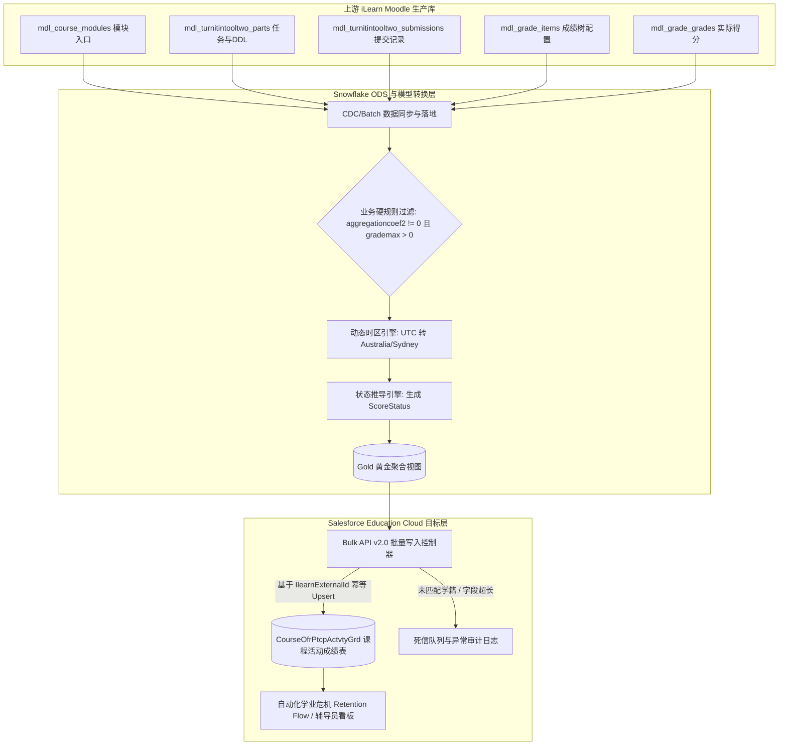
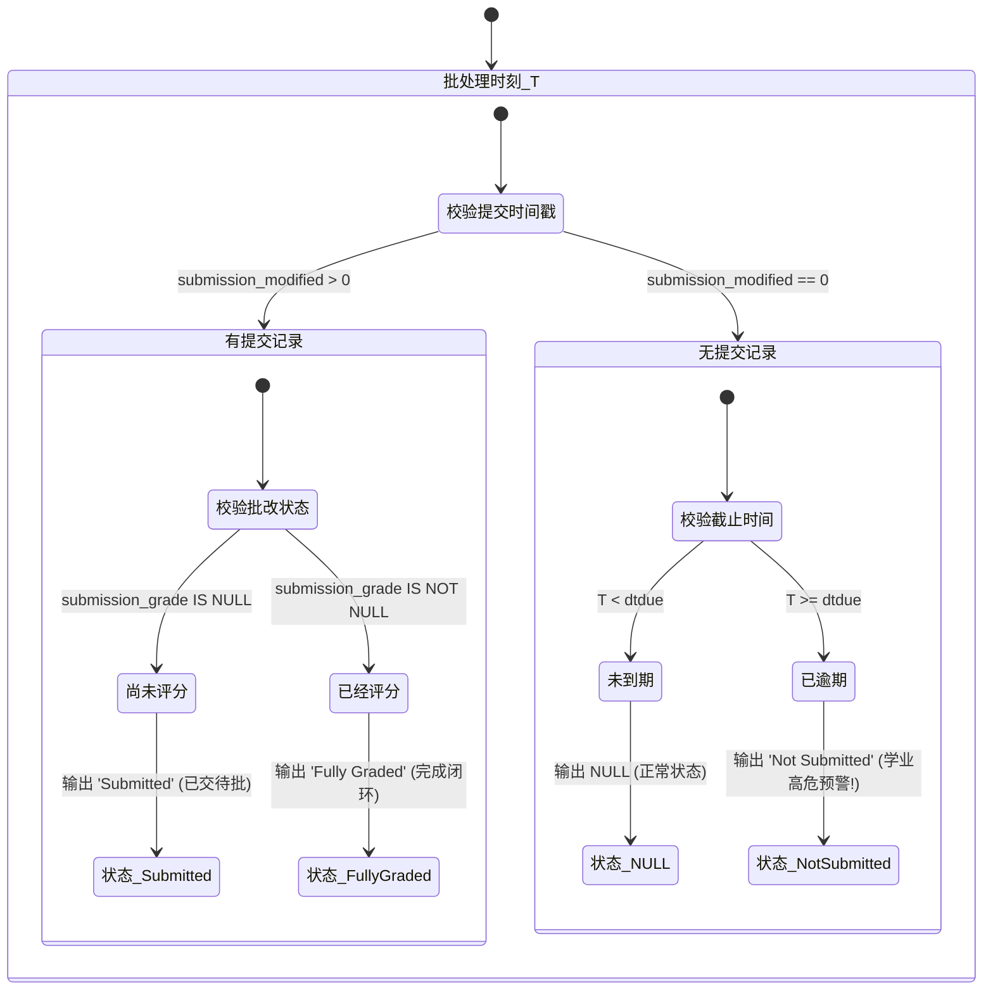

# 边界之困：为什么将高校 LMS 学习信号同步至 CRM 的企业集成总在翻车？（以及如何优雅架构）

## 备选标题（Alternative Headlines）
1. **实时流的虚妄：为什么在企业级 LMS 到 CRM 的数据管道中，状态机批处理依然无可替代？**
2. **超越 CDC：如何架构一套零误报的高校学业预警（At-Risk）高危数据桥梁**
3. **现代数据栈为何总在 CRM 边界折戟？一位首席工程师（Principal Engineer）的系统集成实战指南**
4. **高可信数据契约剖析：从 Moodle/Turnitin 到 Salesforce Education Cloud 的架构演进**
5. **状态机战胜事件流：在企业级管道中驯服夏令时时区、权重树与边界暗坑**

---

## 执行摘要（Executive Summary）
在现代企业数据架构的讨论中，业界常常陷入一种“技术原教旨主义”的执念：似乎任何系统间的数据打通都必须是基于 Kafka/Debezium 的实时 CDC 事件流；似乎只要把上游 OLTP 的物理表通过 Flink 实时塞进下游 CRM，问题就解决了。

然而，在诸如**高校学业危机干预（Student Retention）、金融信用实时定级或医疗预警**等高容错代价的业务场景中，将操作型系统（LMS，如 Moodle、Turnitin）中的弱结构化行为信号同步至运营决策平台（如 Salesforce Education Cloud），从来就不是一个简单的 ETL 搬砖问题，而是一个极其复杂的**分布式状态边界与语义投影问题**。

本文以真实生产场景——将 iLearn/Moodle 中的 Turnitin V2 论文提交、截止时间（DDL）、成绩树与延期状态，精准聚合并幂等同步至 Salesforce EC 的 `CourseOfrPtcpActvtyGrd` 对象为例，深度拆解：为什么轻率的实时流会引发严重的业务信任危机？小组作业为何会产生毁灭性的“数据毒丸”？夏令时转换如何在每年两次悄无声息地制造大面积误报？以及资深架构师如何通过“计算下推、状态机重构、外部唯一主键与死信隔离”打造一套高鲁棒性、高吞吐的企业级数据集成体系。

---

## 1. 业务背景与真实的工程痛点（Context & Real Problem）

在高等教育领域，开学前 6 到 8 周是决定大一新生是否会迷茫挂科、甚至中途退学的黄金窗口期。现代大学会在 Salesforce Education Cloud (EC) 等 CRM 体系中组建辅导员（Student Advisor）团队与自动化营销干预（Retention Campaign）策略。

这套体系能够运转的前提，是下游拿到的**学业预警信号必须绝对真实可信**：
* 学生是否错过了第一门核心课的期中论文截止时间？
* 学生的论文提交了但还没批改，还是压根没有点过提交？
* 某个得分为 0 的作业，到底是一次严重的缺考，还是任课老师随手创建的一个不占总分权重的草稿练习区？

这些信号的源头来自于上游教学管理系统（LMS，如基于 Moodle 架构的 iLearn 及其挂载的 Turnitin V2 插件）。

在许多初级工程师看来，这不就是一个简单的 CRUD 同步吗？从 Moodle 库里抓出提交记录，去数仓与学生档案关联，然后调 Salesforce API 写入对象。

然而，粗糙的实现会导致灾难性的生产事故：辅导员在周一早晨按照报表给数百名实际上早已交了作业的高分学生挨个打电话“谈心”，系统短信轰炸导致教务处投诉信箱被塞满，业务团队对整套数字化预警系统彻底丧失信任。

```
+------------------------------------+         +------------------------------------+         +------------------------------------------+
| 上游教务系统: iLearn (Moodle LMS)   |  CDC /  | 中间计算层: Snowflake ODS           |  批量   | 目标运营平台: Salesforce Education Cloud   |
|  - mdl_turnitintooltwo / _parts    | ------> |  - 成绩树权重校验 (aggregationcoef)| ------> |  - CourseOfrPtcpActvtyGrd                |
|  - mdl_grade_items / _grades       |  批处理 |  - 澳洲悉尼时区动态转换             |  Upsert |  - 触发自动化 Retention Campaign         |
|  - mdl_user (学籍绑定)              |         |  - 四态状态机 (ScoreStatus)        |         |  - 辅导员 360 学业画像看板               |
+------------------------------------+         +------------------------------------+         +------------------------------------------+
```

---

## 2. 深度六层剖析（The Six Layers of Integration Architecture）

### 2.1 表面层（The Surface Layer：看似简单的 CRUD）
初看 Moodle 数据库中 Turnitin V2 的结构，工程师会看到一组看似清晰的关系表：
- 课程模块表：`mdl_course_modules`
- 作业实例表：`mdl_turnitintooltwo`
- 作业分部与截止时间表：`mdl_turnitintooltwo_parts` (`dtdue`)
- 提交记录表：`mdl_turnitintooltwo_submissions`
- 成绩表：`mdl_grade_grades`

于是一个简单的 SQL 就写出来了：
```sql
-- 幼稚的初版提取 SQL
SELECT 
    u.idnumber AS student_id,
    p.dtdue AS due_date,
    s.submission_score AS similarity_score,
    s.submission_grade AS score,
    CASE 
        WHEN s.submission_modified = 0 AND p.dtdue < CURRENT_TIMESTAMP() THEN 'Not Submitted'
        WHEN s.submission_grade IS NOT NULL THEN 'Fully Graded'
        ELSE 'Submitted'
    END AS score_status
FROM mdl_turnitintooltwo_parts p
LEFT JOIN mdl_turnitintooltwo_submissions s ON s.submission_part = p.id
JOIN mdl_user u ON u.id = s.userid;
```

### 2.2 机制层（The Mechanism Layer：Moodle 成绩树的幽灵）
如果你直接把上面这段 SQL 丢进生产管道，第二天就会发生严重的业务翻车。
因为 Moodle 的 Gradebook 从来不是一张扁平表，而是一棵**带有继承与聚合逻辑的层次树**：
1. **分类权重系数（`aggregationcoef2`）**：在 Moodle 中，一个作业可能挂在一个占期末 0% 权重的“测试文件夹”下。如果任课老师设置其父级分类权重为 0 或 NULL，这意味着该作业纯属课后练习，不计入课程总评。如果你不同步过滤父级权重，系统就会把所有没做练习题的学生全量标记为“学业危机”。
2. **满分标尺（`grademax`）**：部分用于排版占位的模块，其 `grademax = 0`。
3. **多 Part 分割机制**：Turnitin V2 允许老师将一次大作业拆为 Part 1（开题）、Part 2（初稿）、Part 3（终稿），每个 Part 拥有独立的 `dtdue`，且被老师软删除的 Part 会在 `mdl_turnitintooltwo_parts` 中标记为 `deleted = 1`。如果不剔除软删除记录，过期的废弃 Part 会持续引发逾期误报。

### 2.3 系统层（The System Layer：跨系统的身份锚定与断链）
一个学生在 LMS 里只是一个数字主键 `userid`；在教务系统（AMIS）中对应具体的选课包记录 `SSP_NO`；在 Salesforce 中对应 `CourseOfferingParticipantId`。

```
[Moodle User ID / SSO Account]
             │
             ▼
[教务学籍唯一号 (OneID / Student ID)]
             │
             ▼
[AMIS 选课关系键 (SSP_NO: Student Study Package Number)]
             │
             ▼
[Salesforce CourseOfferingParticipant (AmisExternalId__c)]
```

当一条来自 LMS 的成绩记录在 Salesforce 中找不到对应的选课参与人时：
- **错误做法**：静默丢弃（Silent Drop），导致数据黑洞；或者导致整个 API Batch 事务回滚。
- **正统架构**：通过结构化死信队列（Dead Letter Queue, DLQ）记录上下文，输出 `UNRESOLVED_PARTICIPANT_LOOKUP` 异常指标，保持主批处理链路通畅。

### 2.4 扩展层（The Scale Layer：CRM API 额度与幂等设计）
Salesforce 作为多租户云平台，对每日 API 调用量及 Bulk API 批处理批次有严格的限额（Governor Limits）。在期中考试或期末出分周，数万名学生的成绩在几小时内密集变动，单条 REST 请求同步会在数分钟内耗尽全校的 API 额度。
- 必须使用 **Salesforce Bulk API v2.0 Upsert**。
- **外部索引键（External ID）的选择是生与死的区别**：绝对不能使用 `(StudentID + CourseCode)` 这种业务组合键（因为学生可能重修同一门课产生多个实例）。唯一可靠的外部主键是 Moodle 底层不可变的打分实例 ID——`IlearnExternalId__c` (`mdl_grade_grades.id`)。

### 2.5 故障层（The Failure Layer：那些坑死资深老手的暗礁）

#### 陷阱 1：小组作业的“代理提交孤儿现象”（Single Submitter Anomaly）
在 Turnitin 小组大作业中，机制通常是“组长一人上传论文，全组共享成绩”。但在 Moodle 数据库底层，仅有组长的 `submission_modified` 记录了提交时间戳，其余 4 位组员的记录全为初始状态 `0`！
如果数据管道没有穿透读取小组配置表，下游状态机就会判定组长“已提交”，而其余 4 位组员在 DDL 到期瞬间被全员判定为 `Not Submitted`。
*治理策略*：在数据源未完成小组关联重构前，通过架构治理在 ETL 层显式剔除 Group Projects，宁缺毋滥。

#### 陷阱 2：夏令时跨度下的 1 小时时钟偏移（The DST Trap）
澳洲悉尼时间每年 4 月（进入冬令时 AEST UTC+10）与 10 月（进入夏令时 AEDT UTC+11）发生时钟切换。
如果工程师在 SQL 中偷懒写了硬编码：`DATEADD('hour', 10, TO_TIMESTAMP(dtdue))`，那么在夏令时期间，原本晚上 23:59 截止的作业会被解析为 22:59。无数在 23:30 准时交作业的正常学生，全部被系统标记为 `LATE` 逾期！
*治理策略*：严禁任何静态时区偏移运算，必须使用数仓原生时区引擎：`CONVERT_TIMEZONE('UTC', 'Australia/Sydney', TO_TIMESTAMP_NTZ(dtdue))`。

### 2.6 战略层（The Strategic Layer：技术决策对组织信任的重塑）
在业务干预型数据工程中，**数据的“准确率”远远重于“实时性”**。辅导员如果根据错误报表给家长打了两次乌龙电话，整套系统的数字化公信力将彻底归零。架构师必须在契约定义、边界防御与容错设计上构筑严密护城河。

---

## 3. 反共识洞见（Contrarian Insight）：实时流的迷思与状态机批处理的胜利

### 大众普遍认知（The Popular Belief）
“批处理 ETL 是上个世纪的落后产物。现代微服务和数据栈必须用 CDC（如 Debezium/Kafka）监听 Moodle 数据库变更，实时将每条作业提交事件秒级推送到 Salesforce。”

### 为什么它看起来很对（Why It Seems Correct）
- 延迟低（秒级响应，辅导员能在学生点击提交的一瞬间看到更新）。
- 避免了周期性大 SQL 查询对数据仓库造成的负载高峰。
- 契合现代云原生“Event-Driven Everything”的时髦教条。

### 为什么在真实业务中必定崩溃（Where It Breaks Down）
1. **教学平台的“草稿与震荡状态”**：大学任课老师不是专业程序员。老师在 Moodle 上经常反复修改截止日期、重设满分比例、隐藏/显示成绩列。实时流会把老师操作过程中的所有短暂、不一致的“中间脏状态”实时放大推给下游，引发下游自动化营销规则的狂犬式误触发。
2. **“非事件”无法被流式捕获（Absence as an Event）**：学业预警中最关键的信号——*“学生在截止时间到了之后，依然没有提交”*，这根本不是一个被动触发的数据库 Event！这是一次**时间的流逝与非动作（Temporal Expiration）**。纯粹的 CDC 无法捕获这种“未发生的动作”，除非在流处理引擎中维系极其复杂且容易内存泄漏的滑动窗口定时器。
3. **CRM 写入雪崩**：大班课统一批改时，老师一键发布 1,000 名学生的成绩，实时流会在瞬间产生 1,000 次并发调用，直接击穿 CRM 的并发锁（Record Lock Contention）。

### 更好的心智模型（A Better Mental Model）：基于业务节奏的状态对齐边界
放弃不切实际的秒级流式执念，采用**与人工干预班次严格对齐的准实时状态机（Scheduled State Reconciliation）**（例如每日 4 次：01:00, 08:00, 12:00, 15:00）。
- 在每个执行点，批处理查询对全量状态进行原子化裁决（权重、DDL、延期申请、提交记录、实际得分）。
- `dtdue <= CURRENT_TIMESTAMP()` 的时间判断在批处理时刻对全量学生统一生效，输出高内聚、无中间态波动的确定性状态。

```
+---------------------------------------------------------------------------------------+
|                                两种架构模式的深度权衡矩阵                              |
+---------------------+---------------------------------+-------------------------------+
| 评估维度            | CDC 实时事件流 (Event-Driven)   | 定时状态机对齐 (Scheduled Batch)|
+---------------------+---------------------------------+-------------------------------+
| 状态一致性          | 脆弱，易被老师草稿修改污染      | 极高，单次运行具备快照确定性  |
| 逾期未交检测        | 极其困难 (需构建复杂 CEP 定时器)| 天然支持 (SQL 统一时间边界)   |
| 目标系统压力 (CRM)  | 脉冲式洪峰，易触发 Lock 异常    | 稳健可控的 Bulk API v2.0 批次 |
| 业务流程契合度      | 低 (辅导员只在工作时段介入)     | 完美匹配 (班次前 1 小时就绪)  |
+---------------------+---------------------------------+-------------------------------+
```

---

## 4. 首席工程师视角（The Principal Engineer Lens）

面对同一个需求，不同层级的工程师所思所想有着本质区别：

| 工程师层级 | 关注焦点 | 典型思维模式与盲区 |
| :--- | :--- | :--- |
| **初级工程师 (Junior)** | 实现功能 | *“我写了个 SQL 把 user 和 submission 表 Join 起来了，在我的测试账号上跑得通，这就提测上线。”*（完全忽略软删除 Part、零权重分类和时区跳变）。 |
| **高级工程师 (Senior)** | 正确性与健壮性 | *“我加上了 `p.deleted = 0` 和 `aggregationcoef2 != 0` 过滤，用 Airflow 封装了重试机制，并处理了 UTC 到悉尼时区的转换。”* |
| **资深架构师 (Staff)** | 架构边界与契约 | *“我定义了以 `mdl_grade_grades.id` 为不可变外部主键的幂等写入契约，设计了解耦上游插件变更的数仓分层视图，并搭建了无归属学籍的 DLQ 监控报警。”* |
| **首席工程师 (Principal)** | 组织演进与战略风险 | *“我将数据批次严格对齐到辅导员排班流程；坚决推动业务剔除小组作业以保护系统公信力底线；全面评估了全校在期中出分峰值对 Salesforce 全局 API 预算的消耗模型。”* |

---

## 5. 推荐架构与流程图（Recommended Diagrams）

### 图 1：端到端数据流动与状态计算拓扑


### 图 2：学业预警四态状态机流转（ScoreStatus State Machine）


---

## 6. 常见问题解答（FAQ）

### Q1: 为什么不直接调 Moodle 的 Web Services REST API，而是要走后台数仓 ODS？
**解答**：Moodle 的标准 Web Services 主要是为单人交互式前端或移动 App 设计的，缺乏针对全校几万名学生跨课程的大批量聚合抽取接口。如果在出分高峰期直接发起海量 API 扫表，会直接拖垮 LMS Web 容器和主数据库，影响学生正常上课。通过数仓只读副本抽取，实现了教学在线负载与数据分析负载的物理隔离。

### Q2: 如果学生申请了特殊延期（Special Consideration / Extension），系统如何避免误判为 Not Submitted？
**解答**：延期审批数据最终会反映在成绩覆盖字段 `mdl_grade_grades.overridden` 中，映射至 Salesforce 的 `OverrideDueDate__c`。在下游状态推导逻辑中，`OverrideDueDate__c` 的优先级高于 `dtdue`，只有在当前时间超过了延期后的最新 DDL 且仍未提交时，才会打上 `Not Submitted` 标签。

### Q3: 为什么外部主键选择 `mdl_grade_grades.id`，而不是用 `(学号 + 课程编号 + 作业名)`？
**解答**：作业名称是可变字段（老师经常在学期中途重命名作业），学号在跨校区或留学生转学籍时也可能发生映射迁移。使用业务语义字段作为主键是典型的脆弱设计；唯有底层生成的物理 Surrogate ID（`mdl_grade_grades.id`）在整个数据生命周期中绝对不可变，能够确保百次回跑百分之百幂等。

### Q4: 在 Salesforce 端执行 Upsert 时，如何处理大量并发锁（UNABLE_TO_LOCK_ROW）错误？
**解答**：当多个批次同时向同一个父级 `CourseOfferingParticipant` 写入子成绩记录时，Salesforce 会在父对象上加行级锁。解决该问题的标准做法是：在 Snowflake 准备 Bulk 数据集时，按 `CourseOfferingParticipantId` 进行全局排序和分片打包，确保同一个父对象的子记录集中在同一个批次内线性处理，彻底消除跨批次争锁。

### Q5: 增量抽取时，如果老师在 12:00 修改了历史作业的满分权重，但学生并未产生新提交，如何保证数据被拉取？
**解答**：增量水位线的判断条件必须是“复合或（Compound OR）”关系：即 `mdl_grade_grades.timemodified >= Watermark OR mdl_grade_items.timemodified >= Watermark`。只要配置项或成绩项任一发生变更，对应记录就会落入增量窗口，配合 Upsert 实现平滑覆盖。

---

## 7. 核心架构法则（Key Takeaways）

1. **集成即状态建模，而非数据搬运**：企业集成的本质是理解上游领域对象的完整生命周期与语义约束，盲目透传字段只会将混乱扩散至全公司。
2. **过滤条件是系统护城河**：`aggregationcoef2 != 0` 与 `p.deleted = 0` 这种业务过滤规则，不是可有可无的代码修饰，而是阻断虚假业务警报的生命线。
3. **基于不可变主键构建幂等性**：永远不要相信业务组合主键，使用上游代理主键作为下游 External ID，让每一次数据同步都具备抗重试能力。
4. **恪守平台职责边界**：让 Snowflake 承担高强度的复杂 Join 与状态推导，让 Salesforce 专注于业务编排与客户互动，严禁在 CRM 内部编写笨拙脆弱的跨对象计算流。

---

## 8. SEO 与 AI 搜索优化元数据（SEO Metadata）

- **主标题（Primary Title）**：边界之困：为什么将高校 LMS 学习信号同步至 CRM 的企业集成总在翻车？
- **SEO 描述（SEO Description）**：深入剖析从 Moodle/Turnitin 到 Salesforce Education Cloud 的高可信学业预警数据管道架构。解析成绩树权重、夏令时漂移、状态机推导与 Bulk API 幂等写入的核心实战法则。
- **核心关键词（Keywords）**：LMS CRM 集成, Salesforce Education Cloud 数据管道, Moodle Turnitin 数据仓库同步, 高校学业预警架构, Bulk API 幂等设计, 企业级数据工程
- **一句话总结（TL;DR）**：高容错代价的企业数据集成是一门状态机重构艺术。掌握这套连接高校 LMS 与 CRM 的架构方法论，助你彻底告别虚假预警与接口超限故障。
